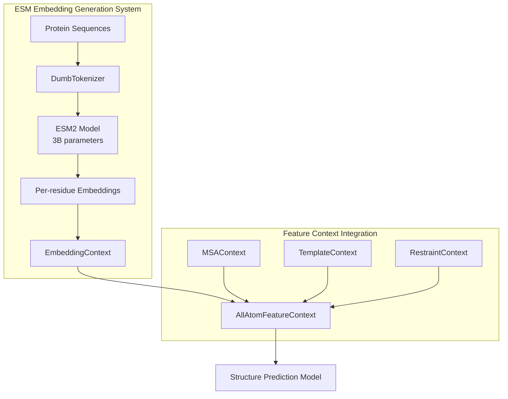
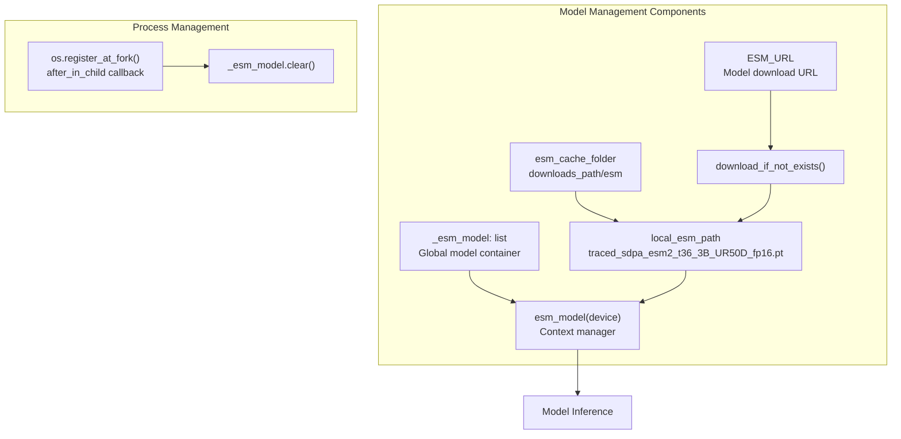
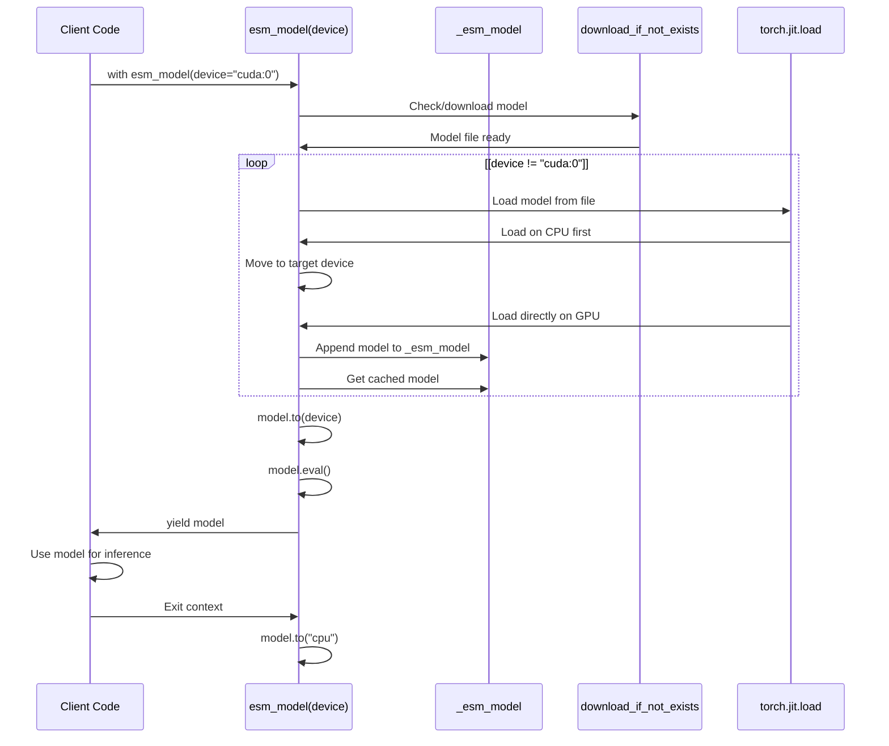
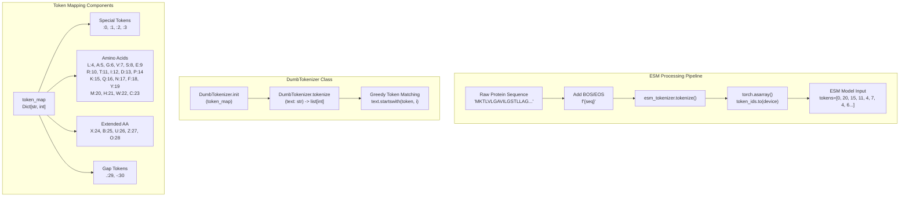
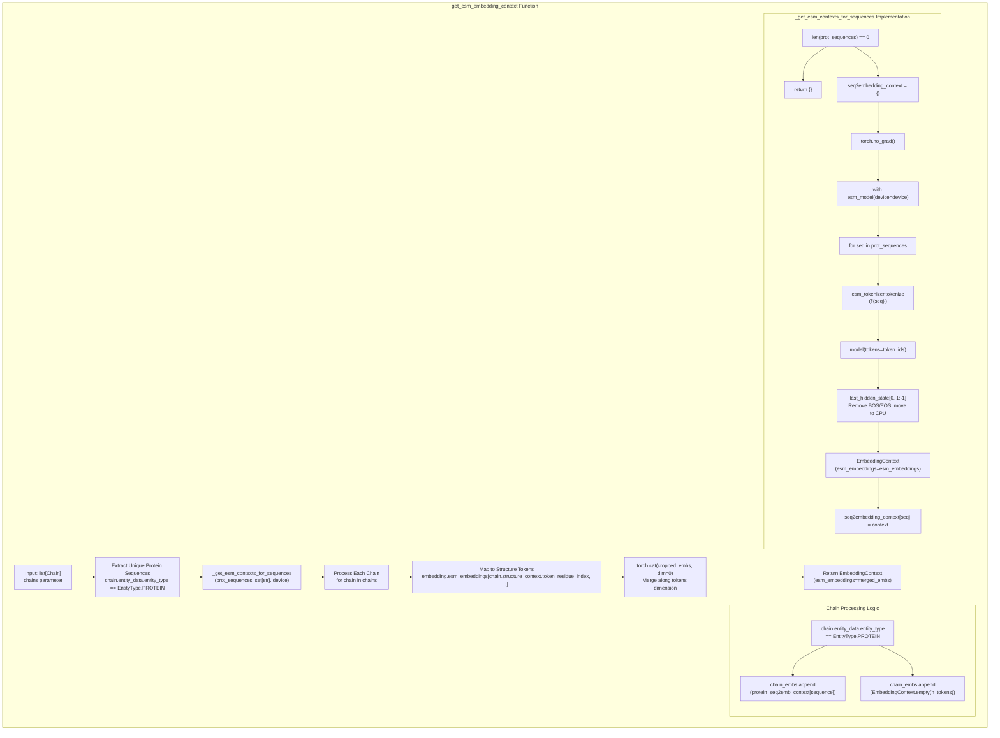
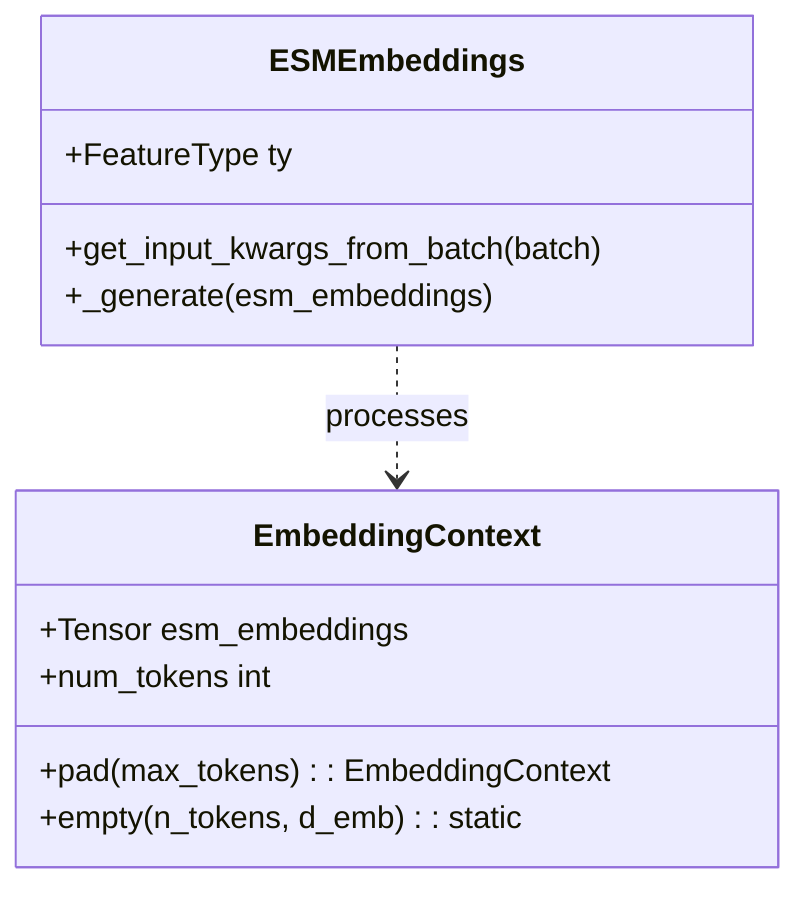
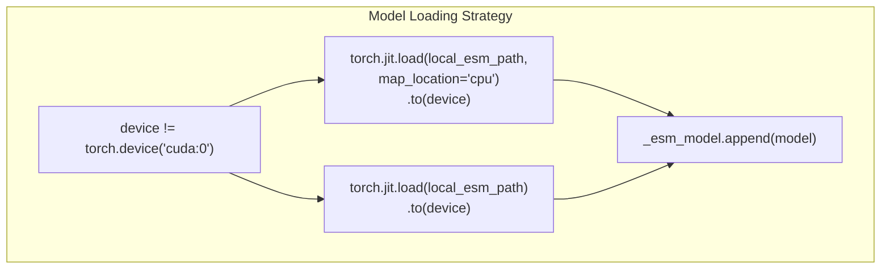
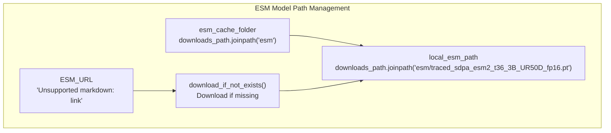

# ESM Embeddings

> **Relevant source files**
> * [chai_lab/data/dataset/embeddings/embedding_context.py](https://github.com/chaidiscovery/chai-lab/blob/66c38d1f/chai_lab/data/dataset/embeddings/embedding_context.py)
> * [chai_lab/data/dataset/embeddings/esm.py](https://github.com/chaidiscovery/chai-lab/blob/66c38d1f/chai_lab/data/dataset/embeddings/esm.py)
> * [chai_lab/data/features/generators/esm_generator.py](https://github.com/chaidiscovery/chai-lab/blob/66c38d1f/chai_lab/data/features/generators/esm_generator.py)
> * [chai_lab/utils/paths.py](https://github.com/chaidiscovery/chai-lab/blob/66c38d1f/chai_lab/utils/paths.py)

## Purpose and Scope

This document details the ESM (Evolutionary Scale Modeling) embeddings component in the Chai Lab system. ESM embeddings provide rich, contextual representations of protein sequences based on evolutionary information. These embeddings serve as a critical input feature for the structure prediction pipeline, particularly for protein sequences.

For information about other feature generation components like Multiple Sequence Alignments, see [Multiple Sequence Alignments](/chaidiscovery/chai-lab/5.1-multiple-sequence-alignments), or for template-based features, see [Structural Templates](/chaidiscovery/chai-lab/5.2-structural-templates).

## Overview

ESM embeddings in Chai Lab are generated using a pre-trained ESM2 model, specifically the ESM2-3B model with 36 transformer layers. These embeddings capture evolutionary information from protein sequences that helps the diffusion model make accurate structural predictions.

Sources: [chai_lab/data/dataset/embeddings/esm.py L140-L180](https://github.com/chaidiscovery/chai-lab/blob/66c38d1f/chai_lab/data/dataset/embeddings/esm.py#L140-L180)

## ESM Model Management

The ESM model is efficiently managed through a global container `_esm_model` and context manager `esm_model()` to minimize memory usage and optimize performance.

### Model Loading and Caching Strategy

The system uses a persistent in-process container `_esm_model` (list) to cache the loaded model and avoid repeated loading: [chai_lab/data/dataset/embeddings/esm.py L16](https://github.com/chaidiscovery/chai-lab/blob/66c38d1f/chai_lab/data/dataset/embeddings/esm.py#L16-L16)

### Device Management Process

The `esm_model` context manager [chai_lab/data/dataset/embeddings/esm.py L28-L52](https://github.com/chaidiscovery/chai-lab/blob/66c38d1f/chai_lab/data/dataset/embeddings/esm.py#L28-L52)

 handles the lifecycle of the model on the GPU/CPU.

The system also registers a fork handler using `os.register_at_fork(after_in_child=lambda: _esm_model.clear())` to prevent model sharing issues in multi-process environments [chai_lab/data/dataset/embeddings/esm.py L18](https://github.com/chaidiscovery/chai-lab/blob/66c38d1f/chai_lab/data/dataset/embeddings/esm.py#L18-L18)

Sources: [chai_lab/data/dataset/embeddings/esm.py L16-L52](https://github.com/chaidiscovery/chai-lab/blob/66c38d1f/chai_lab/data/dataset/embeddings/esm.py#L16-L52)

 [chai_lab/utils/paths.py L29-L48](https://github.com/chaidiscovery/chai-lab/blob/66c38d1f/chai_lab/utils/paths.py#L29-L48)

## Tokenization Process

Before a protein sequence can be processed by the ESM model, it needs to be tokenized. Chai Lab implements a `DumbTokenizer` that converts amino acid sequences to token IDs [chai_lab/data/dataset/embeddings/esm.py L91-L109](https://github.com/chaidiscovery/chai-lab/blob/66c38d1f/chai_lab/data/dataset/embeddings/esm.py#L91-L109)

### Token Mapping and DumbTokenizer Implementation

The system defines a comprehensive `token_map` dictionary that maps amino acids and special tokens to integer IDs [chai_lab/data/dataset/embeddings/esm.py L54-L88](https://github.com/chaidiscovery/chai-lab/blob/66c38d1f/chai_lab/data/dataset/embeddings/esm.py#L54-L88)

Sources: [chai_lab/data/dataset/embeddings/esm.py L54-L109](https://github.com/chaidiscovery/chai-lab/blob/66c38d1f/chai_lab/data/dataset/embeddings/esm.py#L54-L109)

## Embedding Generation Process

The main function for generating embeddings is `get_esm_embedding_context`, which processes a list of `Chain` objects to generate embeddings [chai_lab/data/dataset/embeddings/esm.py L141-L180](https://github.com/chaidiscovery/chai-lab/blob/66c38d1f/chai_lab/data/dataset/embeddings/esm.py#L141-L180)

### Core Function Flow

### Entity Type Handling

The system handles different molecular entity types by checking `chain.entity_data.entity_type` [chai_lab/data/dataset/embeddings/esm.py L155-L161](https://github.com/chaidiscovery/chai-lab/blob/66c38d1f/chai_lab/data/dataset/embeddings/esm.py#L155-L161)

:

| Entity Type | Embedding Strategy | Implementation |
| --- | --- | --- |
| `EntityType.PROTEIN` | ESM model embeddings | `protein_seq2emb_context[chain.entity_data.sequence]` |
| Non-protein entities | Zero embeddings | `EmbeddingContext.empty(n_tokens=chain.structure_context.num_tokens)` |

Sources: [chai_lab/data/dataset/embeddings/esm.py L112-L180](https://github.com/chaidiscovery/chai-lab/blob/66c38d1f/chai_lab/data/dataset/embeddings/esm.py#L112-L180)

 [chai_lab/data/dataset/embeddings/embedding_context.py L48-L52](https://github.com/chaidiscovery/chai-lab/blob/66c38d1f/chai_lab/data/dataset/embeddings/embedding_context.py#L48-L52)

## Key Data Structures

The primary data structure is the `EmbeddingContext`, which contains the ESM embeddings for all tokens in a structure.

### EmbeddingContext

Defined in [chai_lab/data/dataset/embeddings/embedding_context.py L15-L52](https://github.com/chaidiscovery/chai-lab/blob/66c38d1f/chai_lab/data/dataset/embeddings/embedding_context.py#L15-L52)

 this dataclass stores the `esm_embeddings` tensor with shape `[num_tokens, d_emb]`. It provides utility methods like `pad` [chai_lab/data/dataset/embeddings/embedding_context.py L28-L42](https://github.com/chaidiscovery/chai-lab/blob/66c38d1f/chai_lab/data/dataset/embeddings/embedding_context.py#L28-L42)

 and `empty` [chai_lab/data/dataset/embeddings/embedding_context.py L48-L52](https://github.com/chaidiscovery/chai-lab/blob/66c38d1f/chai_lab/data/dataset/embeddings/embedding_context.py#L48-L52)

### ESMEmbeddings Feature Generator

The `ESMEmbeddings` class [chai_lab/data/features/generators/esm_generator.py L12-L35](https://github.com/chaidiscovery/chai-lab/blob/66c38d1f/chai_lab/data/features/generators/esm_generator.py#L12-L35)

 is a `FeatureGenerator` that extracts embeddings from a batch and prepares them for the model trunk.

Sources: [chai_lab/data/dataset/embeddings/embedding_context.py L15-L52](https://github.com/chaidiscovery/chai-lab/blob/66c38d1f/chai_lab/data/dataset/embeddings/embedding_context.py#L15-L52)

 [chai_lab/data/features/generators/esm_generator.py L12-L35](https://github.com/chaidiscovery/chai-lab/blob/66c38d1f/chai_lab/data/features/generators/esm_generator.py#L12-L35)

## Implementation Details

### Model Loading and Device Strategy

The system implements optimized loading based on target device [chai_lab/data/dataset/embeddings/esm.py L38-L43](https://github.com/chaidiscovery/chai-lab/blob/66c38d1f/chai_lab/data/dataset/embeddings/esm.py#L38-L43)

:

The model is moved back to CPU using `model.to("cpu")` after the context manager yields to prevent GPU memory bloat [chai_lab/data/dataset/embeddings/esm.py L51](https://github.com/chaidiscovery/chai-lab/blob/66c38d1f/chai_lab/data/dataset/embeddings/esm.py#L51-L51)

### Embedding Dimensionality

By default, the `EmbeddingContext.empty` method uses a dimension of `2560` [chai_lab/data/dataset/embeddings/embedding_context.py L48](https://github.com/chaidiscovery/chai-lab/blob/66c38d1f/chai_lab/data/dataset/embeddings/embedding_context.py#L48-L48)

 which corresponds to the ESM2-3B output dimension.

Sources: [chai_lab/data/dataset/embeddings/esm.py L28-L52](https://github.com/chaidiscovery/chai-lab/blob/66c38d1f/chai_lab/data/dataset/embeddings/esm.py#L28-L52)

 [chai_lab/data/dataset/embeddings/embedding_context.py L48-L52](https://github.com/chaidiscovery/chai-lab/blob/66c38d1f/chai_lab/data/dataset/embeddings/embedding_context.py#L48-L52)

## Technical Specifications

The ESM model used in Chai Lab is:

| Specification | Value |
| --- | --- |
| Model | ESM2-t36-3B |
| Size | 3 billion parameters |
| Architecture | 36-layer transformer |
| Format | Traced model (PyTorch JIT) |
| Precision | FP16 (half precision) |
| Download URL | `ESM_URL` [chai_lab/data/dataset/embeddings/esm.py L21](https://github.com/chaidiscovery/chai-lab/blob/66c38d1f/chai_lab/data/dataset/embeddings/esm.py#L21-L21) |
| Local Path | `downloads_path / "esm/traced_sdpa_esm2_t36_3B_UR50D_fp16.pt"` |

### File Path Management

Sources: [chai_lab/data/dataset/embeddings/esm.py L21-L34](https://github.com/chaidiscovery/chai-lab/blob/66c38d1f/chai_lab/data/dataset/embeddings/esm.py#L21-L34)

 [chai_lab/utils/paths.py L19-L22](https://github.com/chaidiscovery/chai-lab/blob/66c38d1f/chai_lab/utils/paths.py#L19-L22)