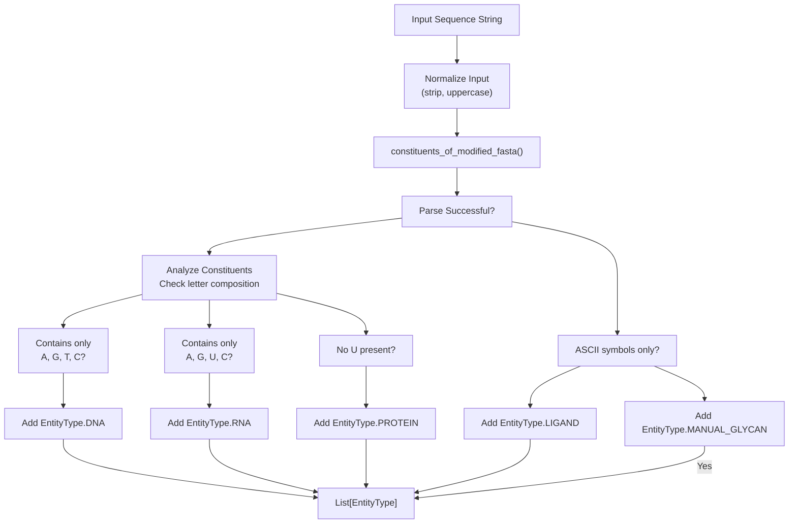
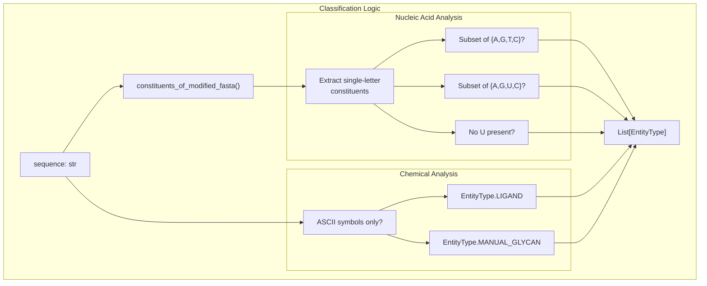
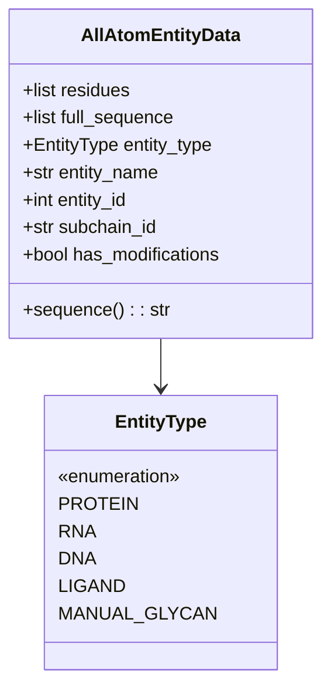

# Entity Type Identification

> **Relevant source files**
> * [chai_lab/data/features/token_utils.py](https://github.com/chaidiscovery/chai-lab/blob/66c38d1f/chai_lab/data/features/token_utils.py)
> * [chai_lab/data/parsing/input_validation.py](https://github.com/chaidiscovery/chai-lab/blob/66c38d1f/chai_lab/data/parsing/input_validation.py)
> * [chai_lab/data/parsing/structure/all_atom_entity_data.py](https://github.com/chaidiscovery/chai-lab/blob/66c38d1f/chai_lab/data/parsing/structure/all_atom_entity_data.py)
> * [chai_lab/data/parsing/structure/entity_type.py](https://github.com/chaidiscovery/chai-lab/blob/66c38d1f/chai_lab/data/parsing/structure/entity_type.py)
> * [chai_lab/data/parsing/structure/residue.py](https://github.com/chaidiscovery/chai-lab/blob/66c38d1f/chai_lab/data/parsing/structure/residue.py)
> * [tests/__init__.py](https://github.com/chaidiscovery/chai-lab/blob/66c38d1f/tests/__init__.py)
> * [tests/example_inputs.py](https://github.com/chaidiscovery/chai-lab/blob/66c38d1f/tests/example_inputs.py)
> * [tests/test_parsing.py](https://github.com/chaidiscovery/chai-lab/blob/66c38d1f/tests/test_parsing.py)

## Purpose and Scope

The entity type identification system is responsible for automatically determining what type of molecular entity a given input sequence represents. This system analyzes raw sequence strings and identifies whether they could be proteins, DNA, RNA, ligands, or glycans based on their composition and structure.

This system is part of the input processing pipeline and works with the FASTA parsing system documented in [FASTA and Sequence Parsing](/chaidiscovery/chai-lab/4.1-fasta-and-sequence-parsing). For information about molecular conformer generation after entity type identification, see [Molecular Conformers](/chaidiscovery/chai-lab/4.3-molecular-conformers).

## System Overview

The entity type identification system provides heuristic analysis of input sequences to determine their molecular nature. It supports multiple entity types and can handle modified sequences with special notations.

### Entity Type Decision Flow

**Sources:** [chai_lab/data/parsing/input_validation.py L54-L78](https://github.com/chaidiscovery/chai-lab/blob/66c38d1f/chai_lab/data/parsing/input_validation.py#L54-L78)

## Core Functions

### Modified FASTA Parsing

The `constituents_of_modified_fasta` function handles sequences with modifications specified in parentheses, such as `"A(ASP)TG"`. This allows for complex molecular entities with non-standard residues.

| Input Pattern | Parsed Result | Description |
| --- | --- | --- |
| `"AGTC"` | `["A", "G", "T", "C"]` | Standard nucleotides |
| `"AG(ASP)TG"` | `["A", "G", "ASP", "T", "G"]` | Modified sequence with ASP |
| `"(KCJ)(SEP)K(NH2)"` | `["KCJ", "SEP", "K", "NH2"]` | Multiple modifications |

**Algorithm Details:**

* Validates allowed characters: letters, digits, parentheses [chai_lab/data/parsing/input_validation.py L23-L25](https://github.com/chaidiscovery/chai-lab/blob/66c38d1f/chai_lab/data/parsing/input_validation.py#L23-L25)
* Tracks bracket state to parse modifications [chai_lab/data/parsing/input_validation.py L27-L51](https://github.com/chaidiscovery/chai-lab/blob/66c38d1f/chai_lab/data/parsing/input_validation.py#L27-L51)
* Returns `None` for invalid bracket patterns, such as double open brackets or unclosed brackets [chai_lab/data/parsing/input_validation.py L32-L50](https://github.com/chaidiscovery/chai-lab/blob/66c38d1f/chai_lab/data/parsing/input_validation.py#L32-L50)
* Ensures modifications are at least 2 characters long [chai_lab/data/parsing/input_validation.py L38-L39](https://github.com/chaidiscovery/chai-lab/blob/66c38d1f/chai_lab/data/parsing/input_validation.py#L38-L39)

**Sources:** [chai_lab/data/parsing/input_validation.py L15-L51](https://github.com/chaidiscovery/chai-lab/blob/66c38d1f/chai_lab/data/parsing/input_validation.py#L15-L51)

### Entity Type Classification

The `identify_potential_entity_types` function returns a list of possible `EntityType` enums for a given sequence. This is necessary because some sequences (like "AAAAAA") are ambiguous and could be DNA, RNA, or Protein.

**Sources:** [chai_lab/data/parsing/input_validation.py L54-L78](https://github.com/chaidiscovery/chai-lab/blob/66c38d1f/chai_lab/data/parsing/input_validation.py#L54-L78)

## Entity Type Categories

The system uses the `EntityType` enum to categorize molecules.

| Enum Value | Code Identifier | Description |
| --- | --- | --- |
| 0 | `EntityType.PROTEIN` | Standard and modified amino acid chains |
| 1 | `EntityType.RNA` | Ribonucleic acid chains |
| 2 | `EntityType.DNA` | Deoxyribonucleic acid chains |
| 3 | `EntityType.LIGAND` | Small molecules, ions, or branched entities |
| 4 | `EntityType.POLYMER_HYBRID` | Mixed DNA/RNA polymers |
| 7 | `EntityType.MANUAL_GLYCAN` | Glycan structures from string representations |

**Sources:** [chai_lab/data/parsing/structure/entity_type.py L13-L21](https://github.com/chaidiscovery/chai-lab/blob/66c38d1f/chai_lab/data/parsing/structure/entity_type.py#L13-L21)

### Nucleic Acids

The system uses set-based logic to determine nucleic acid types from single-letter constituents:

* **DNA**: All single-letter constituents are a subset of `{"A", "G", "T", "C"}` [chai_lab/data/parsing/input_validation.py L68-L69](https://github.com/chaidiscovery/chai-lab/blob/66c38d1f/chai_lab/data/parsing/input_validation.py#L68-L69)
* **RNA**: All single-letter constituents are a subset of `{"A", "G", "U", "C"}` [chai_lab/data/parsing/input_validation.py L70-L71](https://github.com/chaidiscovery/chai-lab/blob/66c38d1f/chai_lab/data/parsing/input_validation.py#L70-L71)

### Proteins

`EntityType.PROTEIN` is assigned when the sequence can be parsed as a modified FASTA and "U" (Uracil) is not present among one-letter constituents [chai_lab/data/parsing/input_validation.py L72-L73](https://github.com/chaidiscovery/chai-lab/blob/66c38d1f/chai_lab/data/parsing/input_validation.py#L72-L73)

### Chemical Entities

Both `EntityType.LIGAND` and `EntityType.MANUAL_GLYCAN` are assigned when the sequence contains only specific ASCII symbols: `ascii_letters + digits + ".-+=#$%:/\\<>@"` [chai_lab/data/parsing/input_validation.py L75-L77](https://github.com/chaidiscovery/chai-lab/blob/66c38d1f/chai_lab/data/parsing/input_validation.py#L75-L77)

 This covers SMILES strings and ion notations like `[Mg+2]` [tests/example_inputs.py L6-L18](https://github.com/chaidiscovery/chai-lab/blob/66c38d1f/tests/example_inputs.py#L6-L18)

## Integration with Structure Data

Identified entity types are stored in the `AllAtomEntityData` class, which holds the processed residue information and metadata for a molecular chain.

**Sources:** [chai_lab/data/parsing/structure/all_atom_entity_data.py L34-L49](https://github.com/chaidiscovery/chai-lab/blob/66c38d1f/chai_lab/data/parsing/structure/all_atom_entity_data.py#L34-L49)

 [chai_lab/data/parsing/structure/entity_type.py L13-L21](https://github.com/chaidiscovery/chai-lab/blob/66c38d1f/chai_lab/data/parsing/structure/entity_type.py#L13-L21)

## Error Handling and Edge Cases

The system handles several edge cases during the identification phase:

| Case | Behavior | Code Reference |
| --- | --- | --- |
| Empty sequence | Returns empty list | [chai_lab/data/parsing/input_validation.py L60-L61](https://github.com/chaidiscovery/chai-lab/blob/66c38d1f/chai_lab/data/parsing/input_validation.py#L60-L61) |
| Invalid characters | Returns `None` (failed parse) | [chai_lab/data/parsing/input_validation.py L24-L25](https://github.com/chaidiscovery/chai-lab/blob/66c38d1f/chai_lab/data/parsing/input_validation.py#L24-L25) |
| Double open bracket | Returns `None` | [chai_lab/data/parsing/input_validation.py L32-L33](https://github.com/chaidiscovery/chai-lab/blob/66c38d1f/chai_lab/data/parsing/input_validation.py#L32-L33) |
| Unclosed bracket | Returns `None` | [chai_lab/data/parsing/input_validation.py L49-L50](https://github.com/chaidiscovery/chai-lab/blob/66c38d1f/chai_lab/data/parsing/input_validation.py#L49-L50) |
| Single-char in bracket | Returns `None` (e.g., `(A)`) | [chai_lab/data/parsing/input_validation.py L38-L39](https://github.com/chaidiscovery/chai-lab/blob/66c38d1f/chai_lab/data/parsing/input_validation.py#L38-L39) |

**Sources:** [chai_lab/data/parsing/input_validation.py L21-L51](https://github.com/chaidiscovery/chai-lab/blob/66c38d1f/chai_lab/data/parsing/input_validation.py#L21-L51)