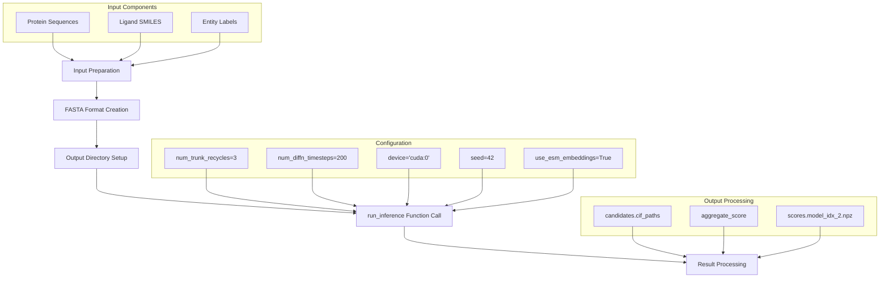
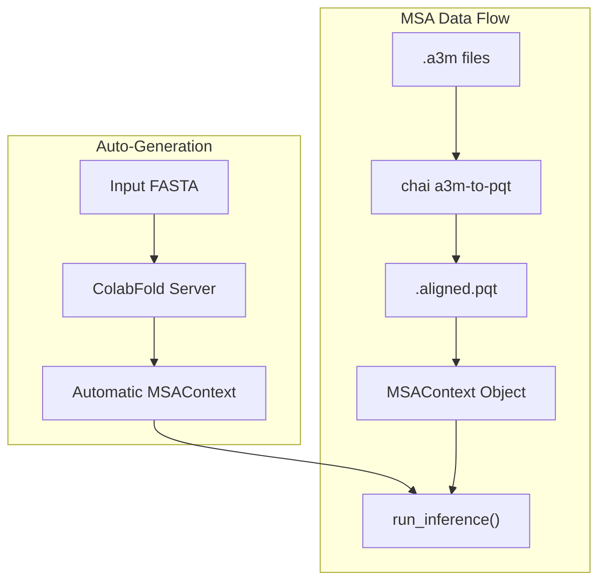
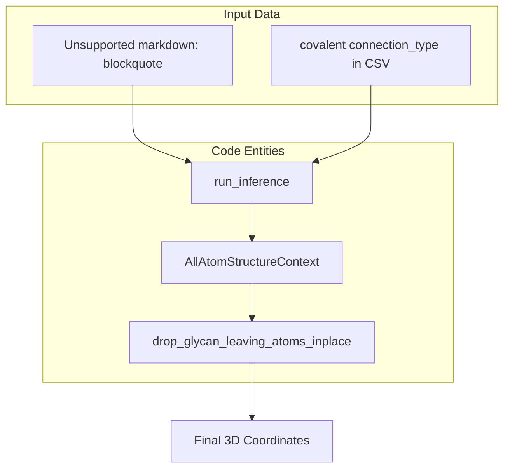

# Examples

> **Relevant source files**
> * [examples/covalent_bonds/8cyo.fasta](https://github.com/chaidiscovery/chai-lab/blob/66c38d1f/examples/covalent_bonds/8cyo.fasta)
> * [examples/covalent_bonds/8cyo.restraints](https://github.com/chaidiscovery/chai-lab/blob/66c38d1f/examples/covalent_bonds/8cyo.restraints)
> * [examples/covalent_bonds/README.md](https://github.com/chaidiscovery/chai-lab/blob/66c38d1f/examples/covalent_bonds/README.md?plain=1)
> * [examples/covalent_bonds/non_glycan_output.png](https://github.com/chaidiscovery/chai-lab/blob/66c38d1f/examples/covalent_bonds/non_glycan_output.png)
> * [examples/covalent_bonds/output.png](https://github.com/chaidiscovery/chai-lab/blob/66c38d1f/examples/covalent_bonds/output.png)
> * [examples/covalent_bonds/predict_covalent_ligand.py](https://github.com/chaidiscovery/chai-lab/blob/66c38d1f/examples/covalent_bonds/predict_covalent_ligand.py)
> * [examples/covalent_bonds/predict_glycosylated.py](https://github.com/chaidiscovery/chai-lab/blob/66c38d1f/examples/covalent_bonds/predict_glycosylated.py)
> * [examples/msas/README.md](https://github.com/chaidiscovery/chai-lab/blob/66c38d1f/examples/msas/README.md?plain=1)
> * [examples/predict_structure.py](https://github.com/chaidiscovery/chai-lab/blob/66c38d1f/examples/predict_structure.py)
> * [examples/restraints/README.md](https://github.com/chaidiscovery/chai-lab/blob/66c38d1f/examples/restraints/README.md?plain=1)
> * [examples/restraints/contact.restraints](https://github.com/chaidiscovery/chai-lab/blob/66c38d1f/examples/restraints/contact.restraints)
> * [examples/restraints/pocket.restraints](https://github.com/chaidiscovery/chai-lab/blob/66c38d1f/examples/restraints/pocket.restraints)
> * [examples/templates/predict_with_templates.py](https://github.com/chaidiscovery/chai-lab/blob/66c38d1f/examples/templates/predict_with_templates.py)

This document provides practical examples demonstrating various usage patterns and features of the chai-lab system. It covers the Python API for structure prediction, the use of Multiple Sequence Alignments (MSAs), structural templates, and advanced restraint mechanisms including covalent bonds.

## Basic Structure Prediction Workflow

The primary example demonstrates a complete structure prediction workflow using the `run_inference` function. This example shows the end-to-end process from input preparation to result analysis.

### Example Workflow Diagram

Sources: [examples/predict_structure.py L1-L57](https://github.com/chaidiscovery/chai-lab/blob/66c38d1f/examples/predict_structure.py#L1-L57)

## MSA-Based Prediction

While Chai-1 performs well in single-sequence mode, evolutionary information via Multiple Sequence Alignments (MSAs) can significantly improve performance [examples/msas/README.md L1-L3](https://github.com/chaidiscovery/chai-lab/blob/66c38d1f/examples/msas/README.md?plain=1#L1-L3)

### The .aligned.pqt Format

Chai-1 uses a custom Parquet-based format for MSAs which extends the standard `a3m` format with metadata required for featurization and multimer pairing [examples/msas/README.md L5-L12](https://github.com/chaidiscovery/chai-lab/blob/66c38d1f/examples/msas/README.md?plain=1#L5-L12)

| Column | Description |
| --- | --- |
| `sequence` | Alignment hits in `a3m` format. |
| `source_database` | Origin database (`uniprot`, `uniref90`, `bfd_uniclust`, `mgnify`, or `query`). |
| `pairing_key` | String used to pair alignments across different chains (e.g., species ID). |
| `comment` | Metadata ignored by the model. |

Sources: [examples/msas/README.md L7-L12](https://github.com/chaidiscovery/chai-lab/blob/66c38d1f/examples/msas/README.md?plain=1#L7-L12)

### MSA Implementation Pattern

Users can provide MSAs by pointing to a directory containing `<HASH>.aligned.pqt` files, where the hash corresponds to the unique chain sequence [examples/msas/README.md L33-L35](https://github.com/chaidiscovery/chai-lab/blob/66c38d1f/examples/msas/README.md?plain=1#L33-L35)

 Alternatively, the system supports automatic generation via the ColabFold server [examples/msas/README.md L64-L71](https://github.com/chaidiscovery/chai-lab/blob/66c38d1f/examples/msas/README.md?plain=1#L64-L71)

Sources: [examples/msas/README.md L27-L35](https://github.com/chaidiscovery/chai-lab/blob/66c38d1f/examples/msas/README.md?plain=1#L27-L35)

 [examples/msas/README.md L64-L71](https://github.com/chaidiscovery/chai-lab/blob/66c38d1f/examples/msas/README.md?plain=1#L64-L71)

## Restraints and Constraints

Chai-1 allows folding complexes with user-specified "restraints" to guide the model. These are provided as a `.csv` table specifying inter-chain contacts or pockets [examples/restraints/README.md L1-L9](https://github.com/chaidiscovery/chai-lab/blob/66c38d1f/examples/restraints/README.md?plain=1#L1-L9)

### Restraint Types

* **Contact**: A restraint between two specific residues in distinct chains (e.g., `A R84` to `C G7`) [examples/restraints/README.md L14-L15](https://github.com/chaidiscovery/chai-lab/blob/66c38d1f/examples/restraints/README.md?plain=1#L14-L15)
* **Pocket**: A coarser restraint where a specific residue in one chain is in contact with *any* residue in another chain [examples/restraints/README.md L16-L17](https://github.com/chaidiscovery/chai-lab/blob/66c38d1f/examples/restraints/README.md?plain=1#L16-L17)

### Restraint Data Mapping

Chains are identified alphabetically (A, B, C...) based on their order in the FASTA file. Residues are specified using a 1-indexed notation like `D4` (Aspartate at position 4) [examples/restraints/README.md L19-L20](https://github.com/chaidiscovery/chai-lab/blob/66c38d1f/examples/restraints/README.md?plain=1#L19-L20)

Sources: [examples/restraints/README.md L7-L22](https://github.com/chaidiscovery/chai-lab/blob/66c38d1f/examples/restraints/README.md?plain=1#L7-L22)

 [examples/restraints/contact.restraints L1-L3](https://github.com/chaidiscovery/chai-lab/blob/66c38d1f/examples/restraints/contact.restraints#L1-L3)

 [examples/restraints/pocket.restraints L1-L4](https://github.com/chaidiscovery/chai-lab/blob/66c38d1f/examples/restraints/pocket.restraints#L1-L4)

## Covalent Bond Examples

Covalent bonds can be specified to model glycosylation or non-canonical linkages between ligands and proteins [examples/covalent_bonds/README.md L1-L4](https://github.com/chaidiscovery/chai-lab/blob/66c38d1f/examples/covalent_bonds/README.md?plain=1#L1-L4)

### Glycan Specification

Chai-1 uses a recursive parenthetical syntax in the FASTA file to define glycan branching and a restraints file to define the attachment point to the protein [examples/covalent_bonds/README.md L32-L62](https://github.com/chaidiscovery/chai-lab/blob/66c38d1f/examples/covalent_bonds/README.md?plain=1#L32-L62)

**Example Branched Glycan FASTA:**
`NAG(4-1 NAG(4-1 BMA(3-1 MAN)(6-1 MAN)))` [examples/covalent_bonds/README.md L60-L61](https://github.com/chaidiscovery/chai-lab/blob/66c38d1f/examples/covalent_bonds/README.md?plain=1#L60-L61)

### Bond Restraint Logic

The restraint file links specific atoms (e.g., `@N` on a protein residue to `@C1` on a glycan ring) [examples/covalent_bonds/README.md L27-L29](https://github.com/chaidiscovery/chai-lab/blob/66c38d1f/examples/covalent_bonds/README.md?plain=1#L27-L29)

Sources: [examples/covalent_bonds/README.md L25-L29](https://github.com/chaidiscovery/chai-lab/blob/66c38d1f/examples/covalent_bonds/README.md?plain=1#L25-L29)

 [examples/covalent_bonds/README.md L47-L50](https://github.com/chaidiscovery/chai-lab/blob/66c38d1f/examples/covalent_bonds/README.md?plain=1#L47-L50)

 [examples/covalent_bonds/README.md L76-L78](https://github.com/chaidiscovery/chai-lab/blob/66c38d1f/examples/covalent_bonds/README.md?plain=1#L76-L78)

### Non-Glycan Covalent Ligands

For ligands defined via SMILES, the user must provide a SMILES string *without* the leaving atoms and specify the bond in the restraints file [examples/covalent_bonds/README.md L70-L78](https://github.com/chaidiscovery/chai-lab/blob/66c38d1f/examples/covalent_bonds/README.md?plain=1#L70-L78)

**Example Restraint for Ligand Bond:**
`A,C217@SG,B,@S1,covalent,1.0,0.0,0.0,protein-ligand,bond1` [examples/covalent_bonds/8cyo.restraints L1-L3](https://github.com/chaidiscovery/chai-lab/blob/66c38d1f/examples/covalent_bonds/8cyo.restraints#L1-L3)

Sources: [examples/covalent_bonds/8cyo.fasta L1-L4](https://github.com/chaidiscovery/chai-lab/blob/66c38d1f/examples/covalent_bonds/8cyo.fasta#L1-L4)

 [examples/covalent_bonds/predict_covalent_ligand.py L16-L25](https://github.com/chaidiscovery/chai-lab/blob/66c38d1f/examples/covalent_bonds/predict_covalent_ligand.py#L16-L25)