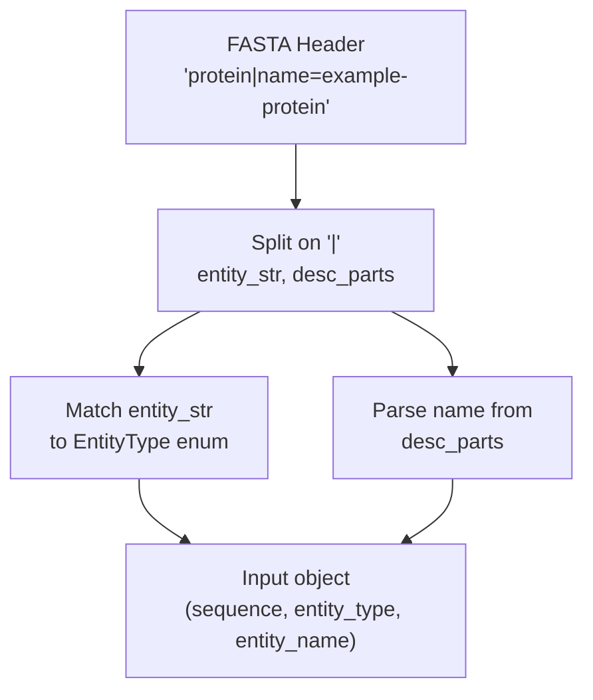
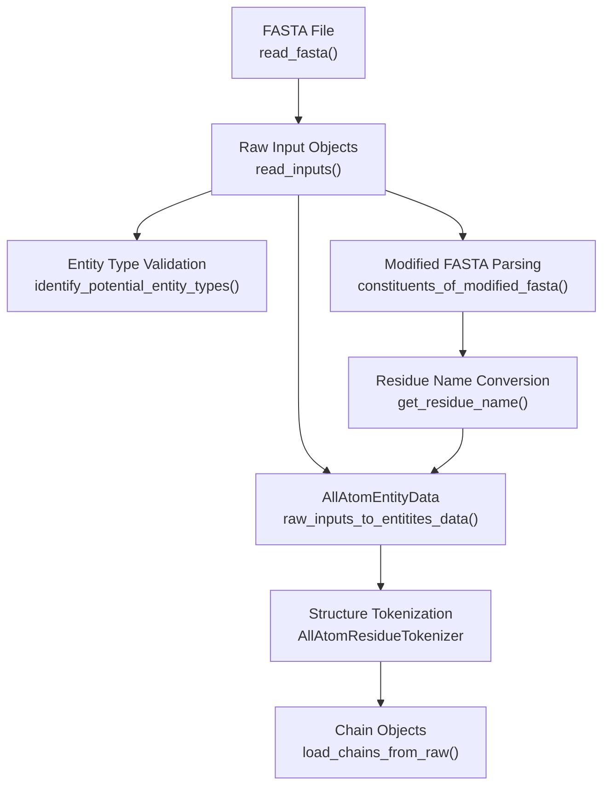
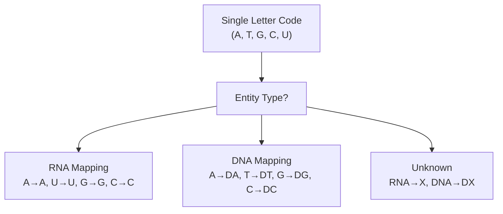
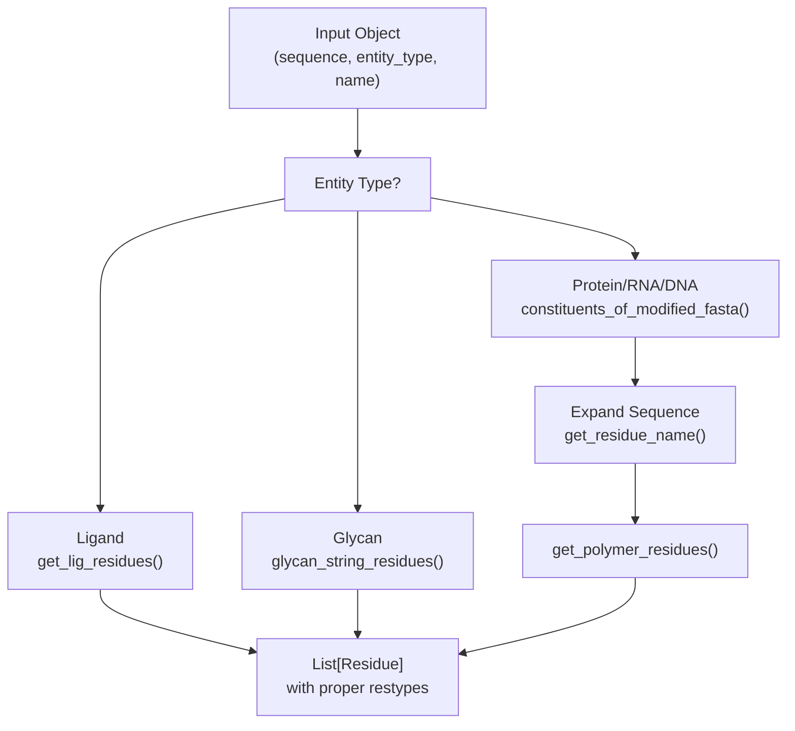

# FASTA and Sequence Parsing

> **Relevant source files**
> * [chai_lab/data/dataset/inference_dataset.py](https://github.com/chaidiscovery/chai-lab/blob/66c38d1f/chai_lab/data/dataset/inference_dataset.py)
> * [chai_lab/data/features/generators/residue_type.py](https://github.com/chaidiscovery/chai-lab/blob/66c38d1f/chai_lab/data/features/generators/residue_type.py)
> * [chai_lab/data/parsing/fasta.py](https://github.com/chaidiscovery/chai-lab/blob/66c38d1f/chai_lab/data/parsing/fasta.py)
> * [chai_lab/data/parsing/msas/a3m.py](https://github.com/chaidiscovery/chai-lab/blob/66c38d1f/chai_lab/data/parsing/msas/a3m.py)
> * [chai_lab/data/parsing/structure/sequence.py](https://github.com/chaidiscovery/chai-lab/blob/66c38d1f/chai_lab/data/parsing/structure/sequence.py)
> * [chai_lab/model/utils.py](https://github.com/chaidiscovery/chai-lab/blob/66c38d1f/chai_lab/model/utils.py)
> * [scripts/stage_colabfold_outputs_for_chai.py](https://github.com/chaidiscovery/chai-lab/blob/66c38d1f/scripts/stage_colabfold_outputs_for_chai.py)
> * [tests/test_inference_dataset.py](https://github.com/chaidiscovery/chai-lab/blob/66c38d1f/tests/test_inference_dataset.py)
> * [tests/test_restraints.py](https://github.com/chaidiscovery/chai-lab/blob/66c38d1f/tests/test_restraints.py)

This document covers the parsing of FASTA files and sequence processing within the chai-lab input processing pipeline. The system handles multi-entity FASTA files with specialized header formats to identify different molecular entity types (proteins, ligands, nucleic acids, glycans) and converts them into internal data structures for model inference.

For information about entity type validation and identification algorithms, see [Entity Type Identification](/chaidiscovery/chai-lab/4.2-entity-type-identification). For details about molecular conformer generation for ligands, see [Molecular Conformers](/chaidiscovery/chai-lab/4.3-molecular-conformers). For glycan-specific processing, see [Glycan Processing](/chaidiscovery/chai-lab/4.4-glycan-processing).

## FASTA Input Format

The chai-lab system uses an extended FASTA format with structured headers that specify entity types and names. Each sequence entry requires a header in the format:

```
>entity_type|name=entity_name
```

### Supported Entity Types

The system recognizes the following entity types in FASTA headers, mapped via the `EntityType` enum:

| Entity Type | Header Prefix | Description |
| --- | --- | --- |
| `protein` | `protein\|` | Protein sequences using standard amino acid codes |
| `ligand` | `ligand\|` | Small molecule ligands as SMILES strings |
| `rna` | `rna\|` | RNA sequences using nucleotide codes |
| `dna` | `dna\|` | DNA sequences using nucleotide codes |
| `glycan` | `glycan\|` | Glycan structures as monosaccharide strings |

### Header Format Processing

The `read_inputs` function parses these headers to instantiate `Input` dataclasses.



Sources: [chai_lab/data/dataset/inference_dataset.py L255-L282](https://github.com/chaidiscovery/chai-lab/blob/66c38d1f/chai_lab/data/dataset/inference_dataset.py#L255-L282)

 [chai_lab/data/parsing/structure/entity_type.py L1-L20](https://github.com/chaidiscovery/chai-lab/blob/66c38d1f/chai_lab/data/parsing/structure/entity_type.py#L1-L20)

## Sequence Processing Pipeline

The sequence processing follows a multi-stage pipeline that converts raw FASTA input into structured `Chain` objects ready for model inference.

### Pipeline Overview



Sources: [chai_lab/data/dataset/inference_dataset.py L235-L301](https://github.com/chaidiscovery/chai-lab/blob/66c38d1f/chai_lab/data/dataset/inference_dataset.py#L235-L301)

 [chai_lab/data/dataset/inference_dataset.py L180-L232](https://github.com/chaidiscovery/chai-lab/blob/66c38d1f/chai_lab/data/dataset/inference_dataset.py#L180-L232)

### Core Processing Functions

The main entry point for FASTA processing is `read_inputs`, which handles file reading and validation:

```python
def read_inputs(fasta_file: str | Path, length_limit: int | None = None) -> list[Input]
```

This function:

* Reads FASTA sequences using `read_fasta` (which wraps `Bio.SeqIO.parse`) [chai_lab/data/parsing/fasta.py L34-L43](https://github.com/chaidiscovery/chai-lab/blob/66c38d1f/chai_lab/data/parsing/fasta.py#L34-L43)
* Parses entity types from headers [chai_lab/data/dataset/inference_dataset.py L255-L265](https://github.com/chaidiscovery/chai-lab/blob/66c38d1f/chai_lab/data/dataset/inference_dataset.py#L255-L265)
* Validates sequence formats using `identify_potential_entity_types` [chai_lab/data/dataset/inference_dataset.py L284-L291](https://github.com/chaidiscovery/chai-lab/blob/66c38d1f/chai_lab/data/dataset/inference_dataset.py#L284-L291)
* Applies length limits if specified [chai_lab/data/dataset/inference_dataset.py L296-L299](https://github.com/chaidiscovery/chai-lab/blob/66c38d1f/chai_lab/data/dataset/inference_dataset.py#L296-L299)
* Returns a list of `Input` objects [chai_lab/data/dataset/inference_dataset.py L301](https://github.com/chaidiscovery/chai-lab/blob/66c38d1f/chai_lab/data/dataset/inference_dataset.py#L301-L301)

The `Input` dataclass structure represents parsed FASTA entries:

```python
@dataclassclass Input:    sequence: str    entity_type: int    entity_name: str
```

Sources: [chai_lab/data/dataset/inference_dataset.py L39-L44](https://github.com/chaidiscovery/chai-lab/blob/66c38d1f/chai_lab/data/dataset/inference_dataset.py#L39-L44)

 [chai_lab/data/dataset/inference_dataset.py L235-L301](https://github.com/chaidiscovery/chai-lab/blob/66c38d1f/chai_lab/data/dataset/inference_dataset.py#L235-L301)

## Residue Name Conversion

Different entity types require different residue naming conventions. The system converts single-letter codes to appropriate residue names based on the `EntityType`.

### Protein Residues

For proteins, the system uses the standard 20 amino acid single-letter codes plus 'X' for unknown residues, utilizing `restype_1to3_with_x` [chai_lab/data/parsing/fasta.py L11](https://github.com/chaidiscovery/chai-lab/blob/66c38d1f/chai_lab/data/parsing/fasta.py#L11-L11)

```python
def get_residue_name(fasta_code: str, entity_type: EntityType) -> str:    match entity_type:        case EntityType.PROTEIN:            return restype_1to3_with_x.get(fasta_code, "UNK")
```

### Nucleic Acid Residues

RNA and DNA sequences use different naming conventions to distinguish ribose from deoxyribose sugars.



The nucleic acid mapping is defined in `nucleic_acid_1_to_name`:

```
nucleic_acid_1_to_name: dict[tuple[str, EntityType], str] = {    ("A", EntityType.RNA): "A",    ("U", EntityType.RNA): "U",    ("G", EntityType.RNA): "G",    ("C", EntityType.RNA): "C",    ("A", EntityType.DNA): "DA",    ("T", EntityType.DNA): "DT",    ("G", EntityType.DNA): "DG",    ("C", EntityType.DNA): "DC",}
```

Sources: [chai_lab/data/parsing/fasta.py L18-L27](https://github.com/chaidiscovery/chai-lab/blob/66c38d1f/chai_lab/data/parsing/fasta.py#L18-L27)

 [chai_lab/data/parsing/fasta.py L62-L77](https://github.com/chaidiscovery/chai-lab/blob/66c38d1f/chai_lab/data/parsing/fasta.py#L62-L77)

## Entity Data Generation

The conversion from raw `Input` to `AllAtomEntityData` handles the creation of `Residue` objects for each sequence based on its entity type.

### Residue Object Creation



* **Ligands**: SMILES are processed via `get_lig_residues`, creating a single residue with the name `LIG` [chai_lab/data/dataset/inference_dataset.py L46-L60](https://github.com/chaidiscovery/chai-lab/blob/66c38d1f/chai_lab/data/dataset/inference_dataset.py#L46-L60)
* **Polymers**: Sequences are parsed via `constituents_of_modified_fasta` to handle brackets for modified residues, then expanded to 3-letter codes via `get_residue_name` [chai_lab/data/dataset/inference_dataset.py L112-L123](https://github.com/chaidiscovery/chai-lab/blob/66c38d1f/chai_lab/data/dataset/inference_dataset.py#L112-L123)
* **Glycans**: Strings are processed by `glycan_string_residues` [chai_lab/data/dataset/inference_dataset.py L124-L125](https://github.com/chaidiscovery/chai-lab/blob/66c38d1f/chai_lab/data/dataset/inference_dataset.py#L124-L125)

### Entity ID Assignment

The system assigns unique `entity_id` values to sequences with identical composition. This is critical for symmetry detection and feature generation.

```markdown
# Determine the entity id (unique integer for each distinct sequence)seq: tuple[str, ...] = (    (input.sequence,)    if input.entity_type == EntityType.LIGAND.value    else tuple(res.name for res in residues))entity_key: tuple[EntityType, tuple[str, ...]] = (entity_type, seq)
```

For ligands, the entity key uses the SMILES string directly [chai_lab/data/dataset/inference_dataset.py L139-L144](https://github.com/chaidiscovery/chai-lab/blob/66c38d1f/chai_lab/data/dataset/inference_dataset.py#L139-L144)

 For other entity types, it uses the sequence of residue names [chai_lab/data/dataset/inference_dataset.py L142](https://github.com/chaidiscovery/chai-lab/blob/66c38d1f/chai_lab/data/dataset/inference_dataset.py#L142-L142)

Sources: [chai_lab/data/dataset/inference_dataset.py L106-L128](https://github.com/chaidiscovery/chai-lab/blob/66c38d1f/chai_lab/data/dataset/inference_dataset.py#L106-L128)

 [chai_lab/data/dataset/inference_dataset.py L130-L149](https://github.com/chaidiscovery/chai-lab/blob/66c38d1f/chai_lab/data/dataset/inference_dataset.py#L130-L149)

## Error Handling and Validation

### Sequence Validation

Entity type validation occurs during input processing to ensure the sequence matches the header type:

```
possible_types = identify_potential_entity_types(sequence)if len(possible_types) == 0:    logger.error(f"Provided {sequence=} is invalid")elif entity_type not in possible_types:    types_fmt = "/".join(str(et.name) for et in possible_types)    logger.warning(        f"Provided {sequence=} is likely {types_fmt}, not {entity_type.name}"    )
```

Sources: [chai_lab/data/dataset/inference_dataset.py L284-L291](https://github.com/chaidiscovery/chai-lab/blob/66c38d1f/chai_lab/data/dataset/inference_dataset.py#L284-L291)

### Tokenization Failure Handling

In `load_chains_from_raw`, failed tokenization attempts (e.g., due to invalid SMILES or missing atoms in a template) are caught and logged, and the failing input is skipped [chai_lab/data/dataset/inference_dataset.py L207-L220](https://github.com/chaidiscovery/chai-lab/blob/66c38d1f/chai_lab/data/dataset/inference_dataset.py#L207-L220)

## Integration with Downstream Processing

The parsed and validated sequences are converted into `Chain` objects. These combine the `AllAtomEntityData` with the tokenized `AllAtomStructureContext` [chai_lab/data/dataset/inference_dataset.py L224-L232](https://github.com/chaidiscovery/chai-lab/blob/66c38d1f/chai_lab/data/dataset/inference_dataset.py#L224-L232)

For MSA generation, sequences can be read uniquely from FASTA files using `read_fasta_unique` to avoid redundant search efforts [chai_lab/data/parsing/fasta.py L46-L59](https://github.com/chaidiscovery/chai-lab/blob/66c38d1f/chai_lab/data/parsing/fasta.py#L46-L59)

Sources: [chai_lab/data/dataset/inference_dataset.py L224-L232](https://github.com/chaidiscovery/chai-lab/blob/66c38d1f/chai_lab/data/dataset/inference_dataset.py#L224-L232)

 [chai_lab/data/parsing/fasta.py L46-L59](https://github.com/chaidiscovery/chai-lab/blob/66c38d1f/chai_lab/data/parsing/fasta.py#L46-L59)