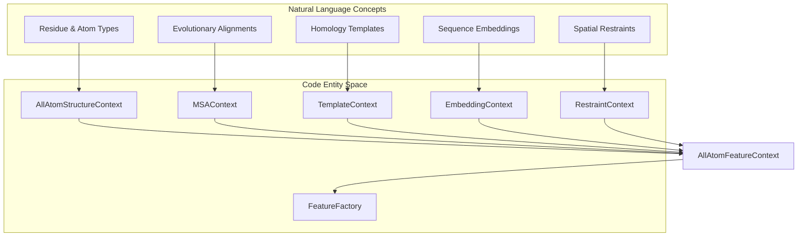
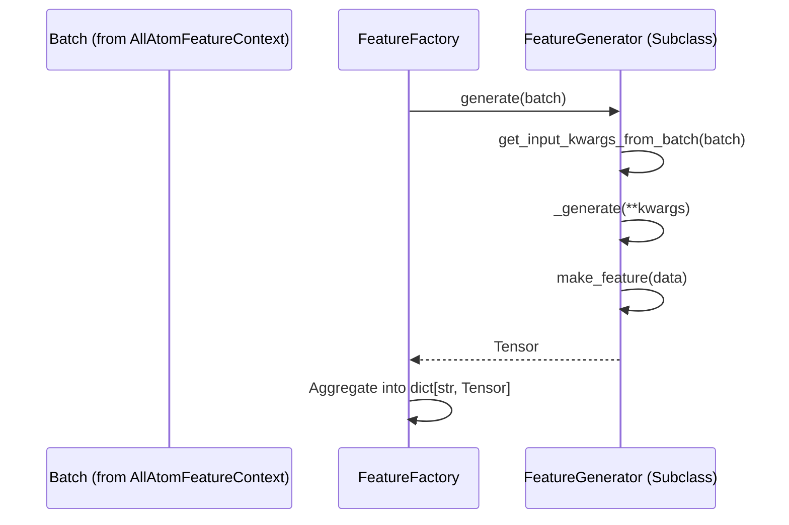

# Feature Context Assembly

> **Relevant source files**
> * [chai_lab/data/dataset/all_atom_feature_context.py](https://github.com/chaidiscovery/chai-lab/blob/66c38d1f/chai_lab/data/dataset/all_atom_feature_context.py)
> * [chai_lab/data/features/feature_factory.py](https://github.com/chaidiscovery/chai-lab/blob/66c38d1f/chai_lab/data/features/feature_factory.py)
> * [chai_lab/data/features/feature_type.py](https://github.com/chaidiscovery/chai-lab/blob/66c38d1f/chai_lab/data/features/feature_type.py)
> * [chai_lab/data/features/feature_utils.py](https://github.com/chaidiscovery/chai-lab/blob/66c38d1f/chai_lab/data/features/feature_utils.py)
> * [chai_lab/data/features/generators/base.py](https://github.com/chaidiscovery/chai-lab/blob/66c38d1f/chai_lab/data/features/generators/base.py)

The Feature Context Assembly system in Chai-1 combines diverse biological and chemical information into a unified `AllAtomFeatureContext` structure. This assembly process integrates structural data, evolutionary information, templates, embeddings, and spatial constraints into a cohesive representation that the model can process.

## Overview

The `AllAtomFeatureContext` class acts as a unified container that consolidates multiple types of data contexts. It is defined in [chai_lab/data/dataset/all_atom_feature_context.py L25-L40](https://github.com/chaidiscovery/chai-lab/blob/66c38d1f/chai_lab/data/dataset/all_atom_feature_context.py#L25-L40)

 The context is designed to be padded and batched by a collator [chai_lab/data/dataset/all_atom_feature_context.py L27-L29](https://github.com/chaidiscovery/chai-lab/blob/66c38d1f/chai_lab/data/dataset/all_atom_feature_context.py#L27-L29)

### AllAtomFeatureContext Structure

| Field | Type | Description |
| --- | --- | --- |
| `chains` | `list[Chain]` | Metadata for each chain in the system. |
| `structure_context` | `AllAtomStructureContext` | Token and atom level structural data. |
| `msa_context` | `MSAContext` | Primary evolutionary information. |
| `profile_msa_context` | `MSAContext` | MSA data used for profiling. |
| `template_context` | `TemplateContext` | Structural templates from homology. |
| `embedding_context` | `EmbeddingContext \| None` | Sequence embeddings (e.g., ESM). |
| `restraint_context` | `RestraintContext` | User-defined spatial constraints. |

Sources: [chai_lab/data/dataset/all_atom_feature_context.py L25-L40](https://github.com/chaidiscovery/chai-lab/blob/66c38d1f/chai_lab/data/dataset/all_atom_feature_context.py#L25-L40)

### Natural Language to Code Entity Space

This diagram maps conceptual features to their corresponding code implementations within the assembly pipeline.

Sources: [chai_lab/data/dataset/all_atom_feature_context.py L32-L39](https://github.com/chaidiscovery/chai-lab/blob/66c38d1f/chai_lab/data/dataset/all_atom_feature_context.py#L32-L39)

 [chai_lab/data/features/feature_factory.py L16-L23](https://github.com/chaidiscovery/chai-lab/blob/66c38d1f/chai_lab/data/features/feature_factory.py#L16-L23)

## Components of Feature Context

### Structure Context

The `AllAtomStructureContext` manages the mapping between tokens (residues/entities) and atoms. It handles global indexing when multiple chains are merged via `AllAtomStructureContext.merge` [chai_lab/data/dataset/structure/all_atom_structure_context.py L360-L361](https://github.com/chaidiscovery/chai-lab/blob/66c38d1f/chai_lab/data/dataset/structure/all_atom_structure_context.py#L360-L361)

### MSA Context

Captures evolutionary information. The assembly limits the depth of MSAs to `MAX_MSA_DEPTH` (16,384) during padding [chai_lab/data/dataset/all_atom_feature_context.py L20](https://github.com/chaidiscovery/chai-lab/blob/66c38d1f/chai_lab/data/dataset/all_atom_feature_context.py#L20-L20)

 [chai_lab/data/dataset/all_atom_feature_context.py L60-L61](https://github.com/chaidiscovery/chai-lab/blob/66c38d1f/chai_lab/data/dataset/all_atom_feature_context.py#L60-L61)

### Template Context

Provides structural hints from known PDB structures. The system supports up to `MAX_NUM_TEMPLATES` (4) [chai_lab/data/dataset/all_atom_feature_context.py L21](https://github.com/chaidiscovery/chai-lab/blob/66c38d1f/chai_lab/data/dataset/all_atom_feature_context.py#L21-L21)

 [chai_lab/data/dataset/all_atom_feature_context.py L68-L69](https://github.com/chaidiscovery/chai-lab/blob/66c38d1f/chai_lab/data/dataset/all_atom_feature_context.py#L68-L69)

## Feature Factory and Generators

The `FeatureFactory` is the engine that converts an assembled `AllAtomFeatureContext` (after collation into a batch) into actual numerical tensors used by the model trunk.

### Implementation Flow

The factory iterates through a dictionary of `FeatureGenerator` objects, calling their `generate` method on the batch [chai_lab/data/features/feature_factory.py L22-L23](https://github.com/chaidiscovery/chai-lab/blob/66c38d1f/chai_lab/data/features/feature_factory.py#L22-L23)

Sources: [chai_lab/data/features/feature_factory.py L16-L23](https://github.com/chaidiscovery/chai-lab/blob/66c38d1f/chai_lab/data/features/feature_factory.py#L16-L23)

 [chai_lab/data/features/generators/base.py L94-L111](https://github.com/chaidiscovery/chai-lab/blob/66c38d1f/chai_lab/data/features/generators/base.py#L94-L111)

### Feature Types and Encodings

Features are categorized by `FeatureType` (e.g., `RESIDUE`, `ATOM`, `MSA`, `TEMPLATES`) [chai_lab/data/features/feature_type.py L8-L17](https://github.com/chaidiscovery/chai-lab/blob/66c38d1f/chai_lab/data/features/feature_type.py#L8-L17)

 They are encoded using various methods defined in `EncodingType` [chai_lab/data/features/generators/base.py L18-L25](https://github.com/chaidiscovery/chai-lab/blob/66c38d1f/chai_lab/data/features/generators/base.py#L18-L25)

:

* **ONE_HOT / OUTERSUM**: Categorical data.
* **RBF / FOURIER**: Continuous distance or positional data.
* **IDENTITY**: Raw floating point values.
* **ESM**: Pre-computed language model embeddings.

The `cast_feature` function ensures tensors are in the correct format and dtype for their encoding type [chai_lab/data/features/generators/base.py L27-L54](https://github.com/chaidiscovery/chai-lab/blob/66c38d1f/chai_lab/data/features/generators/base.py#L27-L54)

## Assembly for Collation

Before being passed to the model, the `AllAtomFeatureContext` must be converted to a dictionary of tensors. This is performed by the `to_dict()` method, which flattens the nested context objects into a single-level dictionary [chai_lab/data/dataset/all_atom_feature_context.py L78-L95](https://github.com/chaidiscovery/chai-lab/blob/66c38d1f/chai_lab/data/dataset/all_atom_feature_context.py#L78-L95)

### Data Flow to Tensors

| Step | Operation | Source |
| --- | --- | --- |
| 1. Assembly | Combine contexts into `AllAtomFeatureContext` | `chai_lab/chai1.py` |
| 2. Padding | `pad(n_tokens, n_atoms)` | [chai_lab/data/dataset/all_atom_feature_context.py L45-L76](https://github.com/chaidiscovery/chai-lab/blob/66c38d1f/chai_lab/data/dataset/all_atom_feature_context.py#L45-L76) |
| 3. Flattening | `to_dict()` | [chai_lab/data/dataset/all_atom_feature_context.py L78-L95](https://github.com/chaidiscovery/chai-lab/blob/66c38d1f/chai_lab/data/dataset/all_atom_feature_context.py#L78-L95) |
| 4. Generation | `FeatureFactory.generate(batch)` | [chai_lab/data/features/feature_factory.py L22-L23](https://github.com/chaidiscovery/chai-lab/blob/66c38d1f/chai_lab/data/features/feature_factory.py#L22-L23) |

The `to_dict` method specifically handles the mapping of MSA keys like `msa_tokens`, `msa_mask`, and `msa_deletion_matrix`, as well as template and restraint features [chai_lab/data/dataset/all_atom_feature_context.py L79-L94](https://github.com/chaidiscovery/chai-lab/blob/66c38d1f/chai_lab/data/dataset/all_atom_feature_context.py#L79-L94)

Sources: [chai_lab/data/dataset/all_atom_feature_context.py L45-L95](https://github.com/chaidiscovery/chai-lab/blob/66c38d1f/chai_lab/data/dataset/all_atom_feature_context.py#L45-L95)

 [chai_lab/data/features/feature_factory.py L22-L23](https://github.com/chaidiscovery/chai-lab/blob/66c38d1f/chai_lab/data/features/feature_factory.py#L22-L23)