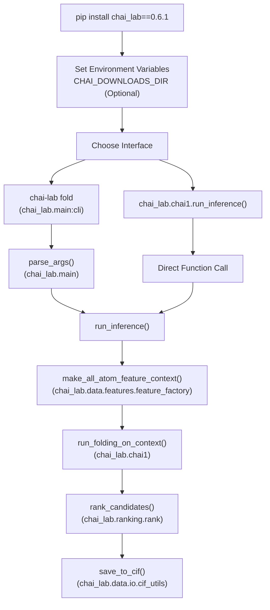
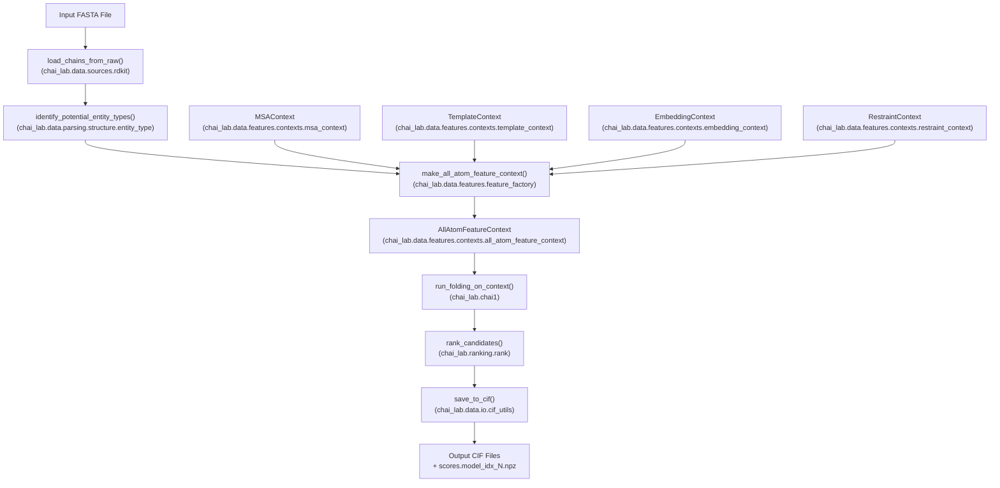

# Getting Started

> **Relevant source files**
> * [README.md](https://github.com/chaidiscovery/chai-lab/blob/66c38d1f/README.md?plain=1)
> * [examples/predict_structure.py](https://github.com/chaidiscovery/chai-lab/blob/66c38d1f/examples/predict_structure.py)

This guide walks you through installing Chai-1 and running your first molecular structure prediction. For detailed information on the command-line options, see [Command Line Interface](/chaidiscovery/chai-lab/2.1-command-line-interface); for comprehensive Python API documentation, see [Python API](/chaidiscovery/chai-lab/2.2-python-api).

## System Requirements

Chai-1 requires the following:

* **Operating System**: Linux
* **Python**: Version 3.10 or later
* **GPU**: CUDA-compatible GPU with bfloat16 support * Recommended: A100 80GB, H100 80GB, or L40S 48GB * Also compatible: A10, A30, or consumer-grade RTX 4090

Sources: [README.md L11-L21](https://github.com/chaidiscovery/chai-lab/blob/66c38d1f/README.md?plain=1#L11-L21)

## Installation

Install Chai-1 using pip:

```python
# Install the released version from PyPIpip install chai_lab==0.6.1 # Or install the latest development versionpip install git+https://github.com/chaidiscovery/chai-lab.git
```

The package automatically installs all required dependencies.

Sources: [README.md L11-L19](https://github.com/chaidiscovery/chai-lab/blob/66c38d1f/README.md?plain=1#L11-L19)

## Installation and Operation Flow

The diagram below illustrates the path from installation to the final 3D structure generation, mapping high-level actions to the underlying code entry points.



Sources: [README.md L11-L19](https://github.com/chaidiscovery/chai-lab/blob/66c38d1f/README.md?plain=1#L11-L19)

 [README.md L25-L46](https://github.com/chaidiscovery/chai-lab/blob/66c38d1f/README.md?plain=1#L25-L46)

 [README.md L48-L62](https://github.com/chaidiscovery/chai-lab/blob/66c38d1f/README.md?plain=1#L48-L62)

 [examples/predict_structure.py L7-L49](https://github.com/chaidiscovery/chai-lab/blob/66c38d1f/examples/predict_structure.py#L7-L49)

## Basic Usage

Chai-1 can be used through either the command-line interface or Python API.

### Command-Line Interface

The main CLI command to predict structures is:

```
chai-lab fold input.fasta output_folder
```

By default, this generates 5 structure predictions using ESM embeddings (without MSAs or templates).

For improved predictions, enable MSA and template usage:

```
chai-lab fold --use-msa-server --use-templates-server input.fasta output_folder
```

For a custom ColabFold server:

```
chai-lab fold --use-msa-server --msa-server-url "https://your-server-url" input.fasta output_folder
```

For details, see [Command Line Interface](/chaidiscovery/chai-lab/2.1-command-line-interface).

Sources: [README.md L25-L46](https://github.com/chaidiscovery/chai-lab/blob/66c38d1f/README.md?plain=1#L25-L46)

### Python API

For programmatic use, import and call the `run_inference` function defined in `chai_lab.chai1`. The following example demonstrates the basic usage pattern:

```javascript
from chai_lab.chai1 import run_inferencefrom pathlib import Path # Create FASTA input fileexample_fasta = """>protein|name=example-proteinAGSHSMRYFSTSVSRPGRGEPRFIAVGYVDDTQFVRFDSDAASPRGEPRAPWVEQEGPEYWDRETQKYKRQAQTDRVSLRNLRGYYNQSEAGSHTLQWMFGCDLGPDGRLLRGYDQSAYDGKDYIALNEDLRSWTAADTAAQITQRKWEAAREAEQRRAYLEGTCVEWLRRYLENGKETLQRAEHPKTHVTHHPVSDHEATLRCWALGFYPAEITLTWQWDGEDQTQDTELVETRPAGDGTFQKWAAVVVPSGEEQRYTCHVQHEGLPEPLTLRWEP>ligand|name=example-ligandCCCCCCCCCCCCCC(=O)O""".strip() fasta_path = Path("/tmp/example.fasta")fasta_path.write_text(example_fasta) # Run the predictioncandidates = run_inference(    fasta_file=fasta_path,    output_dir=Path("/tmp/outputs"),    num_trunk_recycles=3,    num_diffn_timesteps=200,    seed=42,    device="cuda:0",    use_esm_embeddings=True,) # Access resultscif_paths = candidates.cif_pathsagg_scores = [rd.aggregate_score.item() for rd in candidates.ranking_data]
```

For advanced use cases, you can use `run_folding_on_context` to construct a custom `AllAtomFeatureContext` manually. For details, see [Python API](/chaidiscovery/chai-lab/2.2-python-api).

Sources: [README.md L48-L94](https://github.com/chaidiscovery/chai-lab/blob/66c38d1f/README.md?plain=1#L48-L94)

 [examples/predict_structure.py L7-L57](https://github.com/chaidiscovery/chai-lab/blob/66c38d1f/examples/predict_structure.py#L7-L57)

## Data Flow Through System

The following diagram maps the data transformation stages to the specific internal contexts and factories used by the Chai-1 engine.



Sources: [README.md L76-L94](https://github.com/chaidiscovery/chai-lab/blob/66c38d1f/README.md?plain=1#L76-L94)

 [README.md L48-L62](https://github.com/chaidiscovery/chai-lab/blob/66c38d1f/README.md?plain=1#L48-L62)

 [examples/predict_structure.py L1-L57](https://github.com/chaidiscovery/chai-lab/blob/66c38d1f/examples/predict_structure.py#L1-L57)

## Environment Configuration

Model weights are automatically downloaded to `<package_root>/downloads`. To specify a custom location, set the `CHAI_DOWNLOADS_DIR` environment variable:

```javascript
# For command-line usageexport CHAI_DOWNLOADS_DIR=/path/to/downloadschai-lab fold input.fasta output_folder # For Python usageimport osos.environ["CHAI_DOWNLOADS_DIR"] = "/path/to/downloads"from chai_lab.chai1 import run_inference
```

Sources: [README.md L64-L73](https://github.com/chaidiscovery/chai-lab/blob/66c38d1f/README.md?plain=1#L64-L73)

## File Formats

Chai-1 works with the following key file formats:

| Format | Description | Usage |
| --- | --- | --- |
| FASTA (.fasta) | Sequence input | Contains protein sequences, SMILES strings, and other entities |
| CIF (.cif) | Structure output | Contains 3D coordinates of predicted structures |
| Aligned MSA (.aligned.pqt) | Multiple sequence alignment | Used to improve prediction accuracy via `MSAContext` |
| M8 (.m8) | Template hits | BLAST-like format for template search results |
| NPZ (.npz) | Quality scores | Contains pTM, ipTM, pLDDT, and clash scores |

### FASTA Input Format

The FASTA format supports multiple entity types with specific naming conventions:

```
>protein|name=example-protein
AGSHSMRYFSTSVSRPGRGEPRFIAVGYVDDTQFVRFDSDAASPRGEPRAPWVEQEGPEYWDRETQKYKRQAQTDRVSLRNLRGYYNQSEAGSHTLQWMFGCDLGPDGRLLRGYDQSAYDGKDYIALNEDLRSWTAADTAAQITQRKWEAAREAEQRRAYLEGTCVEWLRRYLENGKETLQRAEHPKTHVTHHPVSDHEATLRCWALGFYPAEITLTWQWDGEDQTQDTELVETRPAGDGTFQKWAAVVVPSGEEQRYTCHVQHEGLPEPLTLRWEP
>ligand|name=example-ligand
CCCCCCCCCCCCCC(=O)O
```

For detailed information on input formats and entity identification, see [Input Processing](/chaidiscovery/chai-lab/4-input-processing).

Sources: [README.md L76-L83](https://github.com/chaidiscovery/chai-lab/blob/66c38d1f/README.md?plain=1#L76-L83)

 [examples/predict_structure.py L19-L28](https://github.com/chaidiscovery/chai-lab/blob/66c38d1f/examples/predict_structure.py#L19-L28)

## Next Steps

* [Command Line Interface](/chaidiscovery/chai-lab/2.1-command-line-interface) - Learn all CLI options and commands.
* [Python API](/chaidiscovery/chai-lab/2.2-python-api) - Explore the full API capabilities including `run_folding_on_context`.
* [Multiple Sequence Alignments](/chaidiscovery/chai-lab/5.1-multiple-sequence-alignments) - Enhance predictions with evolutionary information.
* [Structural Templates](/chaidiscovery/chai-lab/5.2-structural-templates) - Use template-based structure prediction.
* [Restraints and Constraints](/chaidiscovery/chai-lab/5.4-restraints-and-constraints) - Apply spatial constraints to predictions.

Sources: [README.md L76-L94](https://github.com/chaidiscovery/chai-lab/blob/66c38d1f/README.md?plain=1#L76-L94)

 [README.md L113-L119](https://github.com/chaidiscovery/chai-lab/blob/66c38d1f/README.md?plain=1#L113-L119)