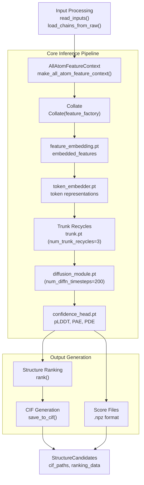
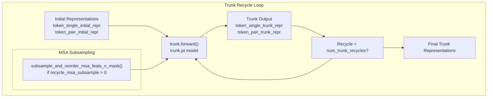
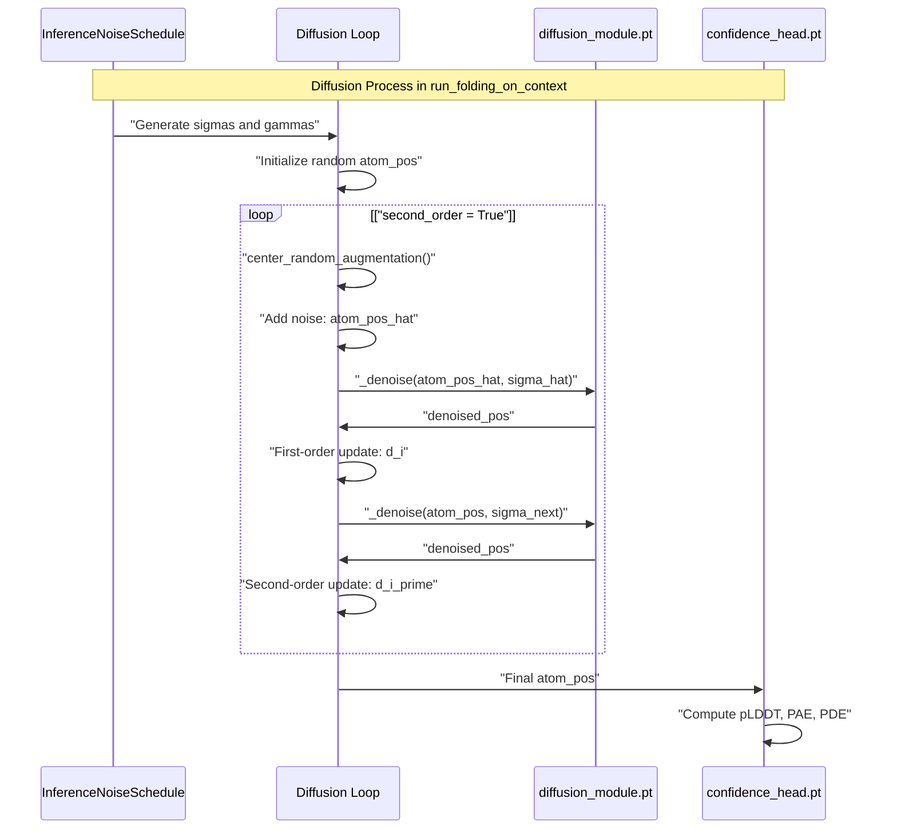
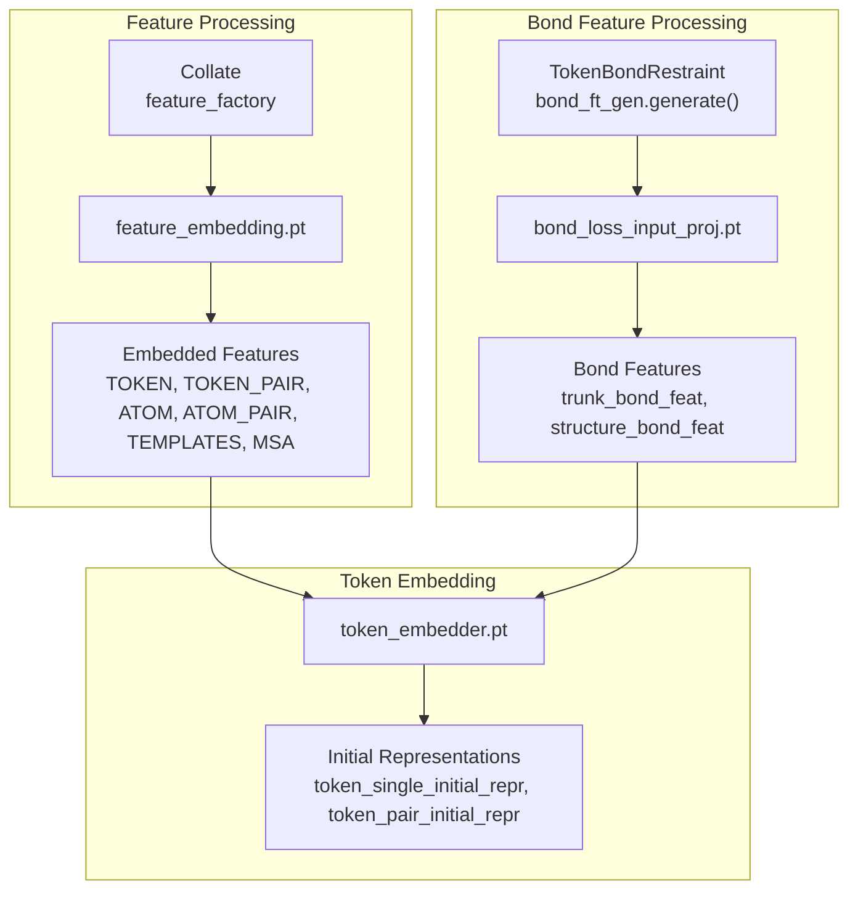
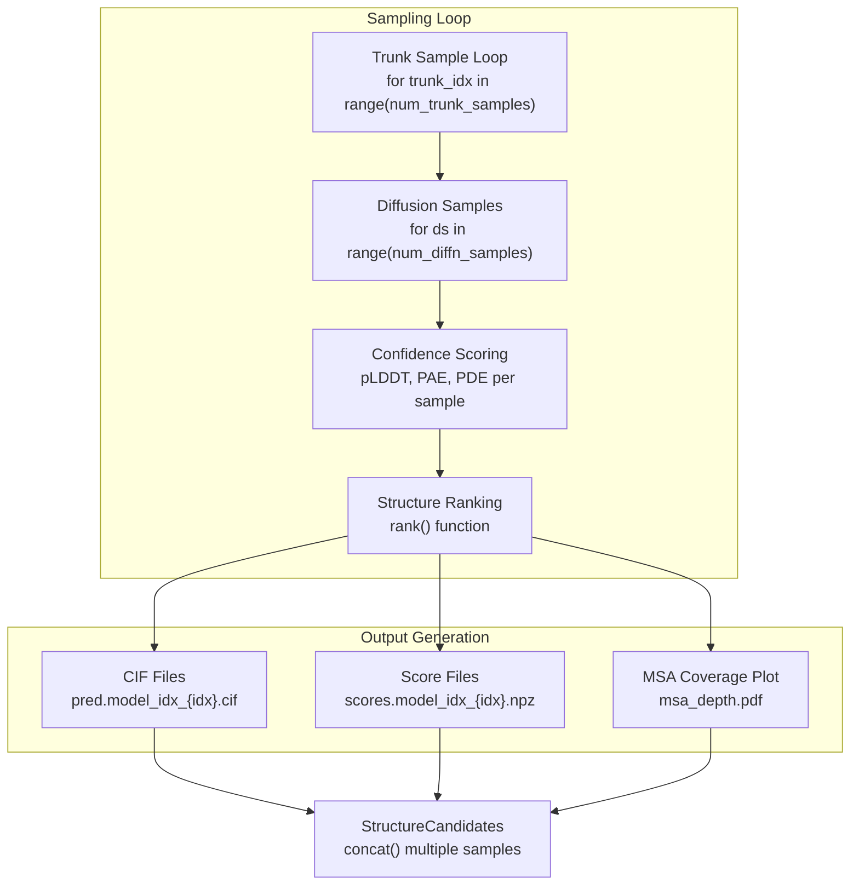

# Inference Engine

> **Relevant source files**
> * [chai_lab/chai1.py](https://github.com/chaidiscovery/chai-lab/blob/66c38d1f/chai_lab/chai1.py)
> * [chai_lab/data/dataset/msas/utils.py](https://github.com/chaidiscovery/chai-lab/blob/66c38d1f/chai_lab/data/dataset/msas/utils.py)
> * [chai_lab/model/__init__.py](https://github.com/chaidiscovery/chai-lab/blob/66c38d1f/chai_lab/model/__init__.py)
> * [chai_lab/model/diffusion_schedules.py](https://github.com/chaidiscovery/chai-lab/blob/66c38d1f/chai_lab/model/diffusion_schedules.py)

## Purpose and Scope

This document describes the core inference engine of the Chai-1 molecular structure prediction system. The inference engine orchestrates the complete pipeline from feature processing through structure generation, including trunk recycling and diffusion. This page covers the main inference pipeline implementation, trunk recycling mechanisms, and diffusion process integration. For information about input processing, see [Input Processing](/chaidiscovery/chai-lab/4-input-processing), for feature generation details, see [Feature Generation](/chaidiscovery/chai-lab/5-feature-generation), and for structure scoring, see [Structure Ranking](/chaidiscovery/chai-lab/3.4-structure-ranking).

## Inference Engine Architecture

The inference engine coordinates the complete Chai-1 structure prediction pipeline, from feature processing through final structure generation.



Sources: [chai_lab/chai1.py L498-L572](https://github.com/chaidiscovery/chai-lab/blob/66c38d1f/chai_lab/chai1.py#L498-L572)

 [chai_lab/chai1.py L579-L1059](https://github.com/chaidiscovery/chai-lab/blob/66c38d1f/chai_lab/chai1.py#L579-L1059)

## Main Inference Functions

The inference engine provides two main entry points for structure prediction:

### run_inference

The primary interface for end-to-end structure prediction from FASTA files:

```python
def run_inference(    fasta_file: Path,    output_dir: Path,    use_esm_embeddings: bool = True,    use_msa_server: bool = False,    num_trunk_recycles: int = 3,    num_diffn_timesteps: int = 200,    num_diffn_samples: int = 5,    num_trunk_samples: int = 1,    # ... other parameters) -> StructureCandidates
```

Sources: [chai_lab/chai1.py L498-L572](https://github.com/chaidiscovery/chai-lab/blob/66c38d1f/chai_lab/chai1.py#L498-L572)

### run_folding_on_context

Lower-level interface for folding when feature context is already prepared:

```python
def run_folding_on_context(    feature_context: AllAtomFeatureContext,    output_dir: Path,    num_trunk_recycles: int = 3,    num_diffn_timesteps: int = 200,    num_diffn_samples: int = 5,    # ... other parameters) -> StructureCandidates
```

Sources: [chai_lab/chai1.py L579-L594](https://github.com/chaidiscovery/chai-lab/blob/66c38d1f/chai_lab/chai1.py#L579-L594)

## Trunk Recycling Process

The trunk model performs iterative refinement of molecular representations through recycling:



The trunk recycling process uses:

* `num_trunk_recycles`: Number of recycling iterations (default: 3) [chai_lab/chai1.py L588](https://github.com/chaidiscovery/chai-lab/blob/66c38d1f/chai_lab/chai1.py#L588-L588)
* `recycle_msa_subsample`: Optional MSA subsampling during recycles [chai_lab/chai1.py L591](https://github.com/chaidiscovery/chai-lab/blob/66c38d1f/chai_lab/chai1.py#L591-L591)
* Progressive refinement of token representations [chai_lab/chai1.py L744-L777](https://github.com/chaidiscovery/chai-lab/blob/66c38d1f/chai_lab/chai1.py#L744-L777)

Sources: [chai_lab/chai1.py L744-L777](https://github.com/chaidiscovery/chai-lab/blob/66c38d1f/chai_lab/chai1.py#L744-L777)

 [chai_lab/data/dataset/msas/utils.py L51-L86](https://github.com/chaidiscovery/chai-lab/blob/66c38d1f/chai_lab/data/dataset/msas/utils.py#L51-L86)

## Exported Model Components

The inference engine uses several exported PyTorch models loaded via `ModuleWrapper` [chai_lab/chai1.py L115-L137](https://github.com/chaidiscovery/chai-lab/blob/66c38d1f/chai_lab/chai1.py#L115-L137)

:

| Component | File | Purpose |
| --- | --- | --- |
| Feature Embedder | `feature_embedding.pt` | Converts raw features to embedded representations |
| Token Embedder | `token_embedder.pt` | Processes token-level features and atom features |
| Trunk Model | `trunk.pt` | Iterative refinement through recycling |
| Diffusion Module | `diffusion_module.pt` | Denoising diffusion for structure generation |
| Confidence Head | `confidence_head.pt` | Confidence scoring (pLDDT, PAE, PDE) |
| Bond Loss Input Projection | `bond_loss_input_proj.pt` | Bond feature processing |

### Component Loading and Management

Components are loaded using `load_exported()` [chai_lab/chai1.py L139-L149](https://github.com/chaidiscovery/chai-lab/blob/66c38d1f/chai_lab/chai1.py#L139-L149)

 and managed with `_component_moved_to()` context manager [chai_lab/chai1.py L154-L167](https://github.com/chaidiscovery/chai-lab/blob/66c38d1f/chai_lab/chai1.py#L154-L167)

:

```markdown
with _component_moved_to("trunk.pt", device) as trunk:    (token_single_trunk_repr, token_pair_trunk_repr) = trunk.forward(        # trunk parameters    )
```

This allows efficient GPU memory management by temporarily moving components to device only when needed.

Sources: [chai_lab/chai1.py L139-L166](https://github.com/chaidiscovery/chai-lab/blob/66c38d1f/chai_lab/chai1.py#L139-L166)

 [chai_lab/chai1.py L678-L685](https://github.com/chaidiscovery/chai-lab/blob/66c38d1f/chai_lab/chai1.py#L678-L685)

## Diffusion Process

The diffusion process generates 3D atomic coordinates through iterative denoising.

### DiffusionConfig Parameters

| Parameter | Default Value | Description |
| --- | --- | --- |
| S_churn | 80 | Controls the amount of noise added during steps |
| S_tmin | 4e-4 | Minimum noise scale in schedule |
| S_tmax | 80.0 | Maximum noise scale in schedule |
| S_noise | 1.003 | Noise parameter for added noise during denoising |
| sigma_data | 16.0 | Scaling parameter for data distribution |
| second_order | True | Whether to use second-order update steps for higher accuracy |

Sources: [chai_lab/chai1.py L242-L249](https://github.com/chaidiscovery/chai-lab/blob/66c38d1f/chai_lab/chai1.py#L242-L249)

### Diffusion Implementation Flow

The `InferenceNoiseSchedule` generates the schedule of noise levels (sigmas) [chai_lab/model/diffusion_schedules.py L14-L39](https://github.com/chaidiscovery/chai-lab/blob/66c38d1f/chai_lab/model/diffusion_schedules.py#L14-L39)



Sources: [chai_lab/chai1.py L821-L885](https://github.com/chaidiscovery/chai-lab/blob/66c38d1f/chai_lab/chai1.py#L821-L885)

 [chai_lab/model/diffusion_schedules.py L14-L39](https://github.com/chaidiscovery/chai-lab/blob/66c38d1f/chai_lab/model/diffusion_schedules.py#L14-L39)

## Feature Processing Pipeline

The inference engine processes features through several stages before trunk recycling:

### Feature Embedding Stage



Sources: [chai_lab/chai1.py L637-L647](https://github.com/chaidiscovery/chai-lab/blob/66c38d1f/chai_lab/chai1.py#L637-L647)

 [chai_lab/chai1.py L679-L738](https://github.com/chaidiscovery/chai-lab/blob/66c38d1f/chai_lab/chai1.py#L679-L738)

## Sampling and Output Generation

The inference engine supports multiple sampling strategies.

### Sampling Parameters

| Parameter | Default | Description |
| --- | --- | --- |
| `num_trunk_samples` | 1 | Number of independent trunk runs |
| `num_diffn_samples` | 5 | Number of diffusion samples per trunk |
| `num_trunk_recycles` | 3 | Recycling iterations per trunk |
| `num_diffn_timesteps` | 200 | Diffusion denoising steps |

Total structures generated: `num_trunk_samples × num_diffn_samples` [chai_lab/chai1.py L813](https://github.com/chaidiscovery/chai-lab/blob/66c38d1f/chai_lab/chai1.py#L813-L813)

### Structure Candidate Generation



Sources: [chai_lab/chai1.py L552-L572](https://github.com/chaidiscovery/chai-lab/blob/66c38d1f/chai_lab/chai1.py#L552-L572)

 [chai_lab/chai1.py L984-L1050](https://github.com/chaidiscovery/chai-lab/blob/66c38d1f/chai_lab/chai1.py#L984-L1050)

## Memory Management and Performance

The inference engine implements several memory optimization strategies:

### Low Memory Mode

When `low_memory=True`, tensors are kept on CPU when possible:

```markdown
if not low_memory:    batch = move_data_to_device(batch, device=device)# Components return data on CPU when return_on_cpu=True
```

### Component Management

Components are temporarily moved to device using context managers [chai_lab/chai1.py L154-L167](https://github.com/chaidiscovery/chai-lab/blob/66c38d1f/chai_lab/chai1.py#L154-L167)

:

```markdown
with _component_moved_to("trunk.pt", device) as trunk:    # Component is on device during forward pass    trunk_output = trunk.forward(...)# Component automatically moved back to CPU
```

### Memory Clearing

Explicit cache clearing between major stages:

```markdown
torch.cuda.empty_cache()  # Clear GPU memory
```

Sources: [chai_lab/chai1.py L154-L166](https://github.com/chaidiscovery/chai-lab/blob/66c38d1f/chai_lab/chai1.py#L154-L166)

 [chai_lab/chai1.py L648-L650](https://github.com/chaidiscovery/chai-lab/blob/66c38d1f/chai_lab/chai1.py#L648-L650)

 [chai_lab/chai1.py L780](https://github.com/chaidiscovery/chai-lab/blob/66c38d1f/chai_lab/chai1.py#L780-L780)

## Integration with MSA Sampling

During trunk recycles, the system can optionally subsample the Multiple Sequence Alignment (MSA) inputs using `subsample_and_reorder_msa_feats_n_mask` [chai_lab/data/dataset/msas/utils.py L51-L86](https://github.com/chaidiscovery/chai-lab/blob/66c38d1f/chai_lab/data/dataset/msas/utils.py#L51-L86)

:

```
if recycle_msa_subsample > 0:    subsampled_msa_input_feats, subsampled_msa_mask = subsample_and_reorder_msa_feats_n_mask(        msa_input_feats,        msa_mask,    )
```

This allows for efficient focusing on the most informative parts of the MSA during recycles.

Sources: [chai_lab/chai1.py L727-L734](https://github.com/chaidiscovery/chai-lab/blob/66c38d1f/chai_lab/chai1.py#L727-L734)

 [chai_lab/data/dataset/msas/utils.py L51-L86](https://github.com/chaidiscovery/chai-lab/blob/66c38d1f/chai_lab/data/dataset/msas/utils.py#L51-L86)

## Confidence and Scoring

After the diffusion process completes, the final atom positions are used to generate confidence scores via the `confidence_head.pt` component [chai_lab/chai1.py L888-L935](https://github.com/chaidiscovery/chai-lab/blob/66c38d1f/chai_lab/chai1.py#L888-L935)

:

1. **pLDDT** (predicted Local Distance Difference Test): Per-residue confidence score.
2. **PAE** (Predicted Aligned Error): Pairwise distance error estimates between residues.
3. **PDE** (Predicted Distance Error): Estimates of distance error.

These scores are used for ranking the generated structures in the `rank()` function [chai_lab/ranking/rank.py L133-L157](https://github.com/chaidiscovery/chai-lab/blob/66c38d1f/chai_lab/ranking/rank.py#L133-L157)

Sources: [chai_lab/chai1.py L872-L935](https://github.com/chaidiscovery/chai-lab/blob/66c38d1f/chai_lab/chai1.py#L872-L935)

 [chai_lab/ranking/rank.py L133-L157](https://github.com/chaidiscovery/chai-lab/blob/66c38d1f/chai_lab/ranking/rank.py#L133-L157)