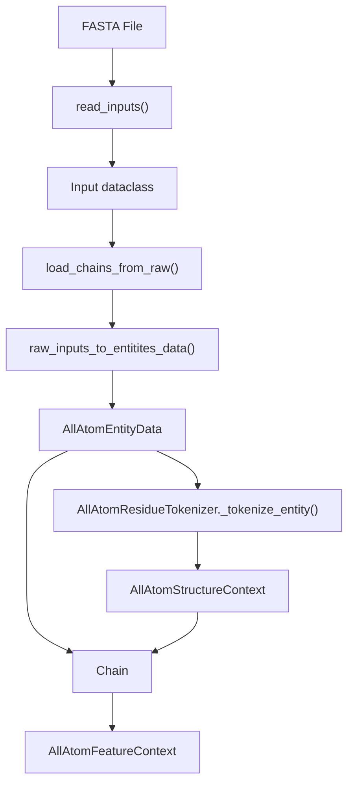
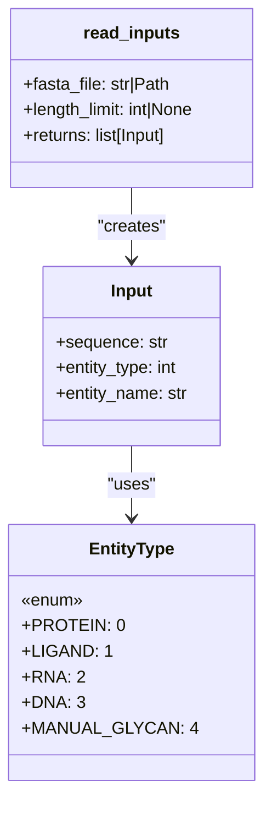

# Input Processing

> **Relevant source files**
> * [chai_lab/data/dataset/inference_dataset.py](https://github.com/chaidiscovery/chai-lab/blob/66c38d1f/chai_lab/data/dataset/inference_dataset.py)
> * [chai_lab/data/parsing/fasta.py](https://github.com/chaidiscovery/chai-lab/blob/66c38d1f/chai_lab/data/parsing/fasta.py)
> * [chai_lab/data/parsing/msas/a3m.py](https://github.com/chaidiscovery/chai-lab/blob/66c38d1f/chai_lab/data/parsing/msas/a3m.py)
> * [chai_lab/model/utils.py](https://github.com/chaidiscovery/chai-lab/blob/66c38d1f/chai_lab/model/utils.py)
> * [scripts/stage_colabfold_outputs_for_chai.py](https://github.com/chaidiscovery/chai-lab/blob/66c38d1f/scripts/stage_colabfold_outputs_for_chai.py)
> * [tests/test_inference_dataset.py](https://github.com/chaidiscovery/chai-lab/blob/66c38d1f/tests/test_inference_dataset.py)
> * [tests/test_restraints.py](https://github.com/chaidiscovery/chai-lab/blob/66c38d1f/tests/test_restraints.py)

## Purpose and Scope

This document covers the input processing system in Chai-1, which handles the parsing, validation, and conversion of various biological sequence inputs into internal data structures used by the prediction engine. It explains how different molecular entities (proteins, ligands, DNA, RNA, and glycans) are identified, processed, and prepared for the subsequent feature generation phase.

For specific details on sub-components, see:

* [FASTA and Sequence Parsing](/chaidiscovery/chai-lab/4.1-fasta-and-sequence-parsing) — Detailed header format and residue mapping.
* [Entity Type Identification](/chaidiscovery/chai-lab/4.2-entity-type-identification) — Validation and `EntityType` enum details.
* [Molecular Conformers](/chaidiscovery/chai-lab/4.3-molecular-conformers) — Ligand 3D generation and RDKit integration.
* [Glycan Processing](/chaidiscovery/chai-lab/4.4-glycan-processing) — Specialized string parsing for monosaccharides.



**Title: Input Processing Pipeline with Code Functions**

Sources: [chai_lab/data/dataset/inference_dataset.py L235-L301](https://github.com/chaidiscovery/chai-lab/blob/66c38d1f/chai_lab/data/dataset/inference_dataset.py#L235-L301)

 [chai_lab/data/dataset/inference_dataset.py L180-L233](https://github.com/chaidiscovery/chai-lab/blob/66c38d1f/chai_lab/data/dataset/inference_dataset.py#L180-L233)

## Supported Input Formats

Chai-1 supports multiple input formats for different types of biological entities, defined by the `EntityType` enum [chai_lab/data/parsing/structure/entity_type.py](https://github.com/chaidiscovery/chai-lab/blob/66c38d1f/chai_lab/data/parsing/structure/entity_type.py)

:

| Entity Type | Input Format | Description | Example |
| --- | --- | --- | --- |
| Protein | FASTA | One-letter amino acid codes | `MDSISLRVALNDGNFIPVLGFGT...` |
| Ligand | SMILES | Simplified molecular-input line-entry system | `CC(=O)OC1=CC=CC=C1C(=O)O` (Aspirin) |
| RNA | FASTA | One-letter nucleotide codes | `AUGGCCAUUGUAAUGGGCCGC...` |
| DNA | FASTA | One-letter nucleotide codes | `ATGGCCATTGTAATGGGCCGC...` |
| Glycan | Glycan string | Specialized format for glycan structures | Complex glycan structure strings |

Sources: [chai_lab/data/dataset/inference_dataset.py L108-L127](https://github.com/chaidiscovery/chai-lab/blob/66c38d1f/chai_lab/data/dataset/inference_dataset.py#L108-L127)

 [chai_lab/data/parsing/fasta.py L18-L27](https://github.com/chaidiscovery/chai-lab/blob/66c38d1f/chai_lab/data/parsing/fasta.py#L18-L27)

## Input Parsing and Entity Identification

### FASTA Parsing

FASTA files are parsed into a list of `Input` dataclasses [chai_lab/data/dataset/inference_dataset.py L39-L43](https://github.com/chaidiscovery/chai-lab/blob/66c38d1f/chai_lab/data/dataset/inference_dataset.py#L39-L43)

 The system supports a pipe-delimited header format (e.g., `>protein|name=A`) to specify metadata. For more details on the parsing logic and residue name mapping (e.g., mapping 'A' to 'ALA' for proteins vs 'DA' for DNA), see [FASTA and Sequence Parsing](/chaidiscovery/chai-lab/4.1-fasta-and-sequence-parsing).



**Title: FASTA Parsing and Input Creation**

Sources: [chai_lab/data/dataset/inference_dataset.py L235-L301](https://github.com/chaidiscovery/chai-lab/blob/66c38d1f/chai_lab/data/dataset/inference_dataset.py#L235-L301)

 [chai_lab/data/dataset/inference_dataset.py L39-L43](https://github.com/chaidiscovery/chai-lab/blob/66c38d1f/chai_lab/data/dataset/inference_dataset.py#L39-L43)

### Entity Type Identification

The system validates sequences using `identify_potential_entity_types` [chai_lab/data/parsing/input_validation.py](https://github.com/chaidiscovery/chai-lab/blob/66c38d1f/chai_lab/data/parsing/input_validation.py)

 This ensures, for example, that a sequence containing 'T' is identified as DNA rather than RNA. For details on the validation rules and the `constituents_of_modified_fasta` utility, see [Entity Type Identification](/chaidiscovery/chai-lab/4.2-entity-type-identification).

Sources: [chai_lab/data/dataset/inference_dataset.py L284-L291](https://github.com/chaidiscovery/chai-lab/blob/66c38d1f/chai_lab/data/dataset/inference_dataset.py#L284-L291)

## Chain Loading Process

The `load_chains_from_raw` function [chai_lab/data/dataset/inference_dataset.py L180-L233](https://github.com/chaidiscovery/chai-lab/blob/66c38d1f/chai_lab/data/dataset/inference_dataset.py#L180-L233)

 orchestrates the conversion of raw inputs into `Chain` objects.

```mermaid
sequenceDiagram
  participant User
  participant read_inputs()
  participant load_chains_from_raw()
  participant raw_inputs_to_entities_data()
  participant AllAtomResidueTokenizer

  User->>read_inputs(): "FASTA file"
  read_inputs()->>load_chains_from_raw(): "list[Input]"
  load_chains_from_raw()->>raw_inputs_to_entities_data(): "list[Input]"
  raw_inputs_to_entities_data()->>load_chains_from_raw(): "list[AllAtomEntityData]"
  load_chains_from_raw()->>AllAtomResidueTokenizer: "_tokenize_entity()"
  AllAtomResidueTokenizer->>load_chains_from_raw(): "AllAtomStructureContext | None"
  load_chains_from_raw()->>User: "list[Chain]"
```

**Title: Chain Loading Sequence Diagram**

### Entity Data Creation

The `raw_inputs_to_entitites_data` function [chai_lab/data/dataset/inference_dataset.py L94-L177](https://github.com/chaidiscovery/chai-lab/blob/66c38d1f/chai_lab/data/dataset/inference_dataset.py#L94-L177)

 performs sequence deduplication and residue generation. It creates `AllAtomEntityData` which stores metadata like `subchain_id` and `entity_id`. Unique entity IDs are assigned to distinct sequences, while `_synth_subchain_id` [chai_lab/data/dataset/inference_dataset.py L85-L91](https://github.com/chaidiscovery/chai-lab/blob/66c38d1f/chai_lab/data/dataset/inference_dataset.py#L85-L91)

 generates chain letters (A, B, C...).

Sources: [chai_lab/data/dataset/inference_dataset.py L94-L177](https://github.com/chaidiscovery/chai-lab/blob/66c38d1f/chai_lab/data/dataset/inference_dataset.py#L94-L177)

 [chai_lab/data/dataset/inference_dataset.py L85-L91](https://github.com/chaidiscovery/chai-lab/blob/66c38d1f/chai_lab/data/dataset/inference_dataset.py#L85-L91)

## Residue Processing

Residues are instantiated as `Residue` objects [chai_lab/data/parsing/structure/residue.py](https://github.com/chaidiscovery/chai-lab/blob/66c38d1f/chai_lab/data/parsing/structure/residue.py)

:

* **Polymers**: `get_polymer_residues` [chai_lab/data/dataset/inference_dataset.py L63-L82](https://github.com/chaidiscovery/chai-lab/blob/66c38d1f/chai_lab/data/dataset/inference_dataset.py#L63-L82)  uses `gemmi` to find tabulated residue information.
* **Ligands**: `get_lig_residues` [chai_lab/data/dataset/inference_dataset.py L46-L60](https://github.com/chaidiscovery/chai-lab/blob/66c38d1f/chai_lab/data/dataset/inference_dataset.py#L46-L60)  creates a placeholder "LIG" residue containing the SMILES string.
* **Glycans**: Handled by `glycan_string_residues` [chai_lab/data/parsing/glycans.py](https://github.com/chaidiscovery/chai-lab/blob/66c38d1f/chai_lab/data/parsing/glycans.py)  See [Glycan Processing](/chaidiscovery/chai-lab/4.4-glycan-processing).

Sources: [chai_lab/data/dataset/inference_dataset.py L46-L82](https://github.com/chaidiscovery/chai-lab/blob/66c38d1f/chai_lab/data/dataset/inference_dataset.py#L46-L82)

 [chai_lab/data/parsing/fasta.py L62-L76](https://github.com/chaidiscovery/chai-lab/blob/66c38d1f/chai_lab/data/parsing/fasta.py#L62-L76)

## Tokenization and Conformer Generation

The `AllAtomResidueTokenizer` [chai_lab/data/dataset/structure/all_atom_residue_tokenizer.py](https://github.com/chaidiscovery/chai-lab/blob/66c38d1f/chai_lab/data/dataset/structure/all_atom_residue_tokenizer.py)

 converts entity data into the `AllAtomStructureContext` tensor representation.

* **Conformers**: For ligands, the tokenizer utilizes `RefConformerGenerator` [chai_lab/data/sources/rdkit.py](https://github.com/chaidiscovery/chai-lab/blob/66c38d1f/chai_lab/data/sources/rdkit.py)  to generate initial 3D coordinates. For details on ETKDGv3 embedding and symmetry detection, see [Molecular Conformers](/chaidiscovery/chai-lab/4.3-molecular-conformers).
* **Failures**: Malformed SMILES (e.g., `Zn` instead of `[Zn+2]`) cause tokenization to return `None`, effectively dropping the chain from inference [tests/test_inference_dataset.py L29-L50](https://github.com/chaidiscovery/chai-lab/blob/66c38d1f/tests/test_inference_dataset.py#L29-L50)

Sources: [chai_lab/data/dataset/inference_dataset.py L202-L230](https://github.com/chaidiscovery/chai-lab/blob/66c38d1f/chai_lab/data/dataset/inference_dataset.py#L202-L230)

 [tests/test_inference_dataset.py L29-L50](https://github.com/chaidiscovery/chai-lab/blob/66c38d1f/tests/test_inference_dataset.py#L29-L50)

## Integration with Feature Context

Processed `Chain` objects are aggregated into an `AllAtomFeatureContext` [chai_lab/data/dataset/all_atom_feature_context.py](https://github.com/chaidiscovery/chai-lab/blob/66c38d1f/chai_lab/data/dataset/all_atom_feature_context.py)

 This context serves as the primary data hub, linking the `AllAtomStructureContext` with MSAs, templates, and user-defined restraints [tests/test_restraints.py L87-L103](https://github.com/chaidiscovery/chai-lab/blob/66c38d1f/tests/test_restraints.py#L87-L103)

For details on how these features are assembled, see [Feature Context Assembly](/chaidiscovery/chai-lab/3.3-feature-context-assembly).

Sources: [chai_lab/data/dataset/inference_dataset.py L209-L220](https://github.com/chaidiscovery/chai-lab/blob/66c38d1f/chai_lab/data/dataset/inference_dataset.py#L209-L220)

 [tests/test_restraints.py L87-L103](https://github.com/chaidiscovery/chai-lab/blob/66c38d1f/tests/test_restraints.py#L87-L103)