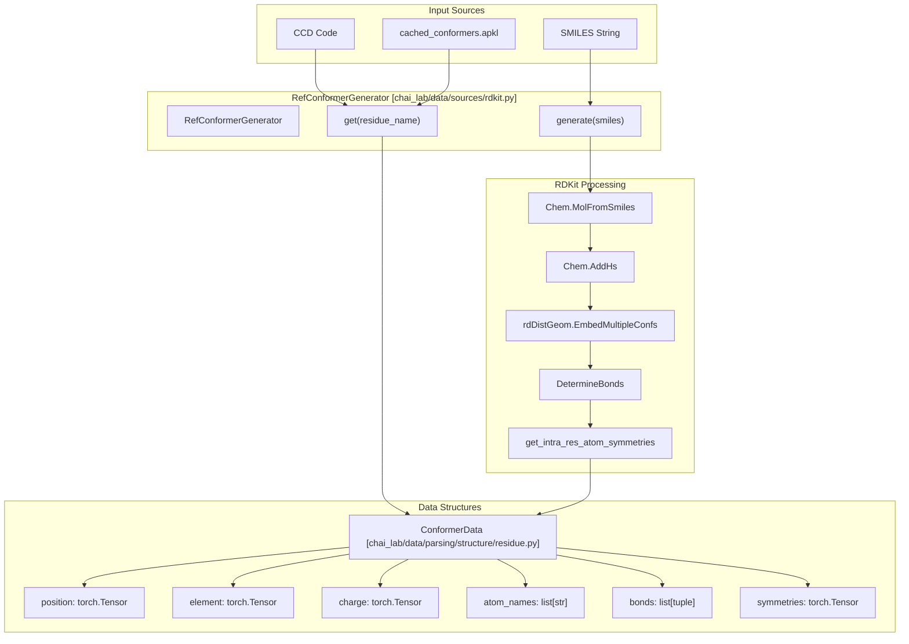
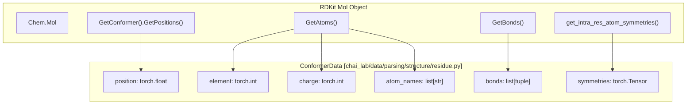

# Molecular Conformers

> **Relevant source files**
> * [chai_lab/data/parsing/templates/m8.py](https://github.com/chaidiscovery/chai-lab/blob/66c38d1f/chai_lab/data/parsing/templates/m8.py)
> * [chai_lab/data/sources/rdkit.py](https://github.com/chaidiscovery/chai-lab/blob/66c38d1f/chai_lab/data/sources/rdkit.py)
> * [tests/test_rdkit.py](https://github.com/chaidiscovery/chai-lab/blob/66c38d1f/tests/test_rdkit.py)

This document covers the molecular conformer generation system in chai-lab, which is responsible for creating 3D molecular structures from chemical representations like SMILES strings or Chemical Component Dictionary (CCD) codes. The system primarily handles ligand conformer generation using RDKit, with caching mechanisms for performance optimization.

For information about parsing molecular sequences and entity type identification, see [FASTA and Sequence Parsing](https://github.com/chaidiscovery/chai-lab/blob/66c38d1f/FASTA and Sequence Parsing)

 and [Entity Type Identification](https://github.com/chaidiscovery/chai-lab/blob/66c38d1f/Entity Type Identification)

## System Overview

The conformer generation system provides two main pathways for obtaining 3D molecular structures:

1. **Cached Conformers**: Pre-computed conformers for standard residues and common ligands stored in the Chemical Component Dictionary.
2. **Dynamic Generation**: Real-time conformer generation from SMILES strings for novel ligands.

The system is built around the `RefConformerGenerator` class, which manages both cached and dynamically generated conformers, ensuring consistent data structures and handling edge cases in molecular structure generation.

### Code Entity Space Bridge: Conformer Generation

The following diagram maps the high-level generation process to specific code entities within `chai_lab/data/sources/rdkit.py`.

Sources: [chai_lab/data/sources/rdkit.py L38-L175](https://github.com/chaidiscovery/chai-lab/blob/66c38d1f/chai_lab/data/sources/rdkit.py#L38-L175)

 [chai_lab/data/parsing/structure/residue.py L1-L25](https://github.com/chaidiscovery/chai-lab/blob/66c38d1f/chai_lab/data/parsing/structure/residue.py#L1-L25)

## Conformer Generation Process

The conformer generation process involves several steps to ensure high-quality 3D structures:

### Dynamic Generation from SMILES

When generating conformers from SMILES strings via `RefConformerGenerator.generate`, the system follows a standardized pipeline using `ETKDGv3` [chai_lab/data/sources/rdkit.py L144-L175](https://github.com/chaidiscovery/chai-lab/blob/66c38d1f/chai_lab/data/sources/rdkit.py#L144-L175)

:

1. **Molecule Creation**: Convert SMILES to RDKit molecule object using `Chem.MolFromSmiles`.
2. **Hydrogen Addition**: Add explicit hydrogens via `Chem.AddHs` for accurate geometry.
3. **3D Embedding**: Generate 3D coordinates using the `ETKDGv3` algorithm with `useSmallRingTorsions=True` and `enforceChirality=True`.
4. **Bond Determination**: Infer bond connectivity and types.
5. **Symmetry Calculation**: Compute atom symmetries using `get_intra_res_atom_symmetries`.
6. **Data Extraction**: Convert to `ConformerData` format via `_load_ref_conformer_from_rdkit`.

### ETKDGv3 Parameters

The generator uses specific parameters for `rdDistGeom.EmbedMultipleConfs` to ensure convergence and quality:

| Parameter | Value | Purpose |
| --- | --- | --- |
| `useSmallRingTorsions` | `True` | Better handling of small rings [chai_lab/data/sources/rdkit.py L153](https://github.com/chaidiscovery/chai-lab/blob/66c38d1f/chai_lab/data/sources/rdkit.py#L153-L153) |
| `randomSeed` | `123` | Deterministic generation [chai_lab/data/sources/rdkit.py L154](https://github.com/chaidiscovery/chai-lab/blob/66c38d1f/chai_lab/data/sources/rdkit.py#L154-L154) |
| `enforceChirality` | `True` | Maintain stereochemistry [chai_lab/data/sources/rdkit.py L155](https://github.com/chaidiscovery/chai-lab/blob/66c38d1f/chai_lab/data/sources/rdkit.py#L155-L155) |
| `maxIterations` | `100` | Prevent hanging on difficult molecules [chai_lab/data/sources/rdkit.py L158](https://github.com/chaidiscovery/chai-lab/blob/66c38d1f/chai_lab/data/sources/rdkit.py#L158-L158) |
| `numThreads` | `-1` | Utilize all available CPU cores [chai_lab/data/sources/rdkit.py L162](https://github.com/chaidiscovery/chai-lab/blob/66c38d1f/chai_lab/data/sources/rdkit.py#L162-L162) |

Sources: [chai_lab/data/sources/rdkit.py L144-L175](https://github.com/chaidiscovery/chai-lab/blob/66c38d1f/chai_lab/data/sources/rdkit.py#L144-L175)

## Data Structures

The conformer system uses the `ConformerData` dataclass to represent molecular structures.

### Code Entity Space Bridge: ConformerData Mapping

This diagram shows how RDKit `Mol` properties are mapped to the `ConformerData` fields within `_load_ref_conformer_from_rdkit`.

Sources: [chai_lab/data/sources/rdkit.py L97-L130](https://github.com/chaidiscovery/chai-lab/blob/66c38d1f/chai_lab/data/sources/rdkit.py#L97-L130)

 [chai_lab/data/parsing/structure/residue.py L1-L25](https://github.com/chaidiscovery/chai-lab/blob/66c38d1f/chai_lab/data/parsing/structure/residue.py#L1-L25)

## Caching and Performance

Initialization of `RefConformerGenerator` is expensive, so it is designed to be cached and reused [chai_lab/data/sources/rdkit.py L43-L46](https://github.com/chaidiscovery/chai-lab/blob/66c38d1f/chai_lab/data/sources/rdkit.py#L43-L46)

### Antipickle Cache

The system uses `antipickle` to load serialized conformers. This is preferred over standard pickle for safety and performance.

* **Cache File**: Loaded from `paths.cached_conformers.get_path()` [chai_lab/data/sources/rdkit.py L60-L63](https://github.com/chaidiscovery/chai-lab/blob/66c38d1f/chai_lab/data/sources/rdkit.py#L60-L63)
* **Adapters**: Uses `TorchAntipickleAdapter` and `DataclassAdapter` for `ConformerData` to handle complex types during deserialization [chai_lab/data/sources/rdkit.py L178-L182](https://github.com/chaidiscovery/chai-lab/blob/66c38d1f/chai_lab/data/sources/rdkit.py#L178-L182)
* **Validation**: The constructor ensures that standard residues (defined in `standard_residue_pdb_codes`) are present in the loaded cache to handle missing protein residues correctly [chai_lab/data/sources/rdkit.py L89-L94](https://github.com/chaidiscovery/chai-lab/blob/66c38d1f/chai_lab/data/sources/rdkit.py#L89-L94)

### Leaving Atoms Cache

The generator also maintains a mapping of `leaving_atoms` [chai_lab/data/sources/rdkit.py L55-L57](https://github.com/chaidiscovery/chai-lab/blob/66c38d1f/chai_lab/data/sources/rdkit.py#L55-L57)

 This dictionary maps molecule names to a tuple containing a list of atom names and a boolean mask indicating which atoms are "leaving" (e.g., in polymerization reactions).

Sources: [chai_lab/data/sources/rdkit.py L38-L73](https://github.com/chaidiscovery/chai-lab/blob/66c38d1f/chai_lab/data/sources/rdkit.py#L38-L73)

 [chai_lab/utils/pickle.py](https://github.com/chaidiscovery/chai-lab/blob/66c38d1f/chai_lab/utils/pickle.py)

## Error Handling and Robustness

Molecular processing can be prone to infinite loops or high resource consumption in RDKit. The system implements safeguards:

### Timeout Protection

The `@timeout` decorator is applied to functions that might hang, such as bond determination or symmetry calculation for complex graphs [chai_lab/data/sources/rdkit.py L28](https://github.com/chaidiscovery/chai-lab/blob/66c38d1f/chai_lab/data/sources/rdkit.py#L28-L28)

* **Bond Determination**: Uses `DetermineBonds` with a fallback if it fails or times out.
* **Symmetry Detection**: `get_intra_res_atom_symmetries` calculates topological symmetries using `GetSubstructMatches`. If this times out, it defaults to identity symmetry (no atoms equivalent) [chai_lab/data/sources/rdkit.py L117-L121](https://github.com/chaidiscovery/chai-lab/blob/66c38d1f/chai_lab/data/sources/rdkit.py#L117-L121)

### Residue Naming

For new ligands generated from SMILES, the system automatically assigns atom names using the element symbol and a counter (e.g., `C1`, `C2`, `O1`) to ensure uniqueness within the residue [chai_lab/data/sources/rdkit.py L167-L171](https://github.com/chaidiscovery/chai-lab/blob/66c38d1f/chai_lab/data/sources/rdkit.py#L167-L171)

Sources: [chai_lab/data/sources/rdkit.py L115-L121](https://github.com/chaidiscovery/chai-lab/blob/66c38d1f/chai_lab/data/sources/rdkit.py#L115-L121)

 [chai_lab/data/sources/rdkit.py L167-L175](https://github.com/chaidiscovery/chai-lab/blob/66c38d1f/chai_lab/data/sources/rdkit.py#L167-L175)

 [chai_lab/utils/timeout.py](https://github.com/chaidiscovery/chai-lab/blob/66c38d1f/chai_lab/utils/timeout.py)