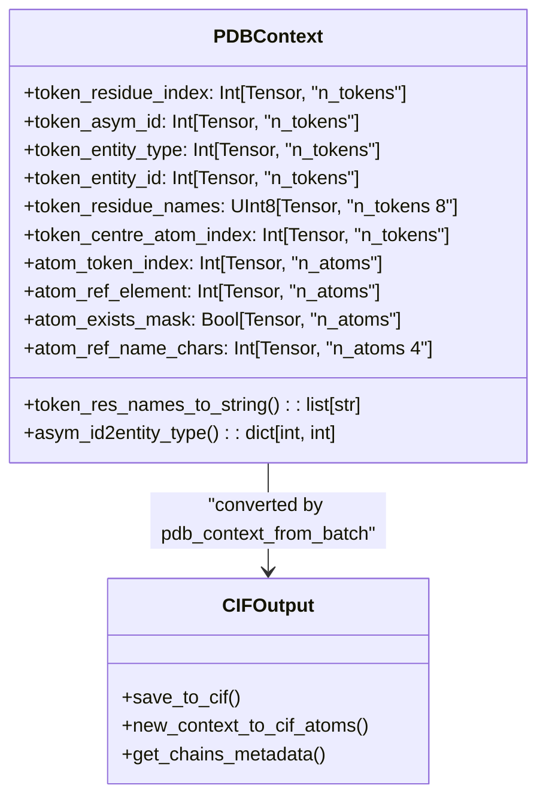
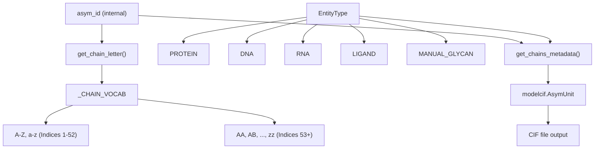
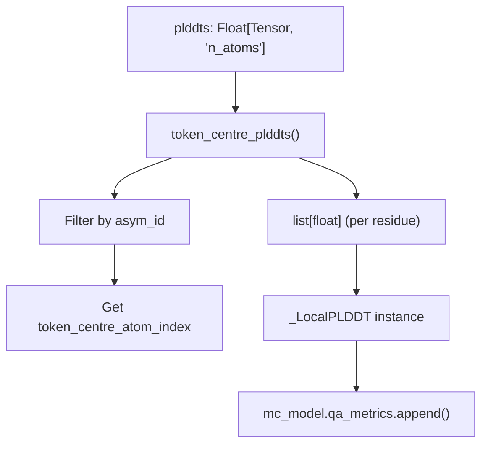

# Output Generation

> **Relevant source files**
> * [chai_lab/data/io/__init__.py](https://github.com/chaidiscovery/chai-lab/blob/66c38d1f/chai_lab/data/io/__init__.py)
> * [chai_lab/data/io/cif_utils.py](https://github.com/chaidiscovery/chai-lab/blob/66c38d1f/chai_lab/data/io/cif_utils.py)
> * [chai_lab/data/io/pdb_utils.py](https://github.com/chaidiscovery/chai-lab/blob/66c38d1f/chai_lab/data/io/pdb_utils.py)
> * [chai_lab/data/residue_constants.py](https://github.com/chaidiscovery/chai-lab/blob/66c38d1f/chai_lab/data/residue_constants.py)
> * [tests/test_cif_utils.py](https://github.com/chaidiscovery/chai-lab/blob/66c38d1f/tests/test_cif_utils.py)

This document covers the output generation system in `chai-lab`, which converts model predictions into structured molecular files. The system takes 3D coordinates and confidence scores from the Chai-1 model and produces CIF (Crystallographic Information File) format outputs with associated quality metrics using the `modelcif` library.

For information about the core inference pipeline that produces these predictions, see [Inference Engine](https://github.com/chaidiscovery/chai-lab/blob/66c38d1f/Inference Engine)

 For details about structure ranking and scoring, see [Structure Ranking](https://github.com/chaidiscovery/chai-lab/blob/66c38d1f/Structure Ranking)

## Purpose and Scope

The output generation system handles the final stage of the Chai-1 prediction pipeline, converting raw model outputs into standardized molecular structure files. This includes:

* Converting atom coordinates and metadata into CIF format via `save_to_cif` [chai_lab/data/io/cif_utils.py L156-L174](https://github.com/chaidiscovery/chai-lab/blob/66c38d1f/chai_lab/data/io/cif_utils.py#L156-L174)
* Embedding quality metrics (pLDDT) into output files using `modelcif.qa_metric` [chai_lab/data/io/cif_utils.py L32-L36](https://github.com/chaidiscovery/chai-lab/blob/66c38d1f/chai_lab/data/io/cif_utils.py#L32-L36)
* Managing chain identifiers and entity metadata [chai_lab/data/io/cif_utils.py L77-L131](https://github.com/chaidiscovery/chai-lab/blob/66c38d1f/chai_lab/data/io/cif_utils.py#L77-L131)
* Handling different molecular entity types including proteins, nucleic acids, ligands, and glycans [chai_lab/data/io/cif_utils.py L134-L153](https://github.com/chaidiscovery/chai-lab/blob/66c38d1f/chai_lab/data/io/cif_utils.py#L134-L153)

## Core Data Structures

### PDBContext

The `PDBContext` class is a dataclass that represents a molecular complex as a collection of tensors. It is the primary bridge between the model's tensor-based output and the structured file writer [chai_lab/data/io/pdb_utils.py L19-L31](https://github.com/chaidiscovery/chai-lab/blob/66c38d1f/chai_lab/data/io/pdb_utils.py#L19-L31)

The `pdb_context_from_batch` function extracts these tensors from the model output dictionary, ensuring all data is moved to the CPU for I/O operations [chai_lab/data/io/pdb_utils.py L48-L63](https://github.com/chaidiscovery/chai-lab/blob/66c38d1f/chai_lab/data/io/pdb_utils.py#L48-L63)

Sources: [chai_lab/data/io/pdb_utils.py L19-L63](https://github.com/chaidiscovery/chai-lab/blob/66c38d1f/chai_lab/data/io/pdb_utils.py#L19-L63)

### Entity and Chain Management

The system manages molecular entities using asymmetric unit (asym) IDs and converts them to standard chain identifiers.

Chain identifiers follow a hierarchical naming scheme defined in `_CHAIN_VOCAB`. It supports up to 2,756 chains using single letters followed by double-letter combinations [chai_lab/data/io/cif_utils.py L38-L47](https://github.com/chaidiscovery/chai-lab/blob/66c38d1f/chai_lab/data/io/cif_utils.py#L38-L47)

Sources: [chai_lab/data/io/cif_utils.py L38-L47](https://github.com/chaidiscovery/chai-lab/blob/66c38d1f/chai_lab/data/io/cif_utils.py#L38-L47)

 [chai_lab/data/io/cif_utils.py L77-L131](https://github.com/chaidiscovery/chai-lab/blob/66c38d1f/chai_lab/data/io/cif_utils.py#L77-L131)

 [tests/test_cif_utils.py L11-L24](https://github.com/chaidiscovery/chai-lab/blob/66c38d1f/tests/test_cif_utils.py#L11-L24)

## CIF File Generation Pipeline

### Main Output Flow

The `save_to_cif` function is the entry point for generating structure files [chai_lab/data/io/cif_utils.py L156-L174](https://github.com/chaidiscovery/chai-lab/blob/66c38d1f/chai_lab/data/io/cif_utils.py#L156-L174)

 It calls `new_context_to_cif_atoms`, which performs the following steps:

1. **Metadata Extraction**: Retrieves `AsymUnit` objects using `get_chains_metadata` [chai_lab/data/io/cif_utils.py L183-L185](https://github.com/chaidiscovery/chai-lab/blob/66c38d1f/chai_lab/data/io/cif_utils.py#L183-L185)
2. **Atom Iteration**: Loops through `context.atom_token_index`, checking the `atom_exists_mask` to skip padding or missing atoms [chai_lab/data/io/cif_utils.py L197-L200](https://github.com/chaidiscovery/chai-lab/blob/66c38d1f/chai_lab/data/io/cif_utils.py#L197-L200)
3. **Coordinate Assignment**: Extracts `x, y, z` coordinates from the model prediction tensor [chai_lab/data/io/cif_utils.py L202](https://github.com/chaidiscovery/chai-lab/blob/66c38d1f/chai_lab/data/io/cif_utils.py#L202-L202)
4. **Assembly Construction**: Builds a `modelcif.Assembly` and `modelcif.AbInitioModel` [chai_lab/data/io/cif_utils.py L194-L195](https://github.com/chaidiscovery/chai-lab/blob/66c38d1f/chai_lab/data/io/cif_utils.py#L194-L195)
5. **Serialization**: Uses `modelcif.dumper` to write the finalized `modelcif.System` to disk.

Sources: [chai_lab/data/io/cif_utils.py L156-L257](https://github.com/chaidiscovery/chai-lab/blob/66c38d1f/chai_lab/data/io/cif_utils.py#L156-L257)

### Chemical Component Assignment

The `_to_chem_component` function maps internal entity types to `ihm` chemical components [chai_lab/data/io/cif_utils.py L134-L153](https://github.com/chaidiscovery/chai-lab/blob/66c38d1f/chai_lab/data/io/cif_utils.py#L134-L153)

| Entity Type | IHM Class | Mapping Logic |
| --- | --- | --- |
| `PROTEIN` | `LPeptideChemComp` | Uses `restype_3to1` and `gemmi` for canonical codes [chai_lab/data/io/cif_utils.py L140-L143](https://github.com/chaidiscovery/chai-lab/blob/66c38d1f/chai_lab/data/io/cif_utils.py#L140-L143) |
| `DNA` | `DNAChemComp` | Canonical code is the last character (e.g., DA -> A) [chai_lab/data/io/cif_utils.py L144-L147](https://github.com/chaidiscovery/chai-lab/blob/66c38d1f/chai_lab/data/io/cif_utils.py#L144-L147) |
| `RNA` | `RNAChemComp` | Uses full 3-letter code as canonical [chai_lab/data/io/cif_utils.py L148-L150](https://github.com/chaidiscovery/chai-lab/blob/66c38d1f/chai_lab/data/io/cif_utils.py#L148-L150) |
| `LIGAND` | `NonPolymerChemComp` | Appends `asym_id` to the residue name for unique identification [chai_lab/data/io/cif_utils.py L136-L137](https://github.com/chaidiscovery/chai-lab/blob/66c38d1f/chai_lab/data/io/cif_utils.py#L136-L137) |
| `MANUAL_GLYCAN` | `SaccharideChemComp` | Uses residue name for both ID and name [chai_lab/data/io/cif_utils.py L138-L139](https://github.com/chaidiscovery/chai-lab/blob/66c38d1f/chai_lab/data/io/cif_utils.py#L138-L139) |

Sources: [chai_lab/data/io/cif_utils.py L134-L153](https://github.com/chaidiscovery/chai-lab/blob/66c38d1f/chai_lab/data/io/cif_utils.py#L134-L153)

## Quality Metrics Integration

### pLDDT Score Embedding

Chai-1 embeds per-residue confidence scores (pLDDT) into the CIF file using the `_LocalPLDDT` class, which inherits from `modelcif.qa_metric.Local` and `modelcif.qa_metric.PLDDT` [chai_lab/data/io/cif_utils.py L32-L36](https://github.com/chaidiscovery/chai-lab/blob/66c38d1f/chai_lab/data/io/cif_utils.py#L32-L36)

The function `token_centre_plddts` extracts the pLDDT value specifically at the center atom index of each token (e.g., Cα for proteins) to represent the residue-level confidence [chai_lab/data/io/cif_utils.py L61-L74](https://github.com/chaidiscovery/chai-lab/blob/66c38d1f/chai_lab/data/io/cif_utils.py#L61-L74)

Sources: [chai_lab/data/io/cif_utils.py L32-L36](https://github.com/chaidiscovery/chai-lab/blob/66c38d1f/chai_lab/data/io/cif_utils.py#L32-L36)

 [chai_lab/data/io/cif_utils.py L61-L74](https://github.com/chaidiscovery/chai-lab/blob/66c38d1f/chai_lab/data/io/cif_utils.py#L61-L74)

 [chai_lab/data/io/cif_utils.py L234-L249](https://github.com/chaidiscovery/chai-lab/blob/66c38d1f/chai_lab/data/io/cif_utils.py#L234-L249)

## Validation and Error Handling

The output generation system includes several critical checks to ensure data integrity:

* **Missing Residues**: `get_chains_metadata` checks for missing residues in the sequence by verifying the `token_residue_index` range [chai_lab/data/io/cif_utils.py L96-L105](https://github.com/chaidiscovery/chai-lab/blob/66c38d1f/chai_lab/data/io/cif_utils.py#L96-L105)
* **Atom Masking**: The `atom_exists_mask` is strictly checked during iteration to prevent writing padding atoms to the CIF file [chai_lab/data/io/cif_utils.py L198-L200](https://github.com/chaidiscovery/chai-lab/blob/66c38d1f/chai_lab/data/io/cif_utils.py#L198-L200)
* **Device Safety**: `pdb_context_from_batch` asserts that all input tensors are on the CPU to avoid GPU-related I/O bottlenecks or errors [chai_lab/data/io/pdb_utils.py L61-L63](https://github.com/chaidiscovery/chai-lab/blob/66c38d1f/chai_lab/data/io/pdb_utils.py#L61-L63)

Sources: [chai_lab/data/io/cif_utils.py L96-L105](https://github.com/chaidiscovery/chai-lab/blob/66c38d1f/chai_lab/data/io/cif_utils.py#L96-L105)

 [chai_lab/data/io/cif_utils.py L198-L200](https://github.com/chaidiscovery/chai-lab/blob/66c38d1f/chai_lab/data/io/cif_utils.py#L198-L200)

 [chai_lab/data/io/pdb_utils.py L61-L63](https://github.com/chaidiscovery/chai-lab/blob/66c38d1f/chai_lab/data/io/pdb_utils.py#L61-L63)