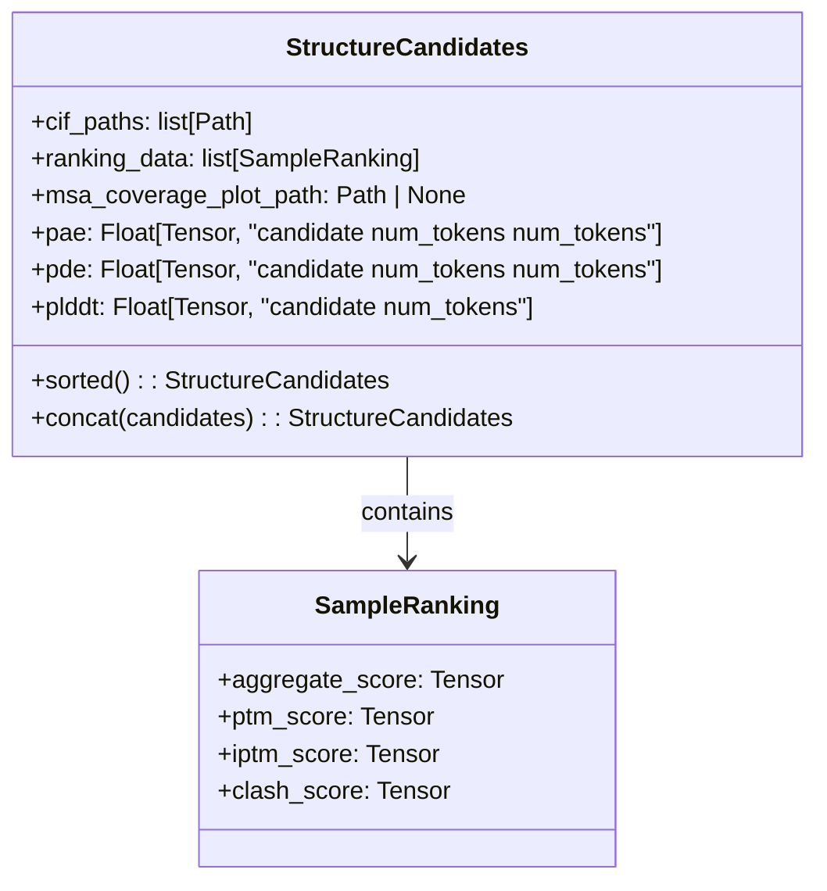
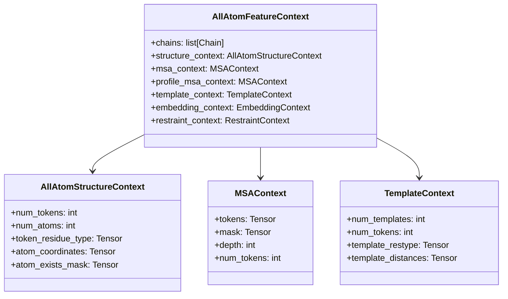
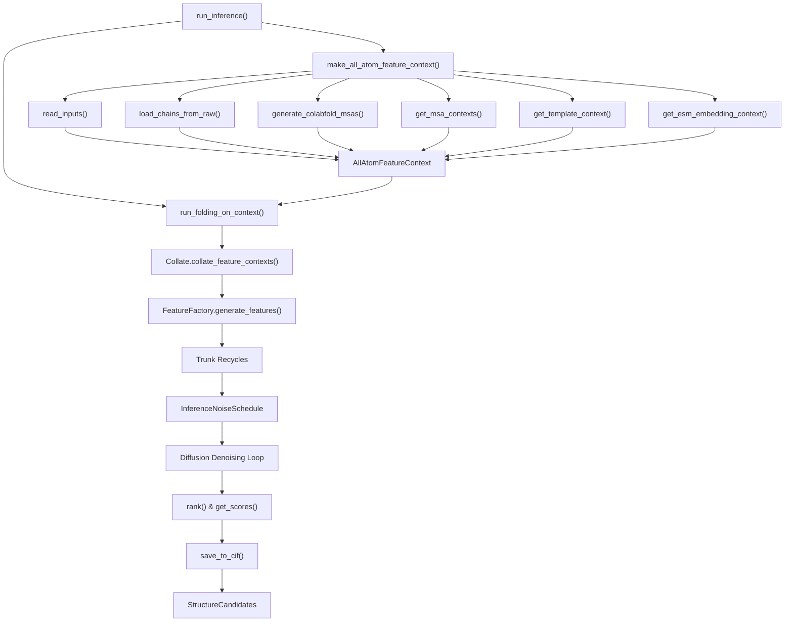

# Python API

> **Relevant source files**
> * [chai_lab/chai1.py](https://github.com/chaidiscovery/chai-lab/blob/66c38d1f/chai_lab/chai1.py)
> * [chai_lab/data/dataset/msas/utils.py](https://github.com/chaidiscovery/chai-lab/blob/66c38d1f/chai_lab/data/dataset/msas/utils.py)
> * [examples/predict_structure.py](https://github.com/chaidiscovery/chai-lab/blob/66c38d1f/examples/predict_structure.py)

This document covers the programmatic Python interface for the Chai-1 model, focusing on the core inference functions and data structures. For command-line usage, see [Command Line Interface](/chaidiscovery/chai-lab/2.1-command-line-interface). For detailed information about input processing and feature generation, see [Input Processing](/chaidiscovery/chai-lab/4-input-processing) and [Feature Generation](/chaidiscovery/chai-lab/5-feature-generation).

## Overview

The Python API provides two main entry points for structure prediction:

* **`run_inference()`** - High-level function that handles the complete pipeline from FASTA input to structure prediction.
* **`run_folding_on_context()`** - Lower-level function for advanced users who want to construct their own feature contexts or run folding on pre-assembled data.

The API returns `StructureCandidates` objects containing predicted structures, confidence scores, and ranking information.

## Main Entry Points

### High-Level Inference

The primary entry point is `run_inference()`, which handles the complete inference pipeline, including sequence parsing, feature generation (MSAs, templates, embeddings), and model execution.

```javascript
from chai_lab.chai1 import run_inference candidates = run_inference(    fasta_file=Path("input.fasta"),    output_dir=Path("output/"),    use_esm_embeddings=True,    use_msa_server=True,    num_diffn_samples=5,    device="cuda:0")
```

**Function Signature and Parameters:**

| Parameter | Type | Default | Description |
| --- | --- | --- | --- |
| `fasta_file` | `Path` | Required | Input FASTA file path. |
| `output_dir` | `Path` | Required | Output directory path. |
| `use_esm_embeddings` | `bool` | `True` | Enable ESM protein embeddings. |
| `use_msa_server` | `bool` | `False` | Use ColabFold MSA server. |
| `msa_server_url` | `str` | `"https://api.colabfold.com"` | MSA server URL. |
| `msa_directory` | `Path \| None` | `None` | Local MSA directory. |
| `constraint_path` | `Path \| None` | `None` | Restraints file path. |
| `use_templates_server` | `bool` | `False` | Use template server. |
| `template_hits_path` | `Path \| None` | `None` | Template hits file. |
| `num_trunk_recycles` | `int` | `3` | Number of trunk recycles. |
| `num_diffn_timesteps` | `int` | `200` | Diffusion timesteps. |
| `num_diffn_samples` | `int` | `5` | Number of structure samples. |
| `seed` | `int \| None` | `None` | Random seed. |
| `device` | `str \| None` | `None` | CUDA device. |
| `low_memory` | `bool` | `True` | Enable low memory mode. |

**Sources:** [chai_lab/chai1.py L498-L572](https://github.com/chaidiscovery/chai-lab/blob/66c38d1f/chai_lab/chai1.py#L498-L572)

### Low-Level Context Folding

For advanced users who want to construct custom feature contexts, `run_folding_on_context()` provides a direct interface to the model's folding pipeline.

```javascript
from chai_lab.chai1 import run_folding_on_context candidates = run_folding_on_context(    feature_context=custom_context,    output_dir=Path("output/"),    num_trunk_recycles=3,    num_diffn_timesteps=200,    num_diffn_samples=5)
```

This function operates on `AllAtomFeatureContext` objects, allowing complete control over MSAs, templates, embeddings, and restraints. It internally handles model loading via JIT, feature collation, and the diffusion loop.

**Sources:** [chai_lab/chai1.py L579-L1059](https://github.com/chaidiscovery/chai-lab/blob/66c38d1f/chai_lab/chai1.py#L579-L1059)

## Core Data Structures

### StructureCandidates

The main return type containing predicted structures and associated data.



**Key Properties:**

* `cif_paths`: List of CIF file paths for each predicted structure. [chai_lab/chai1.py L288](https://github.com/chaidiscovery/chai-lab/blob/66c38d1f/chai_lab/chai1.py#L288-L288)
* `ranking_data`: Scoring information for each candidate (pTM, ipTM, etc.). [chai_lab/chai1.py L289](https://github.com/chaidiscovery/chai-lab/blob/66c38d1f/chai_lab/chai1.py#L289-L289)
* `pae`: Predicted Aligned Error matrices. [chai_lab/chai1.py L291](https://github.com/chaidiscovery/chai-lab/blob/66c38d1f/chai_lab/chai1.py#L291-L291)
* `pde`: Predicted Distance Error matrices. [chai_lab/chai1.py L292](https://github.com/chaidiscovery/chai-lab/blob/66c38d1f/chai_lab/chai1.py#L292-L292)
* `plddt`: Per-token confidence scores (pLDDT). [chai_lab/chai1.py L293](https://github.com/chaidiscovery/chai-lab/blob/66c38d1f/chai_lab/chai1.py#L293-L293)

**Sources:** [chai_lab/chai1.py L284-L335](https://github.com/chaidiscovery/chai-lab/blob/66c38d1f/chai_lab/chai1.py#L284-L335)

### AllAtomFeatureContext

The comprehensive input data structure containing all features for inference.



**Sources:** [chai_lab/data/dataset/all_atom_feature_context.py L23-L27](https://github.com/chaidiscovery/chai-lab/blob/66c38d1f/chai_lab/data/dataset/all_atom_feature_context.py#L23-L27)

## API Function Flow

The following diagram shows the execution flow through the main API functions, linking high-level logic to internal components.



**Sources:** [chai_lab/chai1.py L498-L572](https://github.com/chaidiscovery/chai-lab/blob/66c38d1f/chai_lab/chai1.py#L498-L572)

 [chai_lab/chai1.py L338-L495](https://github.com/chaidiscovery/chai-lab/blob/66c38d1f/chai_lab/chai1.py#L338-L495)

 [chai_lab/chai1.py L579-L1059](https://github.com/chaidiscovery/chai-lab/blob/66c38d1f/chai_lab/chai1.py#L579-L1059)

 [chai_lab/data/collate/collate.py L38-L40](https://github.com/chaidiscovery/chai-lab/blob/66c38d1f/chai_lab/data/collate/collate.py#L38-L40)

## Usage Patterns

### Basic Structure Prediction

The simplest way to use the API is with a FASTA file.

```javascript
from pathlib import Pathfrom chai_lab.chai1 import run_inference # Basic inference with ESM embeddings onlycandidates = run_inference(    fasta_file=Path("input.fasta"),    output_dir=Path("output/"),    use_esm_embeddings=True,    num_diffn_samples=5,    seed=42) # Access resultsbest_structure = candidates.cif_paths[0]confidence_scores = candidates.plddt[0]  # First candidate
```

**Sources:** [examples/predict_structure.py L40-L49](https://github.com/chaidiscovery/chai-lab/blob/66c38d1f/examples/predict_structure.py#L40-L49)

### Enhanced Prediction with MSAs and Templates

For higher accuracy, you can enable MSA and template searches via external servers or local files.

```markdown
# Full pipeline with MSA and template searchcandidates = run_inference(    fasta_file=Path("input.fasta"),    output_dir=Path("output/"),    use_esm_embeddings=True,    use_msa_server=True,    use_templates_server=True,    msa_server_url="https://api.colabfold.com",    num_diffn_samples=5) # Sort by confidence and get best predictionsorted_candidates = candidates.sorted()best_score = sorted_candidates.ranking_data[0].aggregate_score
```

**Sources:** [chai_lab/chai1.py L512-L520](https://github.com/chaidiscovery/chai-lab/blob/66c38d1f/chai_lab/chai1.py#L512-L520)

### Advanced Context Construction

Users can manually assemble features into an `AllAtomFeatureContext`.

```javascript
from chai_lab.chai1 import run_folding_on_contextfrom chai_lab.data.dataset.all_atom_feature_context import AllAtomFeatureContextfrom chai_lab.data.dataset.inference_dataset import load_chains_from_raw, read_inputs # Load and process inputs manuallyfasta_inputs = read_inputs(Path("input.fasta"))chains = load_chains_from_raw(fasta_inputs) # Create custom feature contextfeature_context = AllAtomFeatureContext(    chains=chains,    structure_context=merged_context,    msa_context=custom_msa_context,    template_context=custom_template_context,    embedding_context=custom_embedding_context,    restraint_context=custom_restraint_context) # Run inference on custom contextcandidates = run_folding_on_context(    feature_context=feature_context,    output_dir=Path("output/"),    num_trunk_recycles=3,    num_diffn_timesteps=200,    num_diffn_samples=5)
```

**Sources:** [chai_lab/chai1.py L579-L594](https://github.com/chaidiscovery/chai-lab/blob/66c38d1f/chai_lab/chai1.py#L579-L594)

 [chai_lab/data/dataset/inference_dataset.py L34-L35](https://github.com/chaidiscovery/chai-lab/blob/66c38d1f/chai_lab/data/dataset/inference_dataset.py#L34-L35)

## Input Validation and Limits

The API enforces several limits based on model capacity and hardware constraints.

| Limit | Value | Error Type |
| --- | --- | --- |
| Maximum tokens | Model-dependent (max 32768) | `UnsupportedInputError` |
| Maximum templates | `MAX_NUM_TEMPLATES` (4) | `UnsupportedInputError` |
| Maximum MSA depth | `MAX_MSA_DEPTH` (16384) | `UnsupportedInputError` |

Validation functions like `raise_if_too_many_tokens` and `raise_if_msa_too_deep` are called early in the inference pipeline.

**Sources:** [chai_lab/chai1.py L255-L276](https://github.com/chaidiscovery/chai-lab/blob/66c38d1f/chai_lab/chai1.py#L255-L276)

 [chai_lab/data/dataset/all_atom_feature_context.py L24-L25](https://github.com/chaidiscovery/chai-lab/blob/66c38d1f/chai_lab/data/dataset/all_atom_feature_context.py#L24-L25)

## Error Handling

The API raises `UnsupportedInputError` for various validation failures:

* Input sequences exceeding token limits. [chai_lab/chai1.py L255-L261](https://github.com/chaidiscovery/chai-lab/blob/66c38d1f/chai_lab/chai1.py#L255-L261)
* Too many templates provided. [chai_lab/chai1.py L264-L269](https://github.com/chaidiscovery/chai-lab/blob/66c38d1f/chai_lab/chai1.py#L264-L269)
* MSA depth exceeds limits. [chai_lab/chai1.py L272-L276](https://github.com/chaidiscovery/chai-lab/blob/66c38d1f/chai_lab/chai1.py#L272-L276)
* Duplicate entity names or invalid chain naming. [chai_lab/chai1.py L365-L369](https://github.com/chaidiscovery/chai-lab/blob/66c38d1f/chai_lab/chai1.py#L365-L369)

## Output Structure

The API generates a structured output directory containing model predictions and metadata.

```markdown
output_dir/
├── pred.model_idx_0.cif          # Predicted structure in CIF format
├── pred.model_idx_1.cif
├── ...
├── scores.model_idx_0.npz        # NPZ file with confidence metrics
├── scores.model_idx_1.npz
├── ...
├── msa_depth.pdf                 # Visualization of MSA coverage
└── msas/                         # Generated feature files
    ├── *.aligned.pqt             # Parquet-formatted MSA features
    └── all_chain_templates.m8    # Template search results
```

Each `scores.model_idx_X.npz` file contains:

* `pTM`: Template Modeling score.
* `ipTM`: Interface Template Modeling score.
* `pLDDT`: Per-residue confidence scores.
* `clash_score`: Score based on atomic overlaps.

**Sources:** [chai_lab/chai1.py L1023-L1050](https://github.com/chaidiscovery/chai-lab/blob/66c38d1f/chai_lab/chai1.py#L1023-L1050)

 [chai_lab/ranking/rank.py L104-L105](https://github.com/chaidiscovery/chai-lab/blob/66c38d1f/chai_lab/ranking/rank.py#L104-L105)