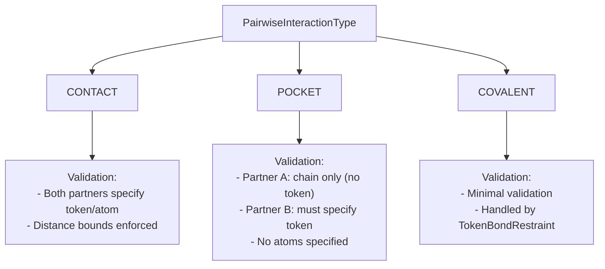
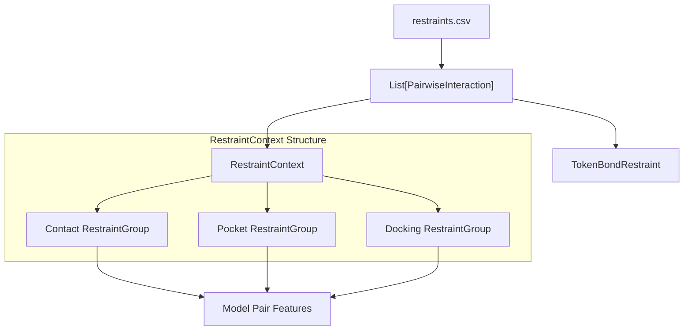

# Restraints and Constraints

> **Relevant source files**
> * [chai_lab/data/dataset/constraints/restraint_context.py](https://github.com/chaidiscovery/chai-lab/blob/66c38d1f/chai_lab/data/dataset/constraints/restraint_context.py)
> * [chai_lab/data/features/generators/docking.py](https://github.com/chaidiscovery/chai-lab/blob/66c38d1f/chai_lab/data/features/generators/docking.py)
> * [chai_lab/data/features/generators/token_bond.py](https://github.com/chaidiscovery/chai-lab/blob/66c38d1f/chai_lab/data/features/generators/token_bond.py)
> * [chai_lab/data/features/generators/token_dist_restraint.py](https://github.com/chaidiscovery/chai-lab/blob/66c38d1f/chai_lab/data/features/generators/token_dist_restraint.py)
> * [chai_lab/data/features/generators/token_pair_pocket_restraint.py](https://github.com/chaidiscovery/chai-lab/blob/66c38d1f/chai_lab/data/features/generators/token_pair_pocket_restraint.py)
> * [chai_lab/data/parsing/msas/aligned_pqt.py](https://github.com/chaidiscovery/chai-lab/blob/66c38d1f/chai_lab/data/parsing/msas/aligned_pqt.py)
> * [chai_lab/data/parsing/restraints.py](https://github.com/chaidiscovery/chai-lab/blob/66c38d1f/chai_lab/data/parsing/restraints.py)
> * [chai_lab/utils/tensor_utils.py](https://github.com/chaidiscovery/chai-lab/blob/66c38d1f/chai_lab/utils/tensor_utils.py)

## Purpose and Scope

This document describes the restraint and constraint system in Chai-1, which allows users to specify spatial relationships between parts of molecular structures during prediction. These restraints guide the folding process by incorporating prior knowledge about spatial relationships into the model features.

Covalent bonds are technically handled as a special type of restraint within the parsing logic but are processed through a distinct feature generator.

## Types of Restraints

Chai-1 supports three primary types of restraints, defined in the `PairwiseInteractionType` enum:

### PairwiseInteractionType Enum



Sources: [chai_lab/data/parsing/restraints.py L21-L25](https://github.com/chaidiscovery/chai-lab/blob/66c38d1f/chai_lab/data/parsing/restraints.py#L21-L25)

1. **CONTACT**: Enforces specific distances between two residues or atoms. Used for site-specific constraints.
2. **POCKET**: Guides a specific residue to be placed within a distance of an entire chain (e.g., ensuring a ligand residue stays within a protein binding pocket).
3. **COVALENT**: Specifies chemical bonds between atoms, typically used for non-standard residues or ligand-protein links.

## Restraint Specification Format

Restraints are defined in CSV files. Each row corresponds to a `PairwiseInteraction`.

```
restraint_id,chainA,res_idxA,chainB,res_idxB,max_distance_angstrom,min_distance_angstrom,connection_type,confidence,comment
restraint_0,A,A219,B,D45,10.0,0.0,contact,1.0,Example contact restraint
restraint_1,A,,B,D45,15.0,0.0,pocket,1.0,Example pocket restraint
restraint_2,A,A219@CA,B,D45@CB,1.5,0.0,covalent,1.0,Example covalent bond
```

### Data Model and Validation

The `PairwiseConstraintDataframeModel` class defines the schema for these tables:

| Column | Code Field | Validation |
| --- | --- | --- |
| `restraint_id` | `restraint_id` | Unique string |
| `chainA` | `chainA` | Non-nullable string |
| `res_idxA` | `res_idxA` | String, format: `<residue><pos>[@<atom>]` |
| `chainB` | `chainB` | Non-nullable string |
| `res_idxB` | `res_idxB` | String, format: `<residue><pos>[@<atom>]` |
| `max_distance_angstrom` | `max_distance_angstrom` | Float >= 0.0 |
| `min_distance_angstrom` | `min_distance_angstrom` | Float >= 0.0 |
| `connection_type` | `connection_type` | Must be one of `PairwiseInteractionType` |
| `confidence` | `confidence` | Float between 0.0 and 1.0 |

Sources: [chai_lab/data/parsing/restraints.py L27-L41](https://github.com/chaidiscovery/chai-lab/blob/66c38d1f/chai_lab/data/parsing/restraints.py#L27-L41)

 [chai_lab/data/parsing/restraints.py L133-L151](https://github.com/chaidiscovery/chai-lab/blob/66c38d1f/chai_lab/data/parsing/restraints.py#L133-L151)

## Restraint Context and Feature Generation

The system converts parsed `PairwiseInteraction` objects into a `RestraintContext`, which organizes them for specific feature generators.

### Data Flow from Input to Features



Sources: [chai_lab/data/dataset/constraints/restraint_context.py L32-L37](https://github.com/chaidiscovery/chai-lab/blob/66c38d1f/chai_lab/data/dataset/constraints/restraint_context.py#L32-L37)

 [chai_lab/data/dataset/constraints/restraint_context.py L86-L136](https://github.com/chaidiscovery/chai-lab/blob/66c38d1f/chai_lab/data/dataset/constraints/restraint_context.py#L86-L136)

 [chai_lab/data/features/generators/token_dist_restraint.py L67-L78](https://github.com/chaidiscovery/chai-lab/blob/66c38d1f/chai_lab/data/features/generators/token_dist_restraint.py#L67-L78)

### Core Data Structures

| Class | Role | Source |
| --- | --- | --- |
| `RestraintContext` | Container for docking, contact, and pocket restraint groups. | [chai_lab/data/dataset/constraints/restraint_context.py L33](https://github.com/chaidiscovery/chai-lab/blob/66c38d1f/chai_lab/data/dataset/constraints/restraint_context.py#L33-L33) |
| `PairwiseInteraction` | Frozen dataclass representing a single row in the restraints CSV. | [chai_lab/data/parsing/restraints.py L46](https://github.com/chaidiscovery/chai-lab/blob/66c38d1f/chai_lab/data/parsing/restraints.py#L46-L46) |
| `TokenDistanceRestraint` | Feature generator for residue-residue distance constraints. | [chai_lab/data/features/generators/token_dist_restraint.py L67](https://github.com/chaidiscovery/chai-lab/blob/66c38d1f/chai_lab/data/features/generators/token_dist_restraint.py#L67-L67) |
| `TokenPairPocketRestraint` | Feature generator for pocket-level constraints. | [chai_lab/data/features/generators/token_pair_pocket_restraint.py L71](https://github.com/chaidiscovery/chai-lab/blob/66c38d1f/chai_lab/data/features/generators/token_pair_pocket_restraint.py#L71-L71) |
| `TokenBondRestraint` | Feature generator specifically for covalent bond indices. | [chai_lab/data/features/generators/token_bond.py L16](https://github.com/chaidiscovery/chai-lab/blob/66c38d1f/chai_lab/data/features/generators/token_bond.py#L16-L16) |

## Feature Generators Detail

### 1. Token Distance Restraints (Contact)

The `TokenDistanceRestraint` generator converts `ContactRestraint` objects into model features. It maps user-provided subchain IDs to internal `asym_id` values using `get_asym_id_from_subchain_id` [chai_lab/data/features/generators/token_dist_restraint.py L38-L53](https://github.com/chaidiscovery/chai-lab/blob/66c38d1f/chai_lab/data/features/generators/token_dist_restraint.py#L38-L53)

 It generates a pair feature matrix where restraints are encoded using Radial Basis Functions (RBF) [chai_lab/data/features/generators/token_dist_restraint.py L105-L106](https://github.com/chaidiscovery/chai-lab/blob/66c38d1f/chai_lab/data/features/generators/token_dist_restraint.py#L105-L106)

### 2. Token Pair Pocket Restraints

The `TokenPairPocketRestraint` handles proximity between a chain and a token. It uses the distance restraint generator internally to sample pocket tokens and chains [chai_lab/data/features/generators/token_pair_pocket_restraint.py L99-L109](https://github.com/chaidiscovery/chai-lab/blob/66c38d1f/chai_lab/data/features/generators/token_pair_pocket_restraint.py#L99-L109)

### 3. Covalent Bonds

Unlike spatial restraints, `TokenBondRestraint` creates a binary feature matrix indicating the presence of a covalent bond between tokens. It gathers token indices from atom indices provided in `atom_covalent_bond_indices` [chai_lab/data/features/generators/token_bond.py L51-L61](https://github.com/chaidiscovery/chai-lab/blob/66c38d1f/chai_lab/data/features/generators/token_bond.py#L51-L61)

## Implementation Logic

### Parsing Residue Indices

The function `_parse_res_idx` handles the string parsing for the `res_idxA/B` columns. It splits the string by the `@` character to separate the residue (e.g., `A219`) from the atom name (e.g., `CA`).

* Input: `A219@CA` -> Output: `('A219', 'CA')`
* Input: `A219` -> Output: `('A219', '')` Sources: [chai_lab/data/parsing/restraints.py L133-L151](https://github.com/chaidiscovery/chai-lab/blob/66c38d1f/chai_lab/data/parsing/restraints.py#L133-L151)

### Restraint Validation Rules

The `PairwiseInteraction.__post_init__` method enforces structural integrity:

* **Chains**: Both `chainA` and `chainB` must be non-null [chai_lab/data/parsing/restraints.py L63-L65](https://github.com/chaidiscovery/chai-lab/blob/66c38d1f/chai_lab/data/parsing/restraints.py#L63-L65)
* **Distances**: `max_dist_angstrom` must be greater than or equal to `min_dist_angstrom` [chai_lab/data/parsing/restraints.py L67](https://github.com/chaidiscovery/chai-lab/blob/66c38d1f/chai_lab/data/parsing/restraints.py#L67-L67)
* **Pocket Logic**: For `POCKET` types, `res_idxA` must be empty (representing the chain) and `res_idxB` must be populated (representing the token) [chai_lab/data/parsing/restraints.py L72-L74](https://github.com/chaidiscovery/chai-lab/blob/66c38d1f/chai_lab/data/parsing/restraints.py#L72-L74)

Sources: [chai_lab/data/parsing/restraints.py L61-L89](https://github.com/chaidiscovery/chai-lab/blob/66c38d1f/chai_lab/data/parsing/restraints.py#L61-L89)

 [chai_lab/data/dataset/constraints/restraint_context.py L102-L132](https://github.com/chaidiscovery/chai-lab/blob/66c38d1f/chai_lab/data/dataset/constraints/restraint_context.py#L102-L132)