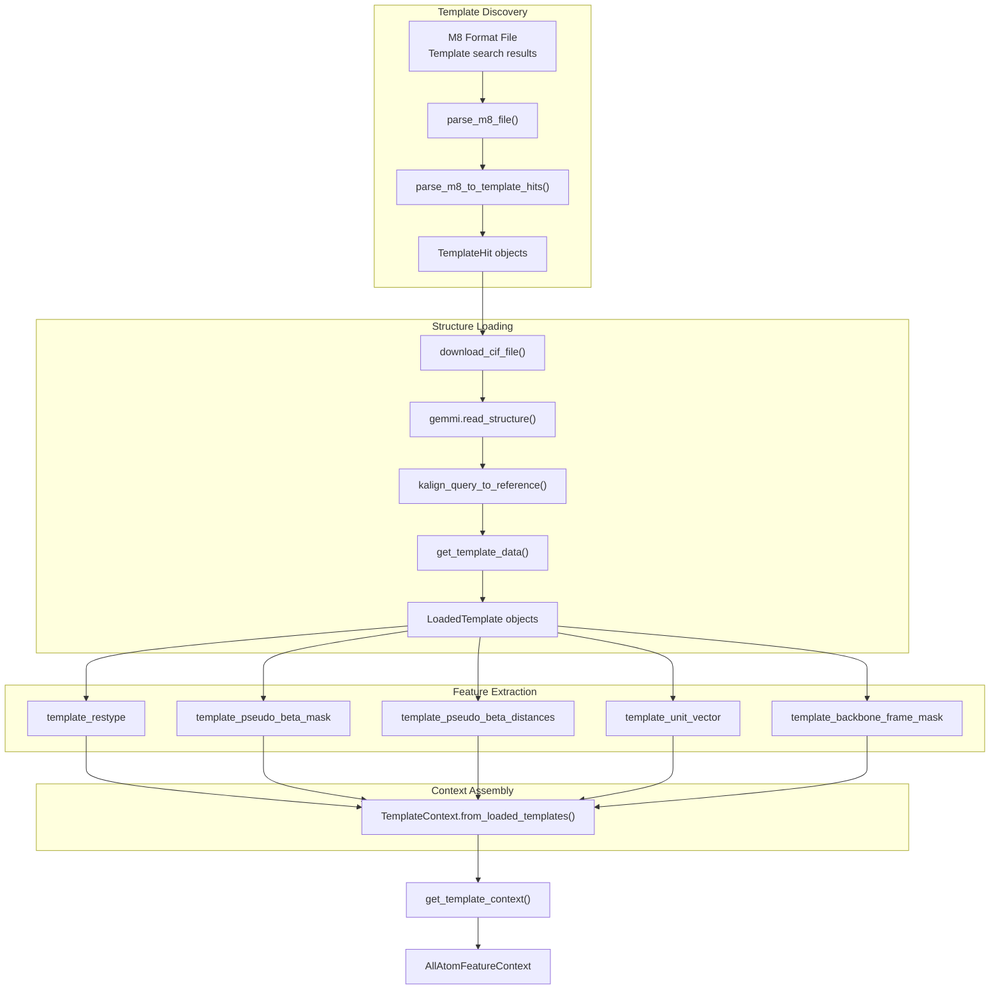
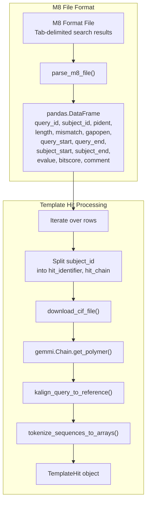
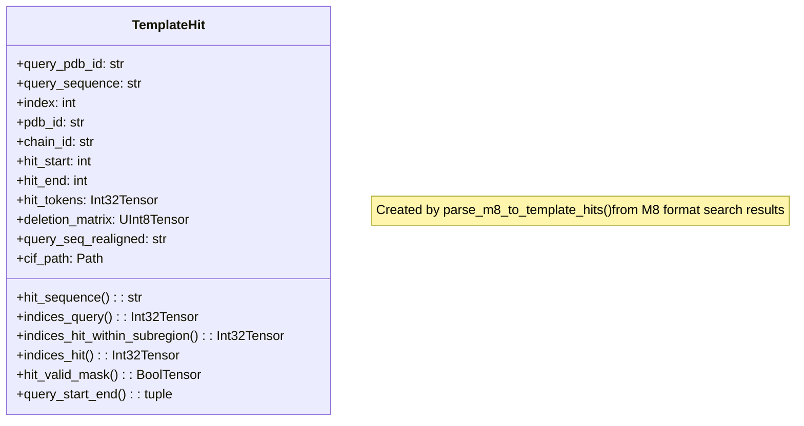
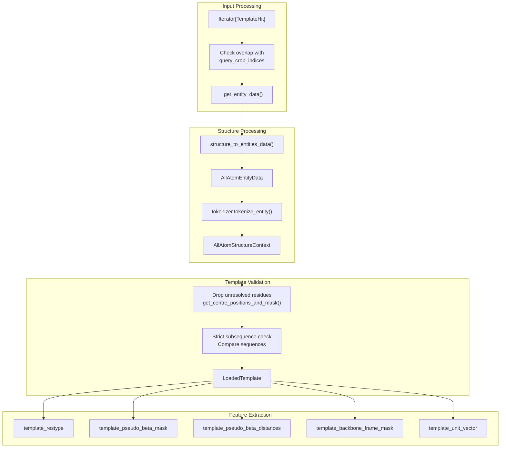
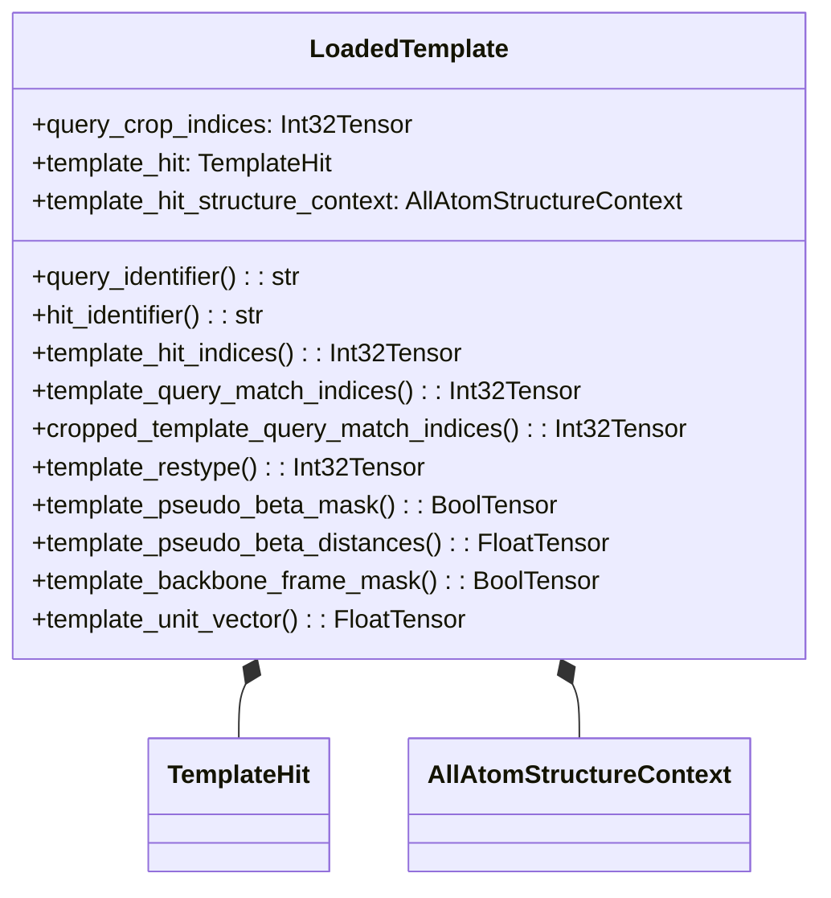
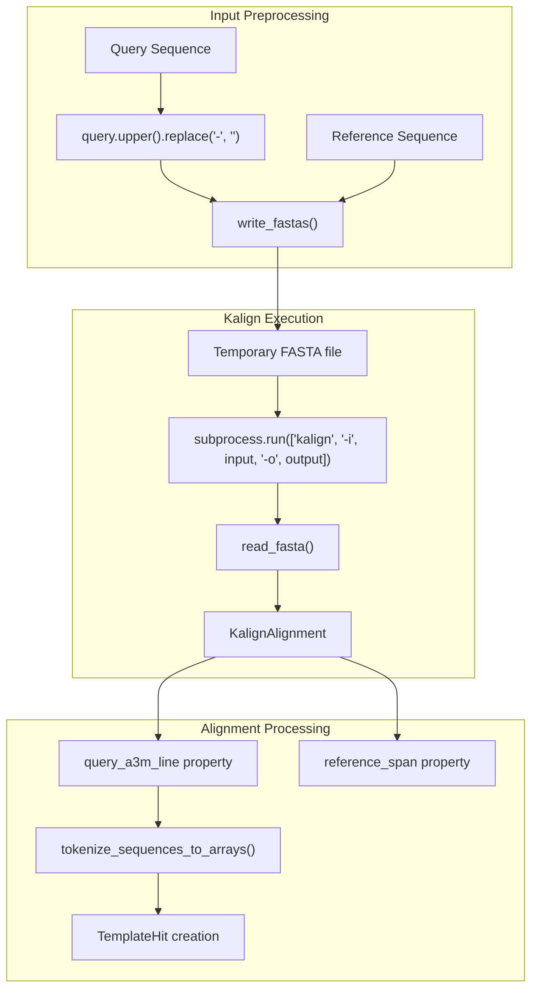
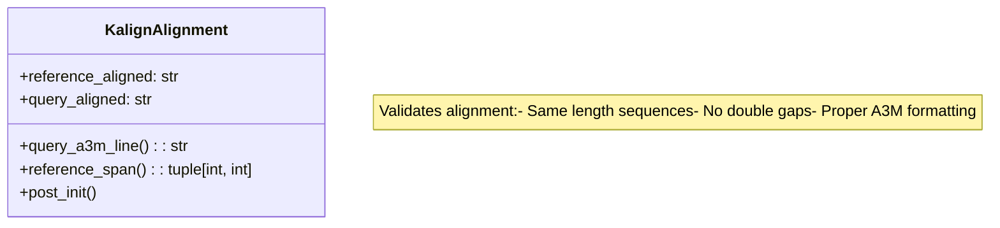
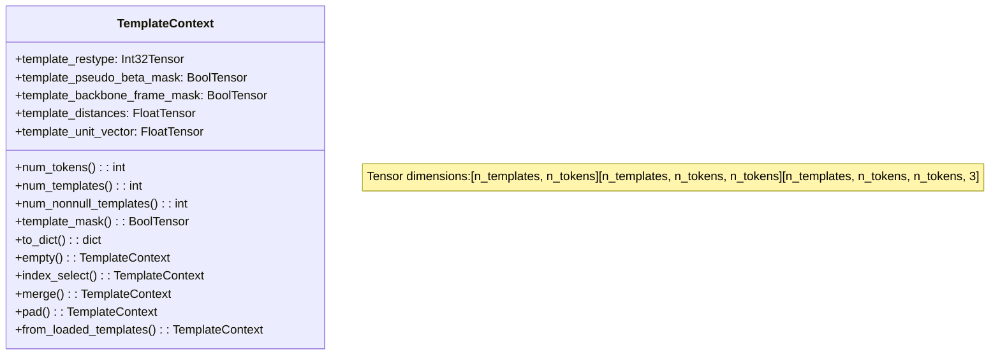
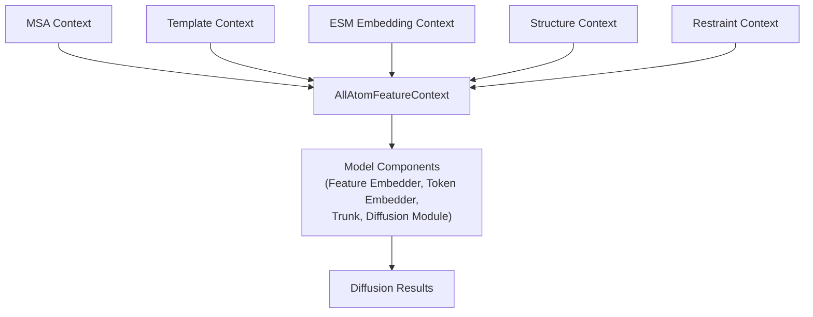

# Structural Templates

> **Relevant source files**
> * [chai_lab/data/dataset/templates/align.py](https://github.com/chaidiscovery/chai-lab/blob/66c38d1f/chai_lab/data/dataset/templates/align.py)
> * [chai_lab/data/dataset/templates/context.py](https://github.com/chaidiscovery/chai-lab/blob/66c38d1f/chai_lab/data/dataset/templates/context.py)
> * [chai_lab/data/dataset/templates/load.py](https://github.com/chaidiscovery/chai-lab/blob/66c38d1f/chai_lab/data/dataset/templates/load.py)
> * [chai_lab/data/io/rcsb.py](https://github.com/chaidiscovery/chai-lab/blob/66c38d1f/chai_lab/data/io/rcsb.py)
> * [chai_lab/data/parsing/templates/m8.py](https://github.com/chaidiscovery/chai-lab/blob/66c38d1f/chai_lab/data/parsing/templates/m8.py)
> * [chai_lab/data/parsing/templates/template_hit.py](https://github.com/chaidiscovery/chai-lab/blob/66c38d1f/chai_lab/data/parsing/templates/template_hit.py)
> * [chai_lab/data/sources/rdkit.py](https://github.com/chaidiscovery/chai-lab/blob/66c38d1f/chai_lab/data/sources/rdkit.py)
> * [chai_lab/tools/kalign.py](https://github.com/chaidiscovery/chai-lab/blob/66c38d1f/chai_lab/tools/kalign.py)
> * [tests/test_rdkit.py](https://github.com/chaidiscovery/chai-lab/blob/66c38d1f/tests/test_rdkit.py)

This document describes the template-based structure prediction capabilities within the Chai-1 molecular structure prediction system. Templates are known 3D structures with sequence similarity to the target sequence that can significantly improve prediction accuracy by providing structural information from homologous proteins.

## Template System Overview

Templates in Chai-1 are processed through a pipeline that parses template hits from M8 format files, downloads structures from RCSB, aligns sequences using Kalign, and extracts structural features that inform the diffusion model during structure prediction.

### Template Processing Pipeline

Sources: [chai_lab/data/parsing/templates/m8.py L22-L130](https://github.com/chaidiscovery/chai-lab/blob/66c38d1f/chai_lab/data/parsing/templates/m8.py#L22-L130)

 [chai_lab/data/dataset/templates/load.py L262-L411](https://github.com/chaidiscovery/chai-lab/blob/66c38d1f/chai_lab/data/dataset/templates/load.py#L262-L411)

 [chai_lab/data/dataset/templates/context.py L334-L420](https://github.com/chaidiscovery/chai-lab/blob/66c38d1f/chai_lab/data/dataset/templates/context.py#L334-L420)

## M8 Format Template Hit Discovery

Template hits are discovered by parsing M8 format files, which contain the results of template search algorithms. The M8 format is a tab-delimited format that includes alignment statistics and coordinates.

### M8 File Parsing

The `parse_m8_to_template_hits` function processes each hit by:

1. Extracting PDB ID and chain ID from the `subject_id` field [chai_lab/data/parsing/templates/m8.py L79-L80](https://github.com/chaidiscovery/chai-lab/blob/66c38d1f/chai_lab/data/parsing/templates/m8.py#L79-L80)
2. Downloading the CIF file using `download_cif_file` [chai_lab/data/parsing/templates/m8.py L82-L87](https://github.com/chaidiscovery/chai-lab/blob/66c38d1f/chai_lab/data/parsing/templates/m8.py#L82-L87)
3. Parsing the structure with `gemmi.read_structure` [chai_lab/data/parsing/templates/m8.py L88](https://github.com/chaidiscovery/chai-lab/blob/66c38d1f/chai_lab/data/parsing/templates/m8.py#L88-L88)
4. Aligning the hit sequence to the query using `kalign_query_to_reference` [chai_lab/data/parsing/templates/m8.py L97](https://github.com/chaidiscovery/chai-lab/blob/66c38d1f/chai_lab/data/parsing/templates/m8.py#L97-L97)
5. Tokenizing the aligned sequence for model input using `tokenize_sequences_to_arrays` [chai_lab/data/parsing/templates/m8.py L101](https://github.com/chaidiscovery/chai-lab/blob/66c38d1f/chai_lab/data/parsing/templates/m8.py#L101-L101)

Sources: [chai_lab/data/parsing/templates/m8.py L22-L130](https://github.com/chaidiscovery/chai-lab/blob/66c38d1f/chai_lab/data/parsing/templates/m8.py#L22-L130)

 [chai_lab/data/io/rcsb.py L9-L18](https://github.com/chaidiscovery/chai-lab/blob/66c38d1f/chai_lab/data/io/rcsb.py#L9-L18)

## Template Hit Representation

The `TemplateHit` class represents a match between a query sequence and a known structure discovered from M8 search results. Each hit contains alignment information and indices that map between query and template positions.

### Key Properties and Methods

| Property | Type | Description |
| --- | --- | --- |
| `hit_sequence` | `str` | Amino acid sequence of the template hit [chai_lab/data/parsing/templates/template_hit.py L71-L74](https://github.com/chaidiscovery/chai-lab/blob/66c38d1f/chai_lab/data/parsing/templates/template_hit.py#L71-L74) |
| `indices_query` | `Int32[Tensor, "m"]` | Query residue indices corresponding to hit [chai_lab/data/parsing/templates/template_hit.py L77-L83](https://github.com/chaidiscovery/chai-lab/blob/66c38d1f/chai_lab/data/parsing/templates/template_hit.py#L77-L83) |
| `indices_hit` | `Int32[Tensor, "n"]` | Hit indices within full hit sequence [chai_lab/data/parsing/templates/template_hit.py L109-L111](https://github.com/chaidiscovery/chai-lab/blob/66c38d1f/chai_lab/data/parsing/templates/template_hit.py#L109-L111) |
| `hit_valid_mask` | `Bool[Tensor, "n"]` | Mask indicating valid positions (not gaps) [chai_lab/data/parsing/templates/template_hit.py L114-L129](https://github.com/chaidiscovery/chai-lab/blob/66c38d1f/chai_lab/data/parsing/templates/template_hit.py#L114-L129) |
| `query_start_end` | `tuple[int, int]` | Start and end positions in query sequence [chai_lab/data/parsing/templates/template_hit.py L132-L135](https://github.com/chaidiscovery/chai-lab/blob/66c38d1f/chai_lab/data/parsing/templates/template_hit.py#L132-L135) |

The `indices_hit` property accounts for insertions and deletions in the alignment by using the `deletion_matrix` and `hit_tokens` [chai_lab/data/parsing/templates/template_hit.py L92-L106](https://github.com/chaidiscovery/chai-lab/blob/66c38d1f/chai_lab/data/parsing/templates/template_hit.py#L92-L106)

Sources: [chai_lab/data/parsing/templates/template_hit.py L14-L136](https://github.com/chaidiscovery/chai-lab/blob/66c38d1f/chai_lab/data/parsing/templates/template_hit.py#L14-L136)

## Template Loading and Processing

Templates are loaded using the `get_template_data` function, which converts `TemplateHit` objects into `LoadedTemplate` objects containing the actual structural data.

### Template Loading Pipeline

### LoadedTemplate Class Structure

### Key Features and Properties

The `LoadedTemplate` class provides properties that extract features directly for the model:

* `template_restype`: Extracts residue types and handles gaps using `rc.residue_types_with_nucleotides_order["-"]` [chai_lab/data/dataset/templates/load.py L121-L128](https://github.com/chaidiscovery/chai-lab/blob/66c38d1f/chai_lab/data/dataset/templates/load.py#L121-L128)
* `template_pseudo_beta_mask`: Computes the existence mask for reference atoms (e.g., Cβ) [chai_lab/data/dataset/templates/load.py L131-L144](https://github.com/chaidiscovery/chai-lab/blob/66c38d1f/chai_lab/data/dataset/templates/load.py#L131-L144)
* `template_pseudo_beta_distances`: Calculates pairwise distances between reference atoms, filling masked regions with a large value (100.0) [chai_lab/data/dataset/templates/load.py L147-L171](https://github.com/chaidiscovery/chai-lab/blob/66c38d1f/chai_lab/data/dataset/templates/load.py#L147-L171)

Sources: [chai_lab/data/dataset/templates/load.py L58-L232](https://github.com/chaidiscovery/chai-lab/blob/66c38d1f/chai_lab/data/dataset/templates/load.py#L58-L232)

 [chai_lab/data/dataset/templates/load.py L262-L411](https://github.com/chaidiscovery/chai-lab/blob/66c38d1f/chai_lab/data/dataset/templates/load.py#L262-L411)

## Template Alignment with Kalign

Sequence alignment is a critical step in template processing. Chai-1 uses the Kalign tool to align query sequences to template sequences through the `kalign_query_to_reference` function.

### Kalign Alignment Process

### KalignAlignment Class

The `query_a3m_line` property converts the alignment to A3M format by marking query insertions as lowercase [chai_lab/tools/kalign.py L35-L42](https://github.com/chaidiscovery/chai-lab/blob/66c38d1f/chai_lab/tools/kalign.py#L35-L42)

 The `reference_span` property identifies the coverage range on the reference sequence [chai_lab/tools/kalign.py L44-L57](https://github.com/chaidiscovery/chai-lab/blob/66c38d1f/chai_lab/tools/kalign.py#L44-L57)

Sources: [chai_lab/tools/kalign.py L19-L111](https://github.com/chaidiscovery/chai-lab/blob/66c38d1f/chai_lab/tools/kalign.py#L19-L111)

## Template Context Assembly

Individual `LoadedTemplate` objects are assembled into a unified `TemplateContext` that can be processed by the model. The `TemplateContext` class handles alignment, padding, and merging of multiple templates.

### TemplateContext Structure

### Template Feature Extraction

Templates provide several key features that inform the structure prediction:

| Feature | Tensor Shape | Description |
| --- | --- | --- |
| `template_restype` | `[n_templates, n_tokens]` | Amino acid residue types [chai_lab/data/dataset/templates/context.py L46](https://github.com/chaidiscovery/chai-lab/blob/66c38d1f/chai_lab/data/dataset/templates/context.py#L46-L46) |
| `template_pseudo_beta_mask` | `[n_templates, n_tokens]` | Mask for valid Cβ positions [chai_lab/data/dataset/templates/context.py L47](https://github.com/chaidiscovery/chai-lab/blob/66c38d1f/chai_lab/data/dataset/templates/context.py#L47-L47) |
| `template_distances` | `[n_templates, n_tokens, n_tokens]` | Pairwise Cβ distances [chai_lab/data/dataset/templates/context.py L49](https://github.com/chaidiscovery/chai-lab/blob/66c38d1f/chai_lab/data/dataset/templates/context.py#L49-L49) |
| `template_backbone_frame_mask` | `[n_templates, n_tokens]` | Mask for complete N-Cα-C frames [chai_lab/data/dataset/templates/context.py L48](https://github.com/chaidiscovery/chai-lab/blob/66c38d1f/chai_lab/data/dataset/templates/context.py#L48-L48) |
| `template_unit_vector` | `[n_templates, n_tokens, n_tokens, 3]` | Unit vectors in backbone frame [chai_lab/data/dataset/templates/context.py L50](https://github.com/chaidiscovery/chai-lab/blob/66c38d1f/chai_lab/data/dataset/templates/context.py#L50-L50) |

### Merging and Alignment

The `merge` method concatenates multiple `TemplateContext` objects along the sequence dimension while properly tiling the 2D distance and unit vector matrices [chai_lab/data/dataset/templates/context.py L119-L180](https://github.com/chaidiscovery/chai-lab/blob/66c38d1f/chai_lab/data/dataset/templates/context.py#L119-L180)

 1D and 2D features are aligned to the global token indices using `align_1d` and `align_2d` [chai_lab/data/dataset/templates/align.py L18-L67](https://github.com/chaidiscovery/chai-lab/blob/66c38d1f/chai_lab/data/dataset/templates/align.py#L18-L67)

Sources: [chai_lab/data/dataset/templates/context.py L42-L332](https://github.com/chaidiscovery/chai-lab/blob/66c38d1f/chai_lab/data/dataset/templates/context.py#L42-L332)

 [chai_lab/data/dataset/templates/align.py L1-L68](https://github.com/chaidiscovery/chai-lab/blob/66c38d1f/chai_lab/data/dataset/templates/align.py#L1-L68)

## Integration with the Prediction Pipeline

Templates are integrated into the `AllAtomFeatureContext`, which serves as the central data structure for structure prediction in Chai-1.

Templates are discovered via M8 search results, downloaded from RCSB [chai_lab/data/io/rcsb.py L9-L18](https://github.com/chaidiscovery/chai-lab/blob/66c38d1f/chai_lab/data/io/rcsb.py#L9-L18)

 and processed into tensors. The `CHAI_TEMPLATE_CIF_FOLDER` environment variable can be used to specify the storage location for downloaded CIF files [chai_lab/data/dataset/templates/context.py L36-L38](https://github.com/chaidiscovery/chai-lab/blob/66c38d1f/chai_lab/data/dataset/templates/context.py#L36-L38)

Sources: [chai_lab/data/dataset/templates/load.py L262-L411](https://github.com/chaidiscovery/chai-lab/blob/66c38d1f/chai_lab/data/dataset/templates/load.py#L262-L411)

 [chai_lab/data/dataset/templates/context.py L36-L38](https://github.com/chaidiscovery/chai-lab/blob/66c38d1f/chai_lab/data/dataset/templates/context.py#L36-L38)