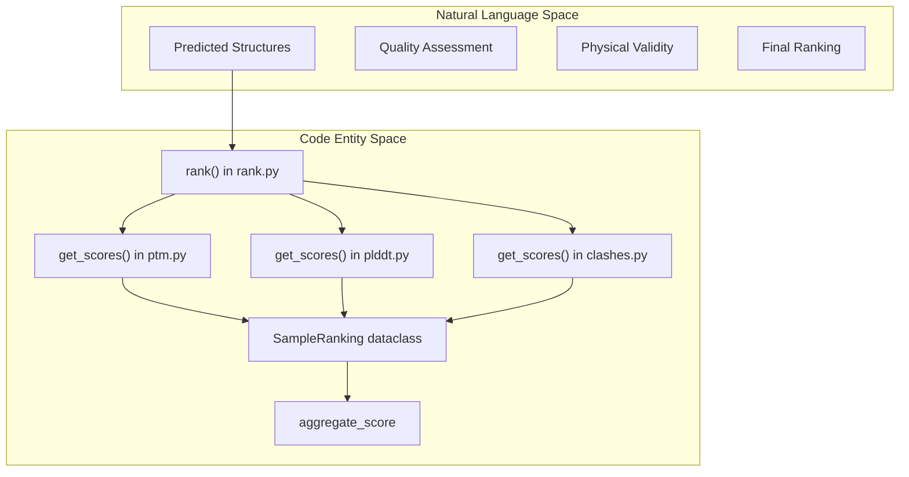
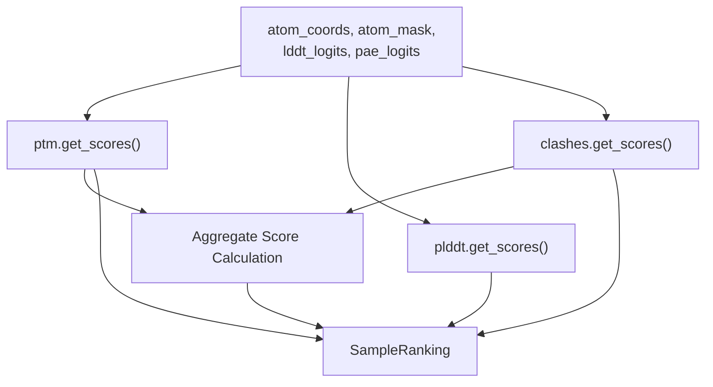

# Structure Ranking

> **Relevant source files**
> * [chai_lab/ranking/clashes.py](https://github.com/chaidiscovery/chai-lab/blob/66c38d1f/chai_lab/ranking/clashes.py)
> * [chai_lab/ranking/frames.py](https://github.com/chaidiscovery/chai-lab/blob/66c38d1f/chai_lab/ranking/frames.py)
> * [chai_lab/ranking/plddt.py](https://github.com/chaidiscovery/chai-lab/blob/66c38d1f/chai_lab/ranking/plddt.py)
> * [chai_lab/ranking/ptm.py](https://github.com/chaidiscovery/chai-lab/blob/66c38d1f/chai_lab/ranking/ptm.py)
> * [chai_lab/ranking/rank.py](https://github.com/chaidiscovery/chai-lab/blob/66c38d1f/chai_lab/ranking/rank.py)
> * [chai_lab/ranking/utils.py](https://github.com/chaidiscovery/chai-lab/blob/66c38d1f/chai_lab/ranking/utils.py)

Structure ranking is a critical component of the Chai-1 molecular structure prediction system. It evaluates and scores predicted 3D structures using a combination of confidence metrics (pLDDT, pTM, ipTM) and physical plausibility checks (clash detection). This system allows the pipeline to rank multiple structure candidates and select the highest-quality predictions for the final output.

## Overview

The structure ranking process takes coordinates and confidence logits produced by the model and assigns them quality scores. These scores are then combined into an aggregate score that determines the final ranking of structure candidates.



Sources: [chai_lab/ranking/rank.py L38-L112](https://github.com/chaidiscovery/chai-lab/blob/66c38d1f/chai_lab/ranking/rank.py#L38-L112)

 [chai_lab/ranking/rank.py L115-L125](https://github.com/chaidiscovery/chai-lab/blob/66c38d1f/chai_lab/ranking/rank.py#L115-L125)

## Ranking Process Implementation

The entry point for structure evaluation is the `rank` function in `chai_lab/ranking/rank.py`. It coordinates the execution of specific scoring modules and calculates the final aggregate score.

### Data Flow in rank()

The function accepts 3D coordinates, masks, and logits for both LDDT (Local Distance Difference Test) and PAE (Predicted Alignment Error).



Sources: [chai_lab/ranking/rank.py L38-L92](https://github.com/chaidiscovery/chai-lab/blob/66c38d1f/chai_lab/ranking/rank.py#L38-L92)

 [chai_lab/ranking/rank.py L106-L112](https://github.com/chaidiscovery/chai-lab/blob/66c38d1f/chai_lab/ranking/rank.py#L106-L112)

### Input Requirements

The `rank` function requires several specific tensors to handle multi-entity complexes:

* `atom_token_index`: Maps atoms back to their parent tokens [chai_lab/ranking/rank.py L41](https://github.com/chaidiscovery/chai-lab/blob/66c38d1f/chai_lab/ranking/rank.py#L41-L41)
* `token_asym_id`: Identifies which chain (asymmetric unit) a token belongs to [chai_lab/ranking/rank.py L43](https://github.com/chaidiscovery/chai-lab/blob/66c38d1f/chai_lab/ranking/rank.py#L43-L43)
* `token_entity_type`: Used to distinguish between polymers (Protein, DNA, RNA) and ligands during clash detection [chai_lab/ranking/rank.py L44](https://github.com/chaidiscovery/chai-lab/blob/66c38d1f/chai_lab/ranking/rank.py#L44-L44)

## Quality Metrics

### pLDDT (Predicted Local Distance Difference Test)

pLDDT measures local confidence for each atom. The score is calculated as the expected value of the `lddt_logits` over the `lddt_bin_centers` [chai_lab/ranking/plddt.py L30-L40](https://github.com/chaidiscovery/chai-lab/blob/66c38d1f/chai_lab/ranking/plddt.py#L30-L40)

The `PLDDTScores` dataclass stores:

* `complex_plddt`: Mean pLDDT across all valid atoms [chai_lab/ranking/plddt.py L24](https://github.com/chaidiscovery/chai-lab/blob/66c38d1f/chai_lab/ranking/plddt.py#L24-L24)
* `per_chain_plddt`: Mean pLDDT for each individual chain [chai_lab/ranking/plddt.py L25](https://github.com/chaidiscovery/chai-lab/blob/66c38d1f/chai_lab/ranking/plddt.py#L25-L25)
* `per_atom_plddt`: Raw pLDDT values for every atom [chai_lab/ranking/plddt.py L26](https://github.com/chaidiscovery/chai-lab/blob/66c38d1f/chai_lab/ranking/plddt.py#L26-L26)

Sources: [chai_lab/ranking/plddt.py L17-L26](https://github.com/chaidiscovery/chai-lab/blob/66c38d1f/chai_lab/ranking/plddt.py#L17-L26)

 [chai_lab/ranking/plddt.py L56-L81](https://github.com/chaidiscovery/chai-lab/blob/66c38d1f/chai_lab/ranking/plddt.py#L56-L81)

### PTM and iPTM (Predicted TM-score)

These metrics assess global structural accuracy and relative orientation of chains using `pae_logits`.

* **pTM (Predicted TM-score)**: Evaluates the global topology of the complex [chai_lab/ranking/ptm.py L74-L87](https://github.com/chaidiscovery/chai-lab/blob/66c38d1f/chai_lab/ranking/ptm.py#L74-L87)
* **ipTM (Interface pTM)**: Measures the quality of interactions between different chains. It is calculated by taking the maximum TM-score over chains while restricting interactions to the interface between a chain and the rest of the complex [chai_lab/ranking/ptm.py L91-L115](https://github.com/chaidiscovery/chai-lab/blob/66c38d1f/chai_lab/ranking/ptm.py#L91-L115)

The system also calculates `per_chain_pair_iptm` to evaluate specific interfaces in multi-component assemblies [chai_lab/ranking/ptm.py L119-L160](https://github.com/chaidiscovery/chai-lab/blob/66c38d1f/chai_lab/ranking/ptm.py#L119-L160)

Sources: [chai_lab/ranking/ptm.py L18-L30](https://github.com/chaidiscovery/chai-lab/blob/66c38d1f/chai_lab/ranking/ptm.py#L18-L30)

 [chai_lab/ranking/ptm.py L40-L70](https://github.com/chaidiscovery/chai-lab/blob/66c38d1f/chai_lab/ranking/ptm.py#L40-L70)

### Clash Detection

Clashes are identified based on a distance threshold (default 1.1 Å) between non-bonded atoms [chai_lab/ranking/clashes.py L34-L44](https://github.com/chaidiscovery/chai-lab/blob/66c38d1f/chai_lab/ranking/clashes.py#L34-L44)

The `has_inter_chain_clashes` logic determines if a structure is physically invalid based on:

1. **Absolute count**: If a chain pair has more than `max_clashes` (default 100) [chai_lab/ranking/clashes.py L66](https://github.com/chaidiscovery/chai-lab/blob/66c38d1f/chai_lab/ranking/clashes.py#L66-L66)
2. **Clash ratio**: If clashes exceed `max_clash_ratio` (default 0.5) of the smaller chain's total atoms [chai_lab/ranking/clashes.py L76-L83](https://github.com/chaidiscovery/chai-lab/blob/66c38d1f/chai_lab/ranking/clashes.py#L76-L83)
3. **Entity filter**: Only clashes between polymer chains (Protein, RNA, DNA, Hybrid) are considered for the binary `has_inter_chain_clashes` flag [chai_lab/ranking/clashes.py L86-L94](https://github.com/chaidiscovery/chai-lab/blob/66c38d1f/chai_lab/ranking/clashes.py#L86-L94)

Sources: [chai_lab/ranking/clashes.py L18-L30](https://github.com/chaidiscovery/chai-lab/blob/66c38d1f/chai_lab/ranking/clashes.py#L18-L30)

 [chai_lab/ranking/clashes.py L48-L94](https://github.com/chaidiscovery/chai-lab/blob/66c38d1f/chai_lab/ranking/clashes.py#L48-L94)

 [chai_lab/ranking/clashes.py L98-L163](https://github.com/chaidiscovery/chai-lab/blob/66c38d1f/chai_lab/ranking/clashes.py#L98-L163)

## Aggregate Score Computation

The final ranking is determined by the `aggregate_score`, which combines global confidence, interface confidence, and physical validity.

```
aggregate_score = (    0.2 * ptm_scores.complex_ptm    + 0.8 * ptm_scores.interface_ptm    - 100 * clash_scores.has_inter_chain_clashes.float())
```

This formula prioritizes interface quality (`ipTM`) while applying a heavy penalty to structures with significant inter-chain clashes.

Sources: [chai_lab/ranking/rank.py L95-L99](https://github.com/chaidiscovery/chai-lab/blob/66c38d1f/chai_lab/ranking/rank.py#L95-L99)

## Core Data Structures

The following classes define the data flow within the ranking system:

| Class | Purpose | Key Attributes |
| --- | --- | --- |
| `SampleRanking` | Main container for all ranking results | `aggregate_score`, `ptm_scores`, `clash_scores`, `plddt_scores` |
| `PTMScores` | Global and interface TM-scores | `complex_ptm`, `interface_ptm`, `per_chain_pair_iptm` |
| `PLDDTScores` | Local confidence scores | `complex_plddt`, `per_chain_plddt`, `per_atom_plddt` |
| `ClashScores` | Physical validity metrics | `total_inter_chain_clashes`, `has_inter_chain_clashes`, `chain_chain_clashes` |

Sources: [chai_lab/ranking/rank.py L20-L35](https://github.com/chaidiscovery/chai-lab/blob/66c38d1f/chai_lab/ranking/rank.py#L20-L35)

 [chai_lab/ranking/ptm.py L18-L30](https://github.com/chaidiscovery/chai-lab/blob/66c38d1f/chai_lab/ranking/ptm.py#L18-L30)

 [chai_lab/ranking/plddt.py L17-L26](https://github.com/chaidiscovery/chai-lab/blob/66c38d1f/chai_lab/ranking/plddt.py#L17-L26)

 [chai_lab/ranking/clashes.py L18-L30](https://github.com/chaidiscovery/chai-lab/blob/66c38d1f/chai_lab/ranking/clashes.py#L18-L30)

## Utility Functions

The `chai_lab/ranking/utils.py` module provides shared logic for ranking:

* `get_chain_masks_and_asyms`: Extracts boolean masks for each chain based on asymmetric IDs [chai_lab/ranking/utils.py L15-L27](https://github.com/chaidiscovery/chai-lab/blob/66c38d1f/chai_lab/ranking/utils.py#L15-L27)
* `chain_is_polymer`: Uses `EntityType` to determine if a chain consists of polymer entities [chai_lab/ranking/utils.py L67-L86](https://github.com/chaidiscovery/chai-lab/blob/66c38d1f/chai_lab/ranking/utils.py#L67-L86)
* `expectation`: Computes the expected value over discrete bins (used for pLDDT and PAE) [chai_lab/ranking/utils.py L49-L54](https://github.com/chaidiscovery/chai-lab/blob/66c38d1f/chai_lab/ranking/utils.py#L49-L54)
* `get_interface_mask`: Identifies atoms at the interface between chains based on a distance threshold [chai_lab/ranking/utils.py L31-L45](https://github.com/chaidiscovery/chai-lab/blob/66c38d1f/chai_lab/ranking/utils.py#L31-L45)

Sources: [chai_lab/ranking/utils.py L9-L86](https://github.com/chaidiscovery/chai-lab/blob/66c38d1f/chai_lab/ranking/utils.py#L9-L86)