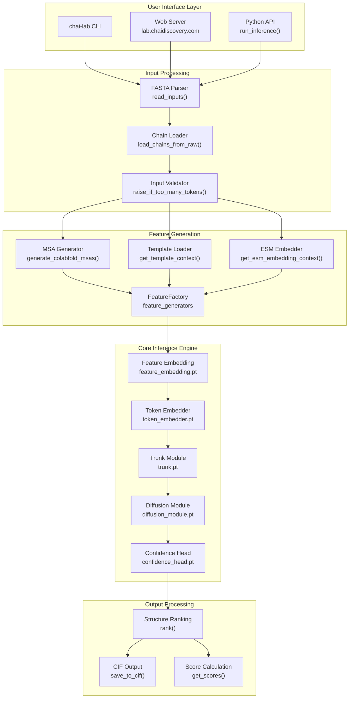
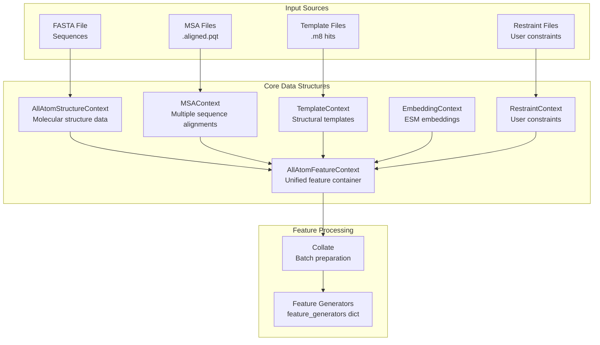
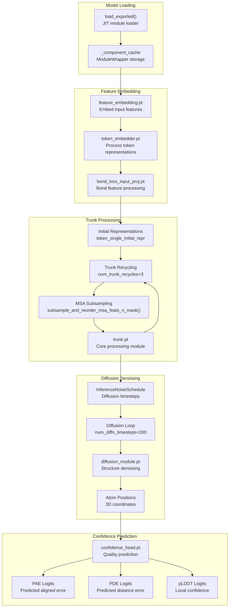
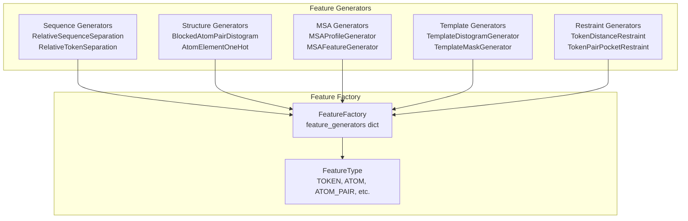
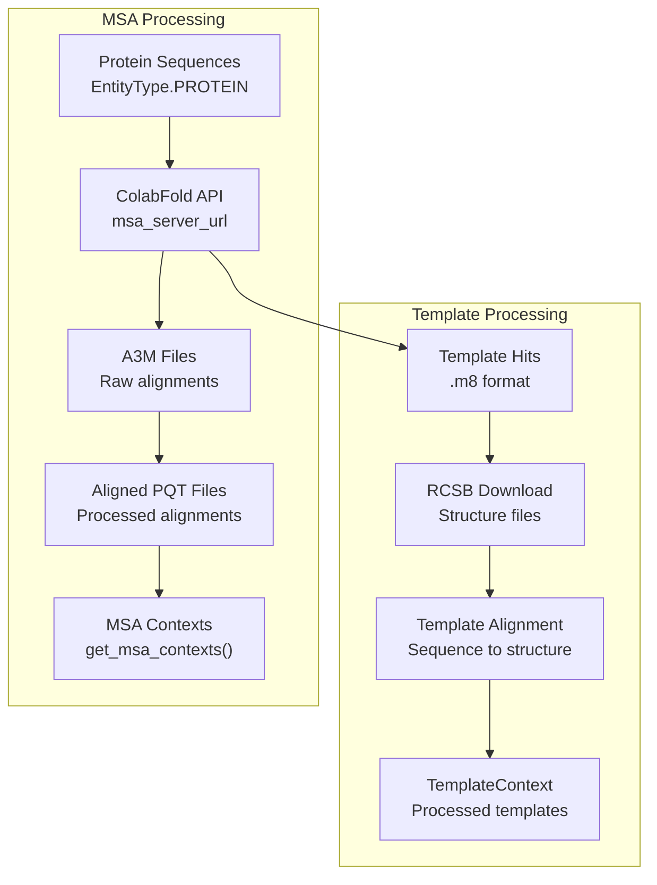
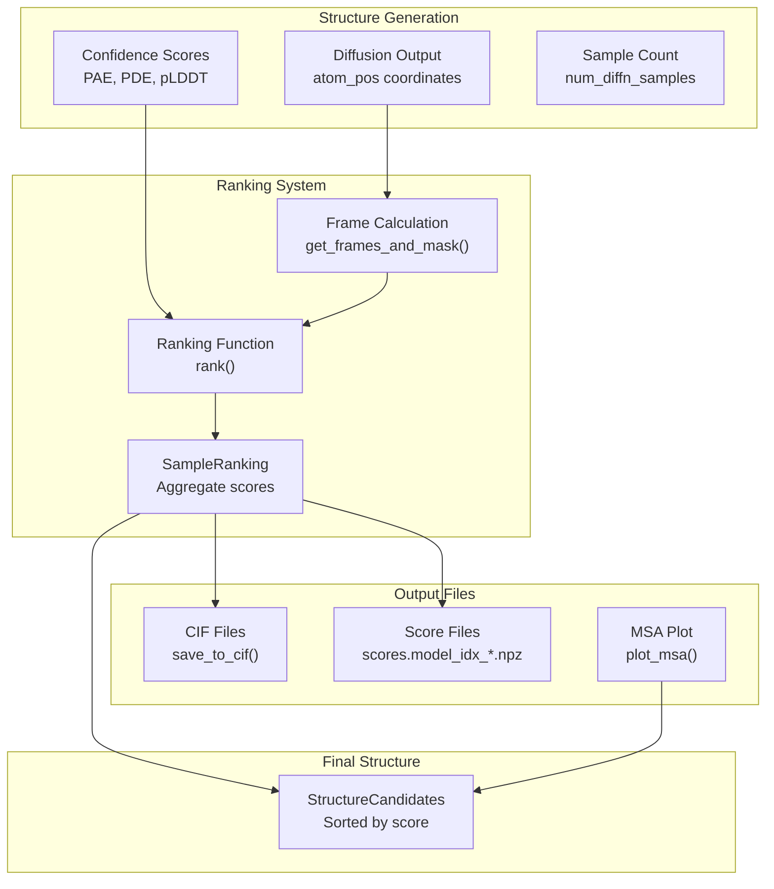
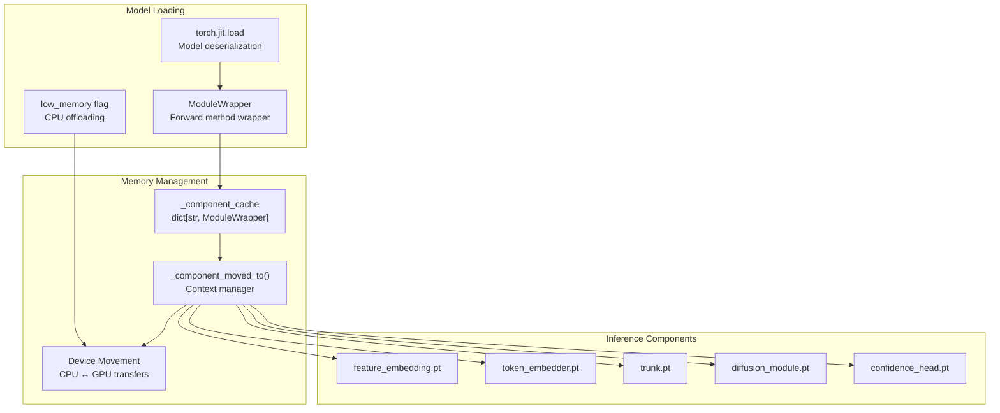

# System Architecture

> **Relevant source files**
> * [chai_lab/chai1.py](https://github.com/chaidiscovery/chai-lab/blob/66c38d1f/chai_lab/chai1.py)
> * [chai_lab/data/collate/collate.py](https://github.com/chaidiscovery/chai-lab/blob/66c38d1f/chai_lab/data/collate/collate.py)
> * [chai_lab/data/dataset/all_atom_feature_context.py](https://github.com/chaidiscovery/chai-lab/blob/66c38d1f/chai_lab/data/dataset/all_atom_feature_context.py)
> * [chai_lab/data/dataset/msas/utils.py](https://github.com/chaidiscovery/chai-lab/blob/66c38d1f/chai_lab/data/dataset/msas/utils.py)

This document provides a comprehensive overview of the Chai-1 system architecture, covering the core inference pipeline, data processing components, and model structure. For specific implementation details about input processing, see [Input Processing](/chaidiscovery/chai-lab/4-input-processing). For feature generation systems, see [Feature Generation](/chaidiscovery/chai-lab/5-feature-generation).

## Overview

Chai-1 is a multi-modal foundation model for molecular structure prediction that unifies prediction of proteins, small molecules, DNA, RNA, and glycosylations. The system follows a pipeline architecture with distinct stages for input processing, feature generation, model inference, and output generation.

## High-Level System Architecture

### Core Pipeline Components

Sources: [chai_lab/chai1.py L499-L1059](https://github.com/chaidiscovery/chai-lab/blob/66c38d1f/chai_lab/chai1.py#L499-L1059)

 [README.md L23-L46](https://github.com/chaidiscovery/chai-lab/blob/66c38d1f/README.md?plain=1#L23-L46)

### Data Context Architecture

The `AllAtomFeatureContext` serves as the central hub for all molecular and feature data required for inference. It encapsulates various sub-contexts that are eventually collated into tensors for the model.

Sources: [chai_lab/data/dataset/all_atom_feature_context.py L25-L40](https://github.com/chaidiscovery/chai-lab/blob/66c38d1f/chai_lab/data/dataset/all_atom_feature_context.py#L25-L40)

 [chai_lab/data/collate/collate.py L24-L35](https://github.com/chaidiscovery/chai-lab/blob/66c38d1f/chai_lab/data/collate/collate.py#L24-L35)

 [chai_lab/chai1.py L486-L495](https://github.com/chaidiscovery/chai-lab/blob/66c38d1f/chai_lab/chai1.py#L486-L495)

## Model Inference Pipeline

### Trunk Recycling and Diffusion Process

The inference engine utilizes a sequential execution flow involving feature embedding, trunk recycling, and a diffusion denoising loop. The `ModuleWrapper` handles JIT-loaded components like `trunk.pt` and `diffusion_module.pt`.

Sources: [chai_lab/chai1.py L115-L137](https://github.com/chaidiscovery/chai-lab/blob/66c38d1f/chai_lab/chai1.py#L115-L137)

 [chai_lab/chai1.py L139-L149](https://github.com/chaidiscovery/chai-lab/blob/66c38d1f/chai_lab/chai1.py#L139-L149)

 [chai_lab/chai1.py L744-L778](https://github.com/chaidiscovery/chai-lab/blob/66c38d1f/chai_lab/chai1.py#L744-L778)

 [chai_lab/chai1.py L821-L886](https://github.com/chaidiscovery/chai-lab/blob/66c38d1f/chai_lab/chai1.py#L821-L886)

 [chai_lab/chai1.py L894-L915](https://github.com/chaidiscovery/chai-lab/blob/66c38d1f/chai_lab/chai1.py#L894-L915)

 [chai_lab/data/dataset/msas/utils.py L51-L86](https://github.com/chaidiscovery/chai-lab/blob/66c38d1f/chai_lab/data/dataset/msas/utils.py#L51-L86)

## Feature Generation System

### Feature Factory Architecture

The system uses a `FeatureFactory` that orchestrates multiple `feature_generators` to produce tensors for the model. These generators cover sequence, structure, MSA, and restraint-based features.

| Feature Type | Generator Class | Purpose |
| --- | --- | --- |
| Sequence Features | `RelativeSequenceSeparation` | Positional relationships [chai_lab/chai1.py L173](https://github.com/chaidiscovery/chai-lab/blob/66c38d1f/chai_lab/chai1.py#L173-L173) |
| Token Features | `RelativeTokenSeparation` | Token-level distances [chai_lab/chai1.py L174](https://github.com/chaidiscovery/chai-lab/blob/66c38d1f/chai_lab/chai1.py#L174-L174) |
| Structure Features | `BlockedAtomPairDistogram` | Atomic distance features [chai_lab/chai1.py L179](https://github.com/chaidiscovery/chai-lab/blob/66c38d1f/chai_lab/chai1.py#L179-L179) |
| MSA Features | `MSAProfileGenerator` | Sequence alignment profiles [chai_lab/chai1.py L72](https://github.com/chaidiscovery/chai-lab/blob/66c38d1f/chai_lab/chai1.py#L72-L72) |
| Template Features | `TemplateDistogramGenerator` | Structural template features [chai_lab/chai1.py L86](https://github.com/chaidiscovery/chai-lab/blob/66c38d1f/chai_lab/chai1.py#L86-L86) |
| Restraint Features | `TokenDistanceRestraint` | User-defined constraints [chai_lab/chai1.py L93](https://github.com/chaidiscovery/chai-lab/blob/66c38d1f/chai_lab/chai1.py#L93-L93) |

Sources: [chai_lab/chai1.py L172-L236](https://github.com/chaidiscovery/chai-lab/blob/66c38d1f/chai_lab/chai1.py#L172-L236)

 [chai_lab/data/features/feature_factory.py L13-L25](https://github.com/chaidiscovery/chai-lab/blob/66c38d1f/chai_lab/data/features/feature_factory.py#L13-L25)

## External Service Integration

### ColabFold MSA Generation

MSA generation is integrated via ColabFold, with support for template discovery and processing into the `TemplateContext`.

Sources: [chai_lab/chai1.py L389-L402](https://github.com/chaidiscovery/chai-lab/blob/66c38d1f/chai_lab/chai1.py#L389-L402)

 [chai_lab/chai1.py L422-L438](https://github.com/chaidiscovery/chai-lab/blob/66c38d1f/chai_lab/chai1.py#L422-L438)

 [chai_lab/data/dataset/msas/colabfold.py L20-L45](https://github.com/chaidiscovery/chai-lab/blob/66c38d1f/chai_lab/data/dataset/msas/colabfold.py#L20-L45)

## Configuration and Validation

### System Limits and Validation

The system enforces several limits to ensure computational feasibility, defined in the feature context and model metadata.

| Limit Type | Maximum Value | Source |
| --- | --- | --- |
| Token Count | `max(AVAILABLE_MODEL_SIZES)` | [chai_lab/data/collate/utils.py L22](https://github.com/chaidiscovery/chai-lab/blob/66c38d1f/chai_lab/data/collate/utils.py#L22-L22) |
| Template Count | `MAX_NUM_TEMPLATES = 4` | [chai_lab/data/dataset/all_atom_feature_context.py L21](https://github.com/chaidiscovery/chai-lab/blob/66c38d1f/chai_lab/data/dataset/all_atom_feature_context.py#L21-L21) |
| MSA Depth | `MAX_MSA_DEPTH = 16384` | [chai_lab/data/dataset/all_atom_feature_context.py L20](https://github.com/chaidiscovery/chai-lab/blob/66c38d1f/chai_lab/data/dataset/all_atom_feature_context.py#L20-L20) |

Sources: [chai_lab/chai1.py L255-L277](https://github.com/chaidiscovery/chai-lab/blob/66c38d1f/chai_lab/chai1.py#L255-L277)

 [chai_lab/data/dataset/all_atom_feature_context.py L20-L21](https://github.com/chaidiscovery/chai-lab/blob/66c38d1f/chai_lab/data/dataset/all_atom_feature_context.py#L20-L21)

## Output Generation and Ranking

### Structure Candidate Processing

The final stage involves ranking predicted structures based on confidence metrics and saving them to standard formats like CIF.

Sources: [chai_lab/chai1.py L989-L1051](https://github.com/chaidiscovery/chai-lab/blob/66c38d1f/chai_lab/chai1.py#L989-L1051)

 [chai_lab/ranking/rank.py L104-L105](https://github.com/chaidiscovery/chai-lab/blob/66c38d1f/chai_lab/ranking/rank.py#L104-L105)

 [chai_lab/data/io/cif_utils.py L98](https://github.com/chaidiscovery/chai-lab/blob/66c38d1f/chai_lab/data/io/cif_utils.py#L98-L98)

## Memory Management and Device Handling

The system implements sophisticated memory management for handling large models via a JIT module cache and transient device movement.

### Component Caching and Device Movement

Sources: [chai_lab/chai1.py L151-L167](https://github.com/chaidiscovery/chai-lab/blob/66c38d1f/chai_lab/chai1.py#L151-L167)

 [chai_lab/chai1.py L115-L148](https://github.com/chaidiscovery/chai-lab/blob/66c38d1f/chai_lab/chai1.py#L115-L148)