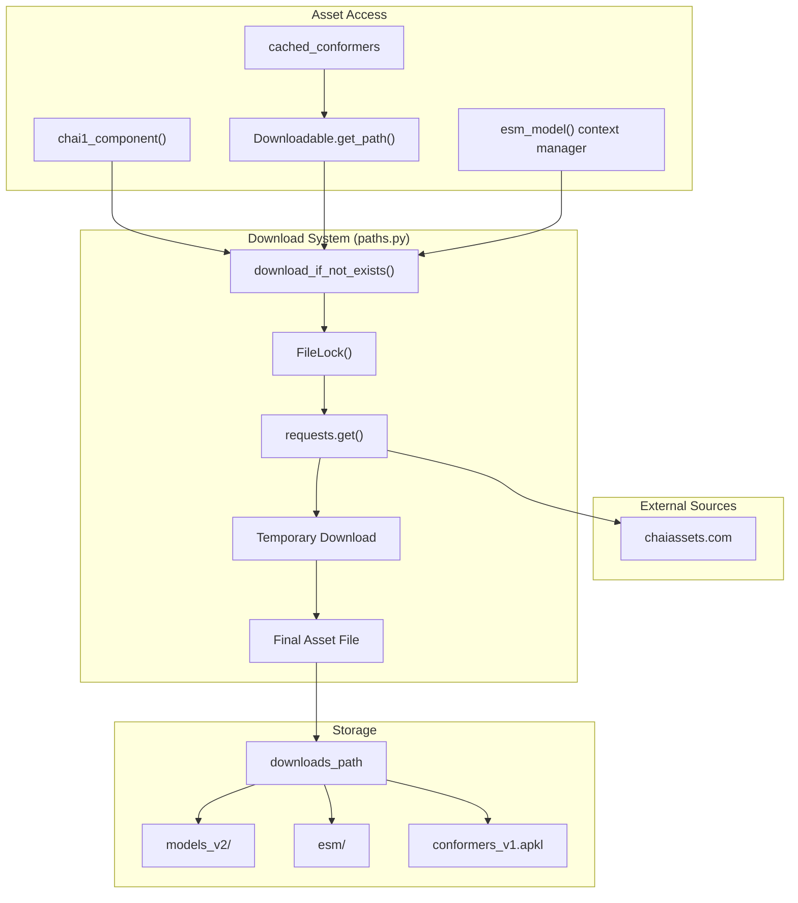
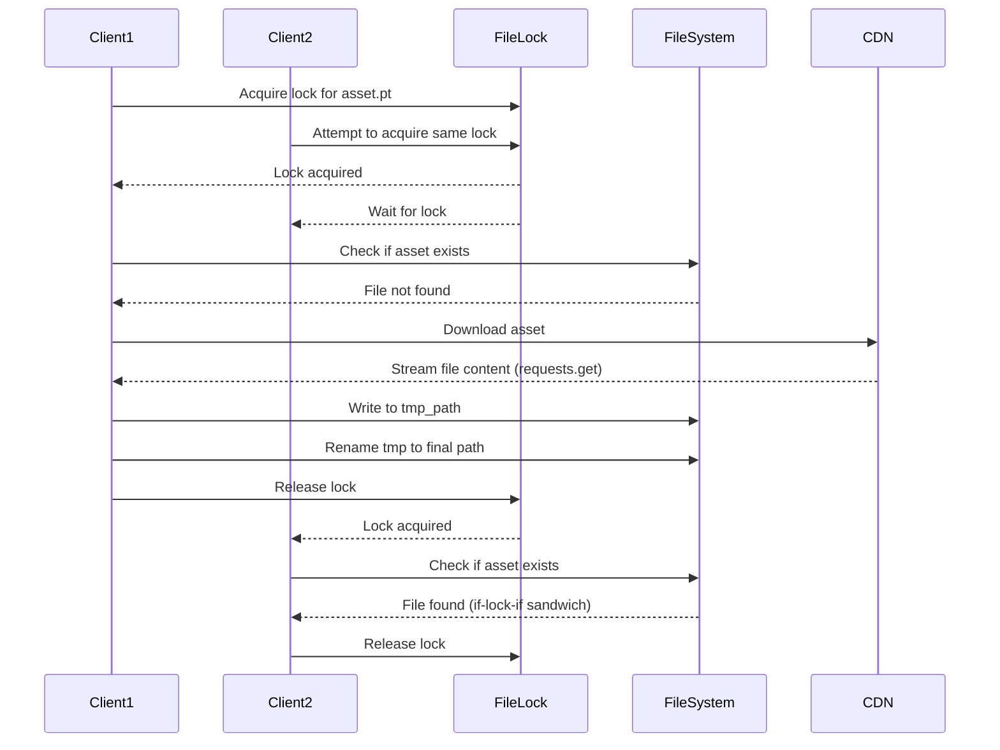
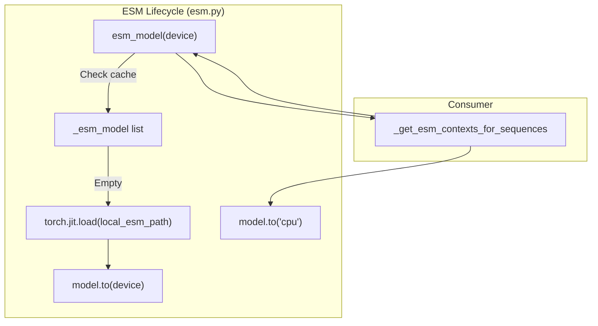

# Asset Management

# Asset Management

> **Relevant source files**
> - [chai\_lab/data/dataset/embeddings/esm\.py](https://github.com/chaidiscovery/chai-lab/blob/66c38d1f/chai_lab/data/dataset/embeddings/esm.py)
> - [chai\_lab/utils/defaults\.py](https://github.com/chaidiscovery/chai-lab/blob/66c38d1f/chai_lab/utils/defaults.py)
> - [chai\_lab/utils/paths\.py](https://github.com/chaidiscovery/chai-lab/blob/66c38d1f/chai_lab/utils/paths.py)

## Purpose and Scope

 This document covers the asset management system in chai\-lab, which handles the downloading, caching, and organization of model weights, conformer data, and external model dependencies like ESM\-2\. The system ensures efficient storage and retrieval of these assets while providing thread\-safe download mechanisms\.

 For information about input data processing and validation, see [Input Processing](https://deepwiki.com/chaidiscovery/chai-lab/4-input-processing)\. For details about model inference and the core prediction pipeline, see [Inference Engine](https://deepwiki.com/chaidiscovery/chai-lab/3.1-inference-engine)\.

## Asset Types and Organization

 The chai\-lab system manages several categories of assets required for structure prediction:

### Model Components

 The primary assets are the trained model weights distributed as PyTorch checkpoint files\. These include:

 - `trunk.pt` \- The main trunk model weights [paths\.py L75-L76](https://github.com/chaidiscovery/chai-lab/blob/66c38d1f/chai_lab/utils/paths.py#L75-L76)
- Additional model components stored in the `models_v2` directory structure [paths\.py L79-L80](https://github.com/chaidiscovery/chai-lab/blob/66c38d1f/chai_lab/utils/paths.py#L79-L80)

### Conformer Data

 Pre\-computed molecular conformers are cached to accelerate ligand processing:

 - `conformers_v1.apkl` \- Serialized conformer data \(antipickle format\) [paths\.py L62-L65](https://github.com/chaidiscovery/chai-lab/blob/66c38d1f/chai_lab/utils/paths.py#L62-L65)

### External Embeddings \(ESM\)

 The system utilizes ESM\-2 for protein sequence embeddings:

 - `traced_sdpa_esm2_t36_3B_UR50D_fp16.pt` \- A TorchScript\-traced version of the ESM\-2 3B model [esm\.py L21-L22](https://github.com/chaidiscovery/chai-lab/blob/66c38d1f/chai_lab/data/dataset/embeddings/esm.py#L21-L22)

### Download Architecture

 The asset management system uses a centralized download mechanism with built\-in caching and concurrent access protection:



 Sources: [paths\.py L29-L49](https://github.com/chaidiscovery/chai-lab/blob/66c38d1f/chai_lab/utils/paths.py#L29-L49) [esm\.py L27-L34](https://github.com/chaidiscovery/chai-lab/blob/66c38d1f/chai_lab/data/dataset/embeddings/esm.py#L27-L34)

## Storage Configuration

### Default Storage Location

 Assets are stored in a configurable downloads directory\. The default location is `repo_root/downloads` [paths\.py L21](https://github.com/chaidiscovery/chai-lab/blob/66c38d1f/chai_lab/utils/paths.py#L21-L21) This path can be overridden using the `CHAI_DOWNLOADS_DIR` environment variable [paths\.py L22](https://github.com/chaidiscovery/chai-lab/blob/66c38d1f/chai_lab/utils/paths.py#L22-L22)

### Path Resolution

 The system uses a hierarchical path resolution strategy:

| Asset Type | Storage Path | Configuration |
| --- | --- | --- |
| Model Components | downloads\_path/models\_v2/\{component\} | Via chai1\_component\(\) chai\_lab/utils/paths\.py79 |
| Conformers | downloads\_path/conformers\_v1\.apkl | Via cached\_conformers chai\_lab/utils/paths\.py64 |
| ESM\-2 Model | downloads\_path/esm/traced\_sdpa\_esm2\.\.\.pt | Via esm\_cache\_folder chai\_lab/data/dataset/embeddings/esm\.py24\-33 |
| Downloads Root | repo\_root/downloads | Via CHAI\_DOWNLOADS\_DIR env var chai\_lab/utils/paths\.py22 |

 Sources: [paths\.py L19-L22](https://github.com/chaidiscovery/chai-lab/blob/66c38d1f/chai_lab/utils/paths.py#L19-L22) [esm\.py L24-L34](https://github.com/chaidiscovery/chai-lab/blob/66c38d1f/chai_lab/data/dataset/embeddings/esm.py#L24-L34)

## Download System Implementation

### Thread\-Safe Downloads

 The system implements a file locking mechanism using `FileLock` to prevent concurrent downloads of the same asset [paths\.py L33](https://github.com/chaidiscovery/chai-lab/blob/66c38d1f/chai_lab/utils/paths.py#L33-L33)



 Sources: [paths\.py L29-L48](https://github.com/chaidiscovery/chai-lab/blob/66c38d1f/chai_lab/utils/paths.py#L29-L48)

### Downloadable Asset Interface

 The `Downloadable` dataclass provides a standardized interface for managing downloadable assets [paths\.py L51-L60](https://github.com/chaidiscovery/chai-lab/blob/66c38d1f/chai_lab/utils/paths.py#L51-L60)

```python
@dataclasses.dataclassclass Downloadable:    url: str    path: Path        def get_path(self) -> Path:        # downloads artifact if necessary        download_if_not_exists(self.url, path=self.path)        return self.path
```

 Sources: [paths\.py L51-L60](https://github.com/chaidiscovery/chai-lab/blob/66c38d1f/chai_lab/utils/paths.py#L51-L60)

## ESM\-2 Asset Management

 The ESM\-2 model is managed lazily through a context manager that handles device placement and memory cleanup\.

### Device Management and Caching

 The `esm_model` context manager ensures the model is loaded once and moved between CPU and the target device \(e\.g\., `cuda:0`\) to save VRAM when not in use [esm\.py L27-L52](https://github.com/chaidiscovery/chai-lab/blob/66c38d1f/chai_lab/data/dataset/embeddings/esm.py#L27-L52)

 - **Lazy Loading**: The model is loaded into a persistent `_esm_model` list only upon first request [esm\.py L36-L45](https://github.com/chaidiscovery/chai-lab/blob/66c38d1f/chai_lab/data/dataset/embeddings/esm.py#L36-L45)
- **Fork Safety**: The `os.register_at_fork` hook clears the model cache in child processes to avoid shared resource issues [esm\.py L18](https://github.com/chaidiscovery/chai-lab/blob/66c38d1f/chai_lab/data/dataset/embeddings/esm.py#L18-L18)
- **Automatic Offloading**: The model is moved back to CPU after the context exits [esm\.py L51](https://github.com/chaidiscovery/chai-lab/blob/66c38d1f/chai_lab/data/dataset/embeddings/esm.py#L51-L51)



 Sources: [esm\.py L16-L52](https://github.com/chaidiscovery/chai-lab/blob/66c38d1f/chai_lab/data/dataset/embeddings/esm.py#L16-L52)

## Asset URLs and CDN Integration

### Base URL Configuration

 Assets are served from a content delivery network with a structured URL scheme:

 - **Model Components**: `https://chaiassets.com/chai1-inference-depencencies/models_v2/{comp_key}` [paths\.py L67-L69](https://github.com/chaidiscovery/chai-lab/blob/66c38d1f/chai_lab/utils/paths.py#L67-L69)
- **Conformers**: `https://chaiassets.com/chai1-inference-depencencies/conformers_v1.apkl` [paths\.py L63](https://github.com/chaidiscovery/chai-lab/blob/66c38d1f/chai_lab/utils/paths.py#L63-L63)
- **ESM\-2 Model**: `https://chaiassets.com/chai1-inference-depencencies/esm2/traced_sdpa_esm2_t36_3B_UR50D_fp16.pt` [esm\.py L21](https://github.com/chaidiscovery/chai-lab/blob/66c38d1f/chai_lab/data/dataset/embeddings/esm.py#L21-L21)

### Component Resolution

 The `chai1_component()` function handles model component downloads with automatic path resolution:

```python
def chai1_component(comp_key: str) -> Path:    assert comp_key.endswith(".pt")    url = COMPONENT_URL.format(comp_key=comp_key)    result = downloads_path.joinpath("models_v2", comp_key)    download_if_not_exists(url, result)    return result
```

 Sources: [paths\.py L72-L82](https://github.com/chaidiscovery/chai-lab/blob/66c38d1f/chai_lab/utils/paths.py#L72-L82)

## Error Handling and Validation

### Download Validation

 The system includes several validation mechanisms:

 - **Repository Root Validation**: Ensures `repo_root` exists [paths\.py L26](https://github.com/chaidiscovery/chai-lab/blob/66c38d1f/chai_lab/utils/paths.py#L26-L26)
- **HTTP Response Validation**: Checks for successful HTTP responses using `response.raise_for_status()` [paths\.py L39](https://github.com/chaidiscovery/chai-lab/blob/66c38d1f/chai_lab/utils/paths.py#L39-L39)
- **File Extension Validation**: Validates model component extensions \(`.pt` files\) [paths\.py L77](https://github.com/chaidiscovery/chai-lab/blob/66c38d1f/chai_lab/utils/paths.py#L77-L77)
- **Existence Checks**: Verifies successful downloads with `assert path.exists()` [paths\.py L48](https://github.com/chaidiscovery/chai-lab/blob/66c38d1f/chai_lab/utils/paths.py#L48-L48)

### Concurrent Access Protection

 The download system uses file locking and temporary files to prevent race conditions:

 - **Lock files**: Use `.download_lock` suffix [paths\.py L33](https://github.com/chaidiscovery/chai-lab/blob/66c38d1f/chai_lab/utils/paths.py#L33-L33)
- **Temporary files**: Use `.download_tmp_{random_id}` suffix to avoid collisions during multi\-process downloads [paths\.py L37](https://github.com/chaidiscovery/chai-lab/blob/66c38d1f/chai_lab/utils/paths.py#L37-L37)
- **Atomic rename**: `tmp_path.rename(path)` ensures the final file is only available once complete [paths\.py L47](https://github.com/chaidiscovery/chai-lab/blob/66c38d1f/chai_lab/utils/paths.py#L47-L47)

 Sources: [paths\.py L25-L48](https://github.com/chaidiscovery/chai-lab/blob/66c38d1f/chai_lab/utils/paths.py#L25-L48)

---
*Source: [https://deepwiki.com/chaidiscovery/chai-lab/7.1-asset-management](https://deepwiki.com/chaidiscovery/chai-lab/7.1-asset-management) on DeepWiki*