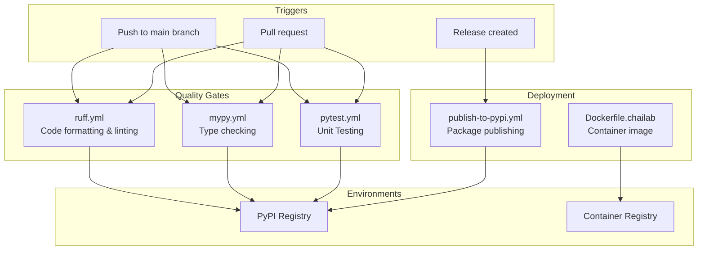
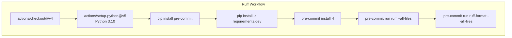
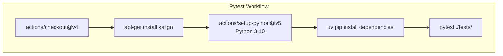
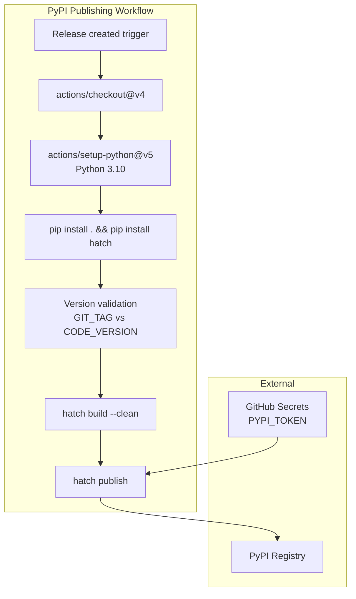
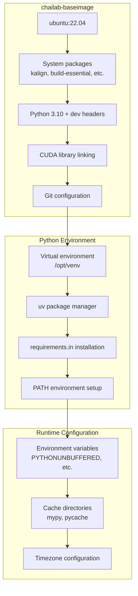
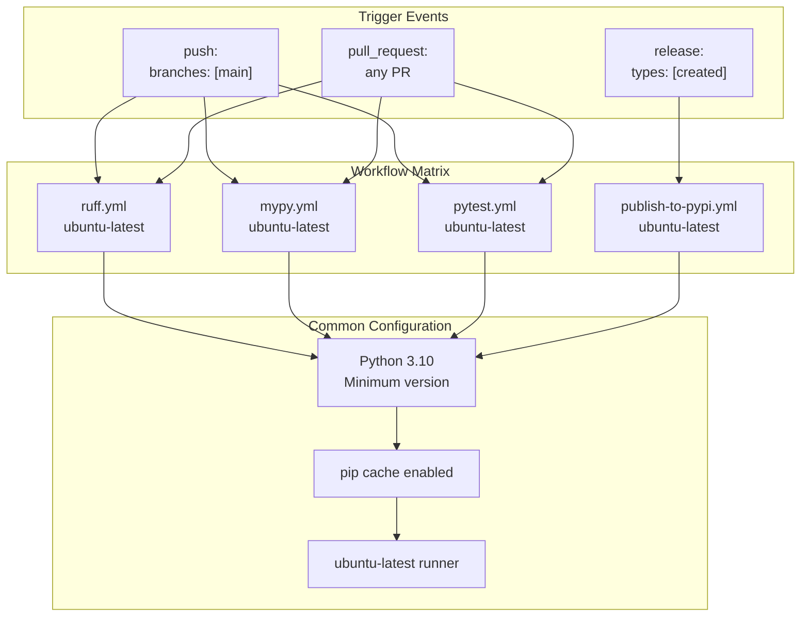

# CI/CD Pipeline

# CI/CD Pipeline

> **Relevant source files**
> - [\.github/workflows/mypy\.yml](https://github.com/chaidiscovery/chai-lab/blob/66c38d1f/.github/workflows/mypy.yml)
> - [\.github/workflows/publish\-to\-pypi\.yml](https://github.com/chaidiscovery/chai-lab/blob/66c38d1f/.github/workflows/publish-to-pypi.yml)
> - [\.github/workflows/pytest\.yml](https://github.com/chaidiscovery/chai-lab/blob/66c38d1f/.github/workflows/pytest.yml)
> - [\.github/workflows/ruff\.yml](https://github.com/chaidiscovery/chai-lab/blob/66c38d1f/.github/workflows/ruff.yml)
> - [\.pre\-commit\-config\.yaml](https://github.com/chaidiscovery/chai-lab/blob/66c38d1f/.pre-commit-config.yaml)
> - [Dockerfile\.chailab](https://github.com/chaidiscovery/chai-lab/blob/66c38d1f/Dockerfile.chailab)
> - [pyproject\.toml](https://github.com/chaidiscovery/chai-lab/blob/66c38d1f/pyproject.toml)
> - [tests/test\_kalign\.py](https://github.com/chaidiscovery/chai-lab/blob/66c38d1f/tests/test_kalign.py)

 This document describes the continuous integration and continuous deployment \(CI/CD\) infrastructure for the chai\-lab repository\. The CI/CD pipeline ensures code quality, type safety, and automated deployment through GitHub Actions workflows and Docker containerization\.

 For information about the testing framework that integrates with these CI/CD processes, see [Testing Framework](https://deepwiki.com/chaidiscovery/chai-lab/9.2-testing-framework)\.

## Pipeline Overview

 The chai\-lab CI/CD pipeline consists of five main components: code quality checks, type checking, automated unit testing, automated PyPI publishing, and Docker containerization\. All workflows are triggered by pushes to the main branch and pull requests\.

 **CI/CD Pipeline Architecture**

 Sources: [\.github/workflows/ruff\.yml](https://github.com/chaidiscovery/chai-lab/blob/66c38d1f/.github/workflows/ruff.yml) [\.github/workflows/mypy\.yml](https://github.com/chaidiscovery/chai-lab/blob/66c38d1f/.github/workflows/mypy.yml) [\.github/workflows/pytest\.yml](https://github.com/chaidiscovery/chai-lab/blob/66c38d1f/.github/workflows/pytest.yml) [\.github/workflows/publish\-to\-pypi\.yml](https://github.com/chaidiscovery/chai-lab/blob/66c38d1f/.github/workflows/publish-to-pypi.yml) [Dockerfile\.chailab](https://github.com/chaidiscovery/chai-lab/blob/66c38d1f/Dockerfile.chailab)

## Code Quality Checks

 The `ruff` workflow enforces code formatting and linting standards across the entire codebase\. It runs on every push to main and every pull request using pre\-commit hooks\.

 **Ruff Workflow Process**

 The workflow executes the following key steps:

| Step | Command | Purpose |
| --- | --- | --- |
| Setup | pip install pre\-commit | Install pre\-commit framework |
| Dependencies | pip install \-r requirements\.dev | Install development dependencies |
| Configuration | pre\-commit install \-f | Configure pre\-commit hooks |
| Linting | pre\-commit run ruff \-\-all\-files | Run code linting checks via ruff |
| Formatting | pre\-commit run ruff\-format \-\-all\-files | Verify code formatting via ruff\-format |

 Sources: [ruff\.yml L20-L28](https://github.com/chaidiscovery/chai-lab/blob/66c38d1f/.github/workflows/ruff.yml#L20-L28) [\.pre\-commit\-config\.yaml L3-L10](https://github.com/chaidiscovery/chai-lab/blob/66c38d1f/.pre-commit-config.yaml#L3-L10)

## Type Checking

 The `mypy` workflow performs static type checking to ensure type safety across the codebase\. It installs dependencies efficiently by separating PyTorch installation from other requirements and uses `uv` for speed\.

 **MyPy Workflow Process**

```mermaid
flowchart TD

Checkout["actions/checkout@v4"]
SetupPython["actions/setup-python@v5<br>Python 3.10"]
InstallTorch["pip install torch (CPU-only)"]
InstallUV["pip install uv"]
InstallRequirements["uv pip install requirements"]
InstallDevRequirements["uv pip install requirements.dev"]
InstallPackage["uv pip install --no-deps -e ."]
RunMypy["mypy ."]

subgraph mypy_workflow ["MyPy Workflow"]
    Checkout
    SetupPython
    InstallTorch
    InstallUV
    InstallRequirements
    InstallDevRequirements
    InstallPackage
    RunMypy
    Checkout --> SetupPython
    SetupPython --> InstallTorch
    InstallTorch --> InstallUV
    InstallUV --> InstallRequirements
    InstallRequirements --> InstallDevRequirements
    InstallDevRequirements --> InstallPackage
    InstallPackage --> RunMypy
end
```

 The workflow uses a sophisticated dependency installation strategy:

 - **PyTorch CPU\-only**: [mypy\.yml L23](https://github.com/chaidiscovery/chai-lab/blob/66c38d1f/.github/workflows/mypy.yml#L23-L23) installs PyTorch from the CPU\-only index to avoid large GPU dependencies\.
- **Filtered requirements**: [mypy\.yml L25](https://github.com/chaidiscovery/chai-lab/blob/66c38d1f/.github/workflows/mypy.yml#L25-L25) excludes `nvidia` and `torch` packages during main installation to optimize runner time\.
- **Mypy Configuration**: Mypy is configured in `pyproject.toml` to check untyped definitions [\.tool\.mypy L26](https://github.com/chaidiscovery/chai-lab/blob/66c38d1f/.tool.mypy#L26-L26) and ignore missing imports for specific external packages like `rdkit`, `scipy`, and `modelcif` [\.tool\.mypy L29-L51](https://github.com/chaidiscovery/chai-lab/blob/66c38d1f/.tool.mypy#L29-L51)

 Sources: [mypy\.yml L21-L29](https://github.com/chaidiscovery/chai-lab/blob/66c38d1f/.github/workflows/mypy.yml#L21-L29) [pyproject\.toml L25-L51](https://github.com/chaidiscovery/chai-lab/blob/66c38d1f/pyproject.toml#L25-L51)

## Automated Testing

 The `pytest` workflow ensures functional correctness by running the test suite on every change\.

 **Pytest Workflow Process**

 The workflow specifically installs `kalign` [pytest\.yml L15](https://github.com/chaidiscovery/chai-lab/blob/66c38d1f/.github/workflows/pytest.yml#L15-L15) which is required for structural template alignment tests like `test_all_matches` in `tests/test_kalign.py` [test\_kalign\.py L8-L17](https://github.com/chaidiscovery/chai-lab/blob/66c38d1f/tests/test_kalign.py#L8-L17)

 Sources: [pytest\.yml L10-L30](https://github.com/chaidiscovery/chai-lab/blob/66c38d1f/.github/workflows/pytest.yml#L10-L30) [test\_kalign\.py L1-L17](https://github.com/chaidiscovery/chai-lab/blob/66c38d1f/tests/test_kalign.py#L1-L17)

## Release Pipeline

 The PyPI publishing workflow automatically deploys new versions when GitHub releases are created\. It includes version validation to ensure consistency between git tags and package versions\.

 **PyPI Publishing Workflow**

 The version validation process [publish\-to\-pypi\.yml L22-L29](https://github.com/chaidiscovery/chai-lab/blob/66c38d1f/.github/workflows/publish-to-pypi.yml#L22-L29) ensures that:

 - `GIT_TAG` matches the git tag from the release\.
- `CODE_VERSION` matches the version defined in `chai_lab/__init__.py` \(managed by `hatch version` [\.tool\.hatch\.version L19](https://github.com/chaidiscovery/chai-lab/blob/66c38d1f/.tool.hatch.version#L19-L19)\)\.
- The workflow fails if versions don't match\.

 Authentication uses the `PYPI_TOKEN` secret with the `__token__` username [publish\-to\-pypi\.yml L32-L33](https://github.com/chaidiscovery/chai-lab/blob/66c38d1f/.github/workflows/publish-to-pypi.yml#L32-L33)

 Sources: [publish\-to\-pypi\.yml L1-L35](https://github.com/chaidiscovery/chai-lab/blob/66c38d1f/.github/workflows/publish-to-pypi.yml#L1-L35) [pyproject\.toml L18-L19](https://github.com/chaidiscovery/chai-lab/blob/66c38d1f/pyproject.toml#L18-L19)

## Containerization

 The Docker configuration provides a complete runtime environment for chai\-lab with all necessary dependencies and system tools\.

 **Docker Build Architecture**

 Key Docker configuration elements:

| Component | Configuration | Purpose |
| --- | --- | --- |
| Base Image | ubuntu:22\.04 | Stable Linux foundation |
| Python | python3\.10 \+ python3\.10\-dev | Runtime and development headers |
| Package Manager | uv | Fast Python package installation |
| Virtual Environment | /opt/venv | Isolated Python environment |
| System Tools | kalign, build\-essential | Template alignment and compilation |
| CUDA | Soft\-linked libraries | GPU computation support |

 Environment variables are configured for optimal Python execution:

 - `PYTHONUNBUFFERED=TRUE` [Dockerfile\.chailab L13](https://github.com/chaidiscovery/chai-lab/blob/66c38d1f/Dockerfile.chailab#L13-L13) for immediate output\.
- `PYTHONFAULTHANDLER=1` [Dockerfile\.chailab L15](https://github.com/chaidiscovery/chai-lab/blob/66c38d1f/Dockerfile.chailab#L15-L15) for better debugging of segfaults\.
- `PYTHONPYCACHEPREFIX='/tmp/.chai_lab_pycache'` [Dockerfile\.chailab L17](https://github.com/chaidiscovery/chai-lab/blob/66c38d1f/Dockerfile.chailab#L17-L17) for clean cache management\.
- `MYPY_CACHE_DIR='/tmp/.chai_lab_mypy_cache'` [Dockerfile\.chailab L11](https://github.com/chaidiscovery/chai-lab/blob/66c38d1f/Dockerfile.chailab#L11-L11) to keep the working tree clean\.

 Sources: [Dockerfile\.chailab L1-L85](https://github.com/chaidiscovery/chai-lab/blob/66c38d1f/Dockerfile.chailab#L1-L85)

## Workflow Triggers and Conditions

 All CI/CD workflows share consistent trigger patterns and Python version requirements:

 **Trigger Configuration**

 All workflows use Python 3\.10 as the minimum version [ruff\.yml L18](https://github.com/chaidiscovery/chai-lab/blob/66c38d1f/.github/workflows/ruff.yml#L18-L18) [mypy\.yml L18](https://github.com/chaidiscovery/chai-lab/blob/66c38d1f/.github/workflows/mypy.yml#L18-L18) [publish\-to\-pypi\.yml L18](https://github.com/chaidiscovery/chai-lab/blob/66c38d1f/.github/workflows/publish-to-pypi.yml#L18-L18) with the rationale that "later versions should maintain backwards\-compatibility" [publish\-to\-pypi\.yml L17](https://github.com/chaidiscovery/chai-lab/blob/66c38d1f/.github/workflows/publish-to-pypi.yml#L17-L17)

 The `pip` cache is enabled in development workflows [ruff\.yml L19](https://github.com/chaidiscovery/chai-lab/blob/66c38d1f/.github/workflows/ruff.yml#L19-L19) [mypy\.yml L19](https://github.com/chaidiscovery/chai-lab/blob/66c38d1f/.github/workflows/mypy.yml#L19-L19) to speed up dependency installation during CI runs\.

 Sources: [ruff\.yml L2-L8](https://github.com/chaidiscovery/chai-lab/blob/66c38d1f/.github/workflows/ruff.yml#L2-L8) [mypy\.yml L2-L8](https://github.com/chaidiscovery/chai-lab/blob/66c38d1f/.github/workflows/mypy.yml#L2-L8) [pytest\.yml L2-L8](https://github.com/chaidiscovery/chai-lab/blob/66c38d1f/.github/workflows/pytest.yml#L2-L8) [publish\-to\-pypi\.yml L3-L5](https://github.com/chaidiscovery/chai-lab/blob/66c38d1f/.github/workflows/publish-to-pypi.yml#L3-L5)

---
*Source: [https://deepwiki.com/chaidiscovery/chai-lab/9.3-cicd-pipeline](https://deepwiki.com/chaidiscovery/chai-lab/9.3-cicd-pipeline) on DeepWiki*