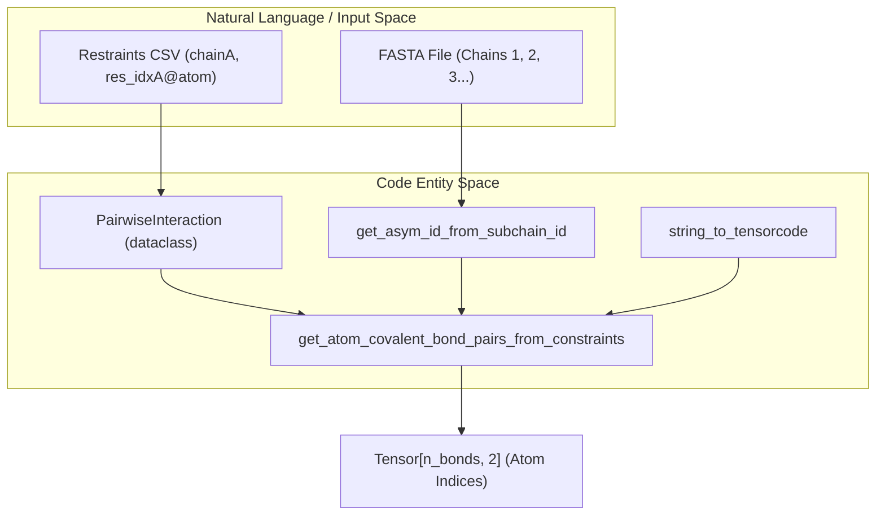
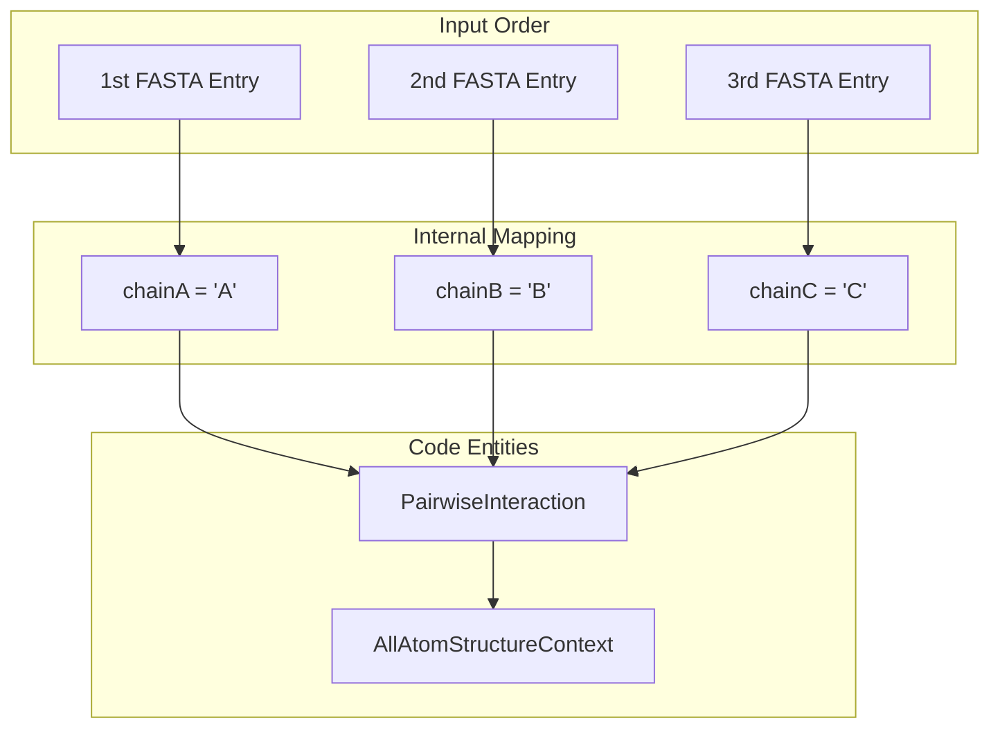

# Custom Restraints

# Custom Restraints

> **Relevant source files**
> - [chai\_lab/data/dataset/structure/bond\_utils\.py](https://github.com/chaidiscovery/chai-lab/blob/66c38d1f/chai_lab/data/dataset/structure/bond_utils.py)
> - [chai\_lab/main\.py](https://github.com/chaidiscovery/chai-lab/blob/66c38d1f/chai_lab/main.py)
> - [examples/covalent\_bonds/1ac5\.fasta](https://github.com/chaidiscovery/chai-lab/blob/66c38d1f/examples/covalent_bonds/1ac5.fasta)
> - [examples/covalent\_bonds/1ac5\.restraints](https://github.com/chaidiscovery/chai-lab/blob/66c38d1f/examples/covalent_bonds/1ac5.restraints)
> - [examples/covalent\_bonds/8cyo\.fasta](https://github.com/chaidiscovery/chai-lab/blob/66c38d1f/examples/covalent_bonds/8cyo.fasta)
> - [examples/covalent\_bonds/8cyo\.restraints](https://github.com/chaidiscovery/chai-lab/blob/66c38d1f/examples/covalent_bonds/8cyo.restraints)
> - [examples/covalent\_bonds/README\.md](https://github.com/chaidiscovery/chai-lab/blob/66c38d1f/examples/covalent_bonds/README.md?plain=1)
> - [examples/covalent\_bonds/non\_glycan\_output\.png](https://github.com/chaidiscovery/chai-lab/blob/66c38d1f/examples/covalent_bonds/non_glycan_output.png)
> - [examples/covalent\_bonds/output\.png](https://github.com/chaidiscovery/chai-lab/blob/66c38d1f/examples/covalent_bonds/output.png)
> - [examples/restraints/README\.md](https://github.com/chaidiscovery/chai-lab/blob/66c38d1f/examples/restraints/README.md?plain=1)
> - [examples/restraints/contact\.restraints](https://github.com/chaidiscovery/chai-lab/blob/66c38d1f/examples/restraints/contact.restraints)
> - [examples/restraints/pocket\.restraints](https://github.com/chaidiscovery/chai-lab/blob/66c38d1f/examples/restraints/pocket.restraints)
> - [examples/restraints/predict\_with\_restraints\.py](https://github.com/chaidiscovery/chai-lab/blob/66c38d1f/examples/restraints/predict_with_restraints.py)

 This document covers the advanced usage of custom restraints in Chai\-1, including detailed file format specifications, integration patterns, and practical examples for guiding structure prediction\. For general information about the restraints system and its role in the inference pipeline, see [Restraints and Constraints](https://deepwiki.com/chaidiscovery/chai-lab/5.4-restraints-and-constraints)\.

## Purpose and Scope

 Custom restraints allow users to provide domain\-specific knowledge to guide Chai\-1's structure prediction by specifying inter\-chain contacts, pockets, and covalent linkages\. This advanced feature enables incorporation of experimental data, known binding sites, or non\-canonical covalent modifications directly into the folding process\. The system supports residue\-level contacts, broader chain\-level pocket interactions, and specific atom\-to\-atom covalent bonds\.

## Restraint File Format

### CSV Structure

 Custom restraints are specified in CSV format with the following required columns:

| Column | Description | Required | Example |
| --- | --- | --- | --- |
| restraint\_id | Unique identifier for each restraint | Yes | restraint0 |
| chainA | First chain identifier \(A\-Z\) | Yes | A |
| res\_idxA | Residue and 1\-based index for chainA | Contact/Covalent only | R84 |
| chainB | Second chain identifier \(A\-Z\) | Yes | C |
| res\_idxB | Residue and 1\-based index for chainB | Yes | G7 |
| connection\_type | Type: contact, pocket, or covalent | Yes | contact |
| confidence | Confidence score \(0\.0\-1\.0\) | Yes | 1\.0 |
| min\_distance\_angstrom | Minimum distance constraint | Yes | 0\.0 |
| max\_distance\_angstrom | Maximum distance constraint | Yes | 22\.0 |
| comment | User annotation \(ignored by model\) | No | toy example |

### Restraint Types

#### Contact Restraints

 Contact restraints specify precise residue\-to\-residue interactions between two chains\. Both `res_idxA` and `res_idxB` must be specified with the residue type and 1\-based position\. The model uses the upper bound \(`max_distance_angstrom`\) to guide folding [README\.md?plain=1 L14](https://github.com/chaidiscovery/chai-lab/blob/66c38d1f/examples/restraints/README.md?plain=1#L14-L14)

```
restraint_id,chainA,res_idxA,chainB,res_idxB,connection_type,confidence,min_distance_angstrom,max_distance_angstrom,commentrestraint0,A,R84,C,G7,contact,1.0,0.0,22.0,specific residue contact
```

#### Pocket Restraints

 Pocket restraints define interactions between any residue in one chain and a specific residue in another chain\. The `res_idxA` field is left empty to indicate this asymmetric relationship [README\.md?plain=1 L16](https://github.com/chaidiscovery/chai-lab/blob/66c38d1f/examples/restraints/README.md?plain=1#L16-L16)

```
restraint_id,chainA,res_idxA,chainB,res_idxB,connection_type,confidence,min_distance_angstrom,max_distance_angstrom,commentrestraint1,C,,A,S18,pocket,1.0,0.0,11.0,chain-to-residue interaction
```

#### Covalent Bonds

 Covalent restraints specify a chemical bond between two specific atoms\. For these, atom names must be provided using the `@` suffix in the `res_idx` columns \(e\.g\., `N437@N`\)\. These are used to model protein\-ligand bonds or protein\-glycan linkages [README\.md?plain=1 L27-L29](https://github.com/chaidiscovery/chai-lab/blob/66c38d1f/examples/covalent_bonds/README.md?plain=1#L27-L29)

```
chainA,res_idxA,chainB,res_idxB,connection_type,confidence,min_distance_angstrom,max_distance_angstrom,comment,restraint_idA,N437@N,B,@C1,covalent,1.0,0.0,0.0,protein-glycan,bond1
```

 Sources: [README\.md?plain=1 L7-L25](https://github.com/chaidiscovery/chai-lab/blob/66c38d1f/examples/restraints/README.md?plain=1#L7-L25) [README\.md?plain=1 L25-L30](https://github.com/chaidiscovery/chai-lab/blob/66c38d1f/examples/covalent_bonds/README.md?plain=1#L25-L30) [bond\_utils\.py L36-L39](https://github.com/chaidiscovery/chai-lab/blob/66c38d1f/chai_lab/data/dataset/structure/bond_utils.py#L36-L39)

## Covalent Bond Implementation

### Data Flow and Logic

 Covalent bonds specified in restraints are converted into atom\-index pairs by `get_atom_covalent_bond_pairs_from_constraints` [bond\_utils\.py L22-L30](https://github.com/chaidiscovery/chai-lab/blob/66c38d1f/chai_lab/data/dataset/structure/bond_utils.py#L22-L30) This function maps the user\-provided chain letters \(A, B, C\) to internal `asym_id` values and identifies specific atoms by their reference names [bond\_utils\.py L41-L52](https://github.com/chaidiscovery/chai-lab/blob/66c38d1f/chai_lab/data/dataset/structure/bond_utils.py#L41-L52)



### Glycan Bond Specification

 Chai\-1 supports a specialized syntax for intra\-glycan bonds directly in the FASTA header, such as `NAG(4-1 NAG)` [README\.md?plain=1 L34-L43](https://github.com/chaidiscovery/chai-lab/blob/66c38d1f/examples/covalent_bonds/README.md?plain=1#L34-L43) These are parsed by `get_atom_covalent_bond_pairs_from_glycan_string` [bond\_utils\.py L137-L142](https://github.com/chaidiscovery/chai-lab/blob/66c38d1f/chai_lab/data/dataset/structure/bond_utils.py#L137-L142)

 Sources: [bond\_utils\.py L22-L133](https://github.com/chaidiscovery/chai-lab/blob/66c38d1f/chai_lab/data/dataset/structure/bond_utils.py#L22-L133) [README\.md?plain=1 L34-L43](https://github.com/chaidiscovery/chai-lab/blob/66c38d1f/examples/covalent_bonds/README.md?plain=1#L34-L43)

## Restraint Processing Pipeline

### Chain Identifier Mapping

 Chain identifiers \(`chainA`, `chainB`\) are assigned alphabetically based on the order chains appear in the input FASTA file\. The first chain becomes `A`, the second becomes `B`, and so on [README\.md?plain=1 L20-L21](https://github.com/chaidiscovery/chai-lab/blob/66c38d1f/examples/restraints/README.md?plain=1#L20-L21)



 Sources: [README\.md?plain=1 L20-L21](https://github.com/chaidiscovery/chai-lab/blob/66c38d1f/examples/restraints/README.md?plain=1#L20-L21) [bond\_utils\.py L41-L45](https://github.com/chaidiscovery/chai-lab/blob/66c38d1f/chai_lab/data/dataset/structure/bond_utils.py#L41-L45)

## Practical Examples

### Using the Python API

 Restraints are passed to `run_inference` via the `constraint_path` parameter [predict\_with\_restraints\.py L25-L35](https://github.com/chaidiscovery/chai-lab/blob/66c38d1f/examples/restraints/predict_with_restraints.py#L25-L35)

```python
from chai_lab.chai1 import run_inferencefrom pathlib import Path candidates = run_inference(    fasta_file=Path("input.fasta"),    output_dir=Path("outputs"),    constraint_path=Path("restraints.csv"),    num_trunk_recycles=3,    num_diffn_timesteps=200,    device="cuda:0")
```

### Performance Impact \(7SYZ\)

| Interface | No Restraints | Contact Restraints | Pocket Restraints |
| --- | --- | --- | --- |
| antibody\-light | 0\.020 | 0\.400 | 0\.273 |
| antibody\-heavy | 0\.011 | 0\.274 | 0\.204 |
| heavy\-light | 0\.789 | 0\.712 | 0\.719 |

 Sources: [README\.md?plain=1 L26-L36](https://github.com/chaidiscovery/chai-lab/blob/66c38d1f/examples/restraints/README.md?plain=1#L26-L36) [predict\_with\_restraints\.py L25-L35](https://github.com/chaidiscovery/chai-lab/blob/66c38d1f/examples/restraints/predict_with_restraints.py#L25-L35)

## Best Practices

### Residue and Atom Validation

 - **Redundancy**: The `res_idx` field expects a concatenation of residue type and 1\-based index \(e\.g\., `D4`\)\. The code checks this against the input sequence to prevent indexing errors [README\.md?plain=1 L19](https://github.com/chaidiscovery/chai-lab/blob/66c38d1f/examples/restraints/README.md?plain=1#L19-L19)
- **Atom Names**: For covalent bonds, atom names must match those assigned by RDKit or standard CCD codes\. For sugar rings, use `@C1`, `@N`, etc [README\.md?plain=1 L29](https://github.com/chaidiscovery/chai-lab/blob/66c38d1f/examples/covalent_bonds/README.md?plain=1#L29-L29)
- **Leaving Atoms**: Chai\-1 automatically attempts to drop hydroxyl "leaving atoms" in glycans when bonds are formed via `AllAtomStructureContext.drop_glycan_leaving_atoms_inplace` [README\.md?plain=1 L78](https://github.com/chaidiscovery/chai-lab/blob/66c38d1f/examples/covalent_bonds/README.md?plain=1#L78-L78)

### Unused Fields

 Currently, `confidence` and `min_distance_angstrom` are not used by the model but are included in the CSV format for future\-proofing [README\.md?plain=1 L24](https://github.com/chaidiscovery/chai-lab/blob/66c38d1f/examples/restraints/README.md?plain=1#L24-L24)

 Sources: [README\.md?plain=1 L18-L25](https://github.com/chaidiscovery/chai-lab/blob/66c38d1f/examples/restraints/README.md?plain=1#L18-L25) [README\.md?plain=1 L78](https://github.com/chaidiscovery/chai-lab/blob/66c38d1f/examples/covalent_bonds/README.md?plain=1#L78-L78)

---
*Source: [https://deepwiki.com/chaidiscovery/chai-lab/7.2-custom-restraints](https://deepwiki.com/chaidiscovery/chai-lab/7.2-custom-restraints) on DeepWiki*