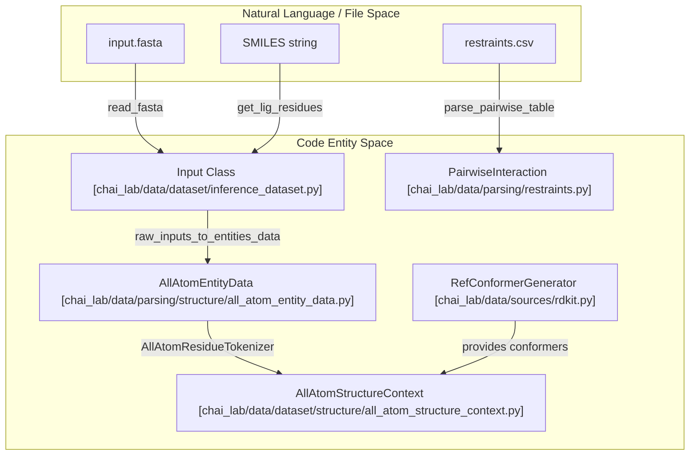
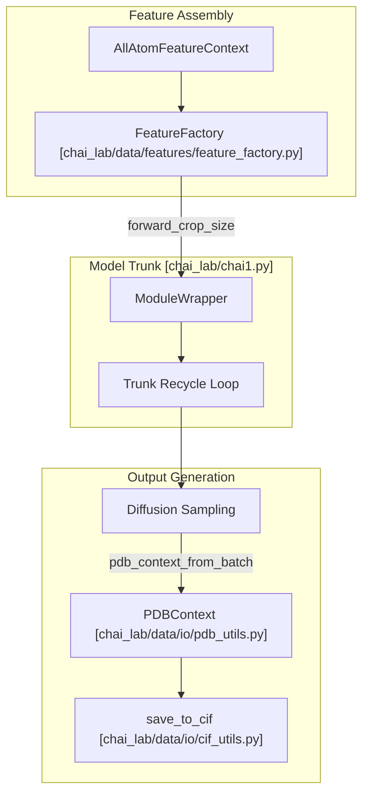

# Glossary

# Glossary

> **Relevant source files**
> - [README\.md](https://github.com/chaidiscovery/chai-lab/blob/66c38d1f/README.md?plain=1)
> - [chai\_lab/chai1\.py](https://github.com/chaidiscovery/chai-lab/blob/66c38d1f/chai_lab/chai1.py)
> - [chai\_lab/data/dataset/inference\_dataset\.py](https://github.com/chaidiscovery/chai-lab/blob/66c38d1f/chai_lab/data/dataset/inference_dataset.py)
> - [chai\_lab/data/dataset/msas/colabfold\.py](https://github.com/chaidiscovery/chai-lab/blob/66c38d1f/chai_lab/data/dataset/msas/colabfold.py)
> - [chai\_lab/data/dataset/msas/utils\.py](https://github.com/chaidiscovery/chai-lab/blob/66c38d1f/chai_lab/data/dataset/msas/utils.py)
> - [chai\_lab/data/io/cif\_utils\.py](https://github.com/chaidiscovery/chai-lab/blob/66c38d1f/chai_lab/data/io/cif_utils.py)
> - [chai\_lab/data/io/pdb\_utils\.py](https://github.com/chaidiscovery/chai-lab/blob/66c38d1f/chai_lab/data/io/pdb_utils.py)
> - [chai\_lab/data/parsing/msas/aligned\_pqt\.py](https://github.com/chaidiscovery/chai-lab/blob/66c38d1f/chai_lab/data/parsing/msas/aligned_pqt.py)
> - [chai\_lab/data/parsing/restraints\.py](https://github.com/chaidiscovery/chai-lab/blob/66c38d1f/chai_lab/data/parsing/restraints.py)
> - [chai\_lab/data/parsing/templates/m8\.py](https://github.com/chaidiscovery/chai-lab/blob/66c38d1f/chai_lab/data/parsing/templates/m8.py)
> - [chai\_lab/data/residue\_constants\.py](https://github.com/chaidiscovery/chai-lab/blob/66c38d1f/chai_lab/data/residue_constants.py)
> - [chai\_lab/data/sources/rdkit\.py](https://github.com/chaidiscovery/chai-lab/blob/66c38d1f/chai_lab/data/sources/rdkit.py)
> - [examples/msas/predict\_with\_msas\.py](https://github.com/chaidiscovery/chai-lab/blob/66c38d1f/examples/msas/predict_with_msas.py)
> - [tests/test\_cif\_utils\.py](https://github.com/chaidiscovery/chai-lab/blob/66c38d1f/tests/test_cif_utils.py)
> - [tests/test\_inference\_dataset\.py](https://github.com/chaidiscovery/chai-lab/blob/66c38d1f/tests/test_inference_dataset.py)
> - [tests/test\_rdkit\.py](https://github.com/chaidiscovery/chai-lab/blob/66c38d1f/tests/test_rdkit.py)
> - [tests/test\_restraints\.py](https://github.com/chaidiscovery/chai-lab/blob/66c38d1f/tests/test_restraints.py)

 This glossary defines technical terms, internal data structures, and algorithmic concepts used throughout the Chai\-1 codebase\. It serves as a reference for engineers to map biological and mathematical concepts to their specific implementations in the `chai-lab` repository\.

## Core Model Concepts

### Trunk Recycling

 A technique where the model's trunk \(the main representation\-learning component\) is executed multiple times, with the outputs of one pass used as inputs for the next\. This allows the model to refine its internal representation before passing it to the diffusion head\.

 - **Implementation**: Controlled in the inference loop within `run_folding_on_context` [chai1\.py L1078-L1091](https://github.com/chaidiscovery/chai-lab/blob/66c38d1f/chai_lab/chai1.py#L1078-L1091)
- **Sources**: [chai1\.py L1078-L1091](https://github.com/chaidiscovery/chai-lab/blob/66c38d1f/chai_lab/chai1.py#L1078-L1091)

### Diffusion Loop

 The process of iteratively denoising 3D coordinates from a random distribution to a structured molecular conformation\. Chai\-1 uses a specific noise schedule for this process\.

 - **Implementation**: `InferenceNoiseSchedule` [diffusion\_schedules\.py L101](https://github.com/chaidiscovery/chai-lab/blob/66c38d1f/chai_lab/model/diffusion_schedules.py#L101-L101) is used within the sampling loop in `run_folding_on_context` [chai1\.py L1093-L1135](https://github.com/chaidiscovery/chai-lab/blob/66c38d1f/chai_lab/chai1.py#L1093-L1135)
- **Sources**: [chai1\.py L101-L1135](https://github.com/chaidiscovery/chai-lab/blob/66c38d1f/chai_lab/chai1.py#L101-L1135)

### Confidence Scoring \(pLDDT, PAE, PDE\)

 Metrics used to estimate the quality of the predicted structure\.

 - **pLDDT**: Predicted Local Distance Difference Test\. Measures local confidence at the residue/token level\.
- **PAE**: Predicted Aligned Error\. Estimates the error in the relative position of two residues\.
- **PDE**: Predicted Distance Error\.
- **Implementation**: Calculated in `get_scores` and `rank` [rank\.py L104](https://github.com/chaidiscovery/chai-lab/blob/66c38d1f/chai_lab/ranking/rank.py#L104-L104)
- **Sources**: [chai1\.py L104](https://github.com/chaidiscovery/chai-lab/blob/66c38d1f/chai_lab/chai1.py#L104-L104)

## Data Structures & Entities

### AllAtomFeatureContext

 The primary "hub" object that aggregates all features required for model inference, including sequence information, MSAs, templates, and restraints\.

 - **Implementation**: `AllAtomFeatureContext` [all\_atom\_feature\_context\.py L26](https://github.com/chaidiscovery/chai-lab/blob/66c38d1f/chai_lab/data/dataset/all_atom_feature_context.py#L26-L26)
- **Sources**: [chai1\.py L26-L27](https://github.com/chaidiscovery/chai-lab/blob/66c38d1f/chai_lab/chai1.py#L26-L27)

### AllAtomStructureContext

 Represents the structural state of a complex, including 3D coordinates, atom types, and bonding information\. It is often merged from multiple `Chain` objects\.

 - **Implementation**: `AllAtomStructureContext` [all\_atom\_structure\_context\.py L41](https://github.com/chaidiscovery/chai-lab/blob/66c38d1f/chai_lab/data/dataset/structure/all_atom_structure_context.py#L41-L41)
- **Key Method**: `merge` [test\_inference\_dataset\.py L80-L82](https://github.com/chaidiscovery/chai-lab/blob/66c38d1f/tests/test_inference_dataset.py#L80-L82) combines multiple chains into a single context\.
- **Sources**: [chai1\.py L41-L43](https://github.com/chaidiscovery/chai-lab/blob/66c38d1f/chai_lab/chai1.py#L41-L43) [test\_inference\_dataset\.py L80-L82](https://github.com/chaidiscovery/chai-lab/blob/66c38d1f/tests/test_inference_dataset.py#L80-L82)

### PDBContext

 A tensor\-based representation of a molecular complex used specifically for I/O operations and PDB/CIF generation\.

 - **Implementation**: `PDBContext` [pdb\_utils\.py L19-L31](https://github.com/chaidiscovery/chai-lab/blob/66c38d1f/chai_lab/data/io/pdb_utils.py#L19-L31)
- **Data Flow**: Converted from model output batches via `pdb_context_from_batch` [pdb\_utils\.py L48-L63](https://github.com/chaidiscovery/chai-lab/blob/66c38d1f/chai_lab/data/io/pdb_utils.py#L48-L63)
- **Sources**: [pdb\_utils\.py L19-L63](https://github.com/chaidiscovery/chai-lab/blob/66c38d1f/chai_lab/data/io/pdb_utils.py#L19-L63)

### EntityType

 An enumeration defining the types of molecules supported by the system\.

 - **Values**: `PROTEIN`, `RNA`, `DNA`, `LIGAND`, `MANUAL_GLYCAN`\.
- **Implementation**: `EntityType` [entity\_type\.py L100](https://github.com/chaidiscovery/chai-lab/blob/66c38d1f/chai_lab/data/parsing/structure/entity_type.py#L100-L100)
- **Sources**: [chai1\.py L100](https://github.com/chaidiscovery/chai-lab/blob/66c38d1f/chai_lab/chai1.py#L100-L100) [inference\_dataset\.py L108-L127](https://github.com/chaidiscovery/chai-lab/blob/66c38d1f/chai_lab/data/dataset/inference_dataset.py#L108-L127)

## Data Formats & I/O

### \.aligned\.pqt \(Aligned Parquet\)

 A specialized Parquet format used by Chai\-1 to store Multiple Sequence Alignments \(MSAs\)\. It includes metadata like `source_database` and `pairing_key` \(often a taxonomic ID\) to facilitate cross\-chain MSA pairing\.

 - **Implementation**: `AlignedParquetModel` [aligned\_pqt\.py L37-L44](https://github.com/chaidiscovery/chai-lab/blob/66c38d1f/chai_lab/data/parsing/msas/aligned_pqt.py#L37-L44)
- **Parsing**: `parse_aligned_pqt_to_msa_context` [aligned\_pqt\.py L63-L139](https://github.com/chaidiscovery/chai-lab/blob/66c38d1f/chai_lab/data/parsing/msas/aligned_pqt.py#L63-L139)
- **Sources**: [aligned\_pqt\.py L37-L139](https://github.com/chaidiscovery/chai-lab/blob/66c38d1f/chai_lab/data/parsing/msas/aligned_pqt.py#L37-L139)

### \.m8 \(MMseqs2 Alignment Format\)

 A tab\-separated format used to describe template hits found during a sequence search\.

 - **Implementation**: Parsed by `parse_m8_file` [m8\.py L22-L46](https://github.com/chaidiscovery/chai-lab/blob/66c38d1f/chai_lab/data/parsing/templates/m8.py#L22-L46)
- **Sources**: [m8\.py L22-L46](https://github.com/chaidiscovery/chai-lab/blob/66c38d1f/chai_lab/data/parsing/templates/m8.py#L22-L46)

### \.apkl \(Antipickle\)

 A serialization format used for caching conformers\. It is a safer and more robust alternative to standard Python pickles\.

 - **Usage**: Loading cached conformers in `RefConformerGenerator` [rdkit\.py L60-L73](https://github.com/chaidiscovery/chai-lab/blob/66c38d1f/chai_lab/data/sources/rdkit.py#L60-L73)
- **Sources**: [rdkit\.py L60-L73](https://github.com/chaidiscovery/chai-lab/blob/66c38d1f/chai_lab/data/sources/rdkit.py#L60-L73)

## Feature Generation Terms

### MSAContext

 Contains tokenized MSA sequences, deletion counts, and taxonomic pairing information\.

 - **Implementation**: `MSAContext` [msa\_context\.py L37](https://github.com/chaidiscovery/chai-lab/blob/66c38d1f/chai_lab/data/dataset/msas/msa_context.py#L37-L37)
- **Subsampling**: Handled by `subsample_and_reorder_msa_feats_n_mask` [utils\.py L51-L86](https://github.com/chaidiscovery/chai-lab/blob/66c38d1f/chai_lab/data/dataset/msas/utils.py#L51-L86)
- **Sources**: [chai1\.py L37-L40](https://github.com/chaidiscovery/chai-lab/blob/66c38d1f/chai_lab/chai1.py#L37-L40) [utils\.py L51-L86](https://github.com/chaidiscovery/chai-lab/blob/66c38d1f/chai_lab/data/dataset/msas/utils.py#L51-L86)

### RestraintContext

 Encapsulates user\-defined physical constraints \(contacts, pockets, covalent bonds\) that guide the folding process\.

 - **Implementation**: `RestraintContext` [restraint\_context\.py L28](https://github.com/chaidiscovery/chai-lab/blob/66c38d1f/chai_lab/data/dataset/constraints/restraint_context.py#L28-L28)
- **Parsing**: `parse_pairwise_table` [restraints\.py L173-L187](https://github.com/chaidiscovery/chai-lab/blob/66c38d1f/chai_lab/data/parsing/restraints.py#L173-L187)
- **Sources**: [chai1\.py L28-L31](https://github.com/chaidiscovery/chai-lab/blob/66c38d1f/chai_lab/chai1.py#L28-L31) [restraints\.py L173-L187](https://github.com/chaidiscovery/chai-lab/blob/66c38d1f/chai_lab/data/parsing/restraints.py#L173-L187)

### Conformer Data

 Idealized 3D coordinates and metadata \(element, charge, atom names\) for a single residue or ligand, typically generated via RDKit\.

 - **Implementation**: `ConformerData` [residue\.py L21](https://github.com/chaidiscovery/chai-lab/blob/66c38d1f/chai_lab/data/parsing/structure/residue.py#L21-L21)
- **Generation**: `RefConformerGenerator.generate` [rdkit\.py L144-L175](https://github.com/chaidiscovery/chai-lab/blob/66c38d1f/chai_lab/data/sources/rdkit.py#L144-L175) uses `ETKDGv3` for ligands\.
- **Sources**: [rdkit\.py L21-L175](https://github.com/chaidiscovery/chai-lab/blob/66c38d1f/chai_lab/data/sources/rdkit.py#L21-L175)

## System Diagrams

### Data Mapping: Input to Code Entities

 This diagram illustrates how raw user inputs \(FASTA, SMILES\) are transformed into internal code objects\.

 Structure Prediction Input Flow

 **Sources**: [inference\_dataset\.py L39-L177](https://github.com/chaidiscovery/chai-lab/blob/66c38d1f/chai_lab/data/dataset/inference_dataset.py#L39-L177) [rdkit\.py L38-L175](https://github.com/chaidiscovery/chai-lab/blob/66c38d1f/chai_lab/data/sources/rdkit.py#L38-L175) [restraints\.py L173-L187](https://github.com/chaidiscovery/chai-lab/blob/66c38d1f/chai_lab/data/parsing/restraints.py#L173-L187)

### Inference Pipeline: Context to Coordinates

 This diagram shows the flow of data through the model components during a single inference run\.

 Model Execution Data Flow

 **Sources**: [chai1\.py L115-L148](https://github.com/chaidiscovery/chai-lab/blob/66c38d1f/chai_lab/chai1.py#L115-L148) [chai1\.py L1078-L1135](https://github.com/chaidiscovery/chai-lab/blob/66c38d1f/chai_lab/chai1.py#L1078-L1135) [pdb\_utils\.py L48-L63](https://github.com/chaidiscovery/chai-lab/blob/66c38d1f/chai_lab/data/io/pdb_utils.py#L48-L63) [cif\_utils\.py L156-L172](https://github.com/chaidiscovery/chai-lab/blob/66c38d1f/chai_lab/data/io/cif_utils.py#L156-L172)

---
*Source: [https://deepwiki.com/chaidiscovery/chai-lab/10-glossary](https://deepwiki.com/chaidiscovery/chai-lab/10-glossary) on DeepWiki*