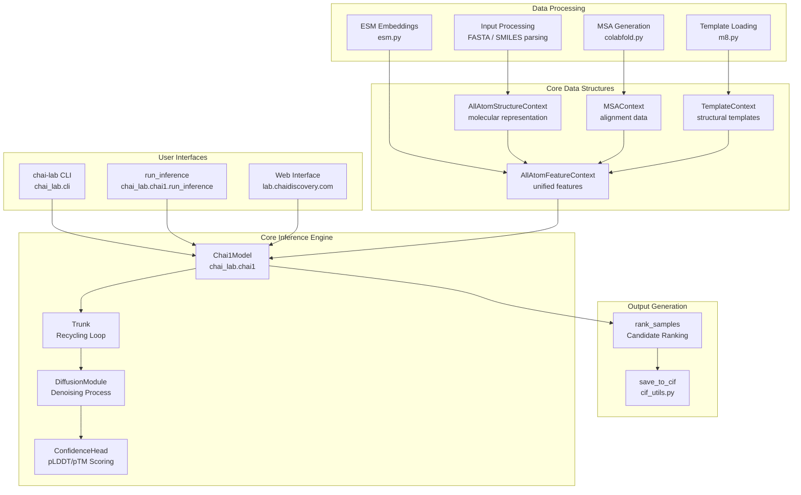
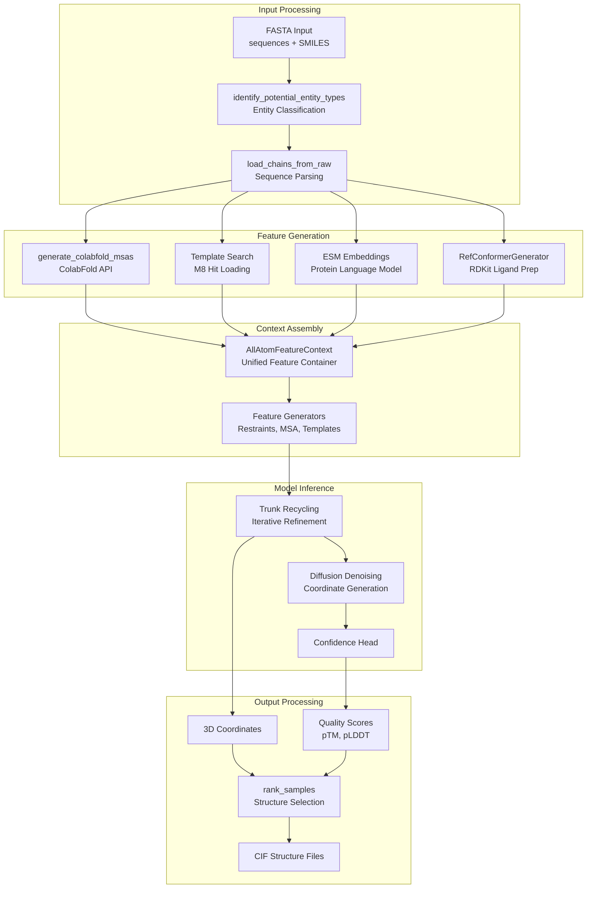

# Overview

# Overview

> **Relevant source files**
> - [LICENSE](https://github.com/chaidiscovery/chai-lab/blob/66c38d1f/LICENSE)
> - [README\.md](https://github.com/chaidiscovery/chai-lab/blob/66c38d1f/README.md?plain=1)
> - [chai\_lab/\_\_init\_\_\.py](https://github.com/chaidiscovery/chai-lab/blob/66c38d1f/chai_lab/__init__.py)
> - [chai\_lab/utils/typing\.py](https://github.com/chaidiscovery/chai-lab/blob/66c38d1f/chai_lab/utils/typing.py)

 This document provides a comprehensive introduction to the chai\-lab repository, which implements the Chai\-1 model for molecular structure prediction\. It covers the system's architecture, core components, and primary interfaces\. For detailed installation instructions, see [Installation and Dependencies](https://deepwiki.com/chaidiscovery/chai-lab/1.2-installation-and-dependencies)\. For step\-by\-step usage guides, see [Getting Started](https://deepwiki.com/chaidiscovery/chai-lab/2-getting-started)\. For deep technical details about specific systems, see [Core Systems](https://deepwiki.com/chaidiscovery/chai-lab/3-core-systems)\.

## Purpose and Scope

 The chai\-lab repository implements Chai\-1, a multi\-modal foundation model for molecular structure prediction that achieves state\-of\-the\-art performance across various benchmarks\. The system enables unified prediction of proteins, small molecules, DNA, RNA, glycosylations, and other molecular entities from sequence inputs [README\.md?plain=1 L1-L9](https://github.com/chaidiscovery/chai-lab/blob/66c38d1f/README.md?plain=1#L1-L9)

## What is Chai\-1?

 Chai\-1 is a transformer\-based diffusion model that predicts 3D molecular structures from sequence information\. The model uses a trunk architecture with recycling and diffusion\-based coordinate generation to produce high\-quality structural predictions [README\.md?plain=1 L23-L38](https://github.com/chaidiscovery/chai-lab/blob/66c38d1f/README.md?plain=1#L23-L38)

### Key Capabilities

| Capability | Description |
| --- | --- |
| Multi\-modal prediction | Proteins, DNA, RNA, small molecules, glycans README\.md3 |
| Enhanced features | MSAs, structural templates, ESM embeddings README\.md32\-34 |
| User constraints | Contact restraints, pocket constraints, covalent bonds README\.md113\-118 |
| Quality scoring | pTM, ipTM, pLDDT confidence metrics README\.md9 |
| Flexible interfaces | CLI, Python API, web server README\.md25\-107 |

 Sources: [README\.md?plain=1 L1-L179](https://github.com/chaidiscovery/chai-lab/blob/66c38d1f/README.md?plain=1#L1-L179)

## System Architecture

 The chai\-lab system consists of several interconnected components that process molecular inputs and generate structural predictions\.

### High\-Level Architecture



 Sources: [README\.md?plain=1 L49-L61](https://github.com/chaidiscovery/chai-lab/blob/66c38d1f/README.md?plain=1#L49-L61) [README\.md?plain=1 L88-L94](https://github.com/chaidiscovery/chai-lab/blob/66c38d1f/README.md?plain=1#L88-L94)

## Core Inference Pipeline

 The Chai\-1 inference pipeline processes molecular inputs through several stages to generate structural predictions\.

### Inference Data Flow



 Sources: [README\.md?plain=1 L49-L61](https://github.com/chaidiscovery/chai-lab/blob/66c38d1f/README.md?plain=1#L49-L61) [README\.md?plain=1 L88-L94](https://github.com/chaidiscovery/chai-lab/blob/66c38d1f/README.md?plain=1#L88-L94)

## Supported Input Types

 Chai\-1 accepts multiple molecular entity types through FASTA format inputs [README\.md?plain=1 L27-L30](https://github.com/chaidiscovery/chai-lab/blob/66c38d1f/README.md?plain=1#L27-L30):

| Entity Type | Input Format | Description |
| --- | --- | --- |
| Proteins | Standard amino acid sequences | Single letter codes, including modified residues |
| DNA | Nucleotide sequences | A, T, G, C nucleotides |
| RNA | Nucleotide sequences | A, U, G, C nucleotides |
| Small molecules | SMILES strings | Chemical structures in SMILES notation |
| Glycans | String representations | Specialized glycan format |

### Enhanced Input Features

 The system supports additional features to improve prediction quality:

 - **MSAs**: Multiple sequence alignments via ColabFold server or custom `.aligned.pqt` files [README\.md?plain=1 L77-L84](https://github.com/chaidiscovery/chai-lab/blob/66c38d1f/README.md?plain=1#L77-L84)
- **Templates**: Structural templates from RCSB PDB or custom structures via `CHAI_TEMPLATE_CIF_FOLDER` [README\.md?plain=1 L97-L103](https://github.com/chaidiscovery/chai-lab/blob/66c38d1f/README.md?plain=1#L97-L103)
- **Restraints**: User\-defined contact constraints and pocket constraints [README\.md?plain=1 L113-L118](https://github.com/chaidiscovery/chai-lab/blob/66c38d1f/README.md?plain=1#L113-L118)
- **Covalent bonds**: Custom covalent bond specifications for branched ligands [README\.md?plain=1 L88-L94](https://github.com/chaidiscovery/chai-lab/blob/66c38d1f/README.md?plain=1#L88-L94)

 Sources: [README\.md?plain=1 L27-L44](https://github.com/chaidiscovery/chai-lab/blob/66c38d1f/README.md?plain=1#L27-L44) [README\.md?plain=1 L77-L84](https://github.com/chaidiscovery/chai-lab/blob/66c38d1f/README.md?plain=1#L77-L84) [README\.md?plain=1 L113-L118](https://github.com/chaidiscovery/chai-lab/blob/66c38d1f/README.md?plain=1#L113-L118)

## Primary Interfaces

### Command Line Interface

 The primary CLI command is `chai-lab fold`, which processes FASTA inputs and generates structural predictions [README\.md?plain=1 L29-L38](https://github.com/chaidiscovery/chai-lab/blob/66c38d1f/README.md?plain=1#L29-L38):

```
chai-lab fold input.fasta output_folderchai-lab fold --use-msa-server --use-templates-server input.fasta output_folder
```

### Python API

 The main programmatic interface is through `chai_lab.chai1.run_inference`, which provides direct access to the inference pipeline [README\.md?plain=1 L49-L54](https://github.com/chaidiscovery/chai-lab/blob/66c38d1f/README.md?plain=1#L49-L54):

```python
from chai_lab.chai1 import run_inference
```

 For advanced use cases, `chai_lab.chai1.run_folding_on_context` allows manual construction of `AllAtomFeatureContext` objects [README\.md?plain=1 L88-L94](https://github.com/chaidiscovery/chai-lab/blob/66c38d1f/README.md?plain=1#L88-L94)

### Web Interface

 A web server is available at `lab.chaidiscovery.com` for browser\-based access to the Chai\-1 model without local installation [README\.md?plain=1 L105-L111](https://github.com/chaidiscovery/chai-lab/blob/66c38d1f/README.md?plain=1#L105-L111)

 Sources: [README\.md?plain=1 L25-L44](https://github.com/chaidiscovery/chai-lab/blob/66c38d1f/README.md?plain=1#L25-L44) [README\.md?plain=1 L49-L61](https://github.com/chaidiscovery/chai-lab/blob/66c38d1f/README.md?plain=1#L49-L61) [README\.md?plain=1 L88-L94](https://github.com/chaidiscovery/chai-lab/blob/66c38d1f/README.md?plain=1#L88-L94) [README\.md?plain=1 L105-L111](https://github.com/chaidiscovery/chai-lab/blob/66c38d1f/README.md?plain=1#L105-L111)

## Hardware Requirements

 Chai\-1 requires a Linux environment with a GPU supporting CUDA and bfloat16 [README\.md?plain=1 L21](https://github.com/chaidiscovery/chai-lab/blob/66c38d1f/README.md?plain=1#L21-L21)

 - **Recommended**: A100 80GB, H100 80GB, or L40S 48GB\.
- **Minimum**: A10 or A30 \(for smaller complexes\)\.
- **Consumer Grade**: RTX 4090 has been reported as compatible by users\.

 Sources: [README\.md?plain=1 L21](https://github.com/chaidiscovery/chai-lab/blob/66c38d1f/README.md?plain=1#L21-L21)

## Output Formats

 The system generates structural predictions in CIF format with associated quality metrics [README\.md?plain=1 L49-L54](https://github.com/chaidiscovery/chai-lab/blob/66c38d1f/README.md?plain=1#L49-L54):

| Output Type | Description |
| --- | --- |
| CIF files | Crystallographic Information File format structures |
| Quality scores | pTM, ipTM, pLDDT confidence metrics |
| Rankings | Ranked candidate structures \(default 5 samples\) |

 By default, the system generates five sample predictions per input, which are ranked by quality scores to identify the best candidates [README\.md?plain=1 L32](https://github.com/chaidiscovery/chai-lab/blob/66c38d1f/README.md?plain=1#L32-L32)

 Sources: [README\.md?plain=1 L32-L38](https://github.com/chaidiscovery/chai-lab/blob/66c38d1f/README.md?plain=1#L32-L38)

## Key Data Structures

 The system uses several core data structures to represent molecular information:

 - **`AllAtomStructureContext`**: Central representation of molecular structure\.
- **`MSAContext`**: Multiple sequence alignment data\.
- **`TemplateContext`**: Structural template information\.
- **`AllAtomFeatureContext`**: Unified feature container for model input\.

 For detailed information about these data structures, see [Data Structures](https://deepwiki.com/chaidiscovery/chai-lab/3.2-data-structures)\. For information about how features are assembled, see [Feature Context Assembly](https://deepwiki.com/chaidiscovery/chai-lab/3.3-feature-context-assembly)\.

 Sources: [README\.md?plain=1 L88-L94](https://github.com/chaidiscovery/chai-lab/blob/66c38d1f/README.md?plain=1#L88-L94)

---
*Source: [https://deepwiki.com/chaidiscovery/chai-lab/1-overview](https://deepwiki.com/chaidiscovery/chai-lab/1-overview) on DeepWiki*