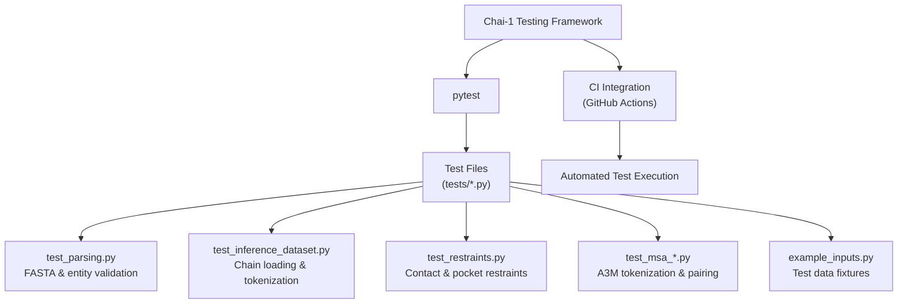
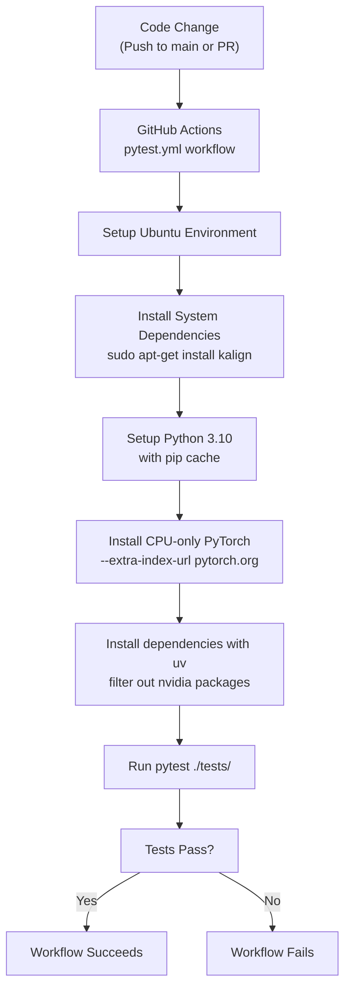

# Testing Framework

# Testing Framework

> **Relevant source files**
> - [\.github/workflows/pytest\.yml](https://github.com/chaidiscovery/chai-lab/blob/66c38d1f/.github/workflows/pytest.yml)
> - [chai\_lab/data/dataset/inference\_dataset\.py](https://github.com/chaidiscovery/chai-lab/blob/66c38d1f/chai_lab/data/dataset/inference_dataset.py)
> - [chai\_lab/data/parsing/input\_validation\.py](https://github.com/chaidiscovery/chai-lab/blob/66c38d1f/chai_lab/data/parsing/input_validation.py)
> - [tests/\_\_init\_\_\.py](https://github.com/chaidiscovery/chai-lab/blob/66c38d1f/tests/__init__.py)
> - [tests/example\_inputs\.py](https://github.com/chaidiscovery/chai-lab/blob/66c38d1f/tests/example_inputs.py)
> - [tests/test\_inference\_dataset\.py](https://github.com/chaidiscovery/chai-lab/blob/66c38d1f/tests/test_inference_dataset.py)
> - [tests/test\_kalign\.py](https://github.com/chaidiscovery/chai-lab/blob/66c38d1f/tests/test_kalign.py)
> - [tests/test\_msa\_a3m\_tokenization\.py](https://github.com/chaidiscovery/chai-lab/blob/66c38d1f/tests/test_msa_a3m_tokenization.py)
> - [tests/test\_msa\_preprocess\.py](https://github.com/chaidiscovery/chai-lab/blob/66c38d1f/tests/test_msa_preprocess.py)
> - [tests/test\_parsing\.py](https://github.com/chaidiscovery/chai-lab/blob/66c38d1f/tests/test_parsing.py)
> - [tests/test\_restraints\.py](https://github.com/chaidiscovery/chai-lab/blob/66c38d1f/tests/test_restraints.py)

 This document outlines the testing infrastructure and practices used in the Chai\-1 molecular structure prediction system\. For information about the type system used in conjunction with testing, see [Type System](https://deepwiki.com/chaidiscovery/chai-lab/9.1-type-system)\.

## Overview

 The Chai\-1 codebase uses pytest as its primary testing framework to verify component functionality and ensure system reliability\. Tests cover input parsing, molecular conformer generation, tool integration, dataset collation, and restraint handling\. All tests are integrated into the development workflow through automated continuous integration processes\.



 Sources: [pytest\.yml L1-L31](https://github.com/chaidiscovery/chai-lab/blob/66c38d1f/.github/workflows/pytest.yml#L1-L31) [test\_parsing\.py L1-L80](https://github.com/chaidiscovery/chai-lab/blob/66c38d1f/tests/test_parsing.py#L1-L80) [test\_inference\_dataset\.py L1-L124](https://github.com/chaidiscovery/chai-lab/blob/66c38d1f/tests/test_inference_dataset.py#L1-L124) [test\_restraints\.py L1-L126](https://github.com/chaidiscovery/chai-lab/blob/66c38d1f/tests/test_restraints.py#L1-L126)

## Test Directory Structure

 Tests are organized in the `tests/` directory at the repository root\. The testing framework follows standard pytest conventions:

 1. Test files follow the naming convention `test_*.py` for automatic discovery\.
2. Each test file focuses on testing a specific component or module\.
3. Test functions use the `test_` prefix naming convention\.
4. Shared test data is organized in helper modules like `example_inputs.py` [example\_inputs\.py L6-L38](https://github.com/chaidiscovery/chai-lab/blob/66c38d1f/tests/example_inputs.py#L6-L38)

  Sources: [test\_parsing\.py L1-L80](https://github.com/chaidiscovery/chai-lab/blob/66c38d1f/tests/test_parsing.py#L1-L80) [test\_inference\_dataset\.py L1-L124](https://github.com/chaidiscovery/chai-lab/blob/66c38d1f/tests/test_inference_dataset.py#L1-L124) [test\_restraints\.py L1-L126](https://github.com/chaidiscovery/chai-lab/blob/66c38d1f/tests/test_restraints.py#L1-L126) [example\_inputs\.py L1-L38](https://github.com/chaidiscovery/chai-lab/blob/66c38d1f/tests/example_inputs.py#L1-L38)

## Continuous Integration

 Tests run automatically via GitHub Actions as defined in the `pytest.yml` workflow configuration [pytest\.yml L1-L31](https://github.com/chaidiscovery/chai-lab/blob/66c38d1f/.github/workflows/pytest.yml#L1-L31) The CI pipeline is triggered on pushes to `main` and all pull requests\.



### CI Configuration Details

| Configuration | Value | Purpose |
| --- | --- | --- |
| Python Version | 3\.10 | Ensures compatibility with minimum supported version  \.github/workflows/pytest\.yml19 |
| PyTorch Version | CPU\-only | Allows testing in GPU\-free environments \.github/workflows/pytest\.yml24 |
| Package Manager | uv | Fast dependency resolution and installation \.github/workflows/pytest\.yml24\-26 |
| System Dependencies | kalign | Required for sequence alignment tests \.github/workflows/pytest\.yml15 |

 Sources: [pytest\.yml L1-L31](https://github.com/chaidiscovery/chai-lab/blob/66c38d1f/.github/workflows/pytest.yml#L1-L31)

## Test Implementation Patterns

### Input Parsing and Entity Identification

 The `test_parsing.py` module verifies that the system correctly identifies molecular types and parses FASTA headers\.

 - **Entity Types**: Validates `EntityType` identification for proteins, DNA, RNA, and ligands [test\_parsing\.py L45-L57](https://github.com/chaidiscovery/chai-lab/blob/66c38d1f/tests/test_parsing.py#L45-L57)
- **Modified Sequences**: Ensures `constituents_of_modified_fasta` correctly handles bracketed residues like `(KCJ)` or `(SEP)` [test\_parsing\.py L24-L28](https://github.com/chaidiscovery/chai-lab/blob/66c38d1f/tests/test_parsing.py#L24-L28)
- **SMILES**: Confirms FASTA\-formatted SMILES strings are correctly read [test\_parsing\.py L73-L80](https://github.com/chaidiscovery/chai-lab/blob/66c38d1f/tests/test_parsing.py#L73-L80)

### Inference Dataset and Tokenization

 The `test_inference_dataset.py` module tests the conversion of raw inputs into `Chain` objects and `AllAtomStructureContext`\.

 - **Malformed Inputs**: Verifies that malformed SMILES \(e\.g\., "Zn" instead of "\[Zn\+2\]"\) are dropped during chain loading [test\_inference\_dataset\.py L29-L43](https://github.com/chaidiscovery/chai-lab/blob/66c38d1f/tests/test_inference_dataset.py#L29-L43)
- **Ions**: Ensures ions like `[Mg+2]` carry the correct charge and atomic number \(element 12\) in the structure context [test\_inference\_dataset\.py L52-L61](https://github.com/chaidiscovery/chai-lab/blob/66c38d1f/tests/test_inference_dataset.py#L52-L61)
- **Merging**: Tests the `AllAtomStructureContext.merge` function to ensure multiple chains \(proteins and ligands\) are correctly combined into a single context [test\_inference\_dataset\.py L80-L82](https://github.com/chaidiscovery/chai-lab/blob/66c38d1f/tests/test_inference_dataset.py#L80-L82)

### Restraints and Feature Collation

 The `test_restraints.py` module tests the end\-to\-end flow from restraint parsing to feature generation\.

 - **Chain Mapping**: `test_restraints_with_manual_chain_names` verifies that restraints are correctly mapped to tokens regardless of whether automatic \(A, B, C\) or manual subchain IDs are used [test\_restraints\.py L49-L126](https://github.com/chaidiscovery/chai-lab/blob/66c38d1f/tests/test_restraints.py#L49-L126)
- **Feature Generation**: It uses the `Collate` class and `chai1.feature_factory` to ensure that `TokenDistanceRestraint` and `TokenPairPocketRestraint` features are populated in the batch [test\_restraints\.py L105-L116](https://github.com/chaidiscovery/chai-lab/blob/66c38d1f/tests/test_restraints.py#L105-L116)

 Sources: [test\_parsing\.py L24-L80](https://github.com/chaidiscovery/chai-lab/blob/66c38d1f/tests/test_parsing.py#L24-L80) [test\_inference\_dataset\.py L29-L107](https://github.com/chaidiscovery/chai-lab/blob/66c38d1f/tests/test_inference_dataset.py#L29-L107) [test\_restraints\.py L49-L126](https://github.com/chaidiscovery/chai-lab/blob/66c38d1f/tests/test_restraints.py#L49-L126)

## Running Tests Locally

 To run tests locally, follow the setup pattern used in CI:

 1. **Install system dependencies**:   ```bash sudo apt-get install kalign  # On Ubuntu/Debian ```
2. **Install dependencies** \(using `uv` for speed, as seen in CI\):   ``` uv pip install -r requirements.inuv pip install -r requirements.devuv pip install -e . ```
3. **Run pytest**:   ``` pytest ./tests/ ```

### Targeted Testing

```
# Run specific test filepytest tests/test_inference_dataset.py # Run specific test functionpytest tests/test_inference_dataset.py::test_ions_parsing # Run with verbose outputpytest ./tests/ -v
```

 Sources: [pytest\.yml L22-L30](https://github.com/chaidiscovery/chai-lab/blob/66c38d1f/.github/workflows/pytest.yml#L22-L30) [test\_inference\_dataset\.py L52-L61](https://github.com/chaidiscovery/chai-lab/blob/66c38d1f/tests/test_inference_dataset.py#L52-L61)

## Key Test Components

| Component | Test File | Description |
| --- | --- | --- |
| FASTA Parsing | test\_parsing\.py | Validates read\_fasta and constituents\_of\_modified\_fasta tests/test\_parsing\.py59\-71 |
| Dataset Loading | test\_inference\_dataset\.py | Tests load\_chains\_from\_raw and AllAtomResidueTokenizer tests/test\_inference\_dataset\.py12\-26 |
| Restraints | test\_restraints\.py | Tests parse\_pairwise\_table and restraint feature mapping tests/test\_restraints\.py31\-38 |
| MSA Processing | test\_msa\_a3m\_tokenization\.py | Tests tokenize\_sequences\_to\_arrays and insertion handling tests/test\_msa\_a3m\_tokenization\.py10\-37 |
| Alignment | test\_kalign\.py | Tests kalign\_query\_to\_reference tool integration tests/test\_kalign\.py5\-17 |

 Sources: [test\_parsing\.py L1-L80](https://github.com/chaidiscovery/chai-lab/blob/66c38d1f/tests/test_parsing.py#L1-L80) [test\_inference\_dataset\.py L1-L124](https://github.com/chaidiscovery/chai-lab/blob/66c38d1f/tests/test_inference_dataset.py#L1-L124) [test\_restraints\.py L1-L126](https://github.com/chaidiscovery/chai-lab/blob/66c38d1f/tests/test_restraints.py#L1-L126) [test\_msa\_a3m\_tokenization\.py L1-L37](https://github.com/chaidiscovery/chai-lab/blob/66c38d1f/tests/test_msa_a3m_tokenization.py#L1-L37) [test\_kalign\.py L1-L17](https://github.com/chaidiscovery/chai-lab/blob/66c38d1f/tests/test_kalign.py#L1-L17)

---
*Source: [https://deepwiki.com/chaidiscovery/chai-lab/9.2-testing-framework](https://deepwiki.com/chaidiscovery/chai-lab/9.2-testing-framework) on DeepWiki*