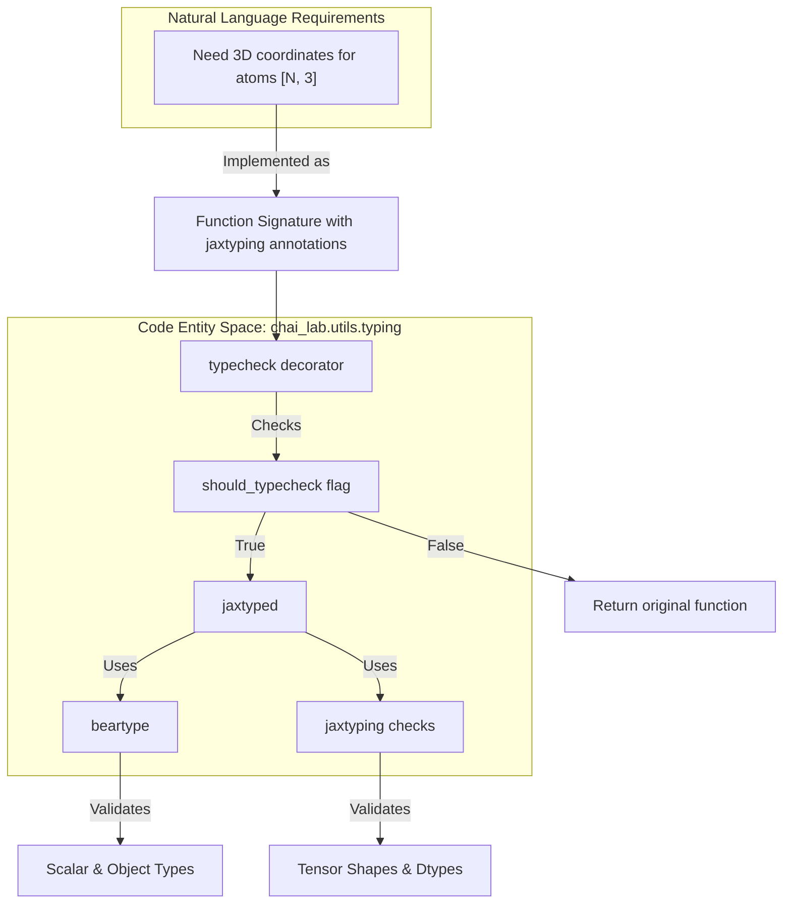
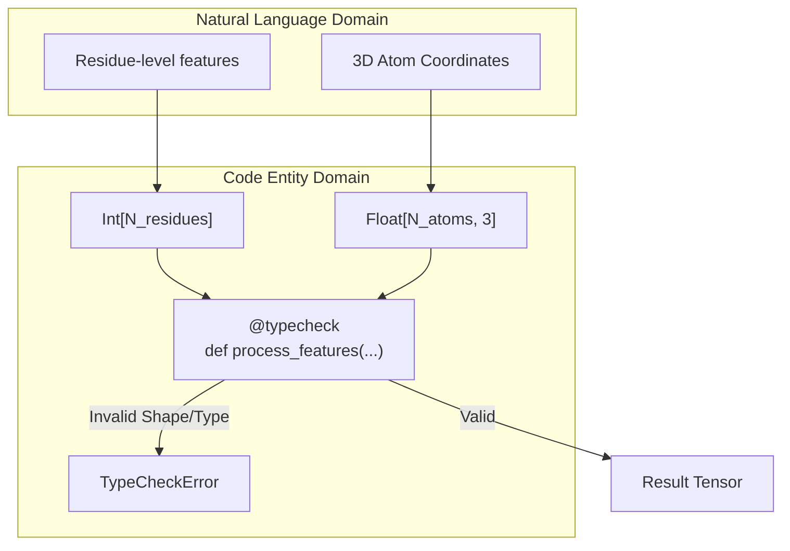

# Type System

# Type System

> **Relevant source files**
> - [LICENSE](https://github.com/chaidiscovery/chai-lab/blob/66c38d1f/LICENSE)
> - [chai\_lab/\_\_init\_\_\.py](https://github.com/chaidiscovery/chai-lab/blob/66c38d1f/chai_lab/__init__.py)
> - [chai\_lab/utils/typing\.py](https://github.com/chaidiscovery/chai-lab/blob/66c38d1f/chai_lab/utils/typing.py)

 This page documents the type checking infrastructure and validation utilities used throughout the Chai Lab codebase\. The system ensures code correctness by validating data types both during development and at runtime, specifically focusing on the complex tensor shapes and multidimensional array operations used in the Chai\-1 molecular structure prediction pipeline\.

## Overview

 Chai Lab employs a hybrid type checking approach that combines static type annotations with runtime type checking\. This system is particularly valuable for catching errors in tensor shapes, dimensions, and data types which are critical in scientific computing applications like molecular modeling\.

 The type system is built on two specialized libraries:

 - **beartype**: A high\-performance runtime type checker for Python\.
- **jaxtyping**: A type annotation system for JAX \(and by extension, compatible tensor\) arrays that provides shape and dtype checking\.

## Type System Architecture

 The following diagram illustrates how the type system is structured within the Chai Lab codebase, specifically focusing on the `typecheck` decorator logic\.

 **Diagram: Type System Validation Flow**



 Sources: [typing\.py L23-L33](https://github.com/chaidiscovery/chai-lab/blob/66c38d1f/chai_lab/utils/typing.py#L23-L33) [typing\.py L7-L19](https://github.com/chaidiscovery/chai-lab/blob/66c38d1f/chai_lab/utils/typing.py#L7-L19)

## Core Components

### The `typecheck` Decorator

 The primary entry point for the type system is the `typecheck` decorator defined in `chai_lab/utils/typing.py`\. It serves as a wrapper that conditionally enables runtime validation\.

 - **Implementation**: If `should_typecheck` is `True`, it returns the function or class wrapped by `jaxtyped(typechecker=beartype)`\. Otherwise, it returns the original object with no runtime overhead [typing\.py L29-L33](https://github.com/chaidiscovery/chai-lab/blob/66c38d1f/chai_lab/utils/typing.py#L29-L33)
- **Scope**: It can be applied to both functions and classes [typing\.py L29](https://github.com/chaidiscovery/chai-lab/blob/66c38d1f/chai_lab/utils/typing.py#L29-L29)

### Configuration: `should_typecheck`

 The global flag `should_typecheck` controls the enforcement of types\.

 - **Persistence**: Because modules are only loaded once, the value of `should_typecheck` remains constant over the lifetime of the program [typing\.py L21-L23](https://github.com/chaidiscovery/chai-lab/blob/66c38d1f/chai_lab/utils/typing.py#L21-L23)
- **Default**: It is currently set to `True` [typing\.py L23](https://github.com/chaidiscovery/chai-lab/blob/66c38d1f/chai_lab/utils/typing.py#L23-L23)

### Re\-exported Tensor Type Aliases

 To provide a unified interface, `chai_lab.utils.typing` re\-exports several key types from `jaxtyping`\. These are used to annotate tensors \(typically JAX or PyTorch arrays\) throughout the model trunk and feature generation pipelines\.

| Alias | Underlying jaxtyping Type | Description |
| --- | --- | --- |
| Bool | jaxtyping\.Bool | Boolean array/tensor |
| Float | jaxtyping\.Float | Generic floating\-point array |
| Float32 | jaxtyping\.Float32 | 32\-bit floating\-point array |
| Int | jaxtyping\.Int | Generic integer array |
| Int32 | jaxtyping\.Int32 | 32\-bit integer array |
| UInt8 | jaxtyping\.UInt8 | 8\-bit unsigned integer array |
| Num | jaxtyping\.Num | Any numeric array \(int or float\) |
| Shaped | jaxtyping\.Shaped | Array with a specific shape but any dtype |

 Sources: [typing\.py L8-L19](https://github.com/chaidiscovery/chai-lab/blob/66c38d1f/chai_lab/utils/typing.py#L8-L19) [typing\.py L36-L48](https://github.com/chaidiscovery/chai-lab/blob/66c38d1f/chai_lab/utils/typing.py#L36-L48)

## Data Flow and Validation

 The following diagram bridges the gap between the internal `typing` utilities and their application in the broader system \(e\.g\., in the Inference Engine or Feature Assembly\)\.

 **Diagram: Application of Types in Model Pipeline**



 Sources: [typing\.py L16](https://github.com/chaidiscovery/chai-lab/blob/66c38d1f/chai_lab/utils/typing.py#L16-L16) [typing\.py L29-L31](https://github.com/chaidiscovery/chai-lab/blob/66c38d1f/chai_lab/utils/typing.py#L29-L31)

## Usage Patterns

### Function Decoration

 Functions requiring strict shape validation are decorated with `@typecheck`\. This is standard for functions handling MSA \(Multiple Sequence Alignment\) data, structural templates, or diffusion coordinates where dimensions like `[batch, atoms, 3]` must be strictly maintained\.

```python
from chai_lab.utils.typing import typecheck, Float, Int32 @typecheckdef compute_loss(    predictions: Float[..., "atoms", 3],     targets: Float[..., "atoms", 3],    mask: Int32[..., "atoms"]) -> Float[()]:    ...
```

### Error Handling

 When a type or shape mismatch occurs at runtime, the system raises a `TypeCheckError` [typing\.py L16](https://github.com/chaidiscovery/chai-lab/blob/66c38d1f/chai_lab/utils/typing.py#L16-L16) This exception is re\-exported in the `__all__` list of the typing utility for easy catching during testing or debugging [typing\.py L38](https://github.com/chaidiscovery/chai-lab/blob/66c38d1f/chai_lab/utils/typing.py#L38-L38)

## Implementation Details

 The core implementation in `chai_lab/utils/typing.py` is concise, leveraging the interoperability between `beartype` \(for standard Python types\) and `jaxtyping` \(for array\-specific logic\)\.

```python
def typecheck(cls_or_func: Func) -> Func:    if should_typecheck:        return jaxtyped(typechecker=beartype)(cls_or_func)  # type: ignore    else:        return cls_or_func
```

 Sources: [typing\.py L29-L33](https://github.com/chaidiscovery/chai-lab/blob/66c38d1f/chai_lab/utils/typing.py#L29-L33)

 The use of `typing.TypeVar("Func")` ensures that the decorator maintains the type signature of the wrapped function or class for static analysis tools like `mypy` [typing\.py L26-L29](https://github.com/chaidiscovery/chai-lab/blob/66c38d1f/chai_lab/utils/typing.py#L26-L29)

 Sources: [typing\.py L1-L49](https://github.com/chaidiscovery/chai-lab/blob/66c38d1f/chai_lab/utils/typing.py#L1-L49)

---
*Source: [https://deepwiki.com/chaidiscovery/chai-lab/9.1-type-system](https://deepwiki.com/chaidiscovery/chai-lab/9.1-type-system) on DeepWiki*