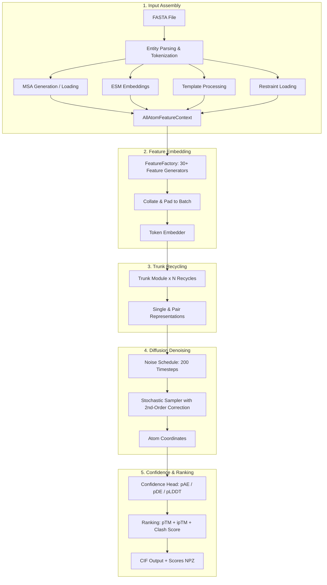

---
slug:1-overview
blog_type:normal
---


**Chai-1** 是一个用于分子结构预测的多模态基础模型，在各项基准测试中均达到了最先进的表现。Chai-1 由 Chai Discovery 开发并在 Apache 2.0 许可证下发布，能够对蛋白质、小分子、DNA、RNA、糖基化及其复合物进行统一预测——所有这些均可通过单一的推理流水线完成。无论你是预测单体蛋白质、多链蛋白质-配体复合物，还是糖基化抗体，Chai-1 都会通过一致的输入格式和共享的架构主干来处理每一个实体。


完整的基准测试详情请参阅[技术报告](https://www.biorxiv.org/content/10.1101/2024.10.10.615955)。

来源: [README.md](/README.md#L1-L10), [chai_lab/__init__.py](/chai_lab/__init__.py#L4-L5)

## Chai-1 能够预测什么

Chai-1 接受类似 FASTA 的输入格式，其中每个实体都标注了类型和唯一名称。该模型通过单一的统一入口处理六种不同的实体类型，这意味着你无需为不同的分子种类使用独立的工具或工作流。

| 实体类型 | 输入格式 | 示例 |
|---|---|---|
| **蛋白质** | 氨基酸序列（单字母代码） | `AGSHSMRYFSTSVSRPGRGE...` |
| **DNA** | 核苷酸序列 (A/T/G/C) | `ATGCGATC` |
| **RNA** | 核苷酸序列 (A/U/G/C) | `AUGCGAUC` |
| **配体** | SMILES 字符串 | `CCCCCCCCCCCCCC(=O)O` |
| **聚糖** | 聚糖字符串（单糖表示法） | `Man(a1-2)Man(a1-...)` |
| **修饰残基** | 以 `AAA(MOD)AAA` 形式嵌入序列中 | `AAA(SEP)AAA` |

FASTA 头部语法使用 `>type|name=identifier` 模式来声明每个实体。此约定由输入验证层解析，并路由到相应的残基分词器，从而使得单个 FASTA 文件能够描述任意复杂的多模态复合物。

来源: [examples/predict_structure.py](/examples/predict_structure.py#L17-L31), [chai_lab/data/parsing/structure/entity_type.py](/chai_lab/data/parsing/structure/entity_type.py#L10-L18), [chai_lab/data/dataset/inference_dataset.py](/chai_lab/data/dataset/inference_dataset.py#L94-L128)

## 架构概览

Chai-1 的推理流水线遵循四阶段架构：**输入组装 → 特征嵌入 → 主干循环 → 扩散去噪**，随后进行置信度预测和结构排序。每个阶段都是模块化的，并基于定义明确的数据结构运行，使得系统兼具可扩展性与可调试性。



贯穿流水线的核心数据结构是 **`AllAtomFeatureContext`**，它将结构上下文、MSA 上下文、模板上下文、嵌入上下文和约束上下文捆绑为单个对象。该上下文经过填充与拼装形成批次，随后由 `FeatureFactory` 进行转换，该工厂负责协调 30 多个特征生成器——从残基类型的独热编码到分块原子对距离图。

来源: [chai_lab/chai1.py](/chai_lab/chai1.py#L100-L162), [chai_lab/data/dataset/all_atom_feature_context.py](/chai_lab/data/dataset/all_atom_feature_context.py#L15-L43), [chai_lab/data/collate/collate.py](/chai_lab/data/collate/collate.py#L24-L97)

## 项目结构

代码库被组织为 `chai_lab/` 下的五个核心子系统，外加示例和测试。理解此布局对于浏览更深层的文档页面至关重要。

```
chai_lab/
├── chai1.py                 # Main inference entry point & orchestration
├── main.py                  # CLI interface (typer-based)
├── __init__.py              # Package version
├── data/                    # Input parsing, feature generation, collation
│   ├── collate/             #   Batch collation & padding
│   ├── dataset/             #   Feature contexts, MSA, embeddings, templates
│   ├── features/            #   FeatureFactory & 30+ feature generators
│   ├── io/                  #   CIF/PDB I/O utilities
│   ├── parsing/             #   FASTA, restraint, glycan, MSA parsers
│   └── sources/             #   RDKit conformer generation
├── model/                   #   Noise schedules & model utilities
├── ranking/                 #   pTM, pLDDT, clash scoring, ranking
├── tools/                   #   Kalign wrapper, rigid transform utilities
└── utils/                   #   Paths, tensor ops, typing, defaults
```

<CgxTip>`chai1.py` 文件是需要理解的最为重要的文件——它既包含高层级的 `run_inference` 函数（用于组装输入并循环遍历主干样本），也包含低层级的 `run_folding_on_context` 函数（用于执行贯穿嵌入、主干、扩散和置信度阶段的核心模型前向传播）。</CgxTip>

来源: [chai_lab/chai1.py](/chai_lab/chai1.py#L1-L30), [chai_lab/main.py](/chai_lab/main.py#L1-L49)

## 运行推理的两种方式

Chai-1 提供了两种用于运行结构预测的接口，以适应不同层级的定制需求。

### 命令行接口

折叠复合物最简单的方法是通过 `chai-lab fold` 命令，该命令已注册为控制台脚本的入口点。它接受一个 FASTA 文件和一个输出目录，并提供用于 MSA 生成、模板搜索和约束的可选标志。

```shell
# Basic usage (no MSA, no templates)
chai-lab fold input.fasta output_folder

# With MSA and template server (recommended for best performance)
chai-lab fold --use-msa-server --use-templates-server input.fasta output_folder
```

### Python API

对于编程控制，`chai_lab.chai1.run_inference` 函数提供了相同的功能，并允许访问全部参数。若需要更深层的控制——例如使用自定义 MSA、嵌入或共价键规范手动构建 `AllAtomFeatureContext`——请使用 `chai_lab.chai1.run_folding_on_context`。

```python
from chai_lab.chai1 import run_inference
candidates = run_inference(
    fasta_file=fasta_path,
    output_dir=output_dir,
    num_trunk_recycles=3,
    num_diffn_timesteps=200,
    num_diffn_samples=5,
    use_esm_embeddings=True,
)
```

| 接口 | 入口点 | 最适用场景 |
|---|---|---|
| CLI | `chai-lab fold` | 快速预测、脚本编写、批处理任务 |
| Python `run_inference` | `chai_lab.chai1.run_inference` | 编程流水线、参数扫描 |
| Python `run_folding_on_context` | `chai_lab.chai1.run_folding_on_context` | 自定义特征上下文、高级研究 |

来源: [chai_lab/main.py](/chai_lab/main.py#L29-L36), [chai_lab/chai1.py](/chai_lab/chai1.py#L397-L451), [examples/predict_structure.py](/examples/predict_structure.py#L38-L51)

## 关键配置参数

推理流水线暴露了多个参数，用于控制质量与速度之间的权衡，以及输入数据的丰富度。

| 参数 | 默认值 | 描述 |
|---|---|---|
| `num_trunk_recycles` | 3 | 主干表征循环使用的次数；更多循环能以线性代价提升质量 |
| `num_diffn_timesteps` | 200 | 扩散模块中的去噪时间步数；更少的时间步 = 速度更快但质量更低 |
| `num_diffn_samples` | 5 | 独立结构样本的数量；通常会选择排名最高的样本 |
| `use_esm_embeddings` | True | 使用 ESM-2 蛋白质语言模型嵌入作为输入特征 |
| `use_msa_server` | False | 查询 ColabFold MMseqs2 服务器以生成 MSA |
| `use_templates_server` | False | 查询服务器以获取结构模板命中 |
| `low_memory` | True | 在前向传播之间将模型组件移至 CPU，以减少 GPU 显存占用 |

<CgxTip>为获得最佳预测质量，请同时启用 `--use-msa-server` 和 `--use-templates-server`。默认配置（仅使用 ESM 嵌入，不使用 MSA）针对速度进行了优化，在许多情况下表现良好，但 MSA 和模板信息可大幅提升蛋白质复合物的预测准确度。</CgxTip>

来源: [chai_lab/chai1.py](/chai_lab/chai1.py#L397-L427), [README.md](/README.md#L24-L38)

## 输出产物

每次推理运行都会在指定目录中生成一组输出文件。对于每一个扩散样本（索引从 0 到 `num_diffn_samples - 1`），流水线会写入：

| 文件 | 内容 |
|---|---|
| `pred.model_idx_N.cif` | CIF 格式的预测 3D 结构，包含 pLDDT B 因子（0–100 范围） |
| `scores.model_idx_N.npz` | NumPy 归档文件，包含 `aggregate_score`、`ptm`、`iptm`、`per_chain_ptm`、`per_chain_pair_iptm`、`has_inter_chain_clashes`、`chain_chain_clashes` |
| `msa_depth.pdf` | MSA 覆盖度图表（仅在提供了 MSA 数据时生成） |

**综合排名分数**结合了界面 pTM（80% 权重）、复合物 pTM（20% 权重）和冲突惩罚：`0.8 * ipTM + 0.2 * pTM - 100 * has_clashes`。Python API 返回的 `StructureCandidates` 对象也提供了对逐 token 的 pLDDT、逐对 pAE 和逐对 pDE 张量的直接访问。

来源: [chai_lab/chai1.py](/chai_lab/chai1.py#L238-L268), [chai_lab/ranking/rank.py](/chai_lab/ranking/rank.py#L93-L109), [chai_lab/chai1.py](/chai_lab/chai1.py#L966-L1014)

## 独特能力：实验约束

Chai-1 独特地支持将**用户指定的约束**作为输入来指导折叠。这些约束包括接触约束（指定哪些残基应当彼此靠近）、口袋约束（限制配体的结合位点）和共价键约束（针对具有共价连接的配体或糖基化蛋白质）。约束在 `.restraints` 文件中指定，并通过 `--constraint` CLI 标志或 `constraint_path` Python 参数传入。


来源: [README.md](/README.md#L91-L94), [chai_lab/chai1.py](/chai_lab/chai1.py#L443-L472)

## 在线体验

没有 GPU？没问题。Chai Discovery 托管了一个[网页服务器](https://lab.chaidiscovery.com)，你可以直接通过浏览器测试 Chai-1——包括对约束的支持——无需任何本地安装。


来源: [README.md](/README.md#L84-L87)

## 系统要求

| 要求 | 详情 |
|---|---|
| **操作系统** | Linux |
| **Python** | 3.10 或更高版本 |
| **GPU** | 支持 bfloat16 的 CUDA |
| **推荐 GPU** | A100 80GB, H100 80GB, L40S 48GB |
| **适用于较小复合物** | A10, A30, RTX 4090 |
| **许可证** | Apache 2.0（代码 + 模型权重；允许商业使用） |

来源: [README.md](/README.md#L17-L20), [README.md](/README.md#L164-L170)

## 接下来去哪里

既然你已经对 Chai-1 的用途和架构有了宏观了解，请按照以下阅读路径进一步深入：

1. **[快速入门](2-quick-start)** — 安装 Chai-1 并在几分钟内运行你的首次预测
2. **[CLI 参考](3-cli-reference)** — 完整的命令行标志和选项
3. **[架构概览](7-architecture-overview)** — 推理流水线各阶段的详细解析
4. **[FASTA 解析与实体类型](13-fasta-parsing-and-entity-types)** — 输入是如何被解析与验证的
5. **[结构排名与评分](21-structure-ranking-and-scoring)** — 预测结果是如何被评估和排名的