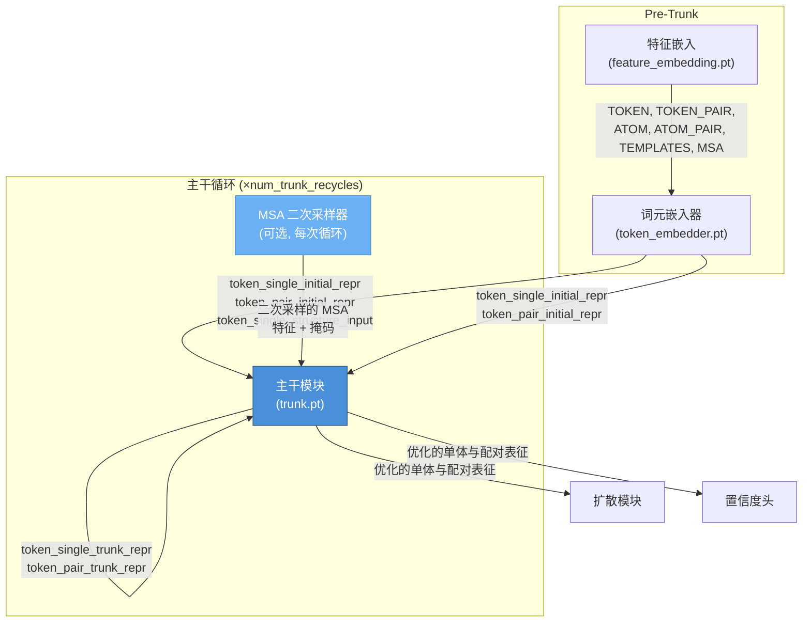
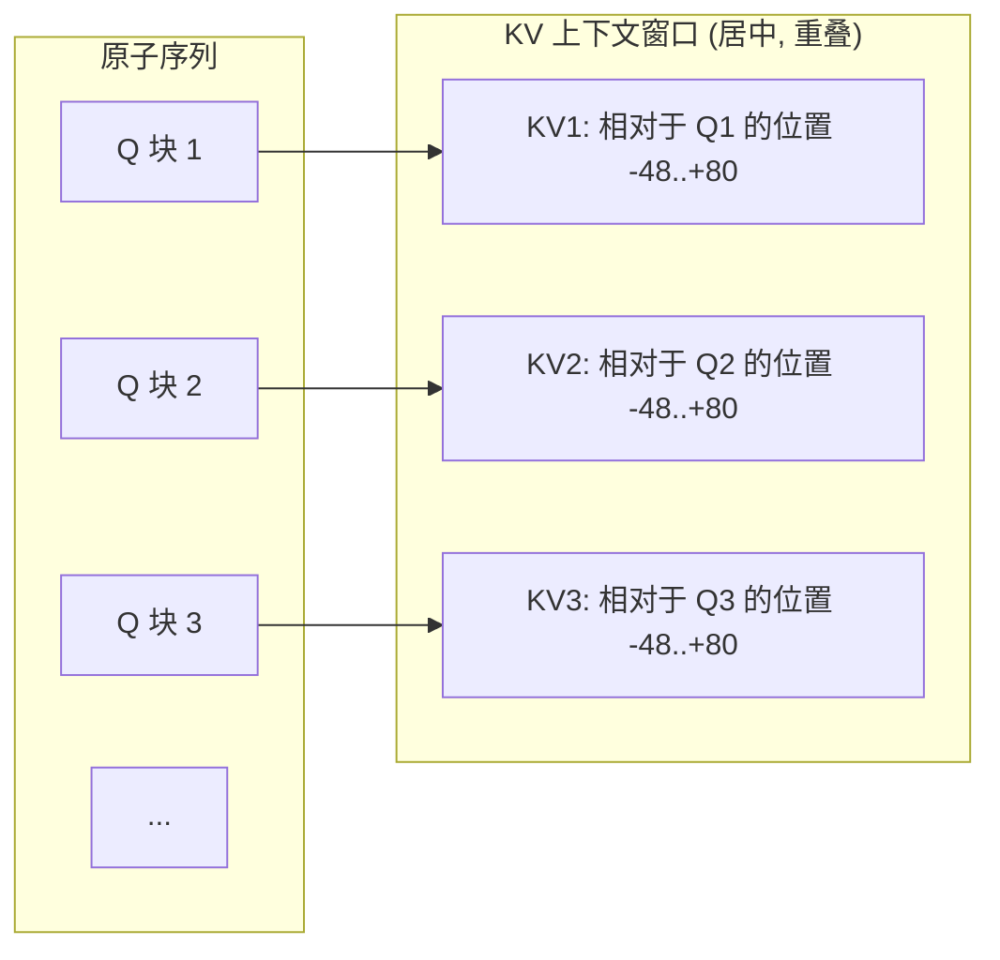
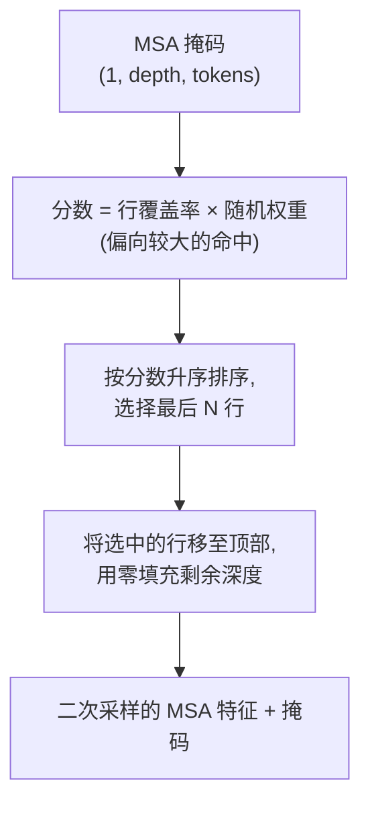

---
slug:10-trunk-recycling-and-attention
blog_type:normal
---


主干是 Chai-1 推理流程的迭代推理核心——这是一个通过多次循环来优化词元级单体与配对表征的模块，每次循环都会融入 MSA、模板以及循环的先验状态信息。本页将探讨循环机制、控制原子对交互的分块局部注意力模式，以及稳定后续循环的 MSA 二次采样策略。理解此阶段至关重要，因为主干输出的质量直接决定了下游扩散去噪和置信度预测的保真度。

## 主干的架构位置

主干在 Chai-1 的三阶段推理流程中占据核心位置：特征嵌入 → 词元嵌入 → **主干循环** → 扩散去噪。它接收四类输入：(1) 来自词元嵌入器的初始单体和配对词元表征，(2) 来自上一次主干循环的循环单体和配对表征，(3) MSA 和模板特征，(4) 词元级掩码。它的输出——经过优化的 `token_single_trunk_repr` 和 `token_pair_trunk_repr`——会被扩散模块和置信度头共同消费。



初始表征在所有循环中作为固定参考，而循环表征则随着每次迭代不断演进。这种双输入设计——恒定锚点加可变状态——在允许迭代优化的同时，防止了表征漂移。

来源: [chai1.py](/chai_lab/chai1.py#L708-L746), [chai1.py](/chai_lab/chai1.py#L689-L706)

## 循环机制

循环机制是主干的决定性机制。在每次迭代中，主干模块同时接收**初始**表征（在多次循环中保持不变）和**当前**循环表征（上一次循环的输出）。该循环执行 `num_trunk_recycles` 次（默认：3 次），并且在第一次迭代之前，循环表征被初始化为初始表征。

核心循环在结构上简单直接，但在效果上至关重要：

```python
token_single_trunk_repr = token_single_initial_repr
token_pair_trunk_repr = token_pair_initial_repr
for _ in range(num_trunk_recycles):
    # 可选：为本次循环二次采样 MSA
    subsampled_msa_input_feats, subsampled_msa_mask = None, None
    if recycle_msa_subsample > 0:
        subsampled_msa_input_feats, subsampled_msa_mask = (
            subsample_and_reorder_msa_feats_n_mask(msa_input_feats, msa_mask)
        )
    # 使用初始和循环表征运行主干
    (token_single_trunk_repr, token_pair_trunk_repr) = trunk.forward(
        token_single_trunk_initial_repr=token_single_initial_repr,
        token_pair_trunk_initial_repr=token_pair_initial_repr,
        token_single_trunk_repr=token_single_trunk_repr,  # 循环的
        token_pair_trunk_repr=token_pair_trunk_repr,  # 循环的
        msa_input_feats=...,
        msa_mask=...,
        template_input_feats=template_input_feats,
        template_input_masks=template_input_masks,
        ...
    )
```

<CgxTip>主干的双输入约定——分离的 `initial` 和 `recycled` 表征参数——在架构上具有重要意义。初始表征将模型锚定在其首次推理的理解上，防止在多次循环中出现失控的漂移。循环表征则承载了累积的优化。在调试主干行为时，请独立检查这两个流：如果循环流在早期循环后就与初始流发生显著偏离，这可能表明注意力模式不稳定或 MSA 噪声过大。</CgxTip>

| 参数 | 默认值 | 作用 |
|---|---|---|
| `num_trunk_recycles` | 3 | 迭代主干的次数；更多的循环以线性的计算成本提升质量 |
| `num_trunk_samples` | 1 | 独立主干样本的数量（每个样本包含完整的循环过程）；多样本可捕捉随机变化 |
| `recycle_msa_subsample` | 0 | 当 > 0 时，每次循环随机二次采样 MSA 行至该深度；0 表示禁用二次采样 |

来源: [chai1.py](/chai_lab/chai1.py#L708-L746), [chai1.py](/chai_lab/chai1.py#L478-L484)

## 原子对的分块局部注意力

Chai-1 对原子对交互采用了**分块局部注意力**模式，避免了全原子对注意力的二次方计算成本。该机制由两个结构参数控制：`num_key_atoms=128`（KV 块大小）和 `num_query_atoms=32`（查询步长），它们在整理阶段进行配置。

### 块索引计算

函数 `get_qkv_indices_for_blocks` 将原子序列划分为大小为 `stride`（32）的不重叠查询块，每个查询块关注一个大小为 `kv_block_size`（128）的居中局部 KV 块。对于起始位置为 `q_start` 的查询块，其 KV 块的范围是从 `q_start + (stride - kv_block_size) // 2` 到 `q_start + (stride - kv_block_size) // 2 + kv_block_size`。给定 stride=32 和 kv_block_size=128，该偏移量为 `(32 - 128) // 2 = -48`，这意味着每个查询块的 KV 上下文在查询块起始位置之前延伸 48 个位置，之后延伸 80 个位置——这是一个严重向后偏差的局部窗口，优先考虑上游的结构上下文。



### 边界处理

当居中的 KV 块超出序列边界（靠近原子序列的起点或终点）时，实现上使用了取模环绕（`kv_indices % sequence_length`），并结合一个**环绕掩码**将越界位置无效化。这确保了 是一个严重向后偏差的局部窗口，优先考虑上游的结构上下文。 索引计算绝不会失败，以及 注意力权重不会关注被环绕的原子，从而保持了局部注意力的语义。

```python
# 屏蔽 kv_indices 发生环绕的位置
kv_mask = (kv_indices < sequence_length) & (kv_indices >= 0)
kv_indices = kv_indices % sequence_length  # 安全索引，稍后进行屏蔽
```

随后，分块原子对掩码被计算为查询侧原子掩码、KV 侧原子掩码和环绕有效性掩码的逻辑与，生成一个 `Bool[Tensor, "b bl bl_q bl_kv"]` 张量，用于门控注意力计算。

<CgxTip>128/32 的 KV/Q 比率意味着每个查询原子关注 128 个局部键原子，压缩比为 4:1。这不仅仅是一种内存优化——局部窗口编码了一种归纳偏置，即结构交互在原子级别上是空间局部的，这与原子间力的物理学相一致。在将模型适应于异常的长程交互场景时，请注意 128 原子的 KV 窗口大约覆盖 5-6 个残基的主链上下文。</CgxTip>

来源: [utils.py](/chai_lab/model/utils.py#L14-L57), [collate.py](/chai_lab/data/collate/collate.py#L64-L85)

## 循环过程中的 MSA 二次采样

当 `recycle_msa_subsample > 0` 时，每次主干循环都会应用随机的 MSA 行二次采样。这起到两个作用：(1) 减少了深度 MSA 的内存和计算量，(2) 引入了受控的随机性，通过在每次循环中呈现不同的进化信息，可以提高跨循环的泛化能力。

### 二次采样算法

二次采样函数 `_subsample_msa_rows` 使用**大小偏置随机评分**策略从 MSA 中选择 `select_n_rows` 行。每个 MSA 行获得的分数等于其非填充残基计数乘以一个随机权重，然后选择得分最高的行。这种做法在选择时偏向于更大、信息更丰富的 MSA 命中，同时保持了随机的多样性。



选择之后，MSA 特征会被重新排序，使选中的行排在前面，而掩码则被截断并用零填充以维持原始的深度维度。一个关键的不变式是：每个被选中的行必须具有非零覆盖率——空行永远不会被采样。

| 方面 | 行为 |
|---|---|
| 选择偏置 | 较大的 MSA 命中（更多非填充残基）被优先选择 |
| 排序 | 选中的行保持其原始的相对顺序 |
| 填充 | 掩码用零填充至原始深度；特征保留完整深度，未选中的行被移至末尾 |
| 默认深度 | 启用时的 `select_n_rows = 4096` |
| 不活跃条件 | 输入 MSA 深度 ≤ `select_n_rows`，或 `recycle_msa_subsample = 0` |

来源: [utils.py](/chai_lab/data/dataset/msas/utils.py#L11-L87), [chai1.py](/chai_lab/chai1.py#L714-L722)

## 模型尺寸门控与静态图导出

主干（以及所有其他导出的模块）被编译为特定词元数量的 **TorchScript 静态图**。可用的模型尺寸为 `[256, 384, 512, 768, 1024, 1536, 2048]`，输入在整理阶段会被填充至最接近的尺寸。主干的 forward 方法通过 `forward_{crop_size}` 进行派发，这意味着每个模型尺寸都有其独立的编译图。

这种设计对主干的注意力模式有直接影响：分块局部注意力索引是在整理阶段预先计算的（而非在主干内部），并且特定的块结构取决于填充后的序列长度。`get_qkv_indices_for_blocks` 函数要求序列长度能被查询步长（32）整除，这由填充策略来保证。

| 模型尺寸 | 最大词元数 | 最大原子数 (23×词元数) |
|---|---|---|
| 256 | 256 | 5,888 |
| 384 | 384 | 8,832 |
| 512 | 512 | 11,776 |
| 768 | 768 | 17,664 |
| 1024 | 1,024 | 23,552 |
| 1536 | 1,536 | 35,328 |
| 2048 | 2,048 | 47,104 |

来源: [utils.py](/chai_lab/data/collate/utils.py#L11-L40), [chai1.py](/chai_lab/chai1.py#L678-L685)

## 设备管理与内存策略

主干模块使用 `_component_moved_to` 上下文管理器进行临时设备放置。在每次循环迭代中，主干模块被移至计算设备（通常是 CUDA），执行 forward pass，然后模块被移回 CPU。这种模式对于 `low_memory=True` 推理模式至关重要，在该模式下，任何时候 GPU 上只驻留一个模型组件。

当 `low_memory=True` 时，循环本身在驻留 CPU 的表征上运行——`trunk.forward()` 内部的 `move_to_device` 参数处理输入张量的临时 GPU 转移，而 `return_on_cpu` 确保输出返回到 CPU。在所有循环完成后，会显式调用 `torch.cuda.empty_cache()` 以在扩散阶段开始前释放碎片化的 GPU 内存。

来源: [chai1.py](/chai_lab/chai1.py#L60-L78), [chai1.py](/chai_lab/chai1.py#L748-L749)

## 数据流总结

下表追踪了从词元嵌入器输出到扩散模块输入期间，主干循环阶段完整的张量生命周期：

| 张量 | 形状模式 | 来源 | 去向 |
|---|---|---|---|
| `token_single_initial_repr` | `(1, n_tokens, d_single)` | 词元嵌入器 | 主干（跨循环不变）+ 扩散 + 置信度 |
| `token_pair_initial_repr` | `(1, n_tokens, n_tokens, d_pair)` | 词元嵌入器 | 主干（跨循环不变） |
| `token_single_trunk_repr` | `(1, n_tokens, d_single)` | 由初始表征初始化，每次循环更新 | 主干（循环的）→ 扩散 + 置信度 |
| `token_pair_trunk_repr` | `(1, n_tokens, n_tokens, d_pair)` | 由初始表征初始化，每次循环更新 | 主干（循环的）→ 扩散 + 置信度 |
| `msa_input_feats` | `(1, depth, n_tokens, d_msa)` | 特征嵌入 | 主干（每次循环可选二次采样） |
| `template_input_feats` | `(1, n_templates, n_tokens, d_template)` | 特征嵌入 | 主干（跨循环不变） |
| `block_atom_pair_mask` | `(1, n_blocks, 32, 128)` | 整理阶段 | 主干（预先计算，恒定） |

循环结束后，主干的输出表征被分为两个流：`token_single_trunk_repr` 和 `token_pair_trunk_repr` 与特定结构的输入投影（`token_single_structure_input`、`token_pair_structure_input_feats`）一起流入扩散模块，同时相同的主干表征也馈送到置信度头。这种分叉意味着主干必须产生同时服务于坐标生成和质量估计的表征——而循环有助于满足这一双重目标。

来源: [chai1.py](/chai_lab/chai1.py#L689-L746), [chai1.py](/chai_lab/chai1.py#L752-L775)

## 接下来是什么

获得了主干优化的表征后，流程接下来将进入随机结构生成阶段。[扩散去噪过程](11-diffusion-denoising-process)页面详细介绍了这些表征如何指导原子坐标从高斯噪声中迭代去噪。关于运行多个主干样本和扩散步骤对内存的影响，请参阅[内存管理与设备策略](24-memory-management-and-device-strategy)。控制扩散过程的噪声表在[扩散噪声表](25-diffusion-noise-schedule)中介绍。