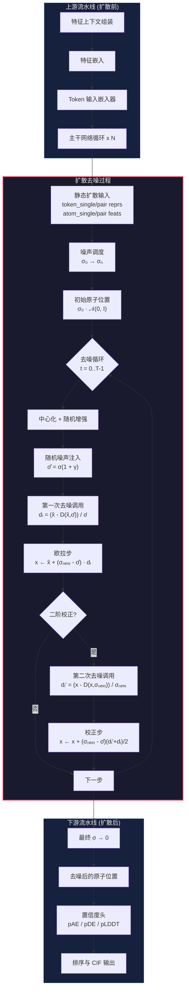
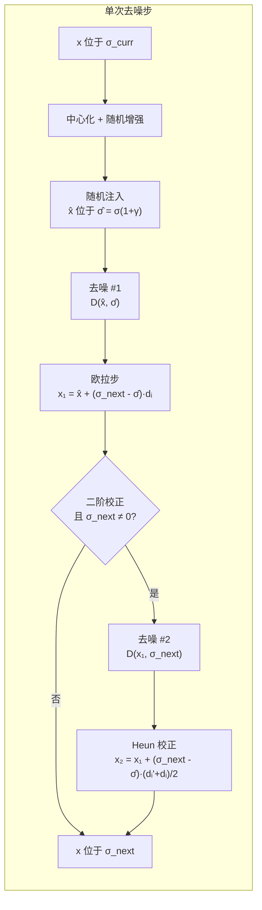

---
slug:11-diffusion-denoising-process
blog_type:normal
---


扩散去噪过程是 Chai-1 的生成核心：它将纯噪声转化为物理上合理的全原子 3D 坐标。与自回归或基于 VAE 的结构生成不同，Chai-1 采用了基于 Karras 等人阐明设计空间（EDM）方法论的**基于分数的扩散框架**，并实现了带有可选二阶校正的随机采样器。该过程接收主干网络的已学习表征——Token 级别单一特征与成对特征——并在数百个时间步中迭代细化含噪原子坐标场，最终生成多个独立的结构样本，这些样本由下游置信度头进行排序。

## 架构上下文：扩散模块的位置

扩散模块位于推理流水线的末端，消费主干网络循环融合后的输出。在执行任何去噪步骤之前，模型已经完成了特征组装、Token 嵌入以及主干网络表征的循环。扩散模块是**唯一直接生成原子坐标的阶段**，使其成为整个架构中唯一的生成瓶颈。



来源: [chai1.py](chai_lab/chai1.py#L782-L888), [diffusion_schedules.py](chai_lab/model/diffusion_schedules.py#L1-L49)

## 静态扩散输入：条件场

在迭代去噪循环开始之前，Chai-1 会组装一个称为 `static_diffusion_inputs` 的**冻结条件字典**。该字典在所有去噪时间步和所有扩散样本中保持不变——它是去噪器所依赖的结构上下文。这些输入沿两个轴进行分支：**结构特定通路**（仅由扩散模块使用）和**共享表征**（源自主干网络循环后的输出）。

| 输入键 | 来源 | 形状模式 | 作用 |
|---|---|---|---|
| `token_single_initial_repr` | Token 嵌入器（结构分支） | `(1, N_tokens, D)` | 主干网络之前的逐 Token 先验 |
| `token_pair_initial_repr` | 特征嵌入器（结构分支） | `(1, N_tokens, N_tokens, D)` | 成对几何先验 |
| `token_single_trunk_repr` | 主干网络输出（循环后） | `(1, N_tokens, D)` | 精炼后的单一表征 |
| `token_pair_trunk_repr` | 主干网络输出（循环后） | `(1, N_tokens, N_tokens, D)` | 精炼后的成对表征 |
| `atom_single_input_feats` | 特征嵌入器（结构分支） | `(1, N_atoms, D)` | 逐原子条件特征 |
| `atom_block_pair_input_feats` | 特征嵌入器（结构分支） | `(1, N_blocks, N_q, N_kv, D)` | 局部块原子对特征 |
| `atom_single_mask` | 输入整理 | `(1, N_atoms)` | 有效原子掩码 |
| `atom_block_pair_mask` | 块对计算 | `(1, N_blocks, N_q, N_kv)` | 有效块对掩码 |
| `token_single_mask` | 输入整理 | `(1, N_tokens)` | 有效 Token 掩码 |
| `block_indices_h/w` | 块索引计算 | `(N_blocks, N_q/kv)` | 注意力块索引 |
| `atom_token_indices` | 输入整理 | `(1, N_atoms)` | 原子到 Token 的映射 |

一个关键的架构细节：特征嵌入器的输出沿通道维度**一分为二**。一半送入主干网络通路（`token_pair_input_feats`，`atom_single_input_feats`）；另一半送入结构/扩散通路（`token_pair_structure_input_feats`，`atom_single_structure_input_feats`）。这种分割确保了扩散模块接收到一个专属的特征通道，该通道不会在循环过程中被主干网络覆盖，从而保留了从原始特征到坐标生成的纯净信息通路。

来源: [chai1.py](chai_lab/chai1.py#L688-L716), [chai1.py](chai_lab/chai1.py#L788-L804)

## 噪声调度：幂律 Sigma 轨迹

去噪轨迹由一个 **sigma 调度**控制——这是一个单调递减的噪声水平序列，采样器从高噪声（纯混乱）遍历到接近零噪声（清晰结构）。Chai-1 通过 `InferenceNoiseSchedule` 实现这一点，该模块在 `s_max` 和 `s_min` 之间通过**幂律插值**生成 sigma 值。

插值公式为：

```
σ(t) = σ_data · [ t · s_min^(1/p) + (1-t) · s_max^(1/p) ]^p
```

其中 `t ∈ [0, 1]` 是归一化时间步，`p = 7.0` 控制曲率，`σ_data = 16.0` 是数据标准差。该调度使用**中点间距**（`linspace(0, 1, 2N+1)[1::2]`）而不是均匀的端点间距来分布时间步，这避免了在噪声水平退化的 t=0 或 t=1 处放置时间步。

| 参数 | 默认值 | 作用 |
|---|---|---|
| `s_max` | 80.0 (来自 `DiffusionConfig.S_tmax`) | 起始噪声水平（最大 σ） |
| `s_min` | 4e-4 | 终止噪声水平（最小 σ） |
| `p` | 7.0 | 幂律指数；值越高，越集中在高噪声区间安排步数 |
| `sigma_data` | 16.0 | 数据标准差；缩放整个 σ 范围 |
| `num_timesteps` | 200 | 去噪步数 |

高指数 `p = 7.0` 生成了一种调度，在决定粗略结构的高噪声区间花费更多步数，而在微调细节的低噪声区间花费较少步数。这是有意为之的：早期的粗粒度决策（整体折叠、链排列）比后期的细粒度调整（侧链旋转异构体）影响更为深远。

来源: [diffusion_schedules.py](chai_lab/model/diffusion_schedules.py#L13-L48), [chai1.py](chai_lab/chai1.py#L821-L829)

## DiffusionConfig：随机采样器超参数

`DiffusionConfig` 数据类控制着随机采样行为。这些参数直接对应于 Karras 等人的 EDM 论文中的算法 2：

| 参数 | 值 | EDM 算法作用 | 描述 |
|---|---|---|---|
| `S_churn` | 80 | 随机性预算 | 所有步数中注入噪声的总量 |
| `S_tmin` | 4e-4 | 搅动的 σ 下界 | 低于此 σ 值时，不添加随机噪声 |
| `S_tmax` | 80.0 | 搅动的 σ 上界 | 高于此 σ 值时，不添加随机噪声 |
| `S_noise` | 1.003 | 噪声膨胀因子 | 注入噪声标准差的乘数 |
| `sigma_data` | 16.0 | 数据标准差 | 与 `InferenceNoiseSchedule.sigma_data` 匹配 |
| `second_order` | True | 启用二阶校正 | 使用第二次去噪器调用进行 Heun 校正 |

<CgxTip>`S_churn = 80` 的值明显偏高，使得采样过程中能够进行充分的随机探索。每步的 gamma 上限设为 `√2 - 1 ≈ 0.414` 以防止不稳定性，并按 `min(S_churn / num_timesteps, √2 - 1)` 分配。在 200 个时间步下，得出 `γ = min(0.4, 0.414) = 0.4`，这意味着在去噪前，每步的有效噪声增加了 40%——这是一种显著的扰动，有助于提升样本多样性。</CgxTip>

来源: [chai1.py](chai_lab/chai1.py#L242-L248)

## 去噪循环：逐步分解

核心去噪循环实现了一个带有 Heun 二阶校正的改进欧拉-丸山采样器。以下是精确的算法追踪，将每个代码块映射到其数学运算。

### 初始化

该过程首先从由最大 sigma 缩放的**纯高斯分布**中抽取原子位置：

```
x₀ = σ₀ · 𝒩(0, I)   其中 σ₀ = σ(t=0) ≈ s_max · σ_data
```

这会产生距离原点量级为 `σ₀ ≈ 80 × 16 = 1280 Å` 的坐标——实际上是毫无结构的噪声。其形状为 `(batch_size × num_diffn_samples, num_atoms, 3)`，其中多个样本共享相同的条件，但在随机初始化上有所不同。

### Gamma 调度

对于每对连续的 sigma `(σ_curr, σ_next)`，计算一个**搅动参数** γ：

```
γ = min(S_churn / num_timesteps, √2 - 1)   如果 S_tmin ≤ σ_curr ≤ S_tmax
γ = 0                                       其他情况
```

此 γ 控制在去噪步骤之前添加的**随机扰动**量，从而实现对解空间的探索。

### 单步算法

每个去噪步骤遵循以下序列：

**步骤 1 — 中心化与随机增强。** 原子坐标经过均值中心化，然后通过 `center_random_augmentation` 进行随机旋转和平移。这至关重要，因为扩散模型是利用 SE(3) 等变性训练的；中心化消除了平移漂移，而随机旋转防止模型过拟合于规范方向。平移缩放 `s_trans = 1.0` 仅增加了 1 Å 的扰动——小到不会破坏结构，但足以打破旋转对称性伪影。

**步骤 2 — 随机噪声注入（EDM 算法 2，第 4–6 行）。** 当 γ > 0 时，当前位置会受到扰动：

```
σ̂ = σ_curr · (1 + γ)
x̂ = x + S_noise · 𝒩(0, I) · √(σ̂² - σ_curr²)
```

这会将噪声水平从 `σ_curr` 膨胀到 `σ̂`，并添加与该膨胀一致的噪声。当 `γ = 0` 时（在搅动范围之外），`σ̂ = σ_curr` 且不添加噪声，采样器退化为确定性的 ODE 求解器。

**步骤 3 — 第一次去噪器调用与欧拉步（第 7–8 行）。** 去噪器网络 `D(x̂, σ̂)` 预测干净信号，并计算类分数方向：

```
d_i = (x̂ - D(x̂, σ̂)) / σ̂
x ← x̂ + (σ_next - σ̂) · d_i
```

这是标准的欧拉步：沿着从含噪观测指向去噪估计的方向，按噪声差值缩放，从 `σ̂` 移动到 `σ_next`。

**步骤 4 — 二阶校正（第 9–11 行）。** 当 `second_order = True` 且 `σ_next ≠ 0` 时，应用 **Heun 校正**：

```
d_i' = (x - D(x, σ_next)) / σ_next
x ← x + (σ_next - σ̂) · (d_i' + d_i) / 2
```
不再仅使用当前点的梯度，第二次去噪器调用评估在*投影的*下一个点处的梯度，然后将两个梯度平均。这种梯形法则校正极大地减少了离散化误差，代价是需要对扩散模块进行第二次前向传播。



来源: [chai1.py](chai_lab/chai1.py#L838-L885), [model/utils.py](chai_lab/model/utils.py#L178-L194)

## 去噪器接口：_denoise 函数

`_denoise` 函数充当迭代采样算法与导出的 TorchScript 扩散模块之间的桥梁。其签名为：

```python
def _denoise(diff_mod, atom_pos, sigma, ds) -> Tensor
```

该函数将扁平的 `(batch_size * num_diffn_samples, num_atoms, 3)` 原子位置张量重塑为 `(batch_size, num_diffn_samples, num_atoms, 3)`，将标量 sigma 广播到所有样本，并使用含噪坐标和 `static_diffusion_inputs` 字典调用扩散模块。`ds` 参数（等于 `num_diffn_samples`）告诉模块要并行处理多少次抽取。

<CgxTip>`num_diffn_samples` 维度完全在样本级别处理——批次内的每个样本独立去噪，但共享相同的条件。这意味着扩散模块在单次前向传播中处理所有样本（批次维度 = `num_diffn_samples`），这比顺序处理效率高得多，但当原子数量庞大时需要 `low_memory` 策略，因为中间激活值与样本数量呈线性缩放。</CgxTip>

来源: [chai1.py](chai_lab/chai1.py#L806-L819)

## 中心化与 SE(3) 增强

每个去噪步骤以 `center_random_augmentation` 开始，它按顺序执行三个操作：

1. **均值中心化**：计算所有有效原子的加权质心并将其减去，确保结构以原点为中心。这可以防止在数百个去噪步骤中累积平移漂移。

2. **随机旋转**：对中心化后的坐标应用均匀随机的 SO(3) 旋转，该旋转通过随机单位四元数生成。这种增强至关重要，因为扩散模型无论全局方向如何都应产生相同的结构；推理期间的随机旋转可防止模型坍缩到某一特定方向。

3. **小幅随机平移**：添加按 `s_trans = 1.0 Å` 缩放的高斯平移。这是一种微小的扰动，可以在不显著移动结构的情况下打破任何残留的平移对称性。

旋转矩阵源自使用标准 Shoemake/Marsaglia 方法的随机四元数，确保了对 SO(3) 的均匀覆盖。四元数到矩阵的转换严格遵循 PyTorch3D 实现，通过标准代数公式将 `(w, x, y, z)` 四元数转换为 `3×3` 旋转矩阵。

来源: [model/utils.py](chai_lab/model/utils.py#L69-L98), [model/utils.py](chai_lab/model/utils.py#L133-L194)

## 计算开销与二阶权衡

去噪循环是推理过程中计算开销最大的阶段。在默认设置下（`num_diffn_timesteps = 200`，`second_order = True`，`num_diffn_samples = 5`），扩散模块被调用：

- **仅一阶**：200 次调用 × 1 = 200 次前向传播
- **带二阶校正**：200 次调用 × 2 = **400 次前向传播**（每步一次欧拉 + 一次 Heun 校正，减去 `σ_next = 0` 的最后一步）

每次前向传播会通过扩散模块同时处理所有 5 个样本，因此批次维度为 5。`low_memory` 标志控制是否在步骤之间将中间结果移至 CPU，这是以吞吐量为代价换取 GPU 内存余量。

| 配置 | 前向传播次数 | 相对时间 | 质量 |
|---|---|---|---|
| 200 步，二阶 | ~400 | 1.0× (基准) | 最高 |
| 200 步，仅一阶 | 200 | ~0.5× | 较低（更多离散化误差） |
| 100 步，二阶 | ~200 | ~0.5× | 与 200 步/一阶相当 |
| 100 步，一阶 | 100 | ~0.25× | 最低 |

二阶校正在 ODE 轨迹曲率最大的中等噪声区间影响最为显著。在极高噪声（轨迹近乎线性）和极低噪声（分数近乎恒定）下，校正的收益递减。

来源: [chai1.py](chai_lab/chai1.py#L844-L886)

## 去噪过程中的内存管理

Chai-1 为扩散阶段实施了一种精细的内存策略。`static_diffusion_inputs` 在循环开始前一次性移至目标设备。扩散模块本身使用 `_component_moved_to` 上下文管理器，该管理器在去噪循环期间将 JIT 编译的模块加载到 GPU，并在之后将其返回 CPU。这避免了模块加载时的重复磁盘 I/O。

去噪循环完成后，在置信度头运行之前，会显式删除 `static_diffusion_inputs` 并调用 `torch.cuda.empty_cache()`。这至关重要，因为否则扩散模块的激活值和置信度头的激活值将争夺同一块 GPU 内存，而置信度头需要最终去噪后的坐标——对于大型复合物而言，这些 `(num_diffn_samples, num_atoms, 3)` 的 float32 张量可能非常庞大。

来源: [chai1.py](chai_lab/chai1.py#L844-L888), [chai1.py](chai_lab/chai1.py#L786-L804)

## 与相邻流水线阶段的关系

扩散去噪过程与推理流水线中的相邻阶段紧密耦合：

- **上游**：[主干网络循环与注意力机制](10-trunk-recycling-and-attention) 提供了作为去噪器条件的 `token_single_trunk_repr` 和 `token_pair_trunk_repr`。主干网络输出的质量直接决定了去噪结构的质量——扩散模块无法纠正糟糕的主干网络表征。

- **下游**：[置信度预测与评分](12-confidence-prediction-and-scoring) 消费最终去噪后的坐标以生成 pAE、pDE 和 pLDDT 分数。每个扩散样本独立评分，从而支持在 `num_diffn_samples` 次抽取之间进行排名。

- **配置**：[扩散噪声调度](25-diffusion-noise-schedule) 提供了此处使用的 sigma 调度和幂律插值的详尽数学处理。