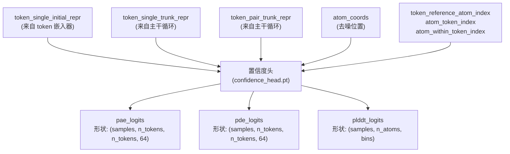
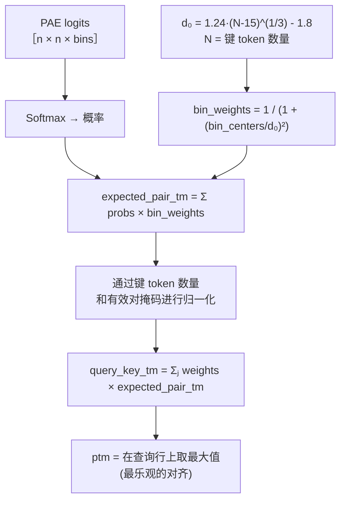
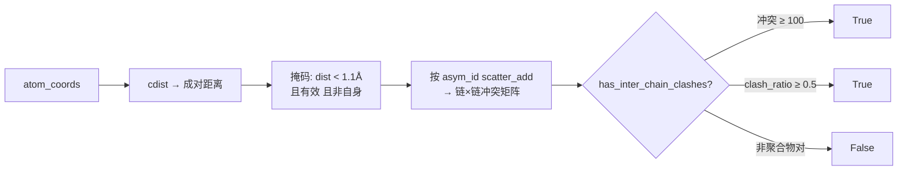
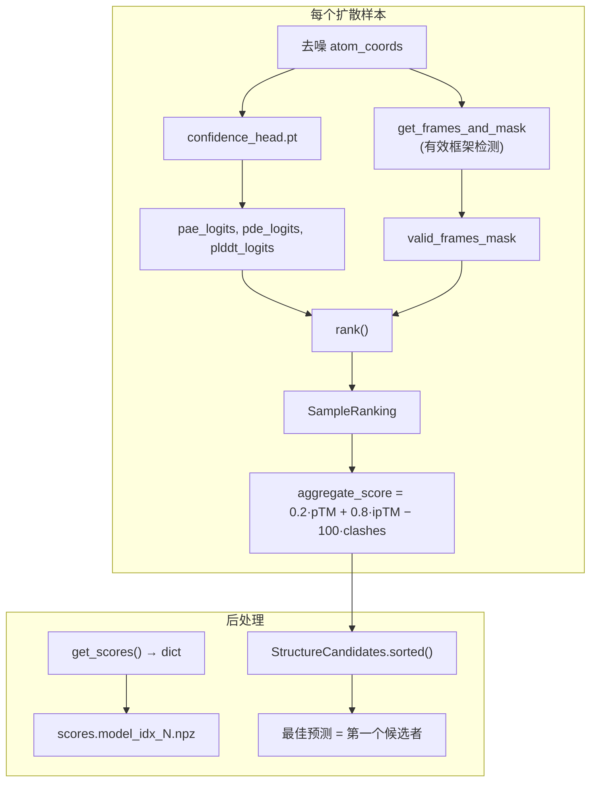

---
slug:12-confidence-prediction-and-scoring
blog_type:normal
---


Chai1 的置信度系统是一个**后扩散评估流水线**，它将原始模型 logits 转换为可解释的质量指标，再将这些指标合成为单一的聚合排名分数。该系统运行在三个截然不同的预测头——pLDDT、PAE 和 PDE——之上，每个预测头捕捉结构置信度的不同方面，并将它们与基于几何结构的冲突检测相结合，从而生成最终的样本排名。本页涵盖置信度头的输入契约、各评分组件的数学推导，以及控制样本选择的聚合评分公式。

## 置信度头架构与调用

置信度头是一个独立的导出模块（`confidence_head.pt`），在**扩散去噪完成后**被调用。它接收初始 token 表示（来自 token 嵌入器）和循环主干表示，以及来自扩散模块的**最终去噪原子坐标**。关键的是，置信度头在每个扩散样本中调用一次——而不是每个批次一次——因为尽管每个样本共享相同的主干表示，但它们具有不同的原子坐标。



该预测头为每个样本生成三个 logit 张量：在 [0, 32] Å 范围的 64 个离散分箱上的 **pae_logits** 和 **pde_logits**，以及在跨越 [0, 1] 的可变数量分箱上的 **plddt_logits**。这些 logits 是推导所有下游置信度分数的原材料。

来源：[chai1.py](chai_lab/chai1.py#L896-L925)

## 从 Logits 到分数：期望算子

所有置信度指标共享一个通用的计算原语：**期望算子**。给定一个离散分箱上的 logits 张量以及相应的分箱权重张量（若直接求期望，则权重为分箱中心；对于 pTM，则为 TM-Score 加权函数），该算子会对 logits 应用 softmax 归一化并计算加权和：

```
expectation(logits, weights) = softmax(logits, dim=-1) · weights
```

此模式将分箱上的分类分布转换为标量预测。`weights` 的选择决定了其语义：**分箱中心**产生直接的期望值（用于 pLDDT 和 PAE/PDE 分数），而 **TM-Score 加权函数**产生预测的 TM-Score（用于 pTM 和 ipTM）。

来源：[utils.py](chai_lab/ranking/utils.py#L63-L68)

## pLDDT：单原子局部置信度

**预测局部距离差异测试 (pLDDT)** 衡量单原子层面上的预期局部距离准确度。该计算应用期望算子，其分箱中心跨越 [0, 1]，然后可选地缩放至 [0, 100] 用于 CIF B 因子输出。系统计算三种粒度的 pLDDT：

| 分数 | 粒度 | 方法 |
|---|---|---|
| `per_atom_plddt` | 单原子 | 分箱上的直接期望 (per_residue=True) |
| `per_chain_plddt` | 单链 | 每个 asym_id 内单原子分数的掩码均值 |
| `complex_plddt` | 整个复合物 | 所有可能原子分数的掩码均值 |

单链变体使用 `get_chain_masks_and_asyms` 为每个唯一的 `asym_id` 构建布尔掩码，然后为每条链独立计算掩码均值。这种分解对于识别多链复合物中哪些链预测得好、哪些链预测得差至关重要。

<CgxTip>在写入 CIF 输出时，pLDDT 分数会从 [0, 1] 范围缩放至 [0, 100] 并作为 B 因子存储。对于 `StructureCandidates` 输出，从单原子 pLDDT 转换为单 token pLDDT 时，使用了 `torch.bincount` 加权平均——原子按其 `atom_token_index` 分组并求平均值，而非简单的池化。</CgxTip>

来源：[plddt.py](chai_lab/ranking/plddt.py#L23-L82)，[chai1.py](chai_lab/chai1.py#L941-L956)

## PAE 和 PDE：成对误差预测

**预测对齐误差 (PAE)** 和 **预测距离误差 (PDE)** 均为 token×token 的成对矩阵，衍生自相同的 64 分箱 logit 结构（分箱跨越 [0, 32] Å）。关键区别在于：

- **PAE** 估计在对包含查询 token 的链和包含键 token 的链应用**最佳刚体对齐**后，两个 token 相对位置的预期误差。它回答的是：“如果我将链 A 最优地对齐到链 B，token i 距离 token j 仍会偏差多远？”
- **PDE** 估计在没有任何对齐校正的情况下的预期原始距离误差——一种对位置不确定性的直接衡量。

两者均通过相同的模式计算：`softmax(logits) · bin_centers`，其中分箱中心由 `_bin_centers(0.0, 32.0, 64)` 生成——这是一个 linspace，在 [0, 32] Å 范围内产生 64 个等距值。在掩码处理至有效 token 后，生成的矩阵形状为 `(num_samples, num_tokens, num_tokens)`。

来源：[chai1.py](chai_lab/chai1.py#L927-L940)

## pTM 和 ipTM：源自 PAE Logits 的全局质量

**预测 TM-Score (pTM)** 并非从 PAE logits 的分箱中心期望计算得出，而是从反映实际 TM-Score 公式的 TM-Score 加权期望计算得出。核心函数 `_compute_ptm` 通过以下几个步骤实现这一点：



TM-Score 归一化常数 **d₀** 计算为 `1.24 · (N - 15)^(1/3) - 1.8`，并限制最少为 19 个 token。分箱加权 `1 / (1 + (d/d₀)²)` 确保较小的误差被赋予更高的权重，这与 TM-Score 对对齐良好区域的敏感性相匹配。最终的 pTM 分数在查询行上取**最大值**，对应于最乐观的对齐方式。

### 界面 pTM (ipTM)

**ipTM** 将计算限制在**链间**相互作用上。对于每条链 c，查询掩码设置为链 c 的 token，而键掩码设置为所有*不在*链 c 中的 token。单链 ipTM 通过带有这些非对称掩码的 `_compute_ptm` 计算，最终的 ipTM 是所有链上的最大值：

```
ipTM = max_c ptm(query=chain_c, key=¬chain_c)
```

这捕获了预测界面的质量：链间相对定位与预测误差分布的匹配程度。

### 单链与成对变体

系统还会计算：

| 分数 | 范围 | 描述 |
|---|---|---|
| `per_chain_ptm` | 单链 | 查询和键均被限制在同一条链内的 pTM |
| `per_chain_pair_iptm` | 链×链 | 每个有序链对 (c_query, c_key) 的 ipTM |

成对变体具有**内存优化**：当张量总大小将超过 2³² 个元素时，它会回退到链上的顺序 for 循环，而不是批量计算。这可以防止在具有许多链的大型复合物上出现 OOM（内存溢出）。

来源：[ptm.py](chai_lab/ranking/ptm.py#L30-L222)

## 冲突检测：几何质量控制

冲突评分直接基于去噪的原子坐标进行操作，独立于置信度头的 logits。该算法计算成对的原子距离，并标记距离小于 `clash_threshold`（默认 1.1 Å）的原子对：



`has_inter_chain_clashes` 的判定在逻辑 OR 中应用了**三个标准**：

1. **绝对阈值**：一个链对具有 ≥ `max_clashes`（100）次冲突
2. **相对阈值**：一个链对的冲突数超过较小链原子数的 `max_clash_ratio`（0.5）
3. **聚合物过滤**：仅考虑聚合物-聚合物对（蛋白质、RNA、DNA、混合物）；配体-聚合物冲突被忽略

冲突矩阵通过 `scatter_add_` 操作构建：首先将单原子冲突聚合为单链计数，然后再聚合为链×链矩阵。自相互作用项（对角线）通过除以 2 进行校正以避免重复计算，因为对称矩阵将每次冲突计算了两次。

来源：[clashes.py](chai_lab/ranking/clashes.py#L1-L164)

## 聚合评分公式

**聚合分数**将 pTM、ipTM 和冲突检测结合为一个单一的标量，用于对扩散样本进行排名：

```
aggregate_score = 0.2 × complex_ptm + 0.8 × interface_ptm − 100 × has_inter_chain_clashes
```

该权重揭示了 Chai1 的设计优先级：**界面质量以 80% 的权重主导排名**，反映出最常见的用例是多链复合物预测，其中链间对接准确性至关重要。冲突惩罚是二元的且严厉（-100），有效地排除了任何具有显著链间空间冲突的样本被选为最高预测结果的可能性。

| 组件 | 权重 | 依据 |
|---|---|---|
| `complex_ptm` | 0.2 | 整体结构质量 |
| `interface_ptm` | 0.8 | 链间对接质量（主要信号） |
| `has_inter_chain_clashes` | -100 | 对空间违规的二元否决 |

<CgxTip>聚合分数在 `rank()` 函数内部计算，但 `StructureCandidates.sorted()` 方法会按此分数以降序重新排列所有候选者。在编程方式使用 `StructureCandidates` 时，请调用 `.sorted()` 以确保第一个候选者是排名最高的预测。</CgxTip>

来源：[rank.py](chai_lab/ranking/rank.py#L88-L100)，[chai1.py](chai_lab/chai1.py#L973-L1009)

## 端到端分数计算流水线

从去噪坐标到排名输出的完整流程遵循以下顺序：



对于 `num_diffn_samples`（默认为 5）中的每一个，系统：(1) 通过 [frames.py](chai_lab/ranking/frames.py) 计算有效的骨架框架，(2) 调用置信度头，(3) 调用 `rank()` 生成 `SampleRanking`，(4) 将每个样本的分数写入 `.npz` 文件，(5) 将所有排名收集到 `StructureCandidates` 对象中。最终输出将 `pae`、`pde` 和 `plddt` 作为密集张量与每个样本的排名数据一起暴露。

来源：[chai1.py](chai_lab/chai1.py#L960-L1040)，[rank.py](chai_lab/ranking/rank.py#L108-L126)

## 分箱配置参考

置信度系统对每种预测类型使用不同的分箱配置。这些配置在推理流水线中是硬编码的，并决定了 logit 维度和分数范围：

| 预测 | 最小值 | 最大值 | 分箱数 | 分箱中心 |
|---|---|---|---|---|
| PAE / PDE | 0.0 Å | 32.0 Å | 64 | `linspace(0, 32, 129)[1::2]` |
| pLDDT | 0.0 | 1.0 | 可变 | `linspace(0, 1, 2·bins+1)[1::2]` |

`_bin_centers` 函数通过创建具有 `2 * no_bins + 1` 个点的 linspace 并从索引 1 开始每隔一个值选取一个，从而生成分箱，产生等距的分箱中心，避免了边缘伪影。

来源：[chai1.py](chai_lab/chai1.py#L476-L478)

---

**后续步骤**：如需更深入地分析这些分数在下游如何被使用，请参阅 [结构排名与评分](21-structure-ranking-and-scoring) 和 [pTM、pLDDT 与冲突指标](23-ptm-plddt-and-clash-metrics)。关于输入到置信度头的主干表示，请参阅 [主干循环与注意力](10-trunk-recycling-and-attention)。