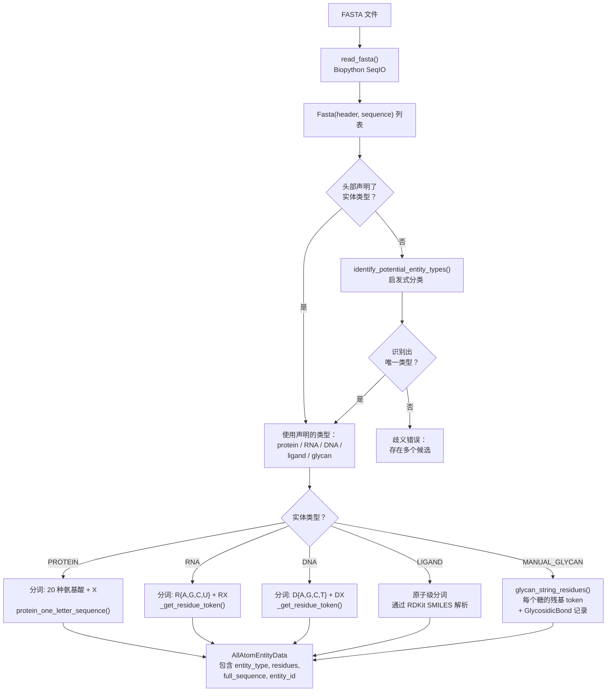

---
slug:13-fasta-parsing-and-entity-types
blog_type:normal
---


Chai1 接受一种**类 FASTA 输入格式**，该格式在传统生物信息学 FASTA 的基础上进行了扩展，加入了实体类型声明、SMILES 编码的配体以及糖类表示法。本页将说明原始 FASTA 字符串如何被解析为带类型且分词化的实体——这是决定所有下游特征、嵌入和结构预测的基础步骤。理解该系统对于构建有效输入以及在遇到歧义序列时推理模型行为至关重要。

## FASTA 输入格式

Chai1 使用一种自定义的 FASTA 方言，其中每个条目的头部都会声明**实体类型**和**唯一名称**，两者用竖线字符分隔。其通用模式为 `>entity_type|name=identifier`，下一行则为序列。此约定允许流水线区分共享相似序列字母表的实体——例如，在没有明确类型提示的情况下，像 `AGTC` 这样的短字符串既可能是蛋白质也可能是 DNA。

```
>protein|name=my-protein
AGSHSMRYFSTSVSRPGRGEPRFIAVGYVDDTQFVR
>ligand|name=my-ligand
CCCCCCCCCCCCCC(=O)O
>RNA|name=my-rna
AGUGGCUA
```

FASTA 头部中支持的实体类型关键字为 `protein`、`RNA`、`DNA`、`ligand` 和 `glycan`。配体被编码为 **SMILES 字符串** 而非残基序列，这是与标准 FASTA 约定最大的不同之处。糖类使用一种专门的括号表示法，将在下文的[糖类解析](#glycan-parsing)部分进行说明。在解析层，原始 FASTA 文件使用 Biopython 的 `SeqIO` 解析器读取，生成一个 `Fasta(header, sequence)` 命名元组列表，保留完整的头部字符串和原始序列，以供下游类型解析使用。

来源：[fasta.py](chai_lab/data/parsing/fasta.py#L25-L37), [predict_structure.py](examples/predict_structure.py#L20-L31)

## 实体类型分类

`EntityType` 枚举定义了流水线可识别的八种可能的实体类别。这些类型决定了分词规则、特征生成路径，以及模型在内部如何表示每个实体。

| EntityType | 值 | 输入编码 | 分词字母表 |
|---|---|---|---|
| **PROTEIN** | 0 | 单字母氨基酸代码 | 20 种标准氨基酸 + X |
| **RNA** | 1 | 单字母核苷酸代码 (A/U/G/C) | RA, RC, RG, RU + RX |
| **DNA** | 2 | 单字母核苷酸代码 (A/T/G/C) | DA, DC, DG, DT + DX |
| **LIGAND** | 3 | SMILES 字符串 | 原子级（每个原子作为一个 token） |
| **POLYMER_HYBRID** | 4 | 混合 DNA/RNA | 组合核苷酸字母表 |
| **WATER** | 5 | 自动（来自结构文件） | N/A |
| **UNKNOWN** | 6 | 无法解析的输入 | X |
| **MANUAL_GLYCAN** | 7 | 糖类表示法（如 `NAG(4-1 FUC)`） | 每个糖的 CCD 代码 |

该枚举使用显式整数值定义，以确保在模型检查点间的稳定序列化。`MANUAL_GLYCAN` 之所以与 `LIGAND` 分离，是因为糖类经历**残基级分词**（每个糖单体成为一个 token），而标准配体经历**原子级分词**（每个重原子成为一个 token）。这种区别深刻影响了扩散模块生成坐标的方式——糖类 token 预测残基坐标系位置，而配体 token 预测单个原子位置。

来源：[entity_type.py](chai_lab/data/parsing/structure/entity_type.py#L12-L20)

## 实体类型推断与歧义消解

当 FASTA 头部未显式声明实体类型，或在验证你提供的类型时，流水线会通过 `identify_potential_entity_types` 应用启发式规则。此函数返回一个**合理类型列表**而非单一类型，因为某些序列确实存在歧义。

消歧逻辑分两个阶段运作。首先，`constituents_of_modified_fasta` 尝试将序列分解为单个残基 token，同时处理单字符代码和括号括起的修饰残基（如 `(SEP)` 或 `[NH2]`）。如果分解成功，将根据已知字母表检查单字符组成部分：

- 如果所有单字符代码都在 `{A, G, T, C}` 中 → **DNA** 的候选
- 如果所有单字符代码都在 `{A, G, U, C}` 中 → **RNA** 的候选
- 如果单字符代码中不含 `U` → **PROTEIN** 的候选

注意，`AGTC` 同时满足 DNA 和蛋白质的标准——它会同时出现在两者的候选列表中。这正是 FASTA 头部的实体类型声明对消歧至关重要的原因。其次，如果序列包含超出修饰 FASTA 语法（括号和字母）的字符，则会对照扩展的 ASCII 符号集进行检查；如果有效，它就会成为 **LIGAND** 或 **MANUAL_GLYCAN** 的候选（因为 SMILES 字符串和糖类表示法共享相似的字符集）。

```
序列: "AGUGGCUA"  →  [RNA]           # 存在 U，排除了 DNA 和蛋白质
序列: "AGTGGCTA"  →  [DNA, PROTEIN]  # 不含 U，符合两种字母表
序列: "CCCCCCCC"  →  [DNA, RNA, PROTEIN, LIGAND, MANUAL_GLYCAN]  # 完全歧义
```

<CgxTip>在构建 FASTA 输入时，请始终在头部提供显式的实体类型声明。对于仅由 `{A, G, C, T}` 组成的短序列，启发式方法可能会返回多个候选类型，而错误的类型将导致错误的分词和无效的结构预测。</CgxTip>

来源：[input_validation.py](chai_lab/data/parsing/input_validation.py#L12-L79)

## 序列分词与残基字母表

一旦实体类型确定，序列必须被分词为模型内部的残基字母表。分词系统定义了一个 **32 符号字母表**，统一了蛋白质、RNA、DNA、缺口和填充：

| 类别 | Token | 数量 |
|---|---|---|
| 标准氨基酸 | A, R, N, D, C, Q, E, G, H, I, L, K, M, F, P, S, T, W, Y, V | 20 |
| 未知蛋白质 | X | 1 |
| RNA 碱基 | RA, RC, RG, RU | 4 |
| 未知 RNA | RX | 1 |
| DNA 碱基 | DA, DC, DG, DT | 4 |
| 未知 DNA | DX | 1 |
| 缺口 | `-` | 1 |
| 不存在（掩码） | `:` | 1 |
| **总计** | | **33** |

前缀约定（RNA 用 `R`，DNA 用 `D`）在特征层面消除了核苷酸 token 与氨基酸 token 的歧义。例如，单独的 `A` 始终代表丙氨酸；RNA 腺嘌呤编码为 `RA`，DNA 腺嘌呤编码为 `DA`。FASTA 解析模块中的 `get_residue_name` 函数执行从单字母 FASTA 代码到三字母 PDB 残基名称的反向映射，应用相同的前缀逻辑：RNA `A` → `A`，DNA `A` → `DA`，蛋白质 `A` → `ALA`。

非标准残基被归为其实体类型的未知 token：D-型氨基酸（如 DAL, DAR）变为 `X`；未知核苷酸变为 `RX` 或 `DX`。然而，一种辅助表示法——`protein_one_letter_sequence_with_mods`——通过将非标准残基编码为带括号的三字母代码（例如，磷酸丝氨酸为 `[SEP]`）来保留修饰信息，该表示法用于文档记录和调试，但不作为模型输入。

来源：[residue_constants.py](chai_lab/data/residue_constants.py#L522-L543), [fasta.py](chai_lab/data/parsing/fasta.py#L40-L68), [residue.py](chai_lab/data/parsing/structure/residue.py#L84-L112)

## 修饰残基语法

FASTA 输入格式支持使用圆括号或方括号括起的**修饰残基**。`constituents_of_modified_fasta` 解析器可处理 `(...)` 和 `[...]` 定界符，提取代表翻译后修饰或化学修饰核苷酸的多字符残基代码。例如：

```
输入:  (KCJ)(SEP)(PPN)(B3S)(BAL)(PPN)K(NH2)
解析: ["KCJ", "SEP", "PPN", "B3S", "BAL", "PPN", "K", "NH2"]
```

括号外的单字符 token 必须是 ASCII 字母；数字仅允许出现在带括号的修饰中（例如 `[NH2]`）。嵌套括号将被拒绝。此语法允许你为修饰残基指定确切的化学标识，同时保持整体 FASTA 结构的线性和人类可读性。

来源：[input_validation.py](chai_lab/data/parsing/input_validation.py#L14-L46), [test_parsing.py](tests/test_parsing.py#L15-L21)

## 糖类解析

糖类在实体类型系统中占据独特位置。它们使用**树状结构表示法**进行解析，其中每个糖是一个三字母 CCD（化学组件字典）代码，糖苷键在括号中使用 `(src_atom-dst_atom SUGAR)` 模式指定。`glycans.py` 中的解析器将此字符串转换为扁平的糖残基列表和记录哪些糖的哪些原子相连的 `GlycosidicBond` 对象列表。

```
输入:  MAN(6-1 FUC)(4-1 MAN)
糖类: ["MAN", "FUC", "MAN"]
键:  [GlycosidicBond(src=0, dst=1, O6→C1),
     GlycosidicBond(src=0, dst=2, O4→C1)]
```

解析算法维护一个**父栈**，用于追踪当前连接点是哪个糖。遇到左括号时，将当前糖压入栈中；遇到右括号时，则弹出栈。键规范（如 `6-1`）紧跟在左括号之后、子糖代码之前，表示父糖的 `src_atom`（O6）与子糖的 `dst_atom`（C1）结合。每个糖成为一个 `is_covalent_bonded=True` 的 `Residue` 对象，确保共价键图能正确表示分支糖类拓扑。

在 FASTA 文件中，糖类使用 `glycan` 实体类型关键字声明：

```fasta
>glycan|two-sugar
NAG(4-1 NAG)
>glycan|one-sugar
NAG
```

<CgxTip>多糖必须使用括号键表示法。像 `NAG NAG` 这样没有键规范的裸序列将无法正确解析——每个键必须显式声明为附加到其父节点的 `(src_atom-dst_atom SUGAR)`。</CgxTip>

来源：[glycans.py](chai_lab/data/parsing/glycans.py#L1-L111), [1ac5.fasta](examples/covalent_bonds/1ac5.fasta#L1-L6)

## 从结构文件解析实体类型

当解析 PDB/mmCIF 结构文件（而非 FASTA 输入）时，实体类型通过 gemmi 的实体元数据使用 `get_entity_type` 进行解析。此函数使用模式匹配将 gemmi 的 `EntityType` 和 `PolymerType` 枚举映射到 chai1 的 `EntityType`：

| gemmi EntityType | gemmi PolymerType | chai1 EntityType |
|---|---|---|
| Polymer | PeptideL / PeptideD | PROTEIN |
| Polymer | Dna | DNA |
| Polymer | Rna | RNA |
| Polymer | DnaRnaHybrid | POLYMER_HYBRID |
| NonPolymer | * | LIGAND |
| Branched | * | LIGAND |
| Water | * | WATER |

注意，gemmi 的 `Branched` 类型（用于 mmCIF 文件中的分支寡糖）映射到了 `LIGAND` 而非 `MANUAL_GLYCAN`。`MANUAL_GLYCAN` 类型专门保留给 FASTA 输入中你提供的糖类字符串——它向流水线发出应调用糖类专用解析器的信号。这种分化存在是因为结构文件已经包含分支实体的原子级坐标，而 FASTA 糖类需要通过糖级分词路径从头生成坐标。

来源：[entity_type.py](chai_lab/data/parsing/structure/entity_type.py#L23-L49)

## FASTA 解析流水线架构

下图说明了原始 FASTA 输入如何流经解析和类型解析系统：



终端节点 `AllAtomEntityData` 是将所有解析信息带入特征组装阶段的统一数据结构。每个实体接收一个唯一的 `entity_id`（从 0 开始）、其解析后的 `EntityType`、完整的残基序列，以及包含来自结构文件的原子位置 `ConformerData` 的逐残基元数据。

来源：[all_atom_entity_data.py](chai_lab/data/parsing/structure/all_atom_entity_data.py#L31-L62), [all_atom_entity_data.py](chai_lab/data/parsing/structure/all_atom_entity_data.py#L138-L199)

## 综合应用：完整的 FASTA 示例

以下示例演示了在单个输入文件中包含所有五种面向你的实体类型，结合了蛋白质链、核酸、小分子配体和糖类：

```fasta
>protein|name=heavy-chain
AGSHSMRYFSTSVSRPGRGEPRFIAVGYVDDTQFVRFDSDAASPRGEPRAPWVEQEGPEYW
>protein|name=light-chain
AIQRTPKIQVYSRHPAENGKSNFLNCYVSGFHPSDIEVDLLKNGERIEKVEHSDLSFSKDW
>RNA|name=ribo-switch
AGUGGCUAAGCUC
>DNA|name=template-strand
AGTGGCTAAGCTC
>ligand|name=inhibitor
Cc1cc2nc3c(=O)[nH]c(=O)nc-3n(C[C@H](O)[C@H](O)[C@H](O)CO)c2cc1C
>glycan|name=n-linked-glycan
NAG(4-1 NAG)(4-1 BMA)(3-1 MAN)(6-1 MAN)
```

每个实体将根据其声明的类型进行分词，分配一个单调递增的 `entity_id`，并嵌入到模型的统一 token 序列中。蛋白质残基为每个氨基酸生成一个 token；RNA 和 DNA 序列为每个核苷酸生成一个 token（内部带有 `R`/`D` 前缀）；配体为每个重原子生成一个 token；糖类为每个糖单体生成一个 token，并附带连接它们的共价键元数据。

要了解这些解析后的实体如何输入到 MSA 生成和模板检索中，请继续阅读 [MSA 生成与加载](14-msa-generation-and-loading) 和 [模板处理流水线](16-template-processing-pipeline)。有关实体类型如何影响特征向量的详细信息，请参阅 [Token 与原子特征生成器](19-token-and-atom-feature-generators)。