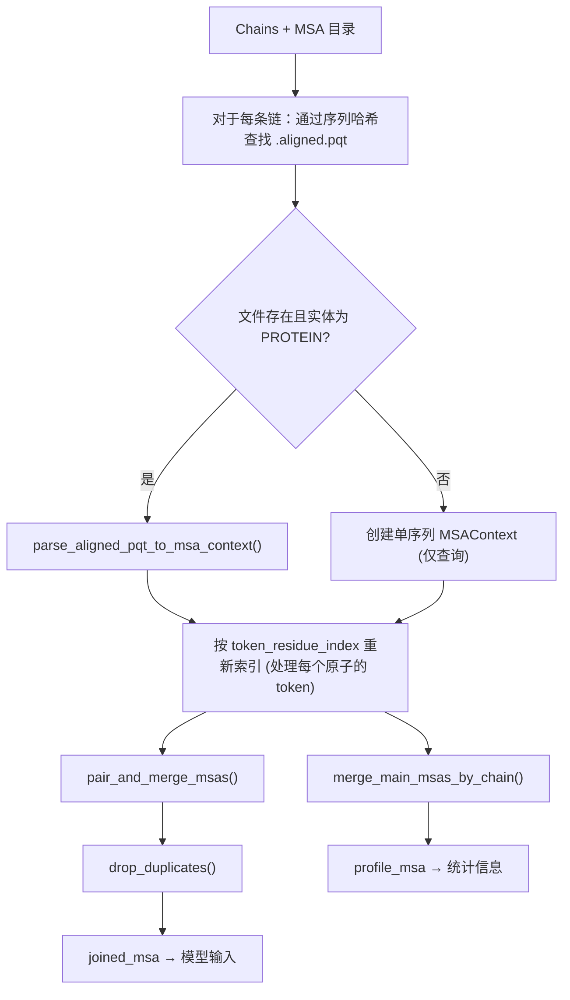

---
slug:14-msa-generation-and-loading
blog_type:normal
---


多序列比对（MSAs）编码了蛋白质序列上的进化约束信息——这对于准确的结构预测至关重要。Chai-1 能够在单序列模式下运行，并具备强大的基线性能，但当进化信息可用时，整合 MSA 会带来显著的提升。本页涵盖了 Chai-1 中**完整的 MSA 生命周期**：比对结果如何在外部生成、以 `.aligned.pqt` 格式持久化保存、加载并预处理为 `MSAContext` 对象，以及最终如何进行特征化以供模型使用。

## .aligned.pqt 文件格式

Chai-1 使用自定义的 **`.aligned.pqt`** 文件格式作为 MSA 在磁盘上的规范表示。从概念上讲，它是一个以 Parquet 数据帧形式存储的增强版 A3M 文件，包含四个必填列：

| 列名 | 类型 | 用途 |
|---|---|---|
| `sequence` | `str` | A3M 序列格式的比对命中（大写 = 比对区，小写 = 插入区，`-` = 缺口） |
| `source_database` | `str` | 来源数据库 — 必须是 `uniprot`、`uniref90`、`bfd_uniclust`、`mgnify` 或 `query` 之一 |
| `pairing_key` | `str` | 用于跨链配对的物种/分类键；空字符串表示未配对 |
| `comment` | `str` | 自由格式的元数据；会被流程忽略 |

第一行必须始终是 `source_database="query"` 的查询序列。文件名由大写查询序列的 SHA-256 哈希值决定：`{sha256_hex}.aligned.pqt`。与原始 `.a3m` 文件相比，这种设计提供了两个关键优势：可以追踪来自不同数据库的比对结果而不会丢失来源信息，并且可以显式指定跨链配对键而无需推断。

该模式在加载时由 `pandera` 模型（`AlignedParquetModel`）强制执行，该模型会验证列类型并将 `source_database` 限制为可识别的值。以下是一个展示表结构的简单示例：

| sequence | source_database | pairing_key | comment |
|---|---|---|---|
| `RKDSS...` | query | | 查询序列 |
| `RKDES...` | uniref90 | | 来自 uniref90 的命中 |
| `RKSES...` | uniprot | Mus musculus | 来自 uniprot 的小鼠序列 |

来源：[aligned_pqt.py](/chai_lab/data/parsing/msas/aligned_pqt.py#L30-L52)，[README.md](/examples/msas/README.md#L1-L30)

## MSA 生成策略

Chai-1 不包含内置的序列搜索引擎。相反，它支持两种获取 MSA 的策略，这两种策略最终都会生成 `.aligned.pqt` 文件。

### ColabFold MMseqs2 服务器

最直接的方法是集成的 **ColabFold MMseqs2 API** 客户端。当向 `run_inference` 传入 `use_msa_server=True` 时，流程会调用 `generate_colabfold_msas()`，该函数将蛋白质序列提交给 ColabFold 服务器并接收配对和非配对的 A3M 结果。流程如下：

1. 对于多链复合物，首先提交**配对搜索**（`pairgreedy` 模式），返回跨链命中共享相同物种的 A3M 行。
2. 单独的**非配对搜索**（`env` 模式）从 UniRef90 + BFD/MGNIFY 数据库中检索更深的单链比对。
3. 配对行通过它们在配对 A3M 中的位置进行索引（排除所有全缺口填充行）；该索引成为 `pairing_key`。
4. 配对集中尚未存在的非配对行将被追加，并带有空的配对键。
5. 来源数据库通过启发式方法分配（`UniRef` 头 → `uniref90`，其他 → `bfd_uniclust`）。
6. 合并后的数据帧作为 `.aligned.pqt` 写入输出 MSA 目录。

<CgxTip>当 `use_templates_server=True` 时，ColabFold 集成还可以选择检索模板命中（`.m8` 文件）。这些文件将作为 `all_chain_templates.m8` 保存在 MSA 目录旁，并由模板处理流程使用。</CgxTip>

### 预生成的 MSA 文件

为了确保可重复性，或者在使用替代搜索工具（例如，针对自定义数据库的 jackhmmer）时，你可以预生成 `.aligned.pqt` 文件，并通过 `msa_directory=Path(...)` 将流程指向该目录。辅助函数 `merge_multi_a3m_to_aligned_dataframe()` 可将多个 A3M 文件（每个来源数据库一个）转换为单个比对 Parquet 文件，自动从 UniProt 头（通过 `OS=` 模式提取物种名）和 UniRef90 头（通过 `TaxID=` 模式提取 TaxID）中提取配对键。

为方便起见，CLI 命令 `chai a3m-to-pqt` 封装了此转换过程。此外，脚本 `scripts/stage_colabfold_outputs_for_chai.py` 可以将现有的 ColabFold 输出目录转换为 Chai-1 格式。

来源：[colabfold.py](/chai_lab/data/dataset/msas/colabfold.py#L213-L459)，[aligned_pqt.py](/chai_lab/data/parsing/msas/aligned_pqt.py#L150-L200)，[species.py](/chai_lab/data/parsing/msas/species.py#L1-L31)

## MSAContext 数据结构

MSA 流程的核心是 `MSAContext`，这是一个类型化的数据类，它将 MSA 表示为形状为 `[msa_depth, n_tokens]` 的 2D 张量集合：

| 字段 | 数据类型 | 含义 |
|---|---|---|
| `tokens` | `uint8` | 分词后的残基索引（词汇表与模型其余部分相同） |
| `pairing_key_hash` | `int32` | 配对键字符串的稳定哈希值；未配对时为 `NO_PAIRING_KEY = -999991` |
| `deletion_matrix` | `uint8` | 每个比对位置前的小写插入计数（上限为 255） |
| `mask` | `bool` | 有效位置为 True；填充位置为 False |
| `sequence_source` | `uint8` | 整数编码的数据库来源（例如，0=BFD_UNICLUST, 2=UNIREF90, 3=UNIPROT） |

`MSAContext` 上的关键操作包括 **`pad()`**（使用哨兵值扩展深度和 token 维度）、**`cat()`**（沿指定维度拼接）、**`apply_mask()`**（用缺口 token 和空配对键填充被遮罩的位置）以及 **`take_rows_with_padding()`**（选择特定行，在索引为 `None` 处插入空填充行）。该类还提供了 `create_single_seq()` 用于从查询构建单行 MSA，以及 `create_empty()` 用于构建零深度的占位符。

来源：[msa_context.py](/chai_lab/data/dataset/msas/msa_context.py#L1-L168)

## 加载流程：从磁盘到 MSAContext

加载流程由 `get_msa_contexts()` 编排，它将 `Chain` 对象列表和 MSA 目录转换为两个 `MSAContext` 实例——一个用于模型输入，另一个用于特征谱统计。



加载步骤在解析期间应用**按来源配额**：UniRef90 上限为 10,000 行，UniProt 上限为 50,000 行，BFD_UNICLUST 实际上无限制（1,000,000）。执行配额后，行按数据库优先级排序（查询优先，然后是 BFD_UNICLUST → MGNIFY → UNIREF90 → UNIPROT）。非蛋白质实体（RNA、DNA、配体）会自动接收仅包含查询序列的空 MSA。

来源：[load.py](/chai_lab/data/dataset/msas/load.py#L1-L83)，[aligned_pqt.py](/chai_lab/data/parsing/msas/aligned_pqt.py#L74-L148)

## A3M 分词

原始 A3M 文本与 `MSAContext` 张量之间的桥梁是分词模块。A3M 格式编码了三类字符：**大写字母**（比对残基）、**小写字母**（相对于查询的插入，计数但不比对）和**破折号**（缺口）。分词器通过一个 256 条目的查找表映射每个字符：

- 大写氨基酸字母 → 残基类型索引（未知字母默认为 `X`）
- 小写字母 → `MAPPED_TOKEN_INSERTION`（增加删除计数器，跳过输出）
- 破折号 → 缺口 token 索引
- 点 → `MAPPED_TOKEN_SKIP`（完全忽略）

核心循环使用 **Numba** 进行 JIT 编译以提高性能，在单次传递中处理拼接的字节字符串。对于每个比对位置，它输出 token 索引和累积的删除计数（上限为 255 以适应 `uint8`）。

来源：[a3m.py](/chai_lab/data/parsing/msas/a3m.py#L1-L134)

## 配对与合并算法

对于多链复合物，跨链 MSA 配对可捕捉共进化信号。`pair_and_merge_msas()` 函数实现了一种贪心配对策略：

1. **计算编辑距离**，即每个 MSA 行与查询行之间的距离（基于 token 的汉明距离）。
2. 从 `(pairing_key_hash, rank_within_key)` 对中**构建唯一键 (ukeys)**，其中排名通过按编辑距离对共享相同配对键的行进行排序来确定。这可以消除非唯一配对键的歧义。
3. **选择配对的 ukeys**，这些 ukeys 出现在所有具有非空 MSA 的链中（交集），最多 `MAX_PAIRED_DEPTH = 8,192` 个。
4. **重新排序每条链的 MSA**：配对行优先（对于缺失的配对使用 `None` 占位符），然后是未配对行，总共最多 `FULL_DEPTH = 16,384`。
5. **跨链合并**，通过填充至相同深度并沿 token 维度拼接。

合并后，`drop_duplicates()` 会删除重复行（按首次出现排序以保持配对-未配对的顺序）。一个单独的 `profile_msa` 也通过简单地沿 token 维度拼接去重后的单链 MSA 来生成——这用于 MSA 特征谱统计，而不是用于配对输入。

来源：[preprocess.py](/chai_lab/data/dataset/msas/preprocess.py#L1-L134)

## MSA 子采样

在推理时，完整的 MSA 深度（最多 16,384）可能会超出内存限制。`subsample_and_reorder_msa_feats_n_mask()` 函数会随机下采样至可配置的目标深度（默认 4,096 行）。采样策略是**大小偏置**的：每行的选择概率与 `覆盖率 × 随机噪声` 成正比，这有利于覆盖更多位置的命中，同时保持随机性。被选中的行在保持顺序的同时被移至特征张量的顶部；掩码张量被截断并补零以维持原始的深度维度。

来源：[utils.py](/chai_lab/data/dataset/msas/utils.py#L1-L87)

## 从 MSA 生成特征

七个特征生成器消费 `MSAContext` 字段并生成模型输入。它们在全局 `feature_factory` 中注册，并按特征类型组织：

| 生成器 | 类型 | 输入 | 输出 | 描述 |
|---|---|---|---|---|
| `MSAFeatureGenerator` | MSA | `msa_tokens` | 独热编码 (32 类) | MSA 行中的 Token 身份 |
| `MSAHasDeletionGenerator` | MSA | `msa_deletion_matrix` | 二进制 | 每个位置的删除计数是否 > 0 |
| `MSADeletionValueGenerator` | MSA | `msa_deletion_matrix` | 缩放浮点数 | 删除计数的 `2/π · arctan(d/3)` |
| `MSAProfileGenerator` | TOKEN | `main_msa_tokens` + `main_msa_mask` | 浮点向量 (32) | 来自特征谱 MSA 的逐位置残基频率谱 |
| `MSADeletionMeanGenerator` | TOKEN | `main_msa_deletion_matrix` + `main_msa_mask` | 浮点标量 | 特征谱 MSA 中每个位置的平均删除数 |
| `IsPairedMSAGenerator` | MSA | `msa_pairkey` + `msa_mask` | 二进制 | Token 是否与第一条链共享配对键 |
| `MSADataSourceGenerator` | MSA | `msa_sequence_source` + `msa_mask` | 独热编码 (6 类) | 数据库来源编码 |

<CgxTip>`MSAProfileGenerator` 使用优化的 `torch.scatter_add` 实现，在单次向量化操作中计算逐位置的残基频率分布，避免了在 MSA 深度上进行显式的 Python 循环。`MSADeletionMeanGenerator` 将 `QUERY` 源重新映射为 `NONE`（Chai-1 特有的设计选择），并使用 `NONE` 作为填充位置的掩码值。</CgxTip>

**MSA 类型**和 **TOKEN 类型**生成器之间的区别在架构上具有重要意义：MSA 类型特征保留完整的 `[batch, depth, tokens, dim]` 形状，并由 MSA 注意力堆栈消费，而 TOKEN 类型特征（特征谱、平均删除数）则在深度上平均化为 `[batch, tokens, dim]`，并与逐 token 嵌入合并。

来源：[msa.py](/chai_lab/data/features/generators/msa.py#L1-L247)，[chai1.py](/chai_lab/chai1.py#L219-L254)

## 端到端数据流

```mermaid
flowchart LR
    subgraph Generation
        CF["ColabFold MMseqs2 API"] --> A3M["A3M Files (paired + unpaired)"]
        ALT["jackhmmer / custom"] --> A3M2["A3M Files (per DB)"]
    end
    subgraph Persistence
        A3M --> PQ["aligned.pqt (Parquet)"]
        A3M2 --> PQ
    end
    subgraph Loading
        PQ --> PARSE["parse_aligned_pqt_to_msa_context()"]
        PARSE --> MC["MSAContext per chain"]
    end
    subgraph Preprocessing
        MC --> PAIR["pair_and_merge_msas()"]
        MC --> PROF["merge_main_msas_by_chain()"]
        PAIR --> DEDUP["drop_duplicates()"]
        DEDUP --> JOINED["joined_msa (model input)"]
        PROF --> PROFILE["profile_msa (statistics)"]
    end
    subgraph Featurization
        JOINED --> FEATS["7 MSA Feature Generators"]
        PROFILE --> FEATS
        FEATS --> BATCH["Collated Batch Tensors"]
    end
```



`AllAtomFeatureContext` 数据类同时持有 `msa_context`（已合并）和 `profile_msa_context`，其 `to_dict()` 方法将所有 MSA 字段扩展为整理器所期望的扁平字典格式。经过整理和填充后，批量张量将被上述特征生成器消费。

来源：[all_atom_feature_context.py](/chai_lab/data/dataset/all_atom_feature_context.py#L1-L96)，[chai1.py](/chai_lab/chai1.py#L283-L350)

## 实际用法

要使用预生成的 MSA 运行推理，请将 `msa_directory` 指向包含 `.aligned.pqt` 文件的文件夹：

```python
from chai_lab.chai1 import run_inference
from pathlib import Path

candidates = run_inference(
    fasta_file=Path("input.fasta"),
    output_dir=Path("outputs"),
    msa_directory=Path("examples/msas"),  # 包含 .aligned.pqt 文件的文件夹
    use_msa_server=False,                 # 不通过服务器生成 MSA
)
```

要通过 ColabFold 服务器动态生成 MSA：

```python
candidates = run_inference(
    fasta_file=Path("input.fasta"),
    output_dir=Path("outputs"),
    use_msa_server=True,                  # 通过 MMseqs2 API 生成 MSA
    msa_server_url="https://api.colabfold.com",
)
```

要检查现有的 `.aligned.pqt` 文件：

```python
import pandas as pd
df = pd.read_parquet("examples/msas/703adc2c74b8d7e613549b6efcf37126da7963522dc33852ad3c691eef1da06f.aligned.pqt")
print(df.head())
```

`use_msa_server` 和 `msa_directory` 选项互斥。无论选择哪种策略，非蛋白质实体都会自动接收空 MSA。

来源：[predict_with_msas.py](/examples/msas/predict_with_msas.py#L1-L46)，[chai1.py](/chai_lab/chai1.py#L283-L370)

## 数据来源配额与优先级

加载 `.aligned.pqt` 文件时，按来源配额控制每个数据库保留多少行。这可防止比例过大的来源淹没其他来源：

| 来源 | 配额 | 优先级 |
|---|---|---|
| QUERY | — (始终第一) | -1 (最高) |
| BFD_UNICLUST | 1,000,000 | 0 |
| MGNIFY | 5,000 | 1 |
| UNIREF90 | 10,000 | 2 |
| UNIPROT | 50,000 | 3 |
| BFD | 5,000 | 4 |
| PDB70 | 5,000 | 5 |

执行配额后，行按优先级排序，确保查询始终占据第 0 行，且高质量来源在 MSA 堆栈中出现得更早。

来源：[data_source.py](/chai_lab/data/parsing/msas/data_source.py#L1-L81)

## 后续内容

MSA 加载和特征化之后，生成的特征张量将流入模型的嵌入和注意力层。要深入了解周边系统，请浏览：

- **[FASTA 解析与实体类型](13-fasta-parsing-and-entity-types)** — 输入序列如何成为馈入 MSA 加载的 `Chain` 对象
- **[ESM 嵌入集成](15-esm-embeddings-integration)** — 互补的单序列嵌入路径
- **[特征生成器基础设计](18-feature-generator-base-design)** — 所有七个 MSA 特征生成器继承的抽象框架
- **[Token 与原子特征生成器](19-token-and-atom-feature-generators)** — MSA 特征如何与结构特征结合