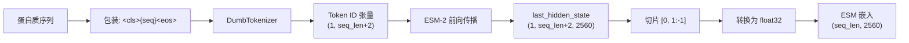
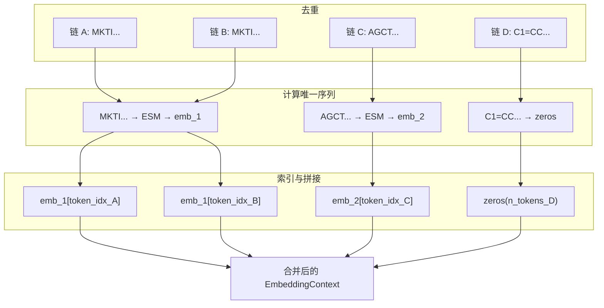

---
slug:15-esm-embeddings-integration
blog_type:normal
---


Chai1 利用 **ESM-2**（Evolutionary Scale Modeling，进化尺度建模）蛋白质语言模型的嵌入作为 token 级别的输入特征，为模型提供了蛋白质序列丰富的预训练语义表示。这种集成在许多场景中替代了对 MSA 进化信息的需求——当 MSA 深度较浅或不可用时，ESM 嵌入能携带关于残基特性、局部结构倾向以及进化约束的充足上下文信号。对于非蛋白质实体（DNA、RNA、配体、聚糖），系统会优雅地回退至零值嵌入，确保异构输入间的张量形状统一，而无需特殊的分支逻辑。

来源：[esm.py](chai_lab/data/dataset/embeddings/esm.py#L1-L181), [embedding_context.py](chai_lab/data/dataset/embeddings/embedding_context.py#L1-L52)

## 架构概述

ESM 集成遵循四阶段流水线：**模型加载 → 逐链嵌入计算 → 上下文组装 → 特征生成**。每个阶段都有明确的职责与边界，使得系统具备良好的模块化和可测试性。

```mermaid
flowchart TD
    A["输入链<br/>(来自 FASTA 解析)"] --> B{"实体类型?"}
    B -->|蛋白质| C["ESM-2 3B 模型<br/>前向传播"]
    B -->|非蛋白质| D["零嵌入<br/>d_emb = 2560"]

    C --> E["EmbeddingContext<br/>逐链"]
    D --> E

    E --> F["Token 残基索引<br/>选择"]
    F --> G["沿 token 维度<br/>链拼接"]
    G --> H["合并后的 EmbeddingContext<br/>&#40;num_tokens, 2560&#41;"]

    H --> I["AllAtomFeatureContext<br/>.embedding_context"]
    I --> J["组装与填充"]
    J --> K["批次张量<br/>esm_embeddings<br/>&#40;batch, num_tokens, 2560&#41;"]

    K --> L["ESMEmbeddings<br/>FeatureGenerator"]
    L --> M["FeatureFactory<br/>.generate()"]
    M --> N["TOKEN 特征<br/>→ 特征嵌入器"]

    style C fill:#4a90d9,color:#fff
    style D fill:#999,color:#fff
    style L fill:#e67e22,color:#fff
    style N fill:#27ae60,color:#fff
```



来源：[esm.py](chai_lab/data/dataset/embeddings/esm.py#L1-L181), [esm_generator.py](chai_lab/data/features/generators/esm_generator.py#L1-L35), [all_atom_feature_context.py](chai_lab/data/dataset/all_atom_feature_context.py#L1-L96)

## ESM-2 模型加载与设备管理

ESM 模型是 `esm2_t36_3B_UR50D`（拥有 30 亿参数的 ESM-2 模型）的 **traced TorchScript** 变体，并量化为 fp16 以实现高效推理。该模型远程托管，并在首次使用时延迟下载。

`esm_model()` 上下文管理器实现了一种**瞬态设备放置**策略：模型被加载到进程内的单例列表（`_esm_model`）中，在 `with` 代码块执行期间移动到目标设备，并在代码块退出时返回 CPU。这种模式确保了 GPU 显存能在嵌入计算完成后立即释放，这对于主干网络和扩散模块同样竞争 GPU 显存的整个推理流水线至关重要。

<CgxTip>`os.register_at_fork(after_in_child=lambda: _esm_model.clear())` 调用对于多进程数据加载至关重要：当 Python 派生工作进程时，父进程中的 CUDA 张量在子进程中会失效。清除单例会强制每个工作进程重新加载模型，从而防止无效的 CUDA 引用。</CgxTip>

| 属性 | 值 |
|---|---|
| 模型 | ESM-2 t36 3B UR50D |
| 精度 | fp16 (traced) |
| 下载 URL | `https://chaiassets.com/chai1-inference-depencencies/esm2/...` |
| 缓存位置 | `{downloads_path}/esm/traced_sdpa_esm2_t36_3B_UR50D_fp16.pt` |
| 嵌入维度 | 2560 |
| 加载策略 | 延迟单例，上下文管理的设备转移 |

来源：[esm.py](chai_lab/data/dataset/embeddings/esm.py#L11-L55)

## Tokenization 与嵌入计算

系统实现了一个轻量级的 **`DumbTokenizer`**，而不是依赖完整的 `esm` Python 包。该分词器使用优先匹配循环，将单个氨基酸字符和特殊 token（`<cls>`、`<eos>`、`<pad>` 等）映射为整数 ID——多字符 token（如 `<cls>`）会在单字符之前进行匹配，从而避免歧义。

每个蛋白质序列的嵌入计算流程如下：

1. **特殊 token 包装**：原始序列在分词前被包装为 `<cls>{seq}<eos>`
2. **前向传播**：Token ID 经过 traced ESM 模型处理，生成 `last_hidden_state`
3. **去除特殊 token**：通过切片 `[0, 1:-1]` 移除 BOS（`<cls>`）和 EOS（`<eos>`）嵌入
4. **向上转型为 float32**：将 fp16 隐状态转换为 float32，以保证下游计算的数值稳定性
5. **断言长度**：运行时断言确认 `seq_len == len(seq)`，以捕获任何分词不对齐的情况



<CgxTip>`DumbTokenizer` 通过 `text.startswith(token, i)` 使用贪婪最长匹配策略。这意味着像 `<mask>` 这样的多字符特殊 token 会在 `<` 字符之前被正确匹配。如果你扩展 token 映射，请确保在迭代顺序中较长的 token 出现在较短的前缀之前——尽管 Python 3.7+ 的字典顺序保证了插入顺序，但仍需将多字符 token 列在前面。</CgxTip>

来源：[esm.py](chai_lab/data/dataset/embeddings/esm.py#L57-L125)

## EmbeddingContext：数据契约

`EmbeddingContext` 是在整个流水线中承载 ESM 嵌入的核心数据结构。它是一个类型化的数据类，包含一个形状为 `(num_tokens, 2560)` 的张量字段，提供三个关键操作：

| 方法 | 用途 | 行为 |
|---|---|---|
| `pad(max_tokens)` | 对齐至批次维度 | 沿 token 维度进行零填充至 `max_tokens` |
| `to_dict()` | 序列化以供批处理 | 返回 `{"esm_embeddings": tensor}` |
| `empty(n_tokens)` | 创建零占位符 | 非蛋白质实体获取 2560 维的零向量 |

`empty()` 类方法是非蛋白质链的关键回退机制——DNA、RNA、配体和聚糖都会获得相同维度的零值嵌入。这种设计避免了下游的条件逻辑：特征生成器和模型只需消费统一的张量，而无需关心实体类型。

来源：[embedding_context.py](chai_lab/data/dataset/embeddings/embedding_context.py#L1-L52)

## 链级组装：get_esm_embedding_context

`get_esm_embedding_context()` 函数是协调点，负责将原始链数据桥接为单个合并的 `EmbeddingContext`。其逻辑遵循**去重 → 计算 → 索引 → 拼接**的模式：

1. **去重**：从所有链中提取唯一蛋白质序列的集合。具有相同序列的多个链共享一次 ESM 前向传播——这对于同源复合物是一个显著的优化。
2. **计算**：调用 `_get_esm_contexts_for_sequences()`，对每个唯一序列运行 ESM，生成一个 `dict[str, EmbeddingContext]` 映射。
3. **索引**：对于每条链，在 `chain.structure_context.token_residue_index` 位置选择嵌入。这处理了 token 结构与原始序列不同的情况（例如，占据多个 token 位置的修饰残基）。
4. **拼接**：通过 `torch.cat` 沿 token 维度合并所有链的嵌入，生成整个输入的单个 `EmbeddingContext`。



代码中包含了一段关于裁剪逻辑的注释，该逻辑当前在推理期间并未执行（`# don't crop any chains during inference`），同时提供了一个存根，展示在需要训练时裁剪的情况下，裁剪索引将如何对展开的嵌入进行切片。

来源：[esm.py](chai_lab/data/dataset/embeddings/esm.py#L127-L181)

## 特征生成流水线

一旦 `EmbeddingContext` 被组装进 `AllAtomFeatureContext` 并通过整理器完成批处理，`ESMEmbeddings` 特征生成器就会从批次中提取原始张量，并将其作为特征传递：

```python
class ESMEmbeddings(FeatureGenerator):
    def __init__(self, ty=FeatureType.TOKEN):
        super().__init__(
            ty=ty,
            encoding_ty=EncodingType.ESM,
            can_mask=False,  # ESM 嵌入始终存在（非蛋白质为零值）
            mult=1,
        )
```

`EncodingType.ESM` 是一种独特的编码类型，它会原样传递张量——无需独热编码、无需 RBF 转换、无需傅里叶特征。`can_mask=False` 标志表示此特征不需要附加掩码通道（与 `EncodingType.IDENTITY` 特征添加掩码位作为最后通道不同）。当值缺失时，掩码值简简单单就是 `0.0`，这与非蛋白质实体的零嵌入策略保持一致。

该特征在全局 `feature_factory` 字典中注册为 `"ESMEmbeddings"`，并在整理后处理期间调用 `FeatureFactory.generate(batch)` 时与其他所有特征一起生成。

来源：[esm_generator.py](chai_lab/data/features/generators/esm_generator.py#L1-L35), [base.py](chai_lab/data/features/generators/base.py#L1-L114), [chai1.py](chai_lab/chai1.py#L174-L177)

## 推理流水线中的集成

`chai1.py` 中的 `make_all_atom_feature_context()` 函数控制着 ESM 嵌入是进行计算还是被跳过：

```python
# 加载 ESM 嵌入
if use_esm_embeddings:
    embedding_context = get_esm_embedding_context(chains, device=esm_device)
else:
    embedding_context = EmbeddingContext.empty(n_tokens=n_actual_tokens)
```

`use_esm_embeddings` 参数在 `run_inference()` 中默认为 `True`，这意味着默认会计算 ESM 嵌入。`esm_device` 参数控制 ESM 模型运行在哪个设备上——它被设置为主推理设备相同的设备，确保 ESM 前向传播在可用时能受益于 GPU 加速。

嵌入计算完成后，`EmbeddingContext` 被存储在 `AllAtomFeatureContext.embedding_context` 中（类型为 `EmbeddingContext | None`）。在整理期间，如果上下文不为 None，它会被填充并通过 `to_dict()` 包含在批次字典中；这会将 `esm_embeddings` 添加到 `inputs` 字典中。随后，`ESMEmbeddings` 生成器会在特征生成期间从 `batch["inputs"]["esm_embeddings"]` 中检索它。

下游流程继续通过**特征嵌入器**（将包括 ESM 在内的所有 TOKEN 类型特征处理为统一的嵌入空间），然后是 **token 嵌入器**（将 token single、pair、atom 和 block-atom-pair 特征组合成主干网络的初始表示）。有关 ESM 特征如何流入模型注意力层的完整图景，请参阅 [Feature Embedding and Token Embedding](9-feature-embedding-and-token-embedding)。

来源：[chai1.py](chai_lab/chai1.py#L350-L475), [all_atom_feature_context.py](chai_lab/data/dataset/all_atom_feature_context.py#L57-L96), [collate.py](chai_lab/data/collate/collate.py#L1-L98)

## 关键设计决策

| 决策 | 理由 |
|---|---|
| **非蛋白质零嵌入** | 统一的张量形状消除了模型代码中的分支逻辑；零值不携带信息，因此模型能学会忽略它们 |
| **延迟单例模型加载** | 避免导入时约 6GB 的内存开销；仅在首次需要时加载模型 |
| **上下文管理的设备转移** | 推理期间 GPU 显存稀缺；ESM 模型在使用后立即移回 CPU |
| **序列去重** | 同源复合物（在蛋白质结构中很常见）共享单次 ESM 传递，节省计算量 |
| **自定义 DumbTokenizer** | 移除了对 `esm` 包的运行时依赖；traced 模型只需要 token ID |
| **TorchScript traced 模型** | 无 Python 开销即可实现优化推理；使用 SDPA 注意力内核加速 |
| **推理后向上转型为 float32** | fp16 嵌入可能会损失精度；float32 确保了下游特征处理的数值稳定性 |

来源：[esm.py](chai_lab/data/dataset/embeddings/esm.py#L1-L181), [embedding_context.py](chai_lab/data/dataset/embeddings/embedding_context.py#L1-L52), [esm_generator.py](chai_lab/data/features/generators/esm_generator.py#L1-L35)

## 后续步骤

- 若要了解 ESM 嵌入在进入主干网络之前如何与其他 token 特征结合，请参阅 [Feature Embedding and Token Embedding](9-feature-embedding-and-token-embedding)。
- 若要查看 MSA 特征如何提供互补的进化信息，请参阅 [MSA Generation and Loading](14-msa-generation-and-loading)。
- 若要获取包含 `EncodingType.ESM` 与其他编码策略对比的完整特征生成器分类，请参阅 [Feature Generator Base Design](18-feature-generator-base-design)。