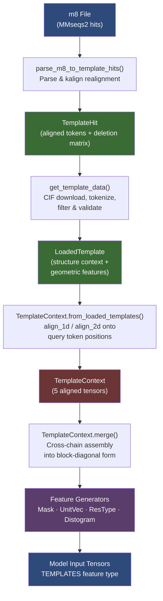

---
slug:16-template-processing-pipeline
blog_type:normal
---


模板处理流水线将通过序列搜索发现的结构同源物，转换为 Chai-1 模型在推理过程中使用的几何对齐且张量化的特征。模板为模型提供了粗粒度的结构先验——骨架帧、残基间距离和单位向量——这些先验衍生自与查询序列具有进化相似性的已知 PDB 结构。该流水线跨越四个架构层：从 MMseqs2 格式的 m8 文件中进行**命中发现**，从 CIF 文件中进行**结构加载**和坐标提取，将模板特征**对齐**到查询 token 位置，以及生成主干网络使用的五个特定于模板的输入张量的**特征生成**。模板仅适用于蛋白质实体；非蛋白质链接收全零的占位上下文，以在多链合并期间保持张量对齐。

来源: [template_hit.py](chai_lab/data/parsing/templates/template_hit.py#L1-L136), [context.py](chai_lab/data/dataset/templates/context.py#L1-L420), [load.py](chai_lab/data/dataset/templates/load.py#L1-L411), [templates.py](chai_lab/data/features/generators/templates.py#L1-L167)

## 流水线架构

模板流水线作为顺序转换运行，从原始搜索命中到模型可使用的特征张量。每个阶段精炼表示，逐渐从无边界的潜在命中集缩小到特征生成器编码的固定形状 `(n_templates, n_tokens, …)` 张量块。



该流水线通过 `get_template_context()` 调用，它为每条链编排完整的序列，然后在输入中合并所有链的结果。当向 [run_inference](chai_lab/chai1.py) 传递 `use_templates_server=True` 时，将触发入口点，这会导致推理数据集将 m8 文件路径传递给模板子系统。

来源: [context.py](chai_lab/data/dataset/templates/context.py#L334-L419), [predict_with_templates.py](examples/templates/predict_with_templates.py#L23-L30)

## 阶段 1: 命中解析与重新对齐

流水线首先解析 **m8 文件**——一种由 MMseqs2 生成的制表符分隔格式，列出了查询实体与 PDB 结构之间的序列比对。`parse_m8_file()` 函数读取 14 列，包括查询/主题标识符、比对边界、一致性百分比、e 值和比特分数，然后按 e 值对每个查询组内的命中进行排序。

`parse_m8_to_template_hits()` 生成器函数通过多步过程将每一行转换为 `TemplateHit` 对象：(1) 将主题标识符拆分为 PDB ID 和链 ID，(2) 通过 `download_cif_file()` 从 RCSB 下载相应的 CIF 文件，(3) 从 gemmi 结构中提取模板的聚合序列（去除缺口标记），(4) 从模板序列中切片出命中子区域，(5) 使用 **kalign** 将查询序列与模板子区域重新对齐，生成取代 m8 原始比对的新比对。此重新对齐步骤至关重要，因为 m8 格式可能无法保留结构特征映射所需的精确残基对应关系。

重新对齐的输出通过 `tokenize_sequences_to_arrays()` 进行 tokenize，将 A3M 格式的比对（其中小写残基表示插入）转换为整数 token 数组和删除矩阵。生成的 `TemplateHit` 是一个冻结的数据类，携带 token 化的比对、删除矩阵、边界索引和缓存 CIF 文件的可选路径。初始化后的验证断言 token 派生的索引与元数据派生的边界匹配，并且不存在负索引。

来源: [m8.py](chai_lab/data/parsing/templates/m8.py#L22-L130), [template_hit.py](chai_lab/data/parsing/templates/template_hit.py#L16-L136), [rcsb.py](chai_lab/data/io/rcsb.py#L9-L18)

### TemplateHit 索引演算

`TemplateHit` 类实现了非平凡的索引算术，用于在存在插入和缺失的情况下映射查询位置和命中位置。三个计算属性构成了该系统的核心：

| 属性 | 形状 | 描述 |
|---|---|---|
| `indices_query` | `(m,)` | 与命中比对对应的查询残基索引，通过定位非缺口 token 派生 |
| `indices_hit_within_subregion` | `(n,)` | 相对于命中子区域起点的命中残基索引，考虑了插入（deletion_matrix 递增）和缺口（gap token 递减） |
| `indices_hit` | `(n,)` | 完整模板序列内的绝对命中索引：`indices_hit_within_subregion + hit_start` |
| `hit_valid_mask` | `(n,)` | 布尔掩码，对于比对中为缺口的命中位置（即查询有残基但模板没有的位置）为 `False` |

`indices_hit_within_subregion` 的计算尤为精细：对递增向量进行累积和，该向量加上缺失计数（以跳过比对中不存在的位置）并减去缺口指示符（以避免对模板缺少残基的位置进行重复计数）。这确保了即使比对引入了不连续性，索引也能正确地反向引用完整的模板结构。

<CgxTip>`hit_valid_mask` 区分了两种类型的比对不对称性：命中中的缺口（命中中为 `"-"`，查询中为残基）产生 `False`，意味着“此查询位置无结构数据”，而命中中的插入（命中有查询中没有的额外残基）由删除矩阵处理，不影响掩码。该掩码对于在 `LoadedTemplate` 特征计算期间将 `template_restype` 和 `template_pseudo_beta_mask` 在缺口位置正确置零至关重要。</CgxTip>

来源: [template_hit.py](chai_lab/data/parsing/templates/template_hit.py#L70-L136)

## 阶段 2: 结构加载与特征提取

`get_template_data()` 函数消耗 `TemplateHit` 迭代器并生成 `LoadedTemplate` 对象列表，将每个命中与其完整的结构上下文配对。对于每个命中，流水线：

1. 通过 `_get_entity_data()` **加载实体数据**，该函数下载 CIF 文件（如果尚未缓存），读取 gemmi 结构，并将其转换为仅过滤蛋白质实体的 `AllAtomEntityData`
2. **拒绝具有修饰残基的命中**，因为修饰的逐原子 token 化会导致 token 计数与逐残基查询序列不匹配
3. 使用 `AllAtomResidueTokenizer` 对实体进行 **Tokenize**，以生成包含真实原子坐标、存在掩码、骨架帧索引和残基类型信息的 `AllAtomStructureContext`
4. 当 `drop_unresolved_from_hits=True` 时，**丢弃未解析的残基**，仅过滤具有有效中心位置的原子

然后，`LoadedTemplate` 数据类从结构上下文计算五个几何特征，均通过 `template_hit_indices` 索引以仅选择命中相关的子区域：

| 特征 | 属性 | 计算 |
|---|---|---|
| `template_restype` | 每个 token 的残基类型 | 在命中位置索引 `token_residue_type`；缺口设为 `"-"` token |
| `template_pseudo_beta_mask` | 每个 token 的布尔值 | 参考原子存在掩码与 `hit_valid_mask` 取与 |
| `template_pseudo_beta_distances` | 成对距离 `(n, n)` | 对伪 beta 坐标执行 `cdist`；被掩码的位置填充为 100.0（将其推至最后一个距离直方图桶） |
| `template_backbone_frame_mask` | 每个 token 的布尔值 | 骨架帧完整性与 `hit_valid_mask` 取与 |
| `template_unit_vector` | 3D 向量 `(n, n, 3)` | N-Cα-C 骨架帧 → `Rigid` 变换 → 逆旋转向量，归一化 |

单位向量的计算在架构上最为重要：它从每个位置的 N、Cα 和 C 骨架原子构建 `Rigid` 对象，然后计算所有配对的旋转不变表示 `R_i^T (t_j - t_i) / ||R_i^T (t_j - t_i)||`。这种 SE(3) 等变编码以一种对全局旋转和平移不变的方式，捕获了骨架帧之间的*相对方向和距离*。

来源: [load.py](chai_lab/data/dataset/templates/load.py#L58-L411), [rigid.py](chai_lab/tools/rigid.py)

### 重叠与包含过滤

`get_template_data()` 函数在加载命中结构之前应用两层空间过滤。首先，它检查命中的查询索引是否与 `query_crop_indices`（裁剪后剩余的 token 位置）重叠。`fully_contained_only` 标志控制命中是必须完全位于裁剪区域内（`issubset`），还是只需具有非零交集即可。其次，在结构加载后，`strict_subsequence_check` 验证加载的 `template_restype` 序列是否是原始比对查询序列的子序列——这可以捕获 gemmi 的残基编号与比对假设不符的情况。未通过任一检查的命中将被静默丢弃。流水线默认最多加载 `max_loaded_templates=4` 个命中，按 e 值顺序取前几个有效的命中。

来源: [load.py](chai_lab/data/dataset/templates/load.py#L262-L410)

## 阶段 3: 对齐到查询 Token 空间

生成 `LoadedTemplate` 对象后，必须将它们从其原生坐标空间（由命中位置索引）映射到查询的 token 空间。`TemplateContext.from_loaded_templates()` 类方法使用 [align.py](chai_lab/data/dataset/templates/align.py) 中的两个对齐原语来编排此操作：

**`align_1d`** 通过在比对索引处散射值，将每个 token 的特征（`template_restype`、`template_pseudo_beta_mask`、`template_backbone_frame_mask`）从命中索引位置映射到 `(n_templates, n_tokens)` 张量。未映射的位置接收填充值（残基类型为缺口 token `"-"`，掩码为 `False`）。

**`align_2d`** 通过从命中索引对到 `(n_templates, n_tokens, n_tokens, ...)` 张量映射成对特征（`template_distances`、`template_unit_vector`）。对于每个模板，它从比对索引构建一个布尔掩码，然后使用此掩码的外积来识别 `(n_tokens, n_tokens)` 网格中哪些条目对应于模板的数据，将展平的模板值写入这些位置。

`from_loaded_templates()` 中的 `apply_crop` 标志控制比对索引是相对于裁剪后的查询（`cropped_template_query_match_indices`，通过 `torch.searchsorted`）还是原始查询（`template_query_match_indices`）计算。在推理期间，使用 `apply_crop=False`，因为完整查询可用。

```
Crop indices:               |-------------------------------------|
Query:      --------------------------------------------------------
Hit on 1B2D:                       |--------------------------|
                                    ↑ hit_start        hit_end ↑

LoadedTemplate maps:
  template_hit_indices  → indices within the full hit structure
  template_query_match_indices → indices within the full query
  cropped_template_query_match_indices → indices within the cropped query
```

来源: [context.py](chai_lab/data/dataset/templates/context.py#L243-L331), [align.py](chai_lab/data/dataset/templates/align.py#L17-L67), [load.py](chai_lab/data/dataset/templates/load.py#L1-L17)

## 阶段 4: 跨链合并

对于多链输入，每条链独立生成自己的 `TemplateContext`。`TemplateContext.merge()` 类方法通过以下方式将这些上下文组合成单个统一上下文：

1. 将每个每链上下文**填充**到相同数量的模板（各链中的最大值）
2. 沿 token 维度**拼接** 1D 特征（`template_restype`、`template_pseudo_beta_mask`、`template_backbone_frame_mask`）
3. 将 2D 特征（`template_distances`、`template_unit_vector`）**组装**成分块对角结构，其中每条链的 `(n_i, n_i)` 成对矩阵占据合并的 `(N, N)` 矩阵中相应的对角块（其中 `N = Σ n_i`）

分块对角构造反映了模板命中是针对每条链的生物学现实：对链 A 的命中不提供关于链 B 的距离信息，因此跨链条目保持为零。随后由特征生成器应用的 `same_asym` 掩码确保仅使用链内模板信息。

对于没有模板命中的链（非蛋白质实体或没有通过过滤的蛋白质），插入填充了缺口的 `template_restype` 和全零掩码/距离的空 `TemplateContext`，以保持对齐维度。

来源: [context.py](chai_lab/data/dataset/templates/context.py#L118-L186), [context.py](chai_lab/data/dataset/templates/context.py#L334-L419)

## 阶段 5: 特征生成

最后阶段通过四个特征生成器将 `TemplateContext` 张量转换为模型可用的特征，均归类在 `FeatureType.TEMPLATES` 下：

| 生成器 | 输入张量 | 输出形状 | 编码 | 核心逻辑 |
|---|---|---|---|---|
| `TemplateMaskGenerator` | `template_backbone_frame_mask`, `template_pseudo_beta_mask` | `(b, t, n, n, 2)` | IDENTITY | 掩码外积 × `same_asym` 掩码；拼接骨架和伪 beta 掩码 |
| `TemplateUnitVectorGenerator` | `template_unit_vector` | `(b, t, n, n, 3)` | IDENTITY | 乘以 `same_asym` 将链间向量置零 |
| `TemplateResTypeGenerator` | `template_restype` | `(b, t, n, n, 32)` | OUTERSUM | 独热残基类型的外和；32 维嵌入 |
| `TemplateDistogramGenerator` | `template_distances` | `(b, t, n, n, 38)` | ONE_HOT | 距离离散化为 38 个桶 (3.25Å–50.75Å)；链间被掩码 |

<CgxTip>`same_asym` 掩码在每个生成器中通过比较 `token_asym_id` 值计算：`rearrange(asym_ids, "b t -> b 1 t 1 1") == rearrange(asym_ids, "b t -> b 1 1 t 1")`。这确保模板特征严格限定在链内——链间位置接收零（对于单位向量）或掩码值（对于距离直方图），防止跨链模板信号泄漏到模型中。距离直方图桶定义为 `torch.linspace(3.25, 50.75, 38)[1:]`，`torch.searchsorted` 将连续距离映射到这些桶中，掩码填充值 100.0 保证落入最后一个“距离过远”桶。</CgxTip>

`TemplateResTypeGenerator` 使用 `EncodingType.OUTERSUM`，意味着计算两个独热残基类型向量的外和，生成一个 `(n_res_types, n_res_types)` 的成对特征，捕获每对位置出现的残基类型。32 的嵌入维度压缩了这种高维外和表示。`TemplateDistogramGenerator` 使用带有 `can_mask=True` 的 `EncodingType.ONE_HOT`，允许掩码值替换链间距离。

来源: [templates.py](chai_lab/data/features/generators/templates.py#L28-L167), [feature_type.py](chai_lab/data/features/feature_type.py#L8-L16)

## 与推理流水线的集成

模板系统通过 `AllAtomFeatureContext` 插入更广泛的推理流水线，该上下文与结构、MSA、嵌入和约束上下文一起持有 `TemplateContext`。在推理期间，使用 m8 文件路径和 CIF 缓存文件夹（可通过 `CHAI_TEMPLATE_CIF_FOLDER` 环境变量配置，默认为 `~/.chai_downloads/template_cifs`）为每条链调用 `get_template_context()`。生成的 `TemplateContext` 在 `AllAtomFeatureContext.pad()` 调用期间被填充到 `MAX_NUM_TEMPLATES=4` 个模板和完整的 token 计数。

`TemplateContext` 上的 `to_dict()` 方法将五个核心张量和派生元数据（`num_templates`、`template_mask`）添加到批次字典中，通过 `batch["inputs"]` 键约定使它们可用于特征生成器。然后，模板特征张量与 MSA 和成对特征一起被主干网络的模板注意力层消耗。

```python
# Simplified invocation path during inference
candidates = run_inference(
    fasta_file=fasta_path,
    use_templates_server=True,  # Enables template search & loading
    ...
)
```

来源: [all_atom_feature_context.py](chai_lab/data/dataset/all_atom_feature_context.py#L20-L95), [predict_with_templates.py](examples/templates/predict_with_templates.py#L23-L30), [context.py](chai_lab/data/dataset/templates/context.py#L36-L38)

## 模板上下文张量摘要

`TemplateContext` 数据类持有五个冻结的张量，共同编码结构模板：

| 字段 | 类型 | 形状 | 默认值 (空) | 用途 |
|---|---|---|---|---|
| `template_restype` | `Int32` | `(T, N)` | 缺口 token `"-"` | 每个模板位置的残基标识 |
| `template_pseudo_beta_mask` | `Bool` | `(T, N)` | `False` | 是否存在 Cβ（或甘氨酸的 Cα）坐标 |
| `template_backbone_frame_mask` | `Bool` | `(T, N)` | `False` | 是否存在用于帧计算的所有 N-Cα-C 骨架原子 |
| `template_distances` | `Float32` | `(T, N, N)` | `0.0` | 伪 beta 成对距离；被掩码的配对为 100.0 |
| `template_unit_vector` | `Float32` | `(T, N, N, 3)` | `0.0` | 骨架帧之间旋转不变的相对位置向量 |

其中 `T` = 模板数量（最多 4 个），`N` = token 数量。`template_mask` 属性（`template_restype != gap_token`）提供了一个方便的布尔值，用于确定哪些模板位置携带实际结构信息与填充。

来源: [context.py](chai_lab/data/dataset/templates/context.py#L41-L107)

## 关键设计决策

**模板范围仅限蛋白质。** `_get_entity_data()` 函数显式过滤 `EntityType.PROTEIN`，并且 `get_template_context()` 仅尝试为蛋白质链加载模板。这是因为 m8 命中格式和骨架帧/单位向量计算假定聚合体骨架几何结构。

**通过 kalign 重新对齐取代 m8 坐标。** 流水线不信任 m8 文件的比对边界，而是使用 kalign 将查询与模板子区域重新对齐。当 m8 比对边界与 gemmi 的残基编号不能完美对应时，这确保了正确性，代价是每次命中需要额外的比对计算。

**拒绝修饰残基。** 包含修饰残基（PTM、非标准氨基酸）的模板结构被丢弃，因为逐原子 token 化导致 token 计数与逐残基查询序列不匹配。这是一个深思熟虑的权衡：牺牲结构覆盖范围以维持索引对齐完整性。

**距离直方图掩码使用大哨兵值。** 不为距离矩阵存储单独的掩码，而是将被掩码的位置填充为 100.0Å，保证超过最大距离直方图桶边界 (50.75Å)，从而在 `torch.searchsorted` 期间落入“距离过远”桶。这避免了额外的掩码张量，但将掩码逻辑与分桶参数耦合。

来源: [load.py](chai_lab/data/dataset/templates/load.py#L234-L258), [load.py](chai_lab/data/dataset/templates/load.py#L324-L330), [m8.py](chai_lab/data/parsing/templates/m8.py#L97-L101), [templates.py](chai_lab/data/features/generators/templates.py#L147-L166)

## 下一步

此流水线生成的模板特征与 MSA 和成对特征一起在主干网络的注意力层中被消耗。要了解这些模板特征如何集成到模型的注意力机制中，请参阅 [主干网络循环与注意力](10-trunk-recycling-and-attention)。有关模板特征如何与其他特征类型一起生成的更广泛上下文，请参阅 [成对与约束特征生成器](20-pairwise-and-restraint-feature-generators)。有关触发模板发现的上游输入，请参阅 [特征上下文组装](8-feature-context-assembly)。