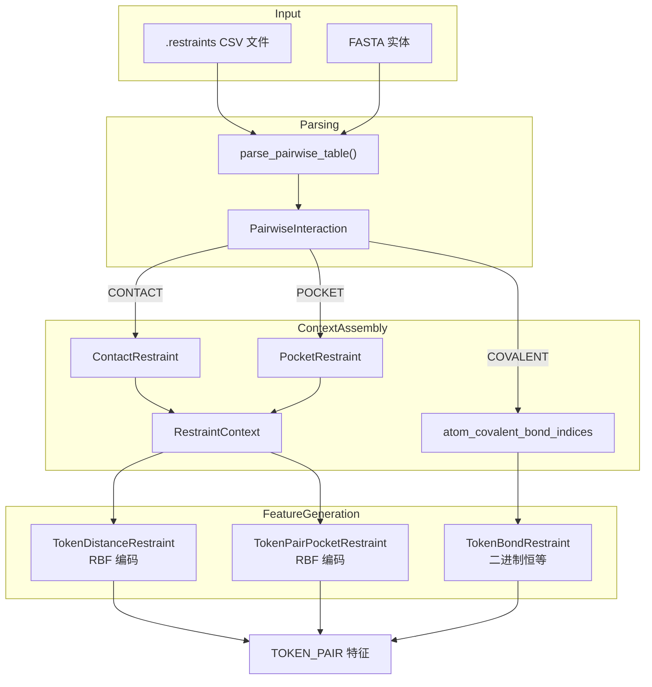

---
slug:17-restraint-and-covalent-bond-system
blog_type:normal
---


Chai-1 约束与共价键系统提供了一个统一的基于 CSV 的接口，用于将三种不同类型的先验结构知识编码到模型的特征空间中：**接触**约束（残基-残基邻近度）、**口袋**约束（残基-链邻近度）以及**共价**键（实体间化学键连接）。每种类型在解析、上下文组装和特征生成的过程中遵循不同的路径，最终产生不同的 TOKEN_PAIR 特征，这些特征会使扩散去噪过程偏向于结构一致的输出。当具备关于分子间接触的实验证据或领域知识时，理解该系统对于引导预测至关重要。

来源：[restraints.py](chai_lab/data/parsing/restraints.py#L1-L205)、[restraint_context.py](chai_lab/data/dataset/constraints/restraint_context.py#L1-L137)

## 架构概述

约束系统作为一个三阶段的流水线运行：**解析**（CSV → 类型化交互对象）、**上下文组装**（交互对象 → 类型化约束组）和**特征生成**（约束组 → token 对张量）。共价键在解析后发生分叉——它们完全绕过 `RestraintContext`，而是输入到原子级键索引中，这些索引随后由 `TokenBondRestraint` 解析为 token 对特征。接触约束和口袋约束共享 `RestraintContext` 路径，但会产生非对称的、结构上截然不同的特征矩阵。



<CgxTip>共价键被有意排除在 `RestraintContext` 之外——`load_manual_restraints_for_chai1` 函数显式地透传了 `COVALENT` 交互，并附带了一条空操作注释：“共价键在别处处理，不作为约束。”这意味着共价键通过 `bond_utils.get_atom_covalent_bond_pairs_from_constraints` 遵循一条完全独立的数据路径，而非约束上下文流水线。</CgxTip>

来源：[restraints.py](chai_lab/data/parsing/restraints.py#L1-L205)、[restraint_context.py](chai_lab/data/dataset/constraints/restraint_context.py#L89-L110)、[token_bond.py](chai_lab/data/features/generators/token_bond.py#L1-L64)、[token_dist_restraint.py](chai_lab/data/features/generators/token_dist_restraint.py#L1-L273)、[token_pair_pocket_restraint.py](chai_lab/data/features/generators/token_pair_pocket_restraint.py#L1-L248)

## 约束文件格式

所有约束均被指定为 CSV 文件（通常带有 `.restraints` 扩展名），并通过 Pandera 依据严格的 `PairwiseConstraintDataframeModel` 模式进行验证。每行定义了一个成对交互，包含以下列：

| 列名 | 类型 | 必需 | 描述 |
|---|---|---|---|
| `restraint_id` | `str` | 是（唯一） | 约束的唯一标识符 |
| `chainA` | `str` | 是 | 伙伴 A 的子链 ID |
| `res_idxA` | `str` | 有条件 | A 的残基标识符（格式：`{name}{pos}`），链级别时为空 |
| `chainB` | `str` | 是 | 伙伴 B 的子链 ID |
| `res_idxB` | `str` | 有条件 | B 的残基标识符，链级别时为空 |
| `connection_type` | `str` | 是 | 以下之一：`covalent`、`contact`、`pocket` |
| `confidence` | `float` | 否（默认 1.0） | 置信度分数，范围 [0.0, 1.0] |
| `min_distance_angstrom` | `float` | 否（≥0） | 最小距离（埃） |
| `max_distance_angstrom` | `float` | 否（≥0） | 最大距离（埃） |
| `comment` | `str` | 否 | 自由文本注释 |

`res_idx` 列使用复合格式：`{residue_name}{position}[@{atom_name}]`。例如，`C387` 表示位于从 1 开始计数的位置 387 处的半胱氨酸残基；`N437@N` 表示位于位置 437 处的天冬酰胺的主干氮原子；`@C1` 表示非聚合物实体的 C1 原子（残基名称为空）。解析函数 `_parse_res_idx` 根据 `@` 分隔符进行拆分，将残基标识符与原子指定符分离开来。

来源：[restraints.py](chai_lab/data/parsing/restraints.py#L22-L47)、[restraints.py](chai_lab/data/parsing/restraints.py#L130-L165)

## 交互类型语义

每种 `connection_type` 都承载着不同的结构语义和验证规则，这些规则在 `PairwiseInteraction.__post_init__` 中强制执行：

**接触**（`contact`）——指定两个特定残基应在距离阈值之内。必须同时提供 `res_idxA` 和 `res_idxB`（或其原子名称）。该特征在 token 对矩阵中被编码为距离阈值，并且是**非对称的**（仅在 `[left, right]` 处设置，而不在 `[right, left]` 处设置）。示例：`A,C387 ↔ B,Y101` 表示链 A 上的 Cys387 应靠近链 B 上的 Tyr101。

**口袋**（`pocket`）——指定一条链上的特定残基应靠近另一条链的所有残基。伙伴 A 是**链级别**的（无 `res_idxA`），伙伴 B 是**token 级别**的（必须指定 `res_idxB`）。不得指定原子。特征矩阵在单个口袋 token 与口袋链中的每个 token 之间设置约束。示例：`B,(chain) ↔ A,C387` 表示链 B 的所有残基应靠近链 A 上的 Cys387。

**共价**（`covalent`）——指定两个实体的原子之间存在共价化学键。两个伙伴都应通过 `@` 语法指定原子名称。距离界限通常设置为 `0.0`（精确的成键距离）。示例：`A,C217@SG ↔ B,@S1` 表示链 A 上 Cys217 的硫原子与链 B 上的 S1 原子共价结合。

| 属性 | 接触 | 口袋 | 共价 |
|---|---|---|---|
| 伙伴 A 特异性 | Token/原子 | 链级别 | 原子 |
| 伙伴 B 特异性 | Token/原子 | Token 级别 | 原子 |
| 距离编码 | 阈值 → RBF | 阈值 → RBF | 二进制（键存在） |
| 特征对称性 | 非对称 | 非对称 | 对称（通过 `und_self`） |
| 特征生成器 | `TokenDistanceRestraint` | `TokenPairPocketRestraint` | `TokenBondRestraint` |
| 数据路径 | `RestraintContext` | `RestraintContext` | `atom_covalent_bond_indices` |

来源：[restraints.py](chai_lab/data/parsing/restraints.py#L50-L128)、[restraint_context.py](chai_lab/data/dataset/constraints/restraint_context.py#L89-L110)

## 解析与验证流水线

入口点 `parse_pairwise_table` 读取 CSV 文件，根据 `PairwiseConstraintDataframeModel` 对其进行验证，用 1.0 填充缺失的置信度值，并将每一行转换为 `PairwiseInteraction` 实例。Pandera 模式强制要求：唯一的 `restraint_id`、非空的链 ID、`connection_type` 必须是三个枚举值之一、`confidence` 在 [0, 1] 之间，以及距离界限 ≥ 0。辅助函数 `_parse_row` 进一步使用 `_parse_res_idx` 将 `res_idx` 字段分解为独立的残基标识符和原子名称。

从 1 开始的残基索引是一个关键的设计选择：`res_idxA_pos` 提取第一个字符（残基单字母名称）之后的数字部分，当未给出位置时默认返回 1。这个基于 1 的索引随后在 `load_manual_restraints_for_chai1` 中通过 `constraint.res_idxA_pos - 1` 转换为从 0 开始的索引。

来源：[restraints.py](chai_lab/data/parsing/restraints.py#L130-L205)、[restraint_context.py](chai_lab/data/dataset/constraints/restraint_context.py#L100-L106)

## 上下文组装：从交互到约束组

`load_manual_restraints_for_chai1` 函数将解析后的 `PairwiseInteraction` 对象桥接到特定于特征生成器的 `RestraintGroup` 数据类。它执行三个关键转换：(1) 从基于 1 的残基索引到基于 0 的**索引转换**，(2) 使用 `restype_1to3_with_x` 从单字母到三字母代码的**残基名称扩展**，以及 (3) **结构分解**——接触约束变为具有显式左/右 token 位置的 `ContactRestraint` 组，而口袋约束变为具有不同链级别和 token 级别字段的 `PocketRestraint` 组。共价交互被显式跳过，并附有注释“在别处处理”。

<CgxTip>约束文件中使用的子链 ID 方案必须与传递给 `load_chains_from_raw` 的 `entity_name_as_subchain` 参数相匹配。如果约束通过实体名称引用链 ID（例如，`G`、`H`），但 `entity_name_as_subchain=False`（这会分配 `A`、`B`），则约束将无法解析，并且所有特征都将为空。测试套件显式验证了此兼容性矩阵。</CgxTip>

来源：[restraint_context.py](chai_lab/data/dataset/constraints/restraint_context.py#L82-L137)、[test_restraints.py](tests/test_restraints.py#L45-L126)

## 特征生成：接触约束

`TokenDistanceRestraint` 生成一个通过具有 6 个半径的 RBF（径向基函数）编码的 `TOKEN_PAIR` 特征。当用户提供的 `ContactRestraint` 组可用时，`generate_from_restraint` 通过匹配 `asym_id`、`residue_index` 和 `residue_name`（带有断言强制的唯一性）将每个组解析为特定的 token 对。距离阈值被写入约束矩阵的 `[left_token, right_token]` 位置，然后通过应用 RBF 编码的 `make_feature` 传递。如果没有用户约束，矩阵将用 `ignore_idx = -1.0` 填充。

该生成器在特征工厂中注册时的参数为 `include_probability=1.0`、`size=0.33`（用于训练时采样的几何分布）、`min_dist=6.0`、`max_dist=30.0` 和 `num_rbf_radii=6`。`add_distance_restraint` 方法强制每个约束恰好解析为一个左侧和一个右侧 token——如果多个 token 匹配，或者残基名称与解析的输入不一致，断言将会失败。

来源：[token_dist_restraint.py](chai_lab/data/features/generators/token_dist_restraint.py#L42-L273)、[chai1.py](chai_lab/chai1.py#L223-L230)

## 特征生成：口袋约束

`TokenPairPocketRestraint` 在内部将采样逻辑委托给 `TokenDistanceRestraint`，但生成结构上不同的特征：它在**单个口袋 token** 与口袋链中的**所有 token** 之间设置约束。`add_pocket_restraint` 方法首先识别口袋 token（断言其唯一性），然后跨 `restraint_mat[pocket_token_mask, pocket_chain_asym_mask]` 广播距离阈值。这意味着 CSV 中的单行口袋约束会生成 `N` 个非空特征条目，其中 `N` 是口袋链中的 token 数量。

该生成器注册时的参数为 `size=0.33`、`include_probability=1.0`、`min_dist=6.0`、`max_dist=20.0` 和 `num_rbf_radii=6`。与接触约束一样，该特征是非对称的——约束从口袋 token 流向口袋链 token，而非反向。

来源：[token_pair_pocket_restraint.py](chai_lab/data/features/generators/token_pair_pocket_restraint.py#L46-L248)、[chai1.py](chai_lab/chai1.py#L231-L238)

## 特征生成：共价键

`TokenBondRestraint` 采取了与基于距离的约束根本不同的方法。它操作 `atom_covalent_bond_indices`——一个由 `get_atom_covalent_bond_pairs_from_constraints` 产生的 `(left_atom_indices, right_atom_indices)` 张量对列表。对于每个键，它通过在 `atom_token_index` 上的 `torch.gather` 将原子索引映射到 token 索引，然后设置 `bond_feature[left_token, right_token] = 1`。该特征使用 `EncodingType.IDENTITY`（二进制）而不是 RBF，并且 `apply_mask` 被重写以返回未屏蔽的特征，确保共价键绝不会因为批量掩码策略而被屏蔽掉。

生成的特征是一个二进制 `TOKEN_PAIR` 矩阵，其中 `1` 表示两个 token 之间存在共价键，`0` 表示不存在键。这对于糖基化（NAG-蛋白质键）和配位配体（例如，Cys–S–配体键）至关重要。

来源：[token_bond.py](chai_lab/data/features/generators/token_bond.py#L1-L64)、[chai1.py](chai_lab/chai1.py#L262)

## 推理集成

在推理时，约束通过 `run_inference` 的 `constraint_path` 参数传入。流程通过 `make_all_atom_feature_context` 进行，该函数读取并解析约束文件，从 FASTA 输入加载链，并组装 `RestraintContext`。共价键信息同时通过 `get_atom_covalent_bond_pairs_from_constraints` 提取到 `atom_covalent_bond_indices` 中。然后，`Collate` 类将所有特征上下文批量处理，`FeatureFactory` 调用每个已注册的生成器以生成最终的特征张量。

```python
# 接触约束示例：残基-残基邻近度
candidates = run_inference(
    fasta_file=fasta_path,
    output_dir=output_dir,
    constraint_path=Path("contact.restraints"),
    # ... 标准推理参数
)

# 共价键示例：蛋白质-聚糖连接
candidates = run_inference(
    fasta_file=Path("1ac5.fasta"),
    output_dir=output_dir,
    constraint_path=Path("1ac5.restraints"),
    # ... 标准推理参数
)
```

来源：[predict_with_restraints.py](examples/restraints/predict_with_restraints.py#L1-L36)、[predict_covalent_ligand.py](examples/covalent_bonds/predict_covalent_ligand.py#L1-L28)、[predict_glycosylated.py](examples/covalent_bonds/predict_glycosylated.py#L1-L28)

## 实践中的约束文件示例

代码库中包含三个具体的约束示例，演示了每种交互类型：

**接触**（`examples/restraints/contact.restraints`）：抗体重/轻链与抗原之间的两个残基-残基接触，`max_distance_angstrom=5.5` 且 `confidence=1.0`：
```csv
chainA,res_idxA,chainB,res_idxB,connection_type,confidence,min_distance_angstrom,max_distance_angstrom,comment,restraint_id
A,C387,B,Y101,contact,1.0,0.0,5.5,protein-heavy,restraint_1
C,I32,A,S483,contact,1.0,0.0,5.5,protein-light,restraint_2
```

**口袋**（`examples/restraints/pocket.restraints`）：两个链级别口袋约束，其中链 B 和链 C 应靠近链 A 上的特定残基：
```csv
chainA,res_idxA,chainB,res_idxB,connection_type,confidence,min_distance_angstrom,max_distance_angstrom,comment,restraint_id
B,,A,C387,pocket,1.0,0.0,5.5,protein-heavy,restraint_0
C,,A,S483,pocket,1.0,0.0,5.5,protein-light,restraint_1
```

**共价——聚糖**（`examples/covalent_bonds/1ac5.restraints`）：两个从天冬酰胺残基到 NAG C1 原子的 N-连接糖基化键，`max_distance_angstrom=0.0`：
```csv
chainA,res_idxA,chainB,res_idxB,connection_type,confidence,min_distance_angstrom,max_distance_angstrom,comment,restraint_id
A,N437@N,B,@C1,covalent,1.0,0.0,0.0,protein-glycan,bond1
A,N445@N,C,@C1,covalent,1.0,0.0,0.0,protein-glycan,bond2
```

**共价——配体**（`examples/covalent_bonds/8cyo.restraints`）：Cys217 硫原子与配体 S1 原子之间的硫醚键：
```csv
chainA,res_idxA,chainB,res_idxB,connection_type,confidence,min_distance_angstrom,max_distance_angstrom,comment,restraint_id
A,C217@SG,B,@S1,covalent,1.0,0.0,0.0,protein-ligand,bond1
```

请注意此模式：聚糖和配体实体在 `res_idxB` 中的残基名称为空（例如，`@C1`、`@S1`），因为非聚合物实体缺乏残基级别的命名——只有原子名称是有意义的。

来源：[contact.restraints](examples/restraints/contact.restraints#L1-L3)、[pocket.restraints](examples/restraints/pocket.restraints#L1-L4)、[1ac5.restraints](examples/covalent_bonds/1ac5.restraints#L1-L3)、[8cyo.restraints](examples/covalent_bonds/8cyo.restraints#L1-L3)

## 子链 ID 兼容性与错误处理

一个关键的操作关注点是约束文件中的链 ID 与链加载期间分配的子链 ID 之间的映射。`load_chains_from_raw` 中的 `entity_name_as_subchain` 参数控制子链 ID 是派生自 FASTA 实体名称（例如，`G`、`H`）还是按字母顺序自动分配（例如，`A`、`B`）。约束链引用（`chainA`、`chainB`）必须使用相同的命名方案。不匹配会导致特征生成器无法找到匹配的 token，从而产生全空的特征张量——在无报错的情况下静默降低预测质量。

`TokenDistanceRestraint` 和 `TokenPairPocketRestraint` 生成器都通过回退到用 `ignore_idx = -1.0` 填充的矩阵来处理缺失或无法解析的约束，这通过带有错误日志记录的 `try/except` 捕获。这种优雅降级意味着模型在没有约束信号的情况下继续运行而不是崩溃，但用户不会收到约束被丢弃的显式通知。

来源：[test_restraints.py](tests/test_restraints.py#L45-L126)、[token_dist_restraint.py](chai_lab/data/features/generators/token_dist_restraint.py#L161-L170)、[token_pair_pocket_restraint.py](chai_lab/data/features/generators/token_pair_pocket_restraint.py#L132-L141)

## 后续步骤

- 要了解这些特征如何被编码到模型的输入空间中，请参阅[成对与约束特征生成器](20-pairwise-and-restraint-feature-generators)，其中涵盖了 RBF 编码、恒等编码以及基础的 `FeatureGenerator` 抽象。
- 对于输入到约束解析的更广泛输入数据流水线，请参阅[FASTA 解析与实体类型](13-fasta-parsing-and-entity-types)，其中定义了由约束链 ID 引用的实体名称。
- 要了解约束特征如何与扩散过程交互，请参阅[扩散去噪过程](11-diffusion-denoising-process)，该过程在结构生成期间消费这些 token 对特征。