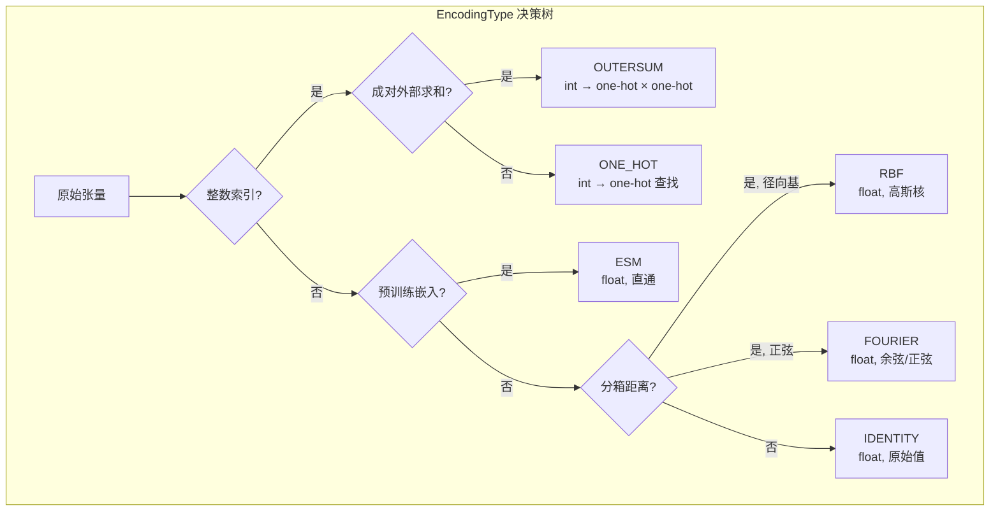
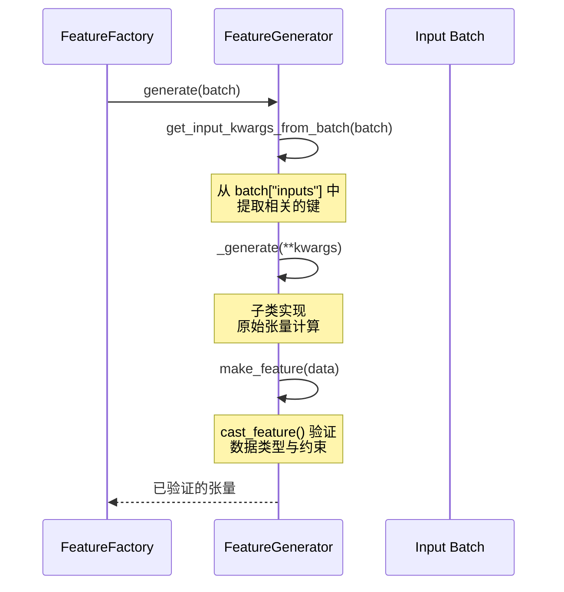

---
slug:18-feature-generator-base-design
blog_type:normal
---


Chai-1 的特征工程系统构建在严谨的抽象类层次结构之上，该结构将原始批次数据转换为可供模型使用的数值编码张量。每一个特征——无论是独热编码的残基类型、经 RBF 编码的距离约束，还是浮点参考位置——都遵循相同的 `FeatureGenerator` 契约流经处理流程：检查批次数据，提取相关字段，计算原始张量，然后验证并转换其数据类型。本文将剖析实现这种统一性的架构骨架：`FeatureGenerator` 抽象基类（ABC）、其 `EncodingType` 和 `FeatureType` 枚举、掩码协议，以及 `FeatureFactory` 编排器。

来源: [base.py](chai_lab/data/features/generators/base.py#L1-L114), [feature_type.py](chai_lab/data/features/feature_type.py#L1-L17), [feature_factory.py](chai_lab/data/features/feature_factory.py#L1-L27)

## FeatureType：结构分类体系

在生成特征之前，必须声明它存在于模型输入张量拓扑结构中的*位置*。`FeatureType` 枚举将所有特征划分为八个空间类别，这些类别与模型的嵌入层直接对应：

| FeatureType | 张量阶数 | 空间形状 | 示例生成器 |
|---|---|---|---|
| `TOKEN` | 3 | `(B, N, C)` | `ResidueType`, `ESMEmbeddings` |
| `TOKEN_PAIR` | 4 | `(B, N, N, C)` | `RelativeChain`, `TokenBondRestraint` |
| `ATOM` | 3 | `(B, A, C)` | `AtomElementOneHot`, `RefPos` |
| `ATOM_PAIR` | 4 | `(B, A, A, C)` | `BlockedAtomPairDistances` |
| `MSA` | 4 | `(B, D, N, C)` | `MSAFeatureGenerator` |
| `TEMPLATES` | 5 | `(B, T, N, N, C)` | `TemplateDistogramGenerator` |
| `RESIDUE` | 3 | `(B, R, C)` | (旧版 / 保留) |
| `PAIR` | 4 | `(B, R, R, C)` | (旧版 / 保留) |

其中 **B** = 批次，**N** = Token，**A** = 原子，**D** = MSA 深度，**T** = 模板数量，**C** = 特征通道。模型的嵌入模块按这些类型对特征进行分组消费——单一表示馈送至 Token/原子嵌入器，而成对表示则馈送至成对注意力模块。这种分类体系确保了工厂能够将每个生成的张量路由到正确的下游消费者，而无需进行运行时检查。

来源: [feature_type.py](chai_lab/data/features/feature_type.py#L1-L17)

## EncodingType：数值表示契约

每个生成器都声明了一个 `EncodingType`，它控制着两项关键行为：**数据类型验证**（通过 `cast_feature`）和**掩码语义**（通过 `mask_value`）。这六种编码类型涵盖了系统中的所有数值模式：



`cast_feature` 函数在生成时强制执行数据类型约束。`ONE_HOT` 和 `OUTERSUM` 要求数据类型为整数（`torch.long`、`torch.int`、`torch.int16`、`torch.int8`、`torch.uint8`），因为它们的值将作为嵌入表的索引。`RBF` 和 `FOURIER` 要求数据类型为浮点数（`torch.float16`、`torch.float32`、`torch.bfloat16`）。`IDENTITY` 会将数据类型转换为 `float32`，并断言绝对最大值小于 100，以此作为针对未缩放输入的安全检查。`ESM` 是直通模式，接受任何数据类型。

来源: [base.py](chai_lab/data/features/generators/base.py#L16-L50)

## 掩码协议

缺失或未知值是结构生物学数据中固有的现实——原子可能缺乏参考坐标，模板可能缺失，蒸馏数据可能未定义 B 因子。`FeatureGenerator` 基类通过 `can_mask` 和 `mask_value` 提供了统一的掩码协议，其语义因编码类型而异：

| EncodingType | `mask_value` | 机制 | 用法示例 |
|---|---|---|---|
| `ONE_HOT` / `OUTERSUM` | `num_classes` | 索引超出最后一个类别 → 嵌入后为零向量 | 被掩码的残基类型，分箱距离 |
| `RBF` / `FOURIER` | `-100.0` | 大的负哨兵值 → 经过高斯/正弦变换后为零 | 无约束的距离约束 |
| `IDENTITY` | 末尾通道 = 1 的零张量 | 附加到特征上的专用掩码通道 | 原子位置，删除值 |
| `ESM` | `0.0` | 零嵌入 | 被掩码的 ESM 表示 |

对于设置了 `can_mask=True` 的 `IDENTITY` 编码特征，生成器会在输出张量后附加一个额外的通道。当某个位置被掩码时，数据通道将置零，而最后的掩码通道将设为 1，这使得下游层能够区分“值为零”和“值未知”。这种设计对于 `RefPos` 和 `BlockedAtomPairDistances` 等特征至关重要，因为在这些特征中零是一个有意义的坐标值。

来源: [base.py](chai_lab/data/features/generators/base.py#L52-L80)

## FeatureGenerator：抽象契约

`FeatureGenerator` 抽象基类（ABC）定义了一个两阶段的生成流水线，所有 20 多个具体生成器都实现了该流水线：



**阶段 1 — 批次提取**（`get_input_kwargs_from_batch`）：每个子类声明它需要从批次字典中获取哪些键。这种间接耦合将生成器与批次结构解耦，允许生成器在计算前对批次字段进行重命名、类型转换或组合。例如，`ResidueType` 提取 `batch["inputs"]["aatype"]` 并将其转换为 `.long()`，而 `RelativeChain` 则同时提取 `token_entity_id` 和 `token_sym_id`。

**阶段 2 — 计算与验证**（`_generate` + `make_feature`）：子类计算原始张量，随后 `make_feature` 委托给 `cast_feature` 进行数据类型强制转换。`generate` 方法编排了这两个阶段，因此调用者绝不会直接调用 `_generate`。

构造函数接受六个参数，这些参数完整地描述了特征的编码契约：`ty`（空间类型）、`encoding_ty`（数值类型）、`num_classes`（独热编码/分箱的基数）、`mult`（针对具有 `mult=4` 的原子名称字符等特征的乘数）、`ignore_index`（用于损失计算的哨兵值，默认为 -100）以及 `can_mask`（是否支持掩码）。

<CgxTip>在实现自定义生成器时，请务必对原始输出张量调用 `self.make_feature()`，而不是直接返回它。这能确保触发数据类型验证——跳过此步骤可能会引入隐式的浮点/整数类型不匹配问题，而这种错误只有在模型嵌入层的深处才会以形状错误的形式暴露出来。</CgxTip>

来源: [base.py](chai_lab/data/features/generators/base.py#L82-L114)

## 两种实现模式

审视具体的生成器，可以发现实现抽象契约的两种截然不同的模式：

### 模式 A：关键字提取（标准模式）

大多数生成器严格遵循模板方法模式——它们同时实现了 `get_input_kwargs_from_batch` 和 `_generate`。批次提取方法返回一个具名张量字典，而 `_generate` 则接收它们作为带类型的关键字参数：

```python
# ResidueType — 经典的双方法模式
class ResidueType(FeatureGenerator):
    def get_input_kwargs_from_batch(self, batch) -> dict:
        return dict(aatype=batch["inputs"]["aatype"].long())

    def _generate(self, aatype: Int[Tensor, "b n"]) -> Tensor:
        seq_emb = aatype.clone()
        return self.make_feature(data=seq_emb.unsqueeze(-1))
```

这种模式得益于 `_generate` 上的 `@typecheck` 装饰器，该装饰器在开发阶段验证张量形状和数据类型，能够及早发现维度不匹配的问题。

### 模式 B：直接重写（Identity 和 RefPos）

一些生成器通过直接重写 `generate()` 完全绕过了关键字提取阶段。当计算简单到间接提取毫无价值时，或者当特征需要不适合关键字参数模式的特殊处理时，就会使用这种方法：

```python
# Identity — 直接重写 generate()
class Identity(FeatureGenerator):
    def generate(self, batch: dict) -> Tensor:
        feat = futils.get_entry_for_key(batch, self.key)
        # ... 维度处理和掩码通道附加 ...
        return self.make_feature(data=feat)
```

`Identity` 生成器是一个通用直通组件，它使用可配置的 `key`（通过 `get_entry_for_key` 支持以斜杠分隔的嵌套路径）从批次中提取任何字段。它既能处理标量特征（将形状从 `(B, N)` 重塑为 `(B, N, 1)`），也能处理向量特征（形状为 `(B, N, D)`），并在 `can_mask=True` 时附加掩码通道。

<CgxTip>对于处理多个批次字段或执行非平凡计算的生成器，优先选择模式 A（关键字提取）。带有 `@typecheck` 装饰器的 `_generate` 签名可作为期望张量形状的活文档，这在调试流水线中的特征不匹配问题时具有不可估量的价值。</CgxTip>

来源: [residue_type.py](chai_lab/data/features/generators/residue_type.py#L1-L35), [identity.py](chai_lab/data/features/generators/identity.py#L1-L49), [ref_pos.py](chai_lab/data/features/generators/ref_pos.py#L1-L33), [feature_utils.py](chai_lab/data/features/feature_utils.py#L1-L32)

## FeatureFactory：批次级编排

`FeatureFactory` 是顶层协调器，负责将整个批次转换为完整的特征字典。它持有一个有序的 `dict[str, FeatureGenerator]` 映射，将特征名称映射到其生成器，其 `generate` 方法会遍历所有条目：

```python
class FeatureFactory:
    generators: dict[str, FeatureGenerator]

    def generate(self, batch) -> dict[str, Tensor]:
        return {name: gen.generate(batch) for name, gen in self.generators.items()}
```

生成的字典将字符串键（例如 `"residue_type"`、`"relative_chain"`）映射到其计算出的张量。在下游，模型的输入模块消费此字典，按 `FeatureType` 对特征进行分组，以构建单一表示、成对表示、MSA 堆栈和模板堆栈。工厂模式确保了添加或移除特征只需修改字典，而无需更改生成循环本身。

来源: [feature_factory.py](chai_lab/data/features/feature_factory.py#L1-L27)

## 构造函数参数参考

`FeatureGenerator.__init__` 签名定义了六个参数，它们共同完整地指定了特征的编码行为：

| 参数 | 类型 | 默认值 | 用途 |
|---|---|---|---|
| `ty` | `FeatureType` | 必填 | 空间类别：TOKEN, TOKEN_PAIR, ATOM 等 |
| `encoding_ty` | `EncodingType` | 必填 | 数值编码：ONE_HOT, IDENTITY, RBF 等 |
| `num_classes` | `int` | `-1` | ONE_HOT 分箱的基数；IDENTITY 的维度计数 |
| `mult` | `int` | `1` | 特征乘数（例如，4 个字符的原子名称设为 4） |
| `ignore_index` | `float` | `-100.0` | 损失掩码的哨兵值 |
| `can_mask` | `bool` | `True` | 该特征是否支持掩码/未知值 |

对于每个空间位置具有多个子组件的特征，`mult` 参数尤其值得注意。例如，`AtomNameOneHot` 将原子名称编码为 4 个字符，因此它设置 `mult=4` 以指示每个空间位置生成 4 个独热索引而不是 1 个。

来源: [base.py](chai_lab/data/features/generators/base.py#L82-L95)

## 接下来是什么

本文介绍了抽象骨架。填充该框架的具体生成器可分为两大类：

- **[Token 和原子特征生成器](19-token-and-atom-feature-generators)** — 单位置特征，如 `ResidueType`、`AtomElementOneHot`、`ESMEmbeddings`、`RefPos` 和 `Identity`，它们编码每个 Token 或每个原子的属性。
- **[成对与约束特征生成器](20-pairwise-and-restraint-feature-generators)** — 成对位置特征，如 `RelativeChain`、`RelativeEntity`、`TokenBondRestraint`、`TokenDistanceRestraint`、`DockingRestraintGenerator`，以及编码位置间关系的模板生成器。