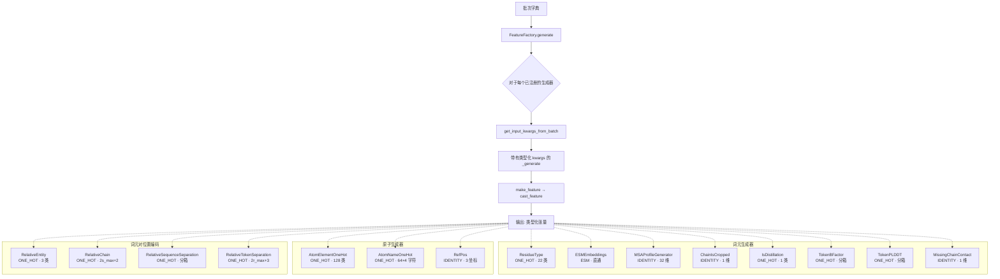

---
slug:19-token-and-atom-feature-generators
blog_type:normal
---


Chai-1 的特征工程流水线将原始结构和序列数据转换为模型可使用的丰富张量表示。本页将详细探讨 **词元级** 和 **原子级** 特征生成器——这些逐位置编码为模型提供了关于化学标识、空间参考和结构元数据的基础词汇表。这些生成器占据了原始输入数据与嵌入层之间的关键边界，负责将异构的生物信息转换为受严格类型系统约束的、统一的、可掩码的张量。

## 特征类型分类与编码系统

Chai-1 中的每个特征生成器都沿着两个正交轴进行分类：其 **FeatureType**（操作的结构粒度）和 **EncodingType**（原始值的数值表示方式）。`FeatureType` 枚举定义了八个域，根据结构分辨率和关系元数对特征空间进行划分：

| FeatureType | 粒度 | 形状模式 | 描述 |
|---|---|---|---|
| `ATOM` | 逐原子 | `(b, n_atoms, ...)` | 单原子属性 |
| `ATOM_PAIR` | 原子对 | `(b, n_blocks, bl_q, bl_kv, ...)` | 分块成对原子特征 |
| `TOKEN` | 逐词元 | `(b, n_tokens, ...)` | 单词元属性 |
| `TOKEN_PAIR` | 词元对 | `(b, n_tokens, n_tokens, ...)` | 成对词元关系 |
| `MSA` | 逐 MSA 行 | `(b, depth, n_tokens, ...)` | 多序列比对特征 |
| `TEMPLATES` | 逐模板 | `(b, n_templ, n_tokens, ...)` | 结构模板特征 |

`EncodingType` 枚举控制原始值的类型转换与掩码策略：

| EncodingType | 输入数据类型 | 掩码策略 | 典型用途 |
|---|---|---|---|
| `ONE_HOT` | Integer | 类索引 = `num_classes`（超出范围） | 类别特征 |
| `IDENTITY` | Float | 最后一个通道设为 1.0，其余为零 | 连续标量/向量特征 |
| `RBF` | Float | 值 = `-100.0` | 径向基函数编码 |
| `FOURIER` | Float | 值 = `-100.0` | 傅里叶特征编码 |
| `OUTERSUM` | Integer | 与 `ONE_HOT` 相同 | 通过外和计算的成对类别特征 |
| `ESM` | Float | 值 = `0.0` | 预计算的蛋白质语言模型嵌入 |

`cast_feature` 函数在生成时强制执行这些数据类型约定——`ONE_HOT` 和 `OUTERSUM` 要求整数类型，而 `RBF` 和 `FOURIER` 要求浮点类型。每个生成器上的 `mask_value` 属性会根据编码类型为缺失数据生成规范的哨兵值，确保下游嵌入层能区分“无数据”与“零值”。

来源: [feature_type.py](/chai_lab/data/features/feature_type.py#L1-L17), [base.py](/chai_lab/data/features/generators/base.py#L1-L114)

## FeatureGenerator 约定

所有生成器均继承自 `FeatureGenerator`，这是一个强制执行两阶段生成协议的抽象基类。`generate(batch)` 方法首先调用 `get_input_kwargs_from_batch(batch)` 从整理后的批次字典中提取相关张量，然后将这些关键字参数传递给每个具体子类实现的 `_generate(**kwargs)`。这种分离确保了批次键查找的集中化，并保证核心生成逻辑接收到预类型化和预验证的输入。

每个生成器在构造时通过五个参数进行配置，这些参数决定了其输出形状和掩码行为：

- **`ty`**（FeatureType）：结构粒度，决定由哪个嵌入路径消费此特征。
- **`encoding_ty`**（EncodingType）：数值编码策略，控制数据类型和掩码语义。
- **`num_classes`**：对于 `ONE_HOT`，为不同类别的数量（嵌入后的输出通道数）。对于 `IDENTITY`，为连续特征向量的维度。
- **`mult`**：`num_classes` 上的乘数，通常为 1，在单个类别特征被复制时使用（例如，原子名字符编码 4 次）。
- **`can_mask`**：此特征是否支持掩码——即是否可以为缺失/无效条目插入哨兵值。

`make_feature(data)` 方法是张量离开生成器前的最后一道关卡：它调用 `cast_feature` 以强制执行数据类型的正确性和范围安全性（例如，`IDENTITY` 特征的绝对最大值必须 < 100）。

<CgxTip>当 `can_mask=True` 时，`Identity` 生成器会在其输出中附加一个额外的零通道，然后在掩码位置将该通道设为 1.0。这意味着实际输出维度为 `num_classes + 1`——最后一个通道充当二进制的“是否被掩码？”指示器，而不是使用哨兵值。这种设计避免了合法零值与缺失值之间的歧义。</CgxTip>

来源: [base.py](/chai_lab/data/features/generators/base.py#L58-L114)

## 原子级特征生成器

原子级生成器产生送入原子嵌入路径的逐原子特征。这些特征编码了输入中可用的最细粒度的化学标识和空间参考信息。

### AtomElementOneHot

**FeatureType**: `ATOM` | **EncodingType**: `ONE_HOT` | **输出通道**: 129 (128 + 1 掩码)

将每个原子的原子序数编码为独热向量。`max_atomic_num` 参数默认为 128，足以覆盖整个元素周期表并留有余量。原子序数在编码前被钳位至 `num_classes`，因此任何超出范围的元素都会映射到最后一个有效索引，而不会发生溢出。输入 `atom_ref_element` 直接取自结构上下文的逐原子元素分配。

```python
# 生成逻辑 (简化版)
seq_emb = torch.clamp(atomic_numbers, max=self.num_classes).unsqueeze(-1)
```

### AtomNameOneHot

**FeatureType**: `ATOM` | **EncodingType**: `ONE_HOT` | **输出通道**: 64 × 4 = 256 (带有 mult=4)

将每个原子的名称编码为四个独立的独热向量，每个字符位置一个。诸如 "CA"、"N"、"OG1" 的原子名称被分解为单独的字符索引，每个字符在 `num_chars=64` 个可能值上独立进行独热编码。`mult=4` 参数向下游消费者表明，此特征包含 4 个重复的类别编码，这些编码应分别嵌入后再组合。

### RefPos

**FeatureType**: `ATOM` | **EncodingType**: `IDENTITY` | **输出通道**: 3 (x, y, z) | **can_mask**: `False`

提供每个原子的 3D 参考位置，通过除以 10.0 进行缩放，将坐标转换至适合神经网络输入的范围。断言机制强制要求缩放后坐标的最大 L2 范数低于 100，作为对不当缩放输入的完整性检查。与大多数 `IDENTITY` 特征不同，`RefPos` 设置 `can_mask=False`，因为对于已存在的原子，其参考位置预期总是有效的——无效原子由原子存在掩码单独处理。

```python
feat = original_pos / 10.0  # Å → 十埃尺度
assert torch.amax(feat.norm(dim=-1)) < 100.0
```

<CgxTip>`RefPos` 中的 `/10.0` 缩放对于稳定训练至关重要。原始的埃坐标（通常为 0–100）会产生巨大的量级，从而破坏 `IDENTITY` 编码的断言保护（`abs().max() < 100`）。十埃尺度将所有坐标分量大致保持在 [-10, 10] 范围内，完全处于嵌入的安全区间内。</CgxTip>

来源: [atom_element.py](/chai_lab/data/features/generators/atom_element.py#L1-L35), [atom_name.py](/chai_lab/data/features/generators/atom_name.py#L1-L32), [ref_pos.py](/chai_lab/data/features/generators/ref_pos.py#L1-L33)

## 词元级特征生成器

词元级生成器产生逐词元特征——输入中每个残基、核苷酸或配体词元对应一个值。这些特征编码了较粗粒度的生物标识和元数据，模型将其用于主要的序列级推理。

### ResidueType

**FeatureType**: `TOKEN` | **EncodingType**: `ONE_HOT` | **输出通道**: 23 (22 + 1 掩码)

基础类别特征，编码每个词元位置上的残基类型。在 `num_res_ty=22` 的设置下，它涵盖了 20 种标准氨基酸，外加一个缺口词元和一个 "X"（未知）词元。`key` 参数默认为 `"aatype"`，但可被重写以指向替代的批次字段，从而允许同一生成器类编码不同的残基分类。输入在扩展维度前会被克隆，以避免原地修改批次数据。

### ESMEmbeddings

**FeatureType**: `TOKEN` | **EncodingType**: `ESM` | **can_mask**: `False`

一个直通生成器，将预计算的 ESM（Evolutionary Scale Model）嵌入直接传递到词元特征流中。与其他转换原始数据的生成器不同，`ESMEmbeddings` 仅验证并转发批次中的 `esm_embeddings` 张量。`ESM` 编码类型使用 `0.0` 作为其掩码值，并绕过常规的数据类型转换，因为这些嵌入已处于其最终的浮点形式。嵌入维度由上游 ESM 模型决定（通常为 256 或 1280 维）。

### MSAProfileGenerator

**FeatureType**: `TOKEN` | **EncodingType**: `IDENTITY` | **输出通道**: 32 (与 `residue_types_with_nucleotides_order` 匹配)

计算 MSA 概要——即各残基类型的逐位置频率分布——并在词元级别将其作为连续的 `IDENTITY` 编码特征传递。该概要通过优化的 `torch.scatter_add` 实现从*主*（浅层、仅含概要的）MSA 中计算得出：它在 MSA 深度维度上累加各残基类型的计数，然后按每个位置的总计数进行归一化。这为模型提供了进化保守性的压缩视图，而无需在推理时使用完整的 MSA 深度。

```python
# 概要 = 跨 MSA 深度的归一化残基类型频率
unnormalized_profile = torch.zeros(...).scatter_add(dim=2, index=..., src=...)
profile = unnormalized_profile / unnormalized_profile.sum(dim=-1, keepdim=True).clamp_min_(1)
```

### MSADeletionMeanGenerator

**FeatureType**: `TOKEN` | **EncodingType**: `IDENTITY` | **输出通道**: 1

对主 MSA 深度维度上的 MSA 缺失计数求平均，生成一个逐词元标量，指示每个位置的平均缺失数量。它使用 `masked_mean` 来正确处理被掩码的 MSA 行，确保填充行不会拉低平均值。输出为每个词元一个单一的连续值。

### ChainIsCropped

**FeatureType**: `TOKEN` | **EncodingType**: `IDENTITY` | **输出通道**: 1 | **can_mask**: `False`

一个占位生成器，当前为每个词元生成全零输出。其 `can_mask=False` 设置意味着输出不会附加掩码通道。该生成器作为特征流水线中的结构钩子存在——它从批次中读取 `token_asym_id`，为未来可能标识哪些链因裁剪而被截断的实现提供一致的接口。

### IsDistillation

**FeatureType**: `TOKEN` | **EncodingType**: `ONE_HOT` | **输出通道**: 2 (1 + 1 掩码)

一个二进制标志，指示每个词元是否源自蒸馏数据（即，用作训练数据的预测结构，如 AlphaFold2 的蒸馏增强）。批次中的 `is_distillation` 标量被广播到所有词元位置，并将结果转换为 `uint8` 以进行独热编码。

### TokenBFactor

**FeatureType**: `TOKEN` | **EncodingType**: `ONE_HOT` | **输出通道**: 2 (1 个分箱边界 + 1 掩码)

将 B 因子值分入离散的独热编码中。默认的分箱边界为 `[140.0]`，创建两个分箱：B 因子 ≤ 140 和 B 因子 > 140。此特征**仅针对非蒸馏数据定义**——对于蒸馏样本或当随机 `include_prob` 门排除某个样本时，该特征将被填充为掩码值。`include_prob` 参数（默认 1.0）在训练期间随机丢弃此特征，作为一种数据增强策略。

### TokenPLDDT

**FeatureType**: `TOKEN` | **EncodingType**: `ONE_HOT` | **输出通道**: 3 (2 个分箱边界 + 1 掩码)

`TokenBFactor` 的镜像特征：使用默认边界 `[0.3, 0.7]` 对 pLDDT（预测 LDDT）分数进行分箱，创建三个分箱。此特征**仅针对蒸馏数据定义**——其掩码逻辑与 `TokenBFactor` 相反。同样适用 `include_prob` 随机丢弃机制。`TokenBFactor` 和 `TokenPLDDT` 共享 `token_b_factor_or_plddt` 批次字段，由 `is_distillation` 标志决定哪种解释有效。

### MissingChainContact

**FeatureType**: `TOKEN` | **EncodingType**: `IDENTITY` | **输出通道**: 2 (1 个特征 + 1 掩码)

标识属于在阈值距离（默认 6.0 Å，与 DockQ 接触截断值匹配）内**无链间原子接触**的链的词元。该生成器计算所有成对原子距离，筛选出阈值内的链间原子对，然后标记出不存在此类接触的链上的词元。对于单体输入，该特征为全零。这为模型提供了关于哪些链在空间上是隔离的显式信号——这一信息对于对接场景至关重要。

来源: [residue_type.py](/chai_lab/data/features/generators/residue_type.py#L1-L35), [esm_generator.py](/chai_lab/data/features/generators/esm_generator.py#L1-L35), [msa.py](/chai_lab/data/features/generators/msa.py#L139-L197), [is_cropped_chain.py](/chai_lab/data/features/generators/is_cropped_chain.py#L1-L37), [structure_metadata.py](/chai_lab/data/features/generators/structure_metadata.py#L1-L144), [missing_chain_contact.py](/chai_lab/data/features/generators/missing_chain_contact.py#L1-L97)

## 词元对位置编码

多个生成器产生 `TOKEN_PAIR` 特征，用于编码词元之间的相对位置关系。这些是空间和序列的归纳偏置，使模型能够推理链拓扑、实体成员关系和残基邻近性。

### RelativeEntity

**FeatureType**: `TOKEN_PAIR` | **EncodingType**: `ONE_HOT` | **输出通道**: 3

实现了 AlphaFold-Multimer 的算法 5。计算词元对 *(i, j)* 是否属于同一实体（类别 1）、不同实体（类别 2）或被掩码（类别 0）。实体 ID 首先通过 `torch.unique` 重新映射到零索引范围，然后相对差值计算为 `entity_id[j] - entity_id[i] + 1`，并钳位至 [0, 2]。这为模型提供了关于实体共成员关系的三路类别信号。

### RelativeChain

**FeatureType**: `TOKEN_PAIR` | **EncodingType**: `ONE_HOT` | **输出通道**: 2*s_max* + 2 (默认: 6)

同样遵循 AF-Multimer 的算法 5。编码共享同一实体的词元之间的**相对链索引**——即同一链的对称副本。参数 `s_max`（默认 2）控制可表示的最大链偏移量。对于同一实体内的词元对，相对链偏移被钳位至 `[-s_max, s_max]` 并平移至 `[0, 2*s_max]`。对于跨不同实体的词元对，该特征被设置为位于索引 `2*s_max + 1` 处的专用“实体间”类别。这使得模型能够区分实体内链关系和实体间链关系。

### RelativeSequenceSeparation

**FeatureType**: `TOKEN_PAIR` | **EncodingType**: `ONE_HOT` | **输出通道**: 66 (默认: 2×32 + 2)

编码**同一链**上词元对之间的相对残基索引偏移量。默认的 `SMALL_SEP_BINS` 覆盖 -32 到 +32 的偏移量（65 个分箱），外加一个用于链间对的附加类别。生成过程使用 `torch.searchsorted` 对残基索引差进行分箱，然后用专用类别掩码掉链间位置（即 `asym_id[i] ≠ asym_id[j]` 的位置）。这提供了一种离散的位置编码，捕获了链内的局部序列邻近性。

### RelativeTokenSeparation

**FeatureType**: `TOKEN_PAIR` | **EncodingType**: `ONE_HOT` | **输出通道**: 35 (默认: 2×16 + 3)

一种更细粒度的位置编码，捕获同一链同一残基的词元之间的相对**词元索引**偏移量（而非残基索引）。参数 `r_max`（默认 16）控制可表示的最大词元偏移量。掩码条件要求同链（`asym_id` 匹配）且同残基（`residue_index` 匹配），使得此特征仅对多原子词元（例如，具有多个重原子的配体词元）有效。不满足此条件的词元对将接收哨兵类别 `2*r_max + 2`。



来源: [relative_entity.py](/chai_lab/data/features/generators/relative_entity.py#L1-L48), [relative_chain.py](/chai_lab/data/features/generators/relative_chain.py#L1-L55), [relative_sep.py](/chai_lab/data/features/generators/relative_sep.py#L1-L63), [relative_token.py](/chai_lab/data/features/generators/relative_token.py#L1-L54)

## 原子对距离生成器

### BlockedAtomPairDistances

**FeatureType**: `ATOM_PAIR` | **EncodingType**: `IDENTITY` | **can_mask**: `True`

以**分块**稀疏模式计算原子间的成对欧几里得距离。它没有构建完整的 O(n²) 原子对距离矩阵，而是使用预计算的查询和键/值索引张量（`block_atom_pair_q_idces`、`block_atom_pair_kv_idces`）来仅选择属于空间块结构内的原子对。此外，原子对经过过滤，仅包含共享相同 `atom_ref_space_uid` 的原子，该标识将属于同一参考坐标系的原子上进行分组。

输出将距离特征与二进制掩码通道拼接，生成一个 2 通道张量，其中 `[..., 0]` 是（可选的逆平方）距离，当值有效时 `[..., 1]` 为 1.0。`inverse_squared` 变换（`1 / (1 + d²)`）将大距离映射至零，同时保持短距离的敏感性——这是一种强调空间位阻的、具有物理动机的编码。

### BlockedAtomPairDistogram

**FeatureType**: `ATOM_PAIR` | **EncodingType**: `ONE_HOT` 或 `RBF` | **输出通道**: 随分箱数变化

`BlockedAtomPairDistances` 的离散对应物，将距离分入独热距离直方图中。`ONE_HOT` 模式的默认分箱为 `[0, 1, 2, 3, 4, 5, 6, 8, 12, 16]` Å，创建 11 个类别（10 个分箱 + 1 个掩码）。`RBF` 模式的默认分箱为 `[0, 2, 4, 6, 8, 10, 12, 14, 16]` Å。它应用了相同的分块计算和 `atom_ref_space_uid` 过滤，但在编码前通过 `torch.searchsorted` 对连续距离进行离散化。无效对接收掩码值。

来源: [blocked_atom_pair_distances.py](/chai_lab/data/features/generators/blocked_atom_pair_distances.py#L1-L176)

## Identity：通用直通生成器

`Identity` 生成器是一个参数化的直通生成器，可适应任何批次键和特征类型。它没有实现自定义的 `_generate` 逻辑，而是从批次中读取可配置的 `key`（支持通过 `/` 分隔符的嵌套路径），并直接将张量作为 `IDENTITY` 编码特征转发。当 `can_mask=True` 时，它会附加标准的零通道掩码指示器。

此生成器充当了由整理流水线生成的原始批次张量与类型化特征系统之间的粘合剂。其灵活性意味着，只需注册一个具有适当键和维度的 `Identity` 生成器即可向流水线添加新的标量或向量特征，而无需编写新的子类。

```python
# 嵌套键解析："inputs/token_asym_id" → batch["inputs"]["token_asym_id"]
sub_keys, sub_dict = key.split("/"), data
for sub_key in sub_keys:
    sub_dict = sub_dict[sub_key]
```

来源: [identity.py](/chai_lab/data/features/generators/identity.py#L1-L49), [feature_utils.py](/chai_lab/data/features/feature_utils.py#L1-L32)

## 特征工厂：编排层

`FeatureFactory` 是将批次字典转换为完整特征字典的运行时编排器。它持有一个 `dict[str, FeatureGenerator]` 映射，并对每个生成器调用 `generate(batch)`，生成一个 `dict[str, Tensor]`，其中每个键与生成器的注册名称相匹配。这种设计允许以声明式组合特征集——同一批次可由不同的工厂配置处理，以生成用于训练与推理、或不同模型变体的不同特征集。

```python
class FeatureFactory:
    generators: dict[str, FeatureGenerator]
    def generate(self, batch) -> dict[str, Tensor]:
        return {name: gen.generate(batch) for name, gen in self.generators.items()}
```

馈送给工厂的完整特征上下文由 `AllAtomFeatureContext.to_dict()` 组装，它将来自结构上下文、MSA 上下文、模板上下文、嵌入上下文和约束上下文的字典合并为一个单一的扁平命名空间，生成器通过 `get_input_kwargs_from_batch` 从中提取数据。

来源: [feature_factory.py](/chai_lab/data/features/feature_factory.py#L1-L27), [all_atom_feature_context.py](/chai_lab/data/dataset/all_atom_feature_context.py#L68-L96)

## 生成器总结参考

| 生成器 | FeatureType | EncodingType | 关键维度 | 可掩码 |
|---|---|---|---|---|
| `AtomElementOneHot` | ATOM | ONE_HOT | 129 (128+1) | ✓ |
| `AtomNameOneHot` | ATOM | ONE_HOT | 64×4=256 | ✓ |
| `RefPos` | ATOM | IDENTITY | 3 | ✗ |
| `ResidueType` | TOKEN | ONE_HOT | 23 (22+1) | ✓ |
| `ESMEmbeddings` | TOKEN | ESM | 可变 | ✗ |
| `MSAProfileGenerator` | TOKEN | IDENTITY | 32 | ✗ |
| `MSADeletionMeanGenerator` | TOKEN | IDENTITY | 1 | ✗ |
| `ChainIsCropped` | TOKEN | IDENTITY | 1 | ✗ |
| `IsDistillation` | TOKEN | ONE_HOT | 2 (1+1) | ✓ |
| `TokenBFactor` | TOKEN | ONE_HOT | 2 (1+1) | ✓ |
| `TokenPLDDT` | TOKEN | ONE_HOT | 3 (2+1) | ✓ |
| `MissingChainContact` | TOKEN | IDENTITY | 1 | ✗ |
| `RelativeEntity` | TOKEN_PAIR | ONE_HOT | 3 | ✗ |
| `RelativeChain` | TOKEN_PAIR | ONE_HOT | 2×2+2=6 | ✗ |
| `RelativeSequenceSeparation` | TOKEN_PAIR | ONE_HOT | 66 (2×32+2) | ✗ |
| `RelativeTokenSeparation` | TOKEN_PAIR | ONE_HOT | 35 (2×16+3) | ✗ |
| `BlockedAtomPairDistances` | ATOM_PAIR | IDENTITY | 2 | ✓ |
| `BlockedAtomPairDistogram` | ATOM_PAIR | ONE_HOT | 11 (默认) | ✓ |
| `Identity` | 可配置 | IDENTITY | 可配置 | 可配置 |

特定于约束和对接的成对生成器（`TokenDistanceRestraint`、`TokenPairPocketRestraint`、`DockingRestraintGenerator`、`TokenBondRestraint`）以及 MSA 深度生成器（`MSAFeatureGenerator`、`MSAHasDeletionGenerator`、`MSADeletionValueGenerator`、`IsPairedMSAGenerator`、`MSADataSourceGenerator`）将分别在 [成对与约束特征生成器](20-pairwise-and-restraint-feature-generators) 和 [MSA 生成与加载](14-msa-generation-and-loading) 中详细讨论。模板生成器（`TemplateMaskGenerator`、`TemplateUnitVectorGenerator`、`TemplateResTypeGenerator`、`TemplateDistogramGenerator`）将在[模板处理流水线](16-template-processing-pipeline)的上下文中进行讨论。