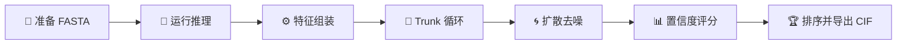

---
slug:2-quick-start
blog_type:normal
---


几分钟内跑通 Chai-1。本页将引导你完成**安装**、**准备首个输入**、**运行结构预测**及**解读输出**——从零开始到获得首个预测结构所需的一切。本文假设你此前没有使用 Chai-1 的经验。


来源: [README.md](/README.md#L1-L194), [__init__.py](/chai_lab/__init__.py#L1-L6)

## 先决条件与安装

Chai-1 要求 **Linux**、**Python ≥ 3.10**，以及**支持 CUDA 和 bfloat16 的 NVIDIA GPU**。模型权重会在首次使用时自动下载。下表概述了硬件要求：

| GPU | 显存 | 适用性 |
|-----|------|-------------|
| H100 80GB / A100 80GB | 80 GB | ✅ 推荐 — 轻松处理大型复合物 |
| L40S | 48 GB | ✅ 推荐 — 适用于大多数复合物 |
| A10 / A30 | 24 GB | ⚠️ 仅适用于较小复合物 |
| RTX 4090 | 24 GB | ⚠️ 社区验证适用于较小复合物 |

<CgxTip>设置 `CHAI_DOWNLOADS_DIR` 环境变量以控制模型权重的存储位置（例如，Docker 中挂载的驱动器）。若未设置，权重将下载至你的 Python site-packages 目录中。</CgxTip>

从 PyPI 安装稳定版：

```bash
pip install chai_lab==0.6.1
```

或者直接从 GitHub 安装最新开发版：

```bash
pip install git+https://github.com/chaidiscovery/chai-lab.git
```

`chai-lab` 命令行工具会通过 `chai-lab` 控制台脚本入口点自动注册，该入口点映射至 `chai_lab.main:cli`。

来源: [README.md](/README.md#L21-L35), [pyproject.toml](/pyproject.toml#L1-L73), [Dockerfile.chailab](/Dockerfile.chailab#L1-L85), [requirements.in](/requirements.in#L1-L32)

## 首次预测 — 工作流

整个预测工作流遵循从输入到排序输出结构的清晰管道。以下是各阶段的具体内容：



1. **准备 FASTA** — 以类似 FASTA 的格式定义你的蛋白质、配体、RNA、DNA 或聚糖实体。
2. **运行推理** — 调用 `chai-lab fold` (CLI) 或 `run_inference()` (Python)。
3. **特征组装** — 系统构建 `AllAtomFeatureContext`，生成 ESM 嵌入，加载 MSA，并组装约束条件。
4. **Trunk 循环** — Trunk 模型对 token 级别的表征进行迭代（默认：3 次循环）。
5. **扩散去噪** — 随机去噪过程生成 3D 原子坐标（默认：200 个时间步，5 个样本）。
6. **置信度评分** — 为每个样本预测 pAE、pDE 和 pLDDT。
7. **排序并导出** — 样本按综合得分排序，并写入 `.cif` 文件。

来源: [chai1.py](/chai_lab/chai1.py#L500-L545), [chai1.py](/chai_lab/chai1.py#L700-L830)

## 准备输入 — FASTA 格式

Chai-1 使用一种**类 FASTA 格式**，其中每个实体（蛋白质、配体、DNA、RNA 或聚糖）被指定为单独的条目。标题行编码了**实体类型**和**唯一名称**；序列行提供了残基字符串或 SMILES。

### 标题语法

```
>{entity_type}|name={unique_name}
```

### 实体类型与序列格式

| 实体类型 | 标题前缀 | 序列内容 | 示例 |
|-------------|--------------|------------------|---------|
| 蛋白质 | `protein` | 氨基酸单字母代码 | `AGSHSMRYFSTSVSRPGRGE...` |
| 配体 | `ligand` | SMILES 字符串 | `CCCCCCCCCCCCCC(=O)O` |
| DNA | `dna` | 核苷酸单字母代码 | `ATCGATCG` |
| RNA | `rna` | 核苷酸单字母代码 | `AUCGAUCG` |
| 聚糖 | `glycan` | 聚糖表示法（例如 `NAG(4-1 NAG)`） | `NAG(4-1 NAG)` |

修饰残基在蛋白质序列中使用括号表示法内联编码，例如，`AAA(SEP)AAA` 表示该位置为磷酸丝氨酸。

### 完整示例

```fasta
>protein|name=example-of-long-protein
AGSHSMRYFSTSVSRPGRGEPRFIAVGYVDDTQFVRFDSDAASPRGEPRAPWVEQEGPEYWDRETQKYKRQAQTDRVSLRNLRGYYNQSEAGSHTLQWMFGCDLGPDGRLLRGYDQSAYDGKDYIALNEDLRSWTAADTAAQITQRKWEAAREAEQRRAYLEGTCVEWLRRYLENGKETLQRAEHPKTHVTHHPVSDHEATLRCWALGFYPAEITLTWQWDGEDQTQDTELVETRPAGDGTFQKWAAVVVPSGEEQRYTCHVQHEGLPEPLTLRWEP
>protein|name=example-of-short-protein
AIQRTPKIQVYSRHPAENGKSNFLNCYVSGFHPSDIEVDLLKNGERIEKVEHSDLSFSKDWSFYLLYYTEFTPTEKDEYACRVNHVTLSQPKIVKWDRDM
>protein|name=example-peptide
GAAL
>ligand|name=example-ligand-as-smiles
CCCCCCCCCCCCCC(=O)O
```

<CgxTip>每个实体必须具有**唯一名称**。重复的名称将在运行时引发 `UnsupportedInputError`。请保持名称具有描述性 — 当 `fasta_names_as_cif_chains=True` 时，它们将用于输出 CIF 文件中的链命名。</CgxTip>

来源: [predict_structure.py](/examples/predict_structure.py#L1-L57), [inference_dataset.py](/chai_lab/data/dataset/inference_dataset.py#L1-L80), [1ac5.fasta](/examples/covalent_bonds/1ac5.fasta#L1-L6), [8cyo.fasta](/examples/covalent_bonds/8cyo.fasta#L1-L4), [chai1.py](/chai_lab/chai1.py#L340-L365)

## 运行预测

### 选项 A：命令行界面

折叠复合物最简单的方法是使用 `chai-lab fold` 命令：

```bash
chai-lab fold input.fasta output_folder
```

这使用了**默认设置**：5 个扩散样本，启用 ESM 嵌入，不使用 MSA，不使用模板。为了提高准确性，可通过 ColabFold MMseqs2 服务器启用 MSA 和模板生成：

```bash
chai-lab fold --use-msa-server --use-templates-server input.fasta output_folder
```

如果你托管了自己的 ColabFold 服务器，请使用 `--msa-server-url` 指向它：

```bash
chai-lab fold --use-msa-server --msa-server-url "https://api.internalcolabserver.com" input.fasta output_folder
```

CLI 还提供了实用命令：

| 命令 | 用途 |
|---------|---------|
| `chai-lab fold` | 运行结构预测 |
| `chai-lab a3m-to-pqt` | 将 A3M MSA 文件转换为已对齐的 Parquet 格式 |
| `chai-lab citation` | 打印引用信息 |

有关完整的参数文档，请参阅 [CLI 参考](3-cli-reference)。

来源: [README.md](/README.md#L37-L65), [main.py](/chai_lab/main.py#L1-L49)

### 选项 B：Python API

若要以编程方式控制，请使用 `chai_lab.chai1.run_inference` 函数。这是基于 Python 工作流的主要入口点：

```python
from pathlib import Path
from chai_lab.chai1 import run_inference

candidates = run_inference(
    fasta_file=Path("input.fasta"),
    output_dir=Path("output_folder"),
    # 核心推理参数
    num_trunk_recycles=3,       # Trunk 循环次数
    num_diffn_timesteps=200,    # 扩散去噪步数
    num_diffn_samples=5,        # 结构样本数
    seed=42,                    # 可复现性种子
    device="cuda:0",            # 目标 GPU 设备
    # 特征来源
    use_esm_embeddings=True,    # ESM 蛋白质嵌入
    use_msa_server=False,       # 通过 ColabFold 自动生成 MSA
    msa_directory=None,         # 或提供预计算的 MSA
    use_templates_server=False, # 自动生成模板
    constraint_path=None,       # 约束文件路径
)
```

返回的 `StructureCandidates` 对象提供了对预测结果和分数的直接访问：

```python
# 获取所有样本的 CIF 文件路径
cif_paths = candidates.cif_paths

# 获取综合置信度分数
agg_scores = [rd.aggregate_score.item() for rd in candidates.ranking_data]

# 加载每个样本的详细分数 (pTM, ipTM, pLDDT, clash)
import numpy as np
scores = np.load("output_folder/scores.model_idx_0.npz")
```

来源: [chai1.py](/chai_lab/chai1.py#L500-L545), [predict_structure.py](/examples/predict_structure.py#L1-L57), [chai1.py](/chai_lab/chai1.py#L280-L310)

### 关键推理参数

| 参数 | 默认值 | 描述 |
|-----------|---------|-------------|
| `num_trunk_recycles` | 3 | Trunk 模型迭代次数；更多循环可提高准确性，但会增加时间开销 |
| `num_diffn_timesteps` | 200 | 扩散去噪调度中的步数 |
| `num_diffn_samples` | 5 | 生成的独立结构样本数 |
| `num_trunk_samples` | 1 | 独立 Trunk 样本数（每个生成 `num_diffn_samples` 个结构） |
| `seed` | None | 用于可复现性的随机种子 |
| `device` | `"cuda:0"` | CUDA 设备字符串 |
| `use_esm_embeddings` | True | 使用 ESM-2 蛋白质语言模型嵌入 |
| `use_msa_server` | False | 通过 ColabFold MMseqs2 服务器生成 MSA |
| `msa_directory` | None | 包含预计算 `.aligned.pqt` MSA 文件的目录路径 |
| `use_templates_server` | False | 通过 ColabFold 服务器生成结构模板 |
| `constraint_path` | None | 约束 CSV 文件路径 |
| `low_memory` | True | 通过将中间张量卸载到 CPU 来优化 GPU 内存 |

来源: [chai1.py](/chai_lab/chai1.py#L500-L530)

## 理解输出

成功运行后，输出目录对于 `num_diffn_samples` 中的每个预测包含以下文件：

| 文件 | 内容 |
|------|---------|
| `pred.model_idx_{N}.cif` | mmCIF 格式的预测 3D 结构，pLDDT 作为 B 因子（0–100 刻度） |
| `scores.model_idx_{N}.npz` | 包含 pTM、ipTM、pLDDT 和冲突指标的 NumPy 存档 |
| `msa_depth.pdf` | （如果使用了 MSA）每个位置的 MSA 深度覆盖度图表 |

`run_inference` 返回的 **`StructureCandidates`** 对象提供：

| 属性 | 类型 | 描述 |
|-----------|------|-------------|
| `cif_paths` | `list[Path]` | 所有候选 CIF 文件的路径 |
| `ranking_data` | `list[SampleRanking]` | 每个候选的排序分数，包括 `aggregate_score` |
| `pae` | `Tensor [candidates, tokens, tokens]` | 预测对齐误差矩阵 |
| `pde` | `Tensor [candidates, tokens, tokens]` | 预测距离误差矩阵 |
| `plddt` | `Tensor [candidates, tokens]` | 逐 token 的 pLDDT 置信度 |
| `msa_coverage_plot_path` | `Path or None` | MSA 覆盖度 PDF 的路径（如适用） |

调用 `candidates.sorted()` 以按综合置信度分数从高到低重新排序结果。具有**最高 `aggregate_score`** 的候选是模型的最佳预测。

来源: [chai1.py](/chai_lab/chai1.py#L280-L330), [chai1.py](/chai_lab/chai1.py#L960-L1060), [predict_structure.py](/examples/predict_structure.py#L44-L57)

## 常见用例一览

`examples/` 目录为每种场景提供了可直接运行的脚本。以下是快速参考：

| 用例 | 示例脚本 | 关键配置 |
|----------|---------------|-------------------|
| 基础折叠 | `examples/predict_structure.py` | `use_esm_embeddings=True`（默认） |
| 使用 MSA（预计算） | `examples/msas/predict_with_msas.py` | `msa_directory=Path(...)` |
| 使用 MSA（自动生成） | 仅 CLI | `--use-msa-server` 标志 |
| 使用模板 | `examples/templates/predict_with_templates.py` | `use_msa_server=True, use_templates_server=True` |
| 使用接触约束 | `examples/restraints/predict_with_restraints.py` | `constraint_path=Path("contact.restraints")` |
| 使用口袋约束 | `examples/restraints/predict_with_restraints.py` | `constraint_path=Path("pocket.restraints")` |
| 共价配体 | `examples/covalent_bonds/predict_covalent_ligand.py` | `constraint_path=Path("8cyo.restraints")` |
| 糖基化蛋白质 | `examples/covalent_bonds/predict_glycosylated.py` | `glycan` 实体类型 + 约束 |

来源: [predict_structure.py](/examples/predict_structure.py#L1-L57), [predict_with_msas.py](/examples/msas/predict_with_msas.py#L1-L46), [predict_with_restraints.py](/examples/restraints/predict_with_restraints.py#L1-L36), [predict_with_templates.py](/examples/templates/predict_with_templates.py#L1-L31), [predict_covalent_ligand.py](/examples/covalent_bonds/predict_covalent_ligand.py#L1-L28)

## 故障排除

| 问题 | 原因 | 解决方案 |
|---------|-------|----------|
| `UnsupportedInputError: Too many tokens` | 输入超过模型最大 token 限制 | 减少序列长度或实体数量 |
| `Output directory is not empty` | `run_inference` 要求输出目录为空 | 删除原目录或使用新的目录路径 |
| `Duplicate entity name` | 两个实体使用了相同的 `name=` 值 | 为每个实体分配唯一名称 |
| CUDA 内存不足 | 复合物过大，超出 GPU 显存 | 设置 `low_memory=True`（默认），减少 `num_diffn_samples`，或使用更大显存的 GPU |
| MSA 服务器超时 | ColabFold 公共服务器过载 | 稍后重试，或托管你自己的 MMseqs2 服务器并使用 `--msa-server-url` |
| 权重下载失败 | 网络或存储问题 | 将 `CHAI_DOWNLOADS_DIR` 设置为具有充足磁盘空间的可写路径 |

来源: [chai1.py](/chai_lab/chai1.py#L236-L260), [chai1.py](/chai_lab/chai1.py#L510-L515), [README.md](/README.md#L78-L85)

## 后续步骤

你现在已经安装了 Chai-1 并能运行基础预测。以下是加深理解的推荐阅读路径：

1. **[CLI 参考](3-cli-reference)** — `chai-lab fold` 命令及所有 CLI 实用程序的完整参数文档。
2. **[FASTA 解析与实体类型](13-fasta-parsing-and-entity-types)** — 深入探讨输入格式，包括修饰残基和高级实体配置。
3. **[MSA 生成与加载](14-msa-generation-and-loading)** — 如何提供预计算的 MSA 或自动生成 MSA 以提高准确性。
4. **[约束与共价键系统](17-restraint-and-covalent-bond-system)** — 使用接触、口袋和共价键约束指导实验预测。
5. **[架构概览](7-architecture-overview)** — 理解从特征组装到扩散再到置信度评分的完整推理管道。

有关最新功能和已知问题，请参阅[最新更新](4-latest-updates)和[问题与反馈](5-issues-and-feedbacks)。