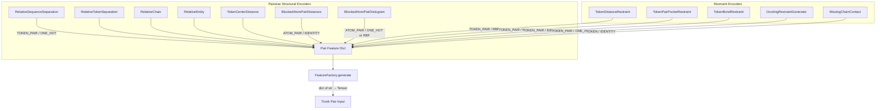

---
slug:20-pairwise-and-restraint-feature-generators
blog_type:normal
---


成对特征与约束特征生成器是连接原始结构上下文与模型对表示之间的桥梁。它们编码**关系信息**——即 Token 沿序列、链和实体轴的相互关联方式——以及**实验约束**，这些约束引导扩散过程生成具有生物学有效性的结构。本页将剖析所有生成 `TOKEN_PAIR`、`ATOM_PAIR` 或具有成对语义的 `TOKEN` 类型特征的生成器，追踪数据从批量张量流经编码，直至被主干网络消费的最终特征张量的全过程。

## 架构概览：两大特征域

本文涵盖的所有生成器均属于两个功能域。**成对结构编码器**捕获内在的关系几何特征（序列间隔、链归属、实体身份、距离）。**约束编码器**注入外部先验知识——接触、口袋、共价键和对接基团——从而引导模型趋向所需的构象。尽管用途不同，这两个域共享相同的 `FeatureGenerator` 抽象：它们从批量字典中提取命名张量，计算 N×N（或分块 N×N）特征，通过 [Feature Generator Base Design](18-feature-generator-base-design) 中定义的类型系统进行编码，最后将其返回以供 `FeatureFactory` 整理。



`FeatureFactory` 通过对同一批次调用每个已注册生成器的 `generate()` 方法来编排生成过程，并将所有特征收集到统一的字典中 [FeatureFactory](chai_lab/data/features/feature_factory.py#L18-L27)。

来源: [feature_type.py](chai_lab/data/features/feature_type.py#L1-L17), [feature_factory.py](chai_lab/data/features/feature_factory.py#L1-L27), [base.py](chai_lab/data/features/generators/base.py#L1-L114)

## 成对结构编码器

这些生成器生成描述 Token 对之间**内在关系**的特征。它们作用于批量级别的元数据——残基索引、不对称 ID、实体 ID——并将相对偏移量编码为独热分类分布。通用模式为：通过 `rearrange(x, "b n -> b n 1") - rearrange(x, "b n -> b 1 n")` 计算成对差值矩阵，对结果进行分箱或截断，最后进行独热编码。

### RelativeSequenceSeparation

`RelativeSequenceSeparation` 编码**同一链内**两个 Token 之间的有符号序列距离。链间对则会获得一个专属的哨兵分箱。该生成器通过 `torch.searchsorted` 将偏移量分配到可配置的间隔分箱集合中（默认：±32 个位置，生成 67 个分箱）。关键在于，该特征仅在 `asym_id` 匹配时计算——所有链间条目均被设置为 `num_classes - 1`，即专属的“不同链”类别。

| 参数 | 默认值 | 描述 |
|---|---|---|
| `sep_bins` | `get_sep_bins(32)` | 序列间隔的分箱边界 |
| `num_bins` | `None` | 替代方案：生成对称分箱 ±`num_bins` |
| 输出形状 | `(B, N, N, 1)` | 具有 `len(sep_bins) + 2` 个类别的 ONE_HOT |
| 特征类型 | `TOKEN_PAIR` | 由 pair trunk 消费 |

<CgxTip>`num_classes` 中额外的 +2 考虑了：(1) `searchsorted` 为超出最后一个分箱边界的值生成的哨兵索引，以及 (2) 位于 `num_classes - 1` 处的专属链间分箱。当指定 `num_bins=32` 时，实际的独热深度为 `2*32 + 2 = 67`。</CgxTip>

来源: [relative_sep.py](chai_lab/data/features/generators/relative_sep.py#L1-L63)

### RelativeTokenSeparation

`RelativeSequenceSeparation` 基于残基级别的偏移量操作，而 `RelativeTokenSeparation` 则基于 **Token 级别**的偏移量操作——它考虑了配体、修饰残基以及 Token 索引 ≠ 残基索引的多原子 Token 类型。在对相对 Token 间隔进行编码前，它要求 Token 对之间的残基索引和链（asym_id）均需匹配。超出范围的对（不同残基或不同链）将获得哨兵值 `2 * r_max + 2`。

| 参数 | 默认值 | 描述 |
|---|---|---|
| `r_max` | `16` | 显式编码的最大 Token 偏移量 |
| 输出形状 | `(B, N, N, 1)` | 具有 `2*r_max + 3` 个类别的 ONE_HOT |
| 掩码逻辑 | `rel_residue == 0 & rel_chain == 0` | 仅限相同残基、相同链的对 |

来源: [relative_token.py](chai_lab/data/features/generators/relative_token.py#L1-L54)

### RelativeChain

遵循 AlphaFold-Multimer 的算法 5，`RelativeChain` 编码**同一实体内的相对链索引**。它计算 `sym_id` 的成对差值（通过 `torch.unique` 重新映射为零索引后），截断至 ±`s_max`，并将实体间对掩码至哨兵分箱。这与 `RelativeEntity` 不同——它区分的是同一实体的*副本*（例如，同一蛋白质序列的同源二聚体链 A 和链 B）。

| 参数 | 默认值 | 描述 |
|---|---|---|
| `s_max` | `2` | 最大相对链偏移量 |
| 输出形状 | `(B, N, N, 1)` | 具有 `2*s_max + 2` 个类别的 ONE_HOT |
| 输入键 | `token_entity_id`, `token_sym_id` | 实体与对称 ID |
| 实体间值 | `2*s_max + 1` | 跨实体的专属哨兵值 |

来源: [relative_chain.py](chai_lab/data/features/generators/relative_chain.py#L1-L55)

### RelativeEntity

`RelativeEntity` 提供了最粗粒度的关系编码：一个 3 类别的独热编码，指示 Token 对是属于**同一实体**（类别 0）、**不同实体**（类别 2），还是表示自配对（类别 1，即零索引化后 `rel_entity == 0` 时）。实体 ID 在求差前被重新映射为零索引，随后 `clamp(+1, 0, 2)` 映射出这三种情况。

| 值 | 语义 |
|---|---|
| 0 | 同一实体，不同 Token |
| 1 | 自配对（同一 Token） |
| 2 | 不同实体 |

来源: [relative_entity.py](chai_lab/data/features/generators/relative_entity.py#L1-L48)

### TokenCenterDistance

`TokenCenterDistance` 通过计算每个 Token 的**中心原子**（通过 `token_centre_atom_index` 聚合）之间的成对欧几里得距离，将原子级坐标桥接至 Token 对特征。生成的距离矩阵使用 `torch.searchsorted` 按可配置的距离分箱进行分箱，然后在任一 Token 的中心原子缺失处进行掩码处理。默认分箱为 `[0, 4, 8, 12, 16]`，生成 6 类别的独热编码（5 个显式分箱 + 1 个掩码哨兵）。

```
all_atom_positions ──► center_atom_coords (via gather on token_centre_atom_index)
                              │
                              ▼
                    cdist(center_atom_coords) ──► bin via searchsorted
                              │
                              ▼
                    mask invalid pairs ──► ONE_HOT encoded TOKEN_PAIR feature
```

该生成器也被 `DockingRestraintGenerator` **组合**使用，后者在内部将距离计算委托给 `TokenCenterDistance._generate()`。

来源: [token_pair_distance.py](chai_lab/data/features/generators/token_pair_distance.py#L1-L66), [token_utils.py](chai_lab/data/features/token_utils.py#L1-L55)

### BlockedAtomPairDistances 和 BlockedAtomPairDistogram

这两个生成器使用**分块稀疏表示**而非完整的 N×N 矩阵来生成 `ATOM_PAIR` 类型特征。它们不计算所有原子间的距离，而是使用预计算的查询/键索引张量（`block_atom_pair_q_idces`、`block_atom_pair_kv_idces`）来定义需要评估的原子对——这是原子注意力模块的关键优化。

`BlockedAtomPairDistances` 输出原始的平方反比距离（`1 / (1 + d²)`）并与有效性掩码通道拼接，输出形状为 `(B, n_blocks, bl_q, bl_kv, 2)`。`BlockedAtomPairDistogram` 将相同的距离划分为离散类别（独热编码或 RBF），以供分类消费。

这两个生成器均强制执行**同一参考空间**约束：仅当原子对的 `atom_ref_space_uid` 值匹配时，该原子对才有效，从而确保仅在共享坐标系的原子之间计算距离。

| 生成器 | 编码 | 默认分箱 | 输出通道 |
|---|---|---|---|
| `BlockedAtomPairDistances` | IDENTITY | 无 | 2 (特征 + 掩码) |
| `BlockedAtomPairDistogram` | ONE_HOT | `[0,1,2,3,4,5,6,8,12,16]` | `len(bins)+1` |
| `BlockedAtomPairDistogram` | RBF | `[0,2,4,6,8,10,12,14,16]` | `len(bins)+1` |

来源: [blocked_atom_pair_distances.py](chai_lab/data/features/generators/blocked_atom_pair_distances.py#L1-L176)

## 约束特征生成器

约束生成器编码有关预期结构结果的**用户指定先验知识**。它们共享一个通用契约：当未提供约束（或约束解析失败）时，它们会生成一个填充了 `ignore_idx`（通常为 `-1.0`）的空特征矩阵，确保模型回退至无偏预测。当存在约束时，它们将链/残基标识符解析为 Token 位置，并将约束值写入 N×N 特征矩阵。

### 约束解析管道

所有约束生成器均遵循相同的解析管道，从原始文本约束到特征张量：

```mermaid
flowchart LR
    A[Raw .restraints file] --> B[parse_pairwise_table]
    B --> C[PairwiseInteraction objects]
    C --> D[load_manual_restraints_for_chai1]
    D --> E[RestraintContext]
    E --> F[Collator: batch dict keys]
    F --> G[Generator.get_input_kwargs_from_batch]
    G --> H[RestraintGroup dataclasses]
    H --> I[_generate / generate_from_restraint]
    I --> J[RBF or ONE_HOT encoded feature]
```



解析层将 CSV 格式的约束文件转换为 `PairwiseInteraction` 对象，然后在链加载期间解析为 `RestraintContext`。整理器将这些约束字典放置在 `contact_constraints`、`pocket_constraints` 和 `docking_constraints` 等批量键下。每个生成器的 `get_input_kwargs_from_batch` 在特征计算前，将这些数据反序列化回具有类型的 `RestraintGroup` 数据类。

来源: [token_dist_restraint.py](chai_lab/data/features/generators/token_dist_restraint.py#L1-L35), [test_restraints.py](tests/test_restraints.py#L1-L126)

### TokenDistanceRestraint (接触约束)

`TokenDistanceRestraint` 编码**成对残基-残基接触约束**——最常见的约束类型。每个 `RestraintGroup` 指定一个左侧/右侧残基对（通过子链 ID + 残基索引 + 残基名称标识）以及一个距离阈值。生成器将阈值写入 `constraint_mat[left_residue_mask, right_residue_mask]`，生成一个**非对称**特征——该约束不会镜像至转置位置。

关键实现细节：

- **残基验证**：`left_residue_mask` 和 `right_residue_mask` 必须各自精确选择一个 Token。如果匹配到多个 Token，将触发断言，从而防止约束产生歧义。
- **名称校验**：约束中的残基名称通过 `tensorcode_to_string` 与 Token 解析出的残基名称进行验证，以便及早发现链/残基规格不匹配的情况。
- **RBF 编码**：距离阈值使用径向基函数（`EncodingType.RBF`，默认 5 个半径）进行编码，允许模型将约束解释为软距离先验。
- **空值回退**：如果约束为 `None` 或在解析期间发生任何异常，生成器将返回填充了 `-1.0` 的矩阵，RBF 编码会将其解释为“无约束”。

| 参数 | 默认值 | 描述 |
|---|---|---|
| `include_probability` | `1.0` | 每个样本包含约束的概率 |
| `size` | `0.33` | 约束数量；若 `<1`，则从 `Geometric(size)` 中采样 |
| `min_dist` / `max_dist` | `10.0` / `30.0` | RBF 编码的距离范围 |
| `num_rbf_radii` | `5` | RBF 基函数的数量 |
| `query_entity_types` | 全部 | 有资格作为约束“查询”方的实体类型 |
| `key_entity_types` | 全部 | 有资格作为约束“键”方的实体类型 |

<CgxTip>`size` 参数具有双重语义：整数值指定确切计数，而 `(0, 1)` 内的浮点值则被解释为几何分布的参数。这种设计允许训练时的随机性（每个批次的约束数量随机变化），同时仍支持具有固定计数的确切推理。</CgxTip>

来源: [token_dist_restraint.py](chai_lab/data/features/generators/token_dist_restraint.py#L1-L273)

### TokenPairPocketRestraint (口袋约束)

`TokenPairPocketRestraint` 编码**口袋约束**——与成对接触在性质上截然不同的关系。口袋约束不指定残基-残基对，而是指定**单个残基**（“口袋 Token”）和**目标链**。生成器随后在口袋 Token 与目标链中的*所有* Token 之间创建约束，将每个条目设置为 `pocket_distance_threshold`。

这在 `add_pocket_restraint` 中实现，即将 `pocket_distance_threshold` 写入 `restraint_mat[pocket_token_residue_mask, pocket_chain_asym_mask]`——这是一个从口袋 Token 到目标链上每个 Token 的约束行向量。与接触约束一样，此特征是**非对称的**：反向不填充。

`TokenPairPocketRestraint` 类内部组合了一个 `TokenDistanceRestraint` 实例（具有匹配的超参数）来处理采样逻辑，但使用其自身特定的口袋解析覆盖了特征生成：

| 方面 | 接触约束 | 口袋约束 |
|---|---|---|
| 约束范围 | 1 残基 ↔ 1 残基 | 1 残基 → 整条链 |
| 特征对称性 | 非对称（单个单元格） | 非对称（单行） |
| 批量键 | `contact_constraints` | `pocket_constraints` |
| RestraintGroup 字段 | `left/right_residue_*` | `pocket_chain/token_*` |

来源: [token_pair_pocket_restraint.py](chai_lab/data/features/generators/token_pair_pocket_restraint.py#L1-L248)

### TokenBondRestraint (共价键)

`TokenBondRestraint` 编码 Token 之间的**共价键拓扑**。它消费 `atom_covalent_bond_indices`——每个批次元素的 `(left_atom_indices, right_atom_indices)` 对列表——通过 `atom_token_index` 将原子索引映射为 Token 索引，并将 `1.0` 写入 `bond_feature[left_token_indices, right_token_indices]`。

值得注意的设计选择：

- **无掩码**：`apply_mask` 被覆盖为返回不变的特征，因为键是结构性事实而非软约束。
- **零初始化**：特征初始全为零；键被显式设置为 1.0。不存在键即为默认状态。
- **IDENTITY 编码**：与使用 RBF 的距离约束不同，键是二元的（存在/不存在），因此恒等编码很自然。

来源: [token_bond.py](chai_lab/data/features/generators/token_bond.py#L1-L64)

### DockingRestraintGenerator

`DockingRestraintGenerator` 是最复杂的约束编码器，为对接任务实现了**链划分策略**。它可以在两种模式下运行：

1. **训练模式** (`_generate_from_batch`)：链被随机划分为两组。计算 Token 中心距离，为**组内**对提供距离，同时掩码**组间**距离。这教导模型从链内结构线索预测链间界面。坐标噪声从 `coord_noise` 范围内均匀采样。可选择性地应用结构丢弃和链丢弃作为正则化。

2. **推理模式** (`_generate_from_restraints`)：显式的 `RestraintGroup` 对象指定哪些链属于对接组，及其中心坐标和噪声参数。使用 `add_restraint` 计算组内所有链对之间的距离，这将填充对称约束矩阵及其关联的掩码。

生成器将核心距离计算委托给内部的 `TokenCenterDistance` 实例，然后在此基础上应用划分掩码或约束覆盖：

| 参数 | 默认值 | 描述 |
|---|---|---|
| `dist_bins` | `[0, 4, 8, 16]` | ONE_HOT 编码的距离分箱边界 |
| `coord_noise` | `(0.0, 3.0)` | 坐标的均匀噪声范围 |
| `include_probability` | `0.1` | 包含组间距离的概率 |
| `structure_dropout_prob` | `0.0` | 丢弃整个结构的概率 |
| `chain_dropout_prob` | `0.0` | 随机掩码链的概率 |
| `entity_types` | 全部 | 有资格进行对接的实体类型 |

`include_probability=0.1` 的默认值意味着在训练期间，90% 的时间*所有*链间距离都会被掩码，迫使模型学习界面预测。剩余 10% 提供部分距离信息作为教学信号。

来源: [docking.py](chai_lab/data/features/generators/docking.py#L1-L372)

### MissingChainContact

`MissingChainContact` 是一个 **Token 级别**（而非对级别）的特征，用于标记没有链间接触的链。它计算所有原子间的距离，识别出与其他链原子距离在 `contact_threshold` 埃以内的原子，并标记属于零接触链的 Token。这是一个诊断特征——它向模型发出某些链在结构上孤立的信号，这可能表明对接失败或确实是完全断开的组件。

该生成器显式处理单体边缘情况：当仅存在一条链时，所有 Token 接收 `0.0`（无缺失接触），因为根本不存在可能缺失的链间接触。

| 参数 | 默认值 | 描述 |
|---|---|---|
| `contact_threshold` | `6.0` | DockQ 兼容的原子接触截断值 (Å) |
| 特征类型 | `TOKEN` | 逐 Token，而非逐对 |
| 编码 | `IDENTITY` | 二元：0.0 = 有接触，1.0 = 孤立 |

来源: [missing_chain_contact.py](chai_lab/data/features/generators/missing_chain_contact.py#L1-L97)

## 编码与掩码契约

所有成对和约束生成器共享继承自 `FeatureGenerator` 的统一编码契约。`mask_value` 属性和 `cast_feature` 函数确保了跨编码类型的数据类型处理一致性：

| 编码类型 | 掩码值 | 数据类型 | 使用它的生成器 |
|---|---|---|---|
| `ONE_HOT` | `num_classes` (哨兵索引) | `long` / `int` | RelativeSep, RelativeToken, RelativeChain, RelativeEntity, TokenCenterDistance, BlockedAtomPairDistogram, DockingRestraint |
| `RBF` | `-100.0` | `float16/32/bfloat16` | TokenDistanceRestraint, TokenPairPocketRestraint |
| `IDENTITY` | 最后一通道 = 1 的零张量 | `float` | BlockedAtomPairDistances, TokenBondRestraint, MissingChainContact |

每个生成器上的 `can_mask` 标志控制是否分配恒等编码掩码通道。对于 `ONE_HOT` 和 `RBF` 编码，掩码是隐式的：哨兵值（`num_classes` 或 `-100.0`）被下游嵌入层解码为“无信息”。

来源: [base.py](chai_lab/data/features/generators/base.py#L36-L74)

## 特征矩阵总结

下表提供了所有成对和约束特征生成器及其输出规范以及它们消费的批量键的综合参考：

| 生成器 | 特征类型 | 编码 | 输出形状 | 关键批量输入 |
|---|---|---|---|---|
| `RelativeSequenceSeparation` | `TOKEN_PAIR` | ONE_HOT | `(B,N,N,1)` | `token_residue_index`, `token_asym_id` |
| `RelativeTokenSeparation` | `TOKEN_PAIR` | ONE_HOT | `(B,N,N,1)` | `token_index`, `token_residue_index`, `token_asym_id` |
| `RelativeChain` | `TOKEN_PAIR` | ONE_HOT | `(B,N,N,1)` | `token_entity_id`, `token_sym_id` |
| `RelativeEntity` | `TOKEN_PAIR` | ONE_HOT | `(B,N,N,1)` | `token_entity_id` |
| `TokenCenterDistance` | `TOKEN_PAIR` | ONE_HOT | `(B,N,N,1)` | `atom_gt_coords`, `atom_exists_mask`, `token_centre_atom_index`, `token_exists_mask` |
| `BlockedAtomPairDistances` | `ATOM_PAIR` | IDENTITY | `(B,bl,bl_q,bl_kv,2)` | `atom_ref_pos`, `atom_ref_mask`, `atom_ref_space_uid`, `block_atom_pair_*` |
| `BlockedAtomPairDistogram` | `ATOM_PAIR` | ONE_HOT/RBF | `(B,bl,bl_q,bl_kv,1)` | 同上 |
| `TokenDistanceRestraint` | `TOKEN_PAIR` | RBF | `(B,N,N,1)` | `contact_constraints`, `token_asym_id`, `token_residue_index`, `subchain_id` |
| `TokenPairPocketRestraint` | `TOKEN_PAIR` | RBF | `(B,N,N,1)` | `pocket_constraints`, 相同的 token 元数据 |
| `TokenBondRestraint` | `TOKEN_PAIR` | IDENTITY | `(B,N,N,1)` | `atom_covalent_bond_indices`, `atom_token_index` |
| `DockingRestraintGenerator` | `TOKEN_PAIR` | ONE_HOT | `(B,N,N,1)` | `docking_constraints`, `atom_gt_coords`, `token_asym_id`, `token_entity_type` |
| `MissingChainContact` | `TOKEN` | IDENTITY | `(B,N,1)` | `atom_gt_coords`, `atom_exists_mask`, `token_asym_id`, `atom_token_index` |

来源: [feature_type.py](chai_lab/data/features/feature_type.py#L1-L17), [base.py](chai_lab/data/features/generators/base.py#L1-L114)

## 与推理管道的集成

在推理期间，约束从用户指定的 `.restraints` 文件流经解析和整理层进入批量字典。`predict_with_restraints.py` 示例展示了端到端路径：一个包含 `chainA, res_idxA, chainB, res_idxB, connection_type, confidence, min_distance_angstrom, max_distance_angstrom, comment, restraint_id` 列的 CSV 文件被 `parse_pairwise_table` 解析，解析为带有 `PairwiseInteractionType.CONTACT` 或 `PairwiseInteractionType.POCKET` 的 `PairwiseInteraction` 对象，然后通过 `load_manual_restraints_for_chai1` 加载到 `RestraintContext` 中。整理器将它们放置在各自生成器消费的 `contact_constraints` 和 `pocket_constraints` 批量键下。

**接触**和**口袋**约束格式在 CSV 结构上有所不同：接触约束指定双方的残基索引，而口袋约束将 `res_idxA` 留空并指定链级别的目标。两种格式共享相同的置信度和距离列。

来源: [predict_with_restraints.py](examples/restraints/predict_with_restraints.py#L1-L36), [contact.restraints](examples/restraints/contact.restraints#L1-L3), [pocket.restraints](examples/restraints/pocket.restraints#L1-L4), [test_restraints.py](tests/test_restraints.py#L1-L126)

## 下一步

理解了成对和约束特征生成器后，特征工程层就完整了。深入探讨系列的后续页面将涵盖这些特征是如何被消费的：

- [Feature Embedding and Token Embedding](9-feature-embedding-and-token-embedding) — 原始特征张量如何嵌入到模型的隐藏维度中
- [Trunk Recycling and Attention](10-trunk-recycling-and-attention) — 成对特征如何流经主干网络的三角形注意力
- [Restraint and Covalent Bond System](17-restraint-and-covalent-bond-system) — 从用户输入到模型引导的完整端到端约束管道