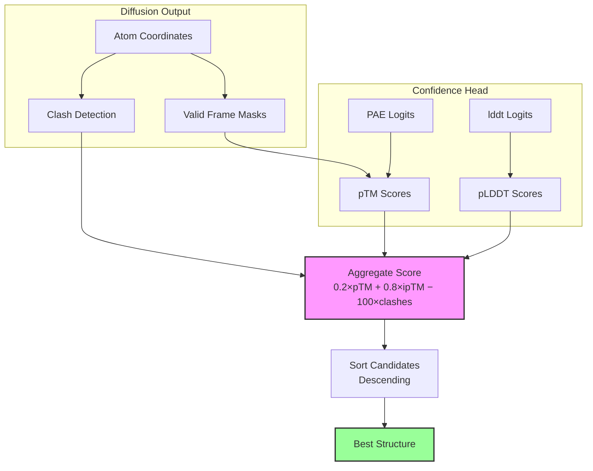

---
slug:21-structure-ranking-and-scoring
blog_type:normal
---


当 Chai-1 通过其扩散采样过程生成多个结构候选时，它必须确定哪个候选最能代表真实的生物组装体。**排名与评分系统**将三个独立的置信度信号——预测 TM-score (pTM)、预测 LDDT (pLDDT) 和空间位阻冲突检测——协调为一个综合得分，从而驱动候选结构的选择。本页将解释这些信号的计算方式、组合方式以及如何用于对结构预测进行排名。

## 架构概述

排名流水线位于推理工作流的末端，在置信度头输出其 logits 且扩散模块生成原子坐标之后执行。每个扩散样本均独立评分，得分最高的候选将被选为预测结构。



其入口是 [rank.py](chai_lab/ranking/rank.py) 中的 `rank()` 函数，该函数会生成一个包含所有子得分和综合得分的 `SampleRanking` 数据类。在 [chai1.py](chai_lab/chai1.py) 的推理循环中，每个扩散样本都会调用一次该函数。

来源：[rank.py](chai_lab/ranking/rank.py#L1-L126), [chai1.py](chai_lab/chai1.py#L938-L975)

## SampleRanking 数据模型

`SampleRanking` 数据类是排名系统的核心产物。它将四类得分捆绑在一起：

| 字段 | 类型 | 描述 |
|-------|------|-------------|
| `asym_ids` | `Int[Tensor, "chain"]` | 排序后的唯一链标识符（从 1 开始） |
| `aggregate_score` | `Float[Tensor, "1"]` | 整个样本的综合排名得分 |
| `ptm_scores` | `PTMScores` | 复合物、链以及链对级别的 pTM 和 ipTM |
| `clash_scores` | `ClashScores` | 总冲突数、链间冲突数和每对链的冲突数 |
| `plddt_scores` | `PLDDTScores` | 复合物、每条链以及每原子级别的 pLDDT |

排名完成后，`get_scores()` 函数会将这些数据展平为包含 NumPy 数组的普通字典，以便序列化为 `.npz` 文件，其键名包括 `aggregate_score`、`ptm`、`iptm`、`per_chain_ptm`、`per_chain_pair_iptm`、`has_inter_chain_clashes` 和 `chain_chain_clashes`。

来源：[rank.py](chai_lab/ranking/rank.py#L16-L32), [rank.py](chai_lab/ranking/rank.py#L117-L126)

## 综合得分公式

综合得分决定了哪个候选是“最佳”的。它是 pTM 得分的加权组合，并对链间空间位阻冲突施加了严厉的惩罚：

```
aggregate_score = 0.2 × complex_ptm + 0.8 × interface_ptm − 100 × has_inter_chain_clashes
```

权重分配揭示了明确的设计意图：**界面质量占主导地位**。`interface_ptm` (ipTM) 0.8 的权重相对于 `complex_ptm` 0.2 的权重反映出，对于多链复合物而言，链间相互作用的质量比整体折叠质量更具参考价值。冲突惩罚是二元且惩罚性的——任何检测到的聚合物链之间的链间冲突都会扣除 100 分，从而有效地淘汰存在严重空间位阻违规的候选结构。

<CgxTip>ipTM 和 pTM 之间 80/20 的权重分配意味着，对于单链预测（此时 ipTM 等于 pTM），公式可简化为 `pTM − 100×clashes`。对于多链复合物，一个强接口得分可以弥补平庸的复合物级别得分，但冲突对排名而言始终是致命的。</CgxTip>

来源：[rank.py](chai_lab/ranking/rank.py#L99-L103)

## pTM 评分：预测模板建模得分

pTM（预测模板模型）得分评估预测结构与真实结构之间预期对齐的契合度，它源自模型的 **预测对齐误差 (PAE)** logits。`PTMScores` 数据类捕获了四个粒度级别：

| 得分 | 形状 | 含义 |
|-------|-------|---------|
| `complex_ptm` | `...` | 整个复合物的整体预测 TM-score |
| `interface_ptm` | `...` | 所有链中最优的界面 TM-score |
| `per_chain_ptm` | `... c` | 每条单独链的 pTM |
| `per_chain_pair_iptm` | `... c c` | 每个有序链对的 ipTM |

### TM-Score d0 归一化

所有的 pTM 计算都依赖于 TM-score 的 `d0` 归一化常数，该常数根据 token 数量计算得出：

```
d0 = 1.24 × (n_tokens − 15)^(1/3) − 1.8
```

该值的最小值被限制为 19 个 token，以避免在极短链上出现未定义行为。这遵循了标准的 TM-score 归一化约定。

### 核心 pTM 计算：`_compute_ptm`

共享的计算引擎 `_compute_ptm()` 工作流程如下：

1. **分箱加权**：对于每个 PAE 区间，计算 `1 / (1 + (bin_center / d0)²)`，这为较小的预测误差分配了更高的权重——与实际 TM-score 公式中使用的加权方式相同。
2. **期望成对 TM**：使用 softmax 对区间计算 `expectation(logits, bin_weights)`，得出每对 token 的期望 TM 贡献。
3. **查询-键掩码**：只有当查询 token 具有有效帧且查询/键 token 同时存在时，该 token 对才有贡献。
4. **聚合**：对每个查询的加权期望 TM 得分求和，并除以键 token 的数量进行归一化。
5. **乐观选择**：在查询行上取 `torch.max` 以选择最乐观的对齐方式——即预测对齐能产生最高 TM-score 的那一行。

### 复合物 pTM 与 界面 pTM

`complex_ptm` 和 `interface_ptm` 之间的区别在于哪些 token 作为查询，哪些作为键：

- **complex_ptm**：所有 token 同时作为查询和键。这衡量了整个组装体的整体折叠质量。
- **interface_ptm**：对于每条链 `c`，`c` 中的 token 作为查询，所有*其他*链中的 token 作为键。返回各链中的最大值，以此捕获最强的界面信号。

`per_chain_pair_iptm` 将此扩展到每个有序链对 (i → j)，使用链 `i` 中的 token 作为查询，链 `j` 中的 token 作为键。为了节省内存，当张量大小将超过 2³² 个元素时，该计算会在 for 循环中执行而非批量处理。

来源：[ptm.py](chai_lab/ranking/ptm.py#L1-L222)

## pLDDT 评分：预测局部距离差异测试

pLDDT 得分用于评估原子位置的局部准确性，源自模型的 **lddt logits**。与在 PAE 上基于 token 级别操作的 pTM 不同，pLDDT 是在原子级别上基于预测的距离误差进行操作。

`PLDDTScores` 数据类提供了三个粒度级别：

| 得分 | 形状 | 含义 |
|-------|-------|---------|
| `complex_plddt` | `...` | 所有可能的原子上的掩码平均 pLDDT |
| `per_chain_plddt` | `... c` | 每条链上的掩码平均 pLDDT |
| `per_atom_plddt` | `... a` | 每个原子的 pLDDT 期望值 |

计算过程非常直接：`expectation(logits, bin_centers)` 对 logits 应用 softmax，并以区间中心值作为权重计算加权和。对于复合物级别的得分，使用 `masked_mean` 对所有有效原子取平均值。对于每条链的得分，则在平均之前应用来自 `get_chain_masks_and_asyms()` 的链掩码。

需要注意的是，pLDDT 得分**不是**综合排名公式的一部分——它们与排名结果一同输出仅用于诊断目的，并在输出的 CIF 文件中以 B 因子（缩放至 0–100 范围）的形式写入。

来源：[plddt.py](chai_lab/ranking/plddt.py#L1-L82), [chai1.py](chai_lab/chai1.py#L978-L979)

## 冲突检测：空间位阻违规评分

冲突检测用于识别物理距离过近的原子，这对于多链界面而言是一项关键的质量检查。`ClashScores` 数据类捕获了以下信息：

| 得分 | 形状 | 含义 |
|-------|-------|---------|
| `total_clashes` | `...` | 总冲突数（链内 + 链间，已校正重复计数） |
| `total_inter_chain_clashes` | `...` | 所有链对的冲突总数 |
| `chain_chain_clashes` | `... n_chains n_chains` | 每对链的冲突矩阵 |
| `has_inter_chain_clashes` | `...` | 布尔值：是否存在任何聚合物链对存在有问题冲突 |

### 成对距离计算

核心的 `_compute_clashes()` 函数通过 `cdist` 计算所有原子两两之间的距离，然后标记满足以下条件的原子对：(1) 两个原子均存在，(2) 不是同一个原子，(3) 距离小于 `clash_threshold`（默认为 **1.1 Å**）。

### 链级别聚合

原始的原子-原子冲突通过 `scatter_add_` 操作聚合为链-链矩阵：首先将原子映射到其所属链（通过 `atom_asym_id`），然后累积每对链的冲突数。对角线（链内冲突）通过除以 2 来补偿重复计数，非对角线（链间冲突）同理除以 2 以解释矩阵的对称性。

### 链间冲突标准

如果满足以下**任一**条件，该链对将被标记为存在链间冲突：

1. **绝对数量**：该链对的冲突数 ≥ `max_clashes`（默认为 100）
2. **相对比率**：冲突数超过较短链原子数的 `max_clash_ratio`（默认为 0.5）
3. **聚合物限制**：两条链必须均为聚合物类型（蛋白质、RNA、DNA 或聚合物杂化体）

<CgxTip>仅针对聚合物的过滤机制意味着，配体-聚合物或配体-配体之间的冲突不会计入 `has_inter_chain_clashes` 标志，即使它们被统计在 `chain_chain_clashes` 中。这可以防止小分子的邻近效应惩罚综合得分。</CgxTip>

来源：[clashes.py](chai_lab/ranking/clashes.py#L1-L164)

## 用于 pTM 有效性的帧计算

`frames.py` 模块提供了 `valid_frames_mask`，用于控制哪些 token 可以参与 pTM 的计算。只有当一个 token 具有明确定义的局部参考帧——即定义其方向的三维非共线原子时，它才能对 pTM 产生贡献。

`get_frames_and_mask()` 函数结合了两种帧定义来源：

1. **主链帧**：为标准氨基酸残基预定义的 N-Cα-C 帧，通过 `token_backbone_frame_mask` 和 `token_backbone_frame_index` 提供
2. **单原子帧**：对于没有主链帧的 token（例如配体原子），该函数通过在同一残基和链内寻找最近的两个原子，然后检查共线性来构建帧

共线性检查使用 `abc_is_colinear()` 实现，该函数计算 A-B-C 三元组中原子 B 处的角度。如果角度小于 25° 或大于 155°，则认为该三元组共线，帧将被拒绝。这确保了只有具有几何意义的帧才会影响 pTM 的计算。

来源：[frames.py](chai_lab/ranking/frames.py#L1-L173)

## 在推理流水线中的集成

排名系统在 [chai1.py](chai_lab/chai1.py) 的 `run_folding_on_context()` 内部被调用，这是在置信度头为每个扩散样本生成其 logits 之后进行的。每个样本的调用顺序如下：

1. **帧计算**：`get_frames_and_mask()` 确定哪些 token 具有有效的参考帧
2. **排名**：`rank()` 根据原子坐标、token 元数据、PAE logits 和 lddt logits 计算完整的 `SampleRanking`
3. **输出**：记录综合得分，将 pLDDT 作为 B 因子写入 CIF 文件，并将得分保存到 `.npz`

所有样本评分完成后，`StructureCandidates.sorted()` 方法会根据 `aggregate_score` 降序重新排列候选，使第一个候选成为模型的最佳预测。当使用多个 trunk 样本时，`StructureCandidates.concat()` 会在排序前合并来自不同 trunk 运行的候选。

```
Score=0.8241, writing output to .../pred.model_idx_0.cif
Score=0.7903, writing output to .../pred.model_idx_1.cif
...
```

来源：[chai1.py](chai_lab/chai1.py#L938-L1004), [chai1.py](chai_lab/chai1.py#L53-L92)

## 共享排名工具

`utils.py` 模块提供了所有评分子模块共用的基础操作：

| 函数 | 用途 |
|----------|---------|
| `get_chain_masks_and_asyms()` | 从 token/原子张量中提取每条链的布尔掩码和排序后的唯一 asym ID |
| `get_interface_mask()` | 识别界面距离阈值内跨链的 token 对 |
| `expectation()` | 计算 softmax 加权期望：`softmax(logits) · weights` |
| `num_atoms_per_chain()` | 使用链掩码统计每条链的有效原子数 |
| `chain_is_polymer()` | 判断每条链是否包含聚合物实体类型（蛋白质、RNA、DNA、聚合物杂化体） |

`expectation()` 函数尤为关键——它是 pTM 和 pLDDT 将分类 logit 分布转换为标量得分的共享机制。对于 pLDDT，权重是区间中心值；对于 pTM，权重是 TM-score 区间权重 `1/(1+(d/d0)²)`。

来源：[utils.py](chai_lab/ranking/utils.py#L1-L87)

## 得分输出文件

每个扩散样本会在输出目录中生成两个输出文件：

| 文件 | 内容 |
|------|----------|
| `pred.model_idx_{N}.cif` | 包含作为 B 因子的 pLDDT（0–100 范围）的原子坐标 |
| `scores.model_idx_{N}.npz` | 包含作为数组的所有排名得分的 NumPy 压缩文件 |

`.npz` 文件包含由 `get_scores()` 生成的以下键：

- `aggregate_score` — 综合排名得分
- `ptm` — 复合物级别的 pTM
- `iptm` — 界面 pTM
- `per_chain_ptm` — 每条链的 pTM 数组
- `per_chain_pair_iptm` — 链对的 ipTM 矩阵
- `has_inter_chain_clashes` — 布尔型冲突标志
- `chain_chain_clashes` — 每对链的冲突计数矩阵

来源：[rank.py](chai_lab/ranking/rank.py#L117-L126), [chai1.py](chai_lab/chai1.py#L985-L988)

## 下一步

综合得分依赖于三个截然不同的度量系统，每个系统都有其自身的数学基础和实现细节。为了加深理解：

- **[pTM, pLDDT, and Clash Metrics](23-ptm-plddt-and-clash-metrics)** — 每个度量的详细数学推导和解释指南
- **[CIF Output and Chain Naming](22-cif-output-and-chain-naming)** — 排名预测如何转化为结构文件
- **[Confidence Prediction and Scoring](12-confidence-prediction-and-scoring)** — 生成被排名系统所使用的 PAE 和 lddt logits 的上游模块