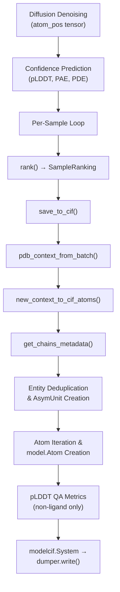
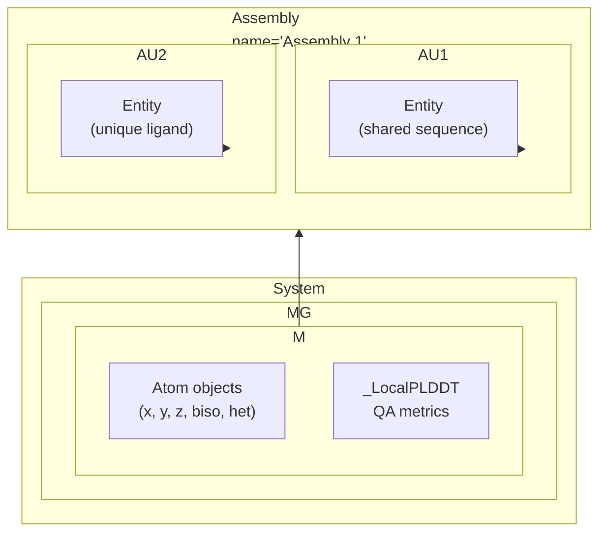

---
slug:22-cif-output-and-chain-naming
blog_type:normal
---


Chai-1 以 **ModelCIF** 格式写入预测结构——该格式是专为计算模型设计的 mmCIF 标准扩展。CIF 输出子系统负责将原始坐标张量、token 级别的元数据以及每个原子的置信度分数，转换为完全合规的 `.cif` 文件，并确保包含正确的链标识符、实体分组、化学组分注释以及内嵌的质量指标。本页将说明链名称的分配方式、实体的去重机制、不同生物大分子类型的序列化过程，以及输出流水线如何与更广泛的推理工作流相整合。

## 从推理到 CIF：输出流水线

CIF 写入步骤是推理流水线的最终阶段。在扩散去噪生成原子坐标、置信度预测头输出 pLDDT/PAE/PDE logits 之后，系统会遍历每个扩散样本，计算排名分数，并为每个样本写入一个 `.cif` 文件。其入口点是 `save_to_cif`，该函数负责协调坐标重排、PDB 上下文重建，并将任务委派给底层写入器。



`save_to_cif` 函数接收预测坐标（形状为 `[1, n_atoms, 3]`）、完整的输出批次字典、输出路径、asym ID 到实体名称的映射，以及可选的 B-factor（pLDDT）张量。它会消除批次维度，从批次字典中重建 `PDBContext`，并将所有数据传递给 `new_context_to_cif_atoms` 以执行实际的序列化。如果输出目录不存在，则会自动创建。[save_to_cif](chai_lab/data/io/cif_utils.py#L144-L158)，[推理中的调用点](chai_lab/chai1.py#L1034-L1049)

## 链命名：自动生成 vs FASTA 派生

链命名由 `run_inference` 中的 `fasta_names_as_cif_chains` 标志控制（在 CLI 中暴露为 `--fasta-names-as-cif-chains`）。该标志决定了链是获取按顺序自动生成的标识符，还是保留输入 FASTA 文件中的实体名称。

### 自动生成的链字母

当 `fasta_names_as_cif_chains=False`（默认值）时，系统使用 `get_chain_letter()` 将每个从 1 开始索引的 `asym_id` 映射到结构化词汇表中的字符串：

| 优先级 | 模式 | 范围 | 数量 |
|----------|---------|-------|-------|
| 1 | 单个大写字母 | A–Z | 26 |
| 2 | 单个小写字母 | a–z | 26 |
| 3 | 双字母 | AA–zz | 2,704 |

词汇表构建为 `_CHAIN_VOCAB`：首先是所有 52 个单字母代码（A–Z 然后是 a–z），然后是按字典序排列的所有 52×52 种双字母组合。这最多支持 **2,808 个唯一链**——远超常规使用场景。该映射严格从 1 开始索引：`asym_id=1` → `"A"`、`asym_id=2` → `"B"`、...、`asym_id=27` → `"a"`、`asym_id=53` → `"AA"`。[_CHAIN_VOCAB 和 get_chain_letter](chai_lab/data/io/cif_utils.py#L39-L47)

### FASTA 派生的链名称

当 `fasta_names_as_cif_chains=True` 时，每个链使用对应 FASTA 头部中的 `entity_name` 字段进行命名。这对于约束工作流至关重要，因为约束是通过名称引用链的——使用自动生成的名称会破坏这种对应关系。系统在继续推理之前会验证实体名称是否唯一。[run_folding_on_context 中的验证](chai_lab/chai1.py#L621-L632)

实际的名称分配发生在 `save_to_cif` 调用点，通过字典推导式构建 `asym_entity_names` 映射：

```python
asym_entity_names={
    i: (
        chain.entity_data.entity_name
        if entity_names_as_chain_names_in_output_cif
        else get_chain_letter(i)
    )
    for i, chain in enumerate(feature_context.chains, start=1)
}
```

该字典流入 `get_chains_metadata`，其中每个 `AsymUnit` 从实体名称接收其 `id` 和 `details`。[asym_entity_names 的构建](chai_lab/chai1.py#L1041-L1049)

## 实体去重与化学组分映射

并非每个链都会成为 CIF 文件中的独立实体。`get_chains_metadata` 函数实现了**实体去重**：具有相同序列和实体类型的链共享同一个 `Entity` 对象。这反映了 PDB 将相同序列归组在同一实体 ID 下的方式。

### 去重键的构建

实体键根据实体类型采用不同的计算方式：

| 实体类型 | 实体键 | 去重行为 |
|-------------|-----------|----------------------|
| PROTEIN | `(type, *sequence)` | 相同的蛋白质序列共享一个实体 |
| RNA | `(type, *sequence)` | 相同的 RNA 序列共享一个实体 |
| DNA | `(type, *sequence)` | 相同的 DNA 序列共享一个实体 |
| LIGAND | `(type, asym_id)` | **每个配体始终是一个独立实体** |
| MANUAL_GLYCAN | `(type, *sequence)` | 相同的糖苷序列共享一个实体 |

配体从不进行去重，因为两个不同的 SMILES 字符串可能代表同一个分子，而系统无法可靠地判定其等效性。因此，每个配体都会获得自己的 Entity，并拥有一个包含其 `asym_id` 的唯一键。[entity_key 的构建](chai_lab/data/io/cif_utils.py#L93-L98)

### 化学组分类型映射

实体中的每个残基由一个 IHM `ChemComponent` 子类表示，该子类由 `_to_chem_component` 函数根据实体类型进行选择：

| 实体类型 | IHM 类 | 规范代码处理 |
|-------------|-----------|------------------------|
| PROTEIN | `LPeptideChemComp` | 通过 `restype_3to1` + gemmi 查找将 3 字母转换为 1 字母 |
| DNA | `DNAChemComp` | 去除前缀 "D"（例如，DA→A 作为规范代码） |
| RNA | `RNAChemComp` | 原样使用 3 字母代码 |
| LIGAND | `NonPolymerChemComp` | ID = 残基名称 + asym_id 后缀 |
| MANUAL_GLYCAN | `SaccharideChemComp` | 使用 3 字母残基名称 |

对于蛋白质，规范的单字母代码通过 gemmi 制表的残基数据库进行解析，确保正确处理非标准氨基酸。对于 DNA，该惯例遵循 wwPDB 的做法，即规范代码去掉 "D" 前缀（例如，"DA" → "A"）。[_to_chem_component](chai_lab/data/io/cif_utils.py#L120-L139)

## 原子序列化与配体处理

`new_context_to_cif_atoms` 中的核心序列化循环遍历每个原子，跳过被 `atom_exists_mask` 屏蔽的原子。对于每个未被屏蔽的原子，它会提取坐标，解析父链的 `AsymUnit`，确定原子名称，并创建一个 `model.Atom` 实例。

### 配体原子名称消歧

配体残基存在命名挑战：多个原子可能共享相同的基于元素的名称（例如，两个碳原子都命名为 "C""）。系统通过基于计数器的后缀解决了这个问题：对于配体中的每个 `(asym_id, atom_name)` 对，附加一个递增计数，生成诸如 `C_1`、`C_2`、`O_1` 之类的名称。非配体原子保留其标准的 PDB 名称（CA、CB、N 等）。所有配体原子的 `het` 标志均设置为 `True`，将其标记为 HETATM 条目。[配体原子命名](chai_lab/data/io/cif_utils.py#L206-L213)

### 残基编号

输出 CIF 中的残基序列 ID 是**从 1 开始索引的**，通过加 1 从从 0 开始索引的内部表示转换而来：`seq_id = int(token_residue_index) + 1`。这遵循了残基编号从 1 开始的 mmCIF 惯例。[seq_id 的计算](chai_lab/data/io/cif_utils.py#L222)

## pLDDT 质量指标：双重表示

Chai-1 在同一个 CIF 文件中以两种互补的方式写入 pLDDT 置信度值：

1. **B-factor 字段 (`biso`)**：每个原子接收其逐原子的 pLDDT 分数（缩放至 0–100）作为 B-factor 值。这使得在 PyMOL 和 ChimeraX 等分子查看器中能够立即进行可视化，这些查看器可以按 B-factor 为结构着色。

2. **ModelCIF QA 指标**：对于非配体链，token 中心的 pLDDT 值作为 `_LocalPLDDT` QA 指标附加在残基级别。蛋白质的 token 中心是 CA，核酸的 token 中心是 C1'。这提供了程序化工具可以解析的标准化 ModelCIF 表示。配体被排除在 QA 指标之外，因为它们缺乏有意义的 token 中心约定。[作为 biso 和 QA 指标的 pLDDT](chai_lab/data/io/cif_utils.py#L224-L244)，[_LocalPLDDT 类](chai_lab/data/io/cif_utils.py#L31-L34)

<CgxTip>当以编程方式读取 Chai-1 的 CIF 输出时，对于残基级别的 pLDDT，建议优先使用 ModelCIF QA 指标（它们明确针对每个残基并排除了配体干扰），而对于原子级别的可视化，则使用 B-factor 字段。这两种表示使用相同的基础分数，但在粒度和范围上有所不同。</CgxTip>

## PDBContext：结构元数据骨干

`PDBContext` 数据类充当推理期间生成的批次张量字典与 CIF 序列化逻辑之间的桥梁。它提取并组织 CIF 写入所需的所有 token 级别和原子级别的元数据：

| 字段 | 级别 | 在 CIF 写入中的用途 |
|-------|-------|----------------------|
| `token_asym_id` | Token | 将 token 映射 → 链 |
| `token_residue_index` | Token | 残基编号 (seq_id) |
| `token_entity_type` | Token | 化学组分选择 |
| `token_residue_names` | Token | 序列重建 |
| `token_centre_atom_index` | Token | pLDDT QA 指标锚定 |
| `atom_token_index` | Atom | 将原子映射 → 父 token |
| `atom_ref_element` | Atom | 元素符号 (type_symbol) |
| `atom_exists_mask` | Atom | 跳过被屏蔽的原子 |
| `atom_ref_name_chars` | Atom | 原子名称解析 |

该数据类提供了两个缓存属性：`token_res_names_to_string`（将编码的残基名称转换为字符串）和 `asym_id2entity_type`（构建从链 ID 到实体类型的映射，排除填充值 asym_id=0）。`pdb_context_from_batch` 工厂函数从每个张量中提取第一个批次元素（索引 `[0]`），并验证所有张量是否都位于 CPU 上。[PDBContext](chai_lab/data/io/pdb_utils.py#L15-L64)

## ModelCIF 组装结构

最终的 CIF 文件遵循 ModelCIF 的层级结构：



系统标题设置为 `"Chai-1 predicted structure"`，作者设置为 `"Chai Discovery team"`。每个扩散样本在一个名为 `"pred"` 的单一模型组中生成一个模型。组装体包含所有不对称单元（链），并且实体在适用去重的链之间共享。[ModelCIF 系统的构建](chai_lab/data/io/cif_utils.py#L246-L255)

## 输出文件命名与多样本

对于每个扩散样本，输出目录中会写入两个文件：

| 文件 | 格式 | 内容 |
|------|--------|---------|
| `pred.model_idx_{idx}.cif` | ModelCIF | 原子坐标、链元数据、pLDDT 指标 |
| `scores.model_idx_{idx}.npz` | NumPy 归档 | 来自 `SampleRanking` 的排名分数 |

样本索引 `idx` 的范围从 0 到 `num_diffn_samples - 1`。当请求多个主干样本时（`num_trunk_samples > 1`），输出会进一步组织到 `trunk_{trunk_idx}/` 子目录中。每个样本的综合得分会打印到标准输出。[输出文件写入](chai_lab/chai1.py#L1029-L1052)

<CgxTip>`run_inference` 返回的 `StructureCandidates` 对象包含所有的 CIF 路径、排名数据和置信度张量。其 `.sorted()` 方法会按综合得分（降序）重新排列候选结果，从而可以直接选择最优预测：`candidates.sorted().cif_paths[0]`。</CgxTip>

## 相关页面

- [Structure Ranking and Scoring](21-structure-ranking-and-scoring) — 在 CIF 写入之前如何计算综合得分
- [pTM, pLDDT, and Clash Metrics](23-ptm-plddt-and-clash-metrics) — 对 CIF 输出中内嵌的置信度指标的详细解释
- [FASTA Parsing and Entity Types](13-fasta-parsing-and-entity-types) — 如何从输入中确定实体名称和类型
- [Feature Context Assembly](8-feature-context-assembly) — 产生由 CIF 写入所消费的批次张量的流水线阶段