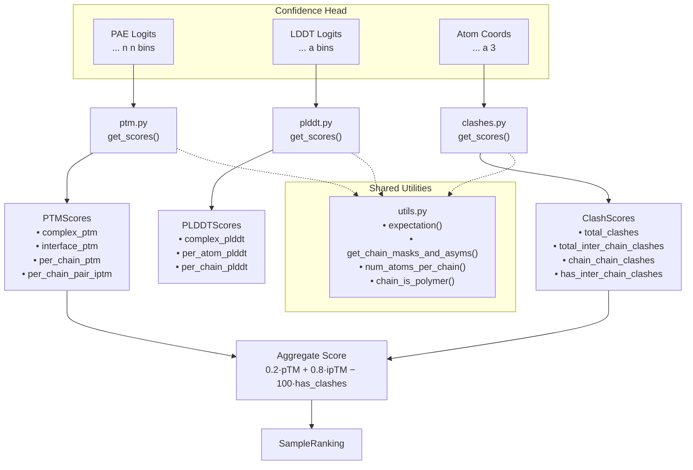
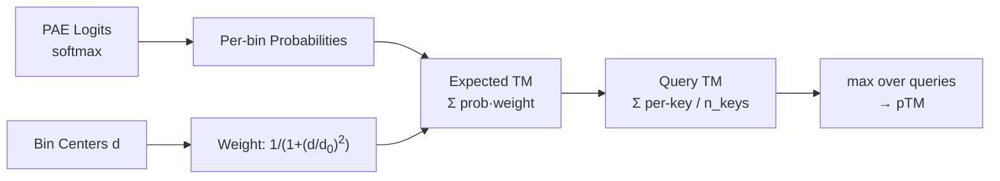
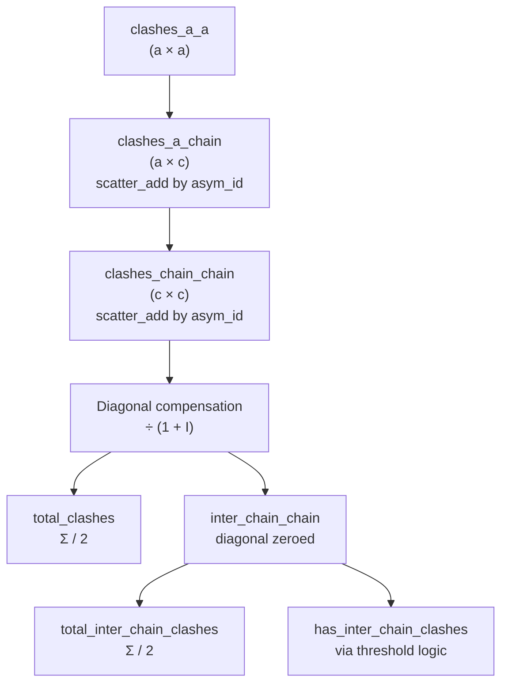
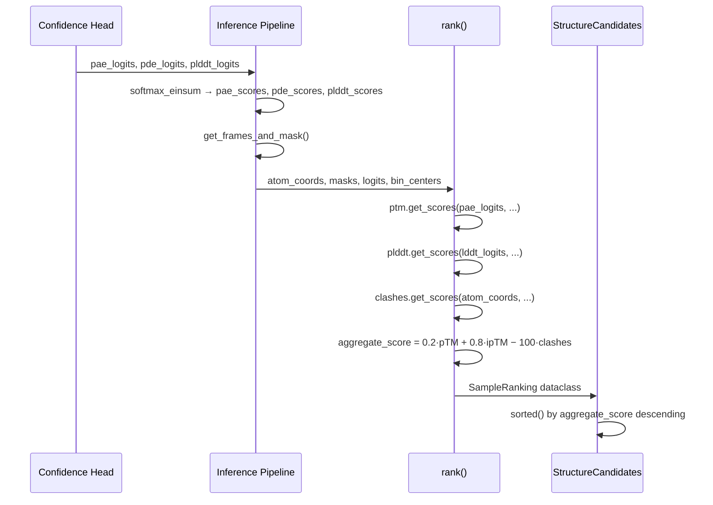

---
slug:23-ptm-plddt-and-clash-metrics
blog_type:normal
---


Chai1 的置信度与质量评估系统产生三个互补的指标族——**pTM**（预测模板建模分数，predicted Template Modeling score）、**pLDDT**（预测局部距离差异测试，predicted Local Distance Difference Test）和 **Clash**（冲突）指标——它们共同驱动结构候选者的综合排名。这些指标在置信度预测头下游计算得出，并作用于不同的信号类型：pTM 通过 TM-score 视角解释预测对齐误差（PAE，Predicted Aligned Error）分布，pLDDT 从 LDDT logits 中提取逐原子定位置信度，而冲突检测则对最终原子坐标进行几何验证。决定最佳候选者的综合得分公式为：`0.2 × pTM + 0.8 × ipTM − 100 × has_inter_chain_clashes`，该公式极大地优先考虑界面质量，并对空间位阻违规进行惩罚。

来源: [rank.py](chai_lab/ranking/rank.py#L88-L93), [chai1.py](chai_lab/chai1.py#L897-L903)

## 指标架构概述

这三个指标模块共享一个通用的架构模式：每个模块都暴露一个返回类型化数据类的 `get_scores()` 入口点，每个模块都将得分分解为复合体级别、逐链和逐链对的粒度，并且每个模块都依赖 `ranking/utils.py` 中的共享工具进行链掩码构建和期望计算。`rank.py` 中的排名协调器调用所有三个 `get_scores()` 函数，组装 `SampleRanking` 数据类，并计算综合得分。



<CgxTip>综合得分中 pTM 和 ipTM 之间的 0.2/0.8 权重意味着，对于多链复合体，界面质量在排名中占主导地位。对于 ipTM 等于 pTM 的单链预测，该公式简化为 `pTM − 100·has_clashes`，使得冲突检测在存在冲突时成为唯一的区分因素。</CgxTip>

来源: [rank.py](chai_lab/ranking/rank.py#L50-L93), [utils.py](chai_lab/ranking/utils.py#L1-L87)

## pTM: 预测模板建模分数

pTM 指标将模型的 PAE（预测对齐误差）分布转换为 TM-score 估计值。TM-score 是一种依赖长度的结构相似性度量，范围从 0 到 1，其中高于 0.5 的值表明具有正确的折叠拓扑。Chai1 计算四种 pTM 变体，每种变体针对不同的 token 子集查询 PAE logits，以测量不同范围的结构置信度。

### d0 归一化函数

基础计算是 TM-score 的 **d0** 参数，它根据 token 数量缩放距离惩罚：

```
d0(n) = 1.24 × (n − 15)^(1/3) − 1.8
```

该公式被限制为最少 19 个 token，产生一个随序列长度亚线性增长的距离阈值——较长的链容许更大的绝对偏差。d0 值将原始 PAE 距离转换为 TM-score 的归一化距离度量。

来源: [ptm.py](chai_lab/ranking/ptm.py#L28-L31)

### 核心计算：`_compute_ptm`

内部 `_compute_ptm` 函数实现成对 TM-score 期望。它接收形状为 `(... n n bins)` 的 PAE logits、一组查询 token、一组键 token 以及表示距离值的分箱中心。计算过程如下：

1. **分箱加权**：每个距离分箱中心通过 `1 / (1 + (d/d0)²)` 加权，这是逐元素应用于所有分箱的 TM-score 距离加权函数。
2. **逐对期望 TM**：PAE logits 的 softmax 产生逐分箱概率；乘以分箱权重并求和，得出每个查询-键 token 对的期望 TM 贡献。
3. **查询级聚合**：每个查询 token 的 TM 分数是其成对期望 TM 值之和除以键 token 的数量。
4. **乐观选择**：最终的 pTM 是所有查询中查询级 TM 分数的**最大值**，选择最有利的对齐方向。



<CgxTip>第 4 步中的 `max` 操作至关重要：pTM 报告的是最佳情况下的对齐，而非平均值。这使得 pTM 成为一种乐观估计，预测结构在最有利叠加下与真实结构对齐的程度。</CgxTip>

来源: [ptm.py](chai_lab/ranking/ptm.py#L34-L66)

### pTM 变体

| 变体 | 查询范围 | 键范围 | 用途 |
|---|---|---|---|
| **complex_ptm** | 具有有效帧的所有 token | 所有 token | 整个复合体的全局结构置信度 |
| **interface_ptm (ipTM)** | 一次一条链 | 该链*之外*的所有 token | 最佳链间对齐质量 |
| **per_chain_ptm** | 一次一条链 | 同一条链 | 逐链内部折叠置信度 |
| **per_chain_pair_iptm** | 一次一条链 | 所有其他链（单独） | 成对界面质量矩阵 |

**complex_ptm** 使用最简单的查询/键配置：具有有效帧的所有现有 token 查询所有现有 token。这测量了对整个结构排列的整体置信度。

**interface_ptm** 将每个查询链限制为仅来自*其他*链的键 token，然后取所有链的最大值。这隔离了对链间对接排列的置信度，这是多链复合体最具信息量的信号。公式为：`ipTM = max_c pTM(query=c, key=∁\{c})`。

**per_chain_ptm** 将查询和键都限制在同一条链，测量每条独立链无论链间排列如何的折叠置信度。

**per_chain_pair_iptm** 计算一个完整的链×链矩阵，其中条目 (i,j) 是链 i 查询链 j 时的 pTM。这是最细粒度的界面指标。为了内存效率，它默认使用循环实现遍历链，而不是批处理计算，仅当总张量大小低于 2³² 个元素时才切换到批处理模式。

来源: [ptm.py](chai_lab/ranking/ptm.py#L69-L186)

### `PTMScores` 数据类

`get_scores()` 函数将所有四个变体组装成一个单独的 `PTMScores` 数据类：

```python
@dataclass
class PTMScores:
    complex_ptm: Float[Tensor, "..."]           # 标量
    interface_ptm: Float[Tensor, "..."]          # 标量
    per_chain_ptm: Float[Tensor, "... c"]        # 每条链一个值
    per_chain_pair_iptm: Float[Tensor, "... c c"]  # 链 × 链矩阵
```

per_chain_pair_iptm 矩阵是不对称的：条目 (i,j) 反映了链 i 相对于链 j 的对齐程度，当链大小不同时，这与 (j,i) 有所区别。

来源: [ptm.py](chai_lab/ranking/ptm.py#L14-L24), [ptm.py](chai_lab/ranking/ptm.py#L189-L222)

## pLDDT: 预测局部距离差异测试

pLDDT 指标通过从模型的分箱 logits 计算 LDDT 分数的期望值，来估计逐原子的局部结构准确性。与在 token 级 PAE 上操作的 pTM 不同，pLDDT 在原子分辨率上操作，测量局部原子间距离邻域正确的置信度。

### 核心计算

计算非常简洁优雅：对 LDDT logits 应用 softmax 以获得逐分箱概率，然后使用分箱中心值作为权重计算加权和。这得出每个原子的期望 LDDT 分数。

```python
def plddt(logits, mask, bin_centers, per_residue=False):
    expectations = rank_utils.expectation(logits, bin_centers)  # softmax + 加权和
    if per_residue:
        return expectations           # 逐原子分数
    else:
        return masked_mean(mask, expectations, dim=-1)  # 标量平均值
```

`ranking/utils.py` 中的 `expectation()` 工具执行 `softmax(logits) · weights`，在分箱维度上求和。对于 pLDDT，权重简单地为分箱中心值本身（而非 pTM 中使用的 TM-score 加权），产生一个与期望距离准确度成比例的值。

来源: [plddt.py](chai_lab/ranking/plddt.py#L26-L34), [utils.py](chai_lab/ranking/utils.py#L43-L49)

### pLDDT 变体

| 变体 | 粒度 | 形状 | 用例 |
|---|---|---|---|
| **complex_plddt** | 标量（掩码平均） | `...` | 整体结构质量 |
| **per_atom_plddt** | 逐原子 | `... a` | 原子级置信度映射 |
| **per_chain_plddt** | 逐链（每链掩码平均） | `... c` | 链级质量比较 |

**per_chain_plddt** 的工作原理是通过 `get_chain_masks_and_asyms()` 构建形状为 `(... c a)` 的链掩码张量，然后在链维度上复制 logits 并独立计算每条链的掩码平均值。

### 分箱中心推导

在推理管道（`chai1.py`）中，LDDT 分箱中心推导如下：

```python
_bin_centers(0, 1, plddt_logits.shape[-1])
```

这通过 `torch.linspace(0, 1, 2*no_bins+1)[1::2]` 创建 `no_bins` 个等距中心，将每个中心放置在其分箱的中点。范围 [0, 1] 对应于归一化的 LDDT 刻度。当在 `StructureCandidates` 数据类中报告时，逐原子 pLDDT 通过在 token 内取平均转换为逐 token，并存储原始期望值以供下游使用。

来源: [plddt.py](chai_lab/ranking/plddt.py#L37-L82), [chai1.py](chai_lab/chai1.py#L919-L932)

### `PLDDTScores` 数据类

```python
@dataclass
class PLDDTScores:
    complex_plddt: Float[Tensor, "..."]       # 标量平均值
    per_atom_plddt: Float[Tensor, "... a"]    # 逐原子分数
    per_chain_plddt: Float[Tensor, "... c"]   # 逐链平均值
```

来源: [plddt.py](chai_lab/ranking/plddt.py#L14-L22)

## 冲突指标：空间质量评估

冲突指标对预测的原子坐标执行事后几何验证，检测表明结构在物理上不合理的空间冲突。与解释模型置信度输出的 pTM 和 pLDDT 不同，冲突检测是对最终坐标的确定性几何计算。

### 核心冲突检测：`_compute_clashes`

基础操作计算距离过近的原子对布尔矩阵：

1. **成对距离**：通过 `cdist(atom_coords)` 计算所有成对的欧几里得距离。
2. **有效对掩码**：排除自相互作用（对角线）以及任一原子被掩蔽的对。
3. **阈值**：如果 `distance < clash_threshold`（默认为 **1.1 Å**），则将该对标记为冲突。

结果是一个形状为 `(... a a)` 的布尔矩阵，指示所有冲突的原子对。

来源: [clashes.py](chai_lab/ranking/clashes.py#L29-L41)

### 从原子-原子到链-链冲突

`get_scores()` 函数通过一系列 scatter 操作将原子-原子冲突聚合为链级统计信息：

1. **构建 `clashes_a_a`**：布尔 → int32 的原子-原子冲突矩阵。
2. **Scatter 到 `clashes_a_chain`**：对于每个原子，按链标识对冲突进行分组求和（使用从 1 基转换为 0 基的 `atom_asym_id`）。
3. **Scatter 到 `clashes_chain_chain`**：将原子-链冲突聚合为链×链矩阵。
4. **补偿双倍计数**：由于对称性，对角线（链内）条目被计算了两次，因此除以 `(1 + I)`，其中 I 是单位矩阵——这将减半对角线条目，同时保持非对角线条目不变。
5. **提取链间冲突**：将对角线清零以隔离链间冲突，然后除以 2 求和以恢复对称性。



来源: [clashes.py](chai_lab/ranking/clashes.py#L72-L138)

### 链间冲突判定：`has_inter_chain_clashes`

布尔值 `has_inter_chain_clashes` 标志使用双标准阈值来确定链间冲突是否严重到足以标记整个结构：

| 标准 | 阈值 | 理由 |
|---|---|---|
| **绝对计数** | ≥ `max_clashes`（默认 100） | 无论链大小如何，绝对冲突数都很大 |
| **相对比例** | ≥ `max_clash_ratio`（默认 0.5）乘以较小链的原子数 | 对于小链而言冲突不成比例 |
| **聚合物限制** | 两条链都必须是聚合物（蛋白质/RNA/DNA/杂合） | 忽略涉及配体或水的冲突 |

如果超过绝对计数或相对比例中的**任一**项，且**两条**链都是聚合物，则该链对将被标记。最终的 `has_inter_chain_clashes` 是对所有链对的 `any()` 规约——这意味着即使只有一个有问题的聚合物-聚合物界面也会触发该标志。

<CgxTip>仅限聚合物的限制意味着配体链冲突永远不会触发惩罚。这是有意为之的：配体通常位于紧密的结合口袋中，其中许多原子靠近蛋白质表面，如果在用于聚合物-聚合物界面的相同阈值下，这会产生冲突标志的误报。</CgxTip>

来源: [clashes.py](chai_lab/ranking/clashes.py#L44-L70), [utils.py](chai_lab/ranking/utils.py#L71-L87)

### `ClashScores` 数据类

```python
@dataclass
class ClashScores:
    total_clashes: Int[Tensor, "..."]                    # 所有冲突（链内 + 链间）
    total_inter_chain_clashes: Int[Tensor, "..."]        # 仅链间
    chain_chain_clashes: Int[Tensor, "... n_chains n_chains"]  # 逐对矩阵
    has_inter_chain_clashes: Bool[Tensor, "..."]         # 惩罚标志
```

来源: [clashes.py](chai_lab/ranking/clashes.py#L14-L27)

## 综合得分组合

`rank()` 中的综合得分将 pTM 和冲突指标组合成单个标量：

```python
aggregate_score = (
    0.2 * ptm_scores.complex_ptm
    + 0.8 * ptm_scores.interface_ptm
    - 100 * clash_scores.has_inter_chain_clashes.float()
)
```

加权方案具有重要意义：

| 场景 | 得分行为 | 实际效果 |
|---|---|---|
| 多链，界面良好，无冲突 | ~0.8 × ipTM 占主导 | ipTM 是主要质量信号 |
| 多链，界面较差，无冲突 | 得分随 ipTM 下降 | 界面质量决定排名 |
| 任何具有链间冲突的复合体 | 施加 −100 惩罚 | 带有冲突的结构沉至底部 |
| 单链结构 | 0.2×pTM + 0.8×pTM = pTM | 简化为仅 complex_ptm |

`get_scores()` 函数将 `SampleRanking` 数据类转换为扁平的 numpy 字典以供下游使用，暴露以下指标：`aggregate_score`、`ptm`、`iptm`、`per_chain_ptm`、`per_chain_pair_iptm`、`has_inter_chain_clashes` 和 `chain_chain_clashes`。

来源: [rank.py](chai_lab/ranking/rank.py#L88-L126)

## 与推理管道的集成

这些指标在置信度头产生其三个输出 logits 张量之后计算。在 `run_folding_on_context()` 中，每个扩散样本都会调用置信度头，产生 `pae_logits`、`pde_logits` 和 `plddt_logits`。这些通过 softmax-einsum 与分箱中心转换为得分张量，然后与原子坐标和 token 元数据一起输入到 `rank()` 中。



PAE 和 PDE 分箱中心均使用 `_bin_centers(0.0, 32.0, 64)`（64 个分箱，跨越 0–32 Å），而 LDDT 使用跨越归一化 [0, 1] 范围的 `_bin_centers(0, 1, n_bins)`。通过 `get_frames_and_mask()` 进行的帧计算提供了决定哪些 token 参与 pTM 计算的 `valid_frames_mask`——没有有效局部帧的 token（例如，没有邻居用于构建帧的孤立原子）被排除在对齐搜索之外。

来源: [chai1.py](chai_lab/chai1.py#L897-L980), [chai1.py](chai_lab/chai1.py#L865-L895)

## 比较摘要

| 方面 | pTM | pLDDT | Clash |
|---|---|---|---|
| **输入信号** | PAE logits (token×token) | LDDT logits (逐原子) | 原子坐标 |
| **操作对象** | token 对 | 单个原子 | 原子对 |
| **得分范围** | [0, 1] | [0, 1] (归一化) | 非负整数 |
| **关键公式** | TM-score 加权 `1/(1+(d/d₀)²)` | 分箱中心期望 | 欧几里得距离 < 阈值 |
| **链感知** | 完全不对称分解 | 逐链平均 | 链 scatter + 聚合物过滤 |
| **主要粒度** | 链对矩阵 | 逐原子 | 链对矩阵 |
| **在排名中的作用** | 20% 复合体 + 80% 界面 | 不参与综合得分 | −100 惩罚标志 |
| **模块** | [ptm.py](chai_lab/ranking/ptm.py) | [plddt.py](chai_lab/ranking/plddt.py) | [clashes.py](chai_lab/ranking/clashes.py) |

注意，pLDDT 尽管被计算和存储，但**不**参与综合排名得分——它作为逐原子置信度图，可用于可视化和局部质量评估，但排名决策完全由 pTM/ipTM 和冲突惩罚驱动。

来源: [ptm.py](chai_lab/ranking/ptm.py#L1-L222), [plddt.py](chai_lab/ranking/plddt.py#L1-L82), [clashes.py](chai_lab/ranking/clashes.py#L1-L164), [rank.py](chai_lab/ranking/rank.py#L1-L126)

## 后续步骤

- 要了解这些指标如何输入到更广泛的样本选择和 CIF 输出管道中，请参阅 [Structure Ranking and Scoring](21-structure-ranking-and-scoring)。
- 要了解产生这些指标所消耗的 PAE 和 LDDT logits 的置信度头架构，请参阅 [Confidence Prediction and Scoring](12-confidence-prediction-and-scoring)。
- 要了解决定哪些 token 具有用于 pTM 的有效结构帧的帧计算，请参阅 [frames.py](chai_lab/ranking/frames.py)。