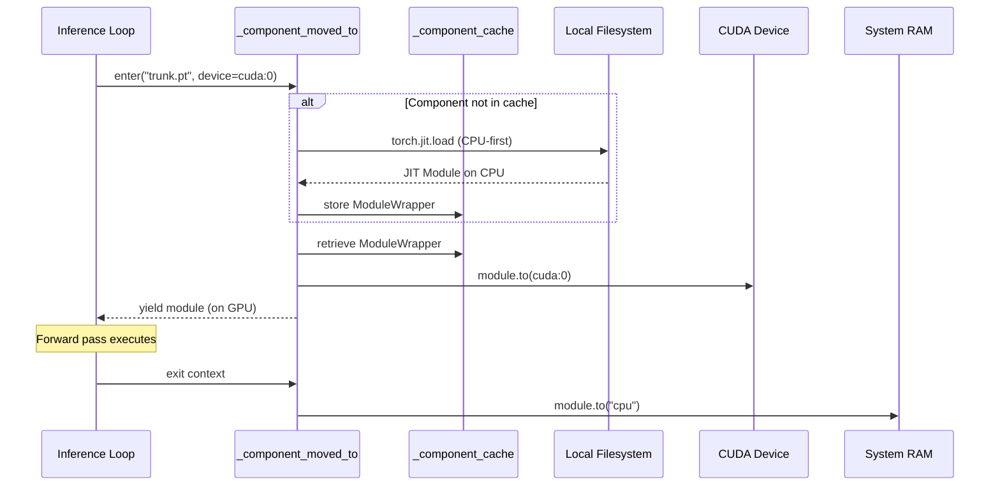
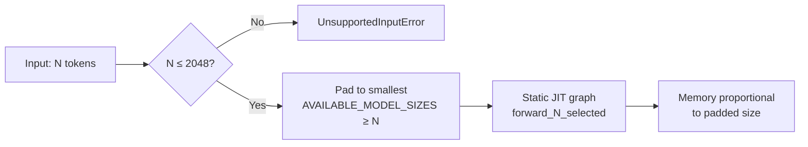
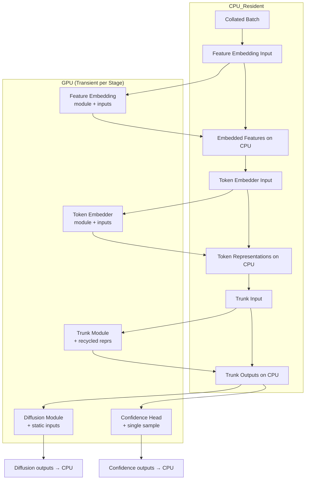

---
slug:24-memory-management-and-device-strategy
blog_type:normal
---

Chai-1 的推理流水线会处理海量的张量表示——成对 token 特征、MSA 堆栈、原子级扩散坐标——如果简单粗暴地一次性全部加载，极易超出 GPU 显存。代码库通过一种**短暂设备迁移**架构来解决此问题：模型组件和中间张量仅在活跃计算时被移至 GPU，计算完毕后立即返回 CPU。本页将剖析该策略的三大支柱——模块生命周期管理、数据迁移控制和策略性缓存驱逐——以便你在折叠大型复合物或在硬件资源受限的环境下运行时，能够分析内存行为。

## 核心抽象：ModuleWrapper 与短暂迁移

核心的内存节省机制是 `ModuleWrapper` 类，它封装了 TorchScript 编译的模型组件，并暴露了一个带有两个内存控制参数的 `forward` 方法：`move_to_device` 和 `return_on_cpu`。当设置了 `move_to_device` 时，输入数据会在前向调用前被递归地传输到目标设备；当设置了 `return_on_cpu` 时，输出结果在计算完成后会立即被移回 CPU。这意味着调用方无需手动追踪数据驻留的位置——封装器会强制执行这一契约。

`forward` 方法会根据填充后的模型大小（256、384、512、768、1024、1536、2048 之一），通过动态选择 `forward_{crop_size}` 来解析正确的编译图变体。每种大小对应一个单独导出的静态图，从而避免了 JIT 运行时内部的动态形状开销。

来源：[chai1.py](chai_lab/chai1.py#L104-L122)，[utils.py](chai_lab/data/collate/utils.py#L10-L11)

## 组件缓存与延迟加载

模型组件通过 `load_exported` 加载，该函数实现了一种**CPU 优先加载策略**：当目标设备不是 `cuda:0` 时，JIT 模块首先被加载到 CPU，然后再传输到目标设备。这避免了 `torch.jit.load` 直接在 GPU 上实例化大型参数缓冲区时可能引发的 CUDA OOM 错误。

模块级字典 `_component_cache` 通过组件键存储已加载的 `ModuleWrapper` 实例。一旦组件被加载，就再也不会从磁盘重新读取。上下文管理器 `_component_moved_to` 利用此缓存将缓存的模块短暂地移至活跃设备，交由计算使用，然后再将其移回 CPU——这种往返操作的成本远低于反复从磁盘反序列化。

这种模式一致地应用于所有五个模型组件——`feature_embedding.pt`、`bond_loss_input_proj.pt`、`token_embedder.pt`、`trunk.pt`、`diffusion_module.pt` 和 `confidence_head.pt`——每个组件都在一个 `with` 块内进出 GPU。

来源：[chai1.py](chai_lab/chai1.py#L124-L141)，[chai1.py](chai_lab/chai1.py#L606-L616)

## low_memory 标志：两种运行模式

`run_inference` 函数接受一个布尔值 `low_memory`（默认为 `True`），用于控制流水线将中间张量移出 GPU 的激进程度。此标志会传播到 `run_folding_on_context`，并控制每个主要流水线阶段的行为。

| 模式 | 批次放置位置 | 中间特征 | 模块输出 | 适用场景 |
|---|---|---|---|---|
| `low_memory=True` | CPU（默认） | 通过 `move_to_device` 按模块移至 GPU | 通过 `return_on_cpu` 返回 CPU | 消费级 GPU（≤24 GB 显存） |
| `low_memory=False` | 立即移至 GPU | 已在 GPU 上 | 保留在 GPU 上 | 高显存服务器（≥80 GB） |

在低内存模式下，拼接后的批次在构建后保留在 CPU 上。每个模型组件的 `forward` 调用使用 `move_to_device=device` 仅在该调用期间将所需的输入传输到 GPU，并使用 `return_on_cpu=True` 将输出带回。这意味着在任何时刻，只有一个模型组件及其直接输入占用 GPU 显存——峰值使用量受限于最大的单个组件，而非所有组件的总和。

当 `low_memory=False` 时，整个批次会通过 `move_data_to_device(batch, device=device)` 预先移至 GPU，并且模块输出保留在 GPU 上。这消除了重复 CPU↔GPU 传输的开销，但需要足够的显存来同时容纳所有中间表示。

来源：[chai1.py](chai_lab/chai1.py#L590-L595)，[chai1.py](chai_lab/chai1.py#L620-L631)

## 递归数据迁移：move_data_to_device

实用函数 `move_data_to_device` 可跨任意嵌套的数据结构执行递归的、类型分派的设备迁移。它处理 `torch.Tensor`（通过 `.to(device)`）、`dict`、`list`、`tuple` 和 `dataclass` 实例——对于后者，通过迁移所有字段来重建 dataclass。这是实现 `ModuleWrapper.forward` 参数和非低内存模式下批次级迁移的核心驱动力。

递归特性至关重要，因为由 `Collate` 生成的批次字典包含深度嵌套的结构：`batch["inputs"]` 是一个扁平的张量字典，而 `batch["features"]` 是一个命名特征张量字典，未来的扩展可能会进一步嵌套。简单的 `tensor.to()` 调用会遗漏非张量容器；递归分派可确保无一遗漏。

<CgxTip>在使用新数据结构扩展流水线时，请确保它们是普通的张量/字典/列表或 dataclass。`move_data_to_device` 函数会对不支持的类型抛出 `NotImplementedError`——这是有意为之的，以便尽早捕获错误，而不是悄无声息地将数据留在错误的设备上。</CgxTip>

来源：[tensor_utils.py](chai_lab/utils/tensor_utils.py#L254-L278)

## 策略性缓存驱逐点

除了组件级迁移模式外，流水线还在已知会发生峰值内存压力的三个关键时刻包含了显式的 `torch.cuda.empty_cache()` 调用：

1. **折叠开始前**——清除特征上下文组装期间的所有残留分配。
2. **主干循环完成后**——主干模块是最消耗内存的组件（对所有 token 进行成对注意力计算），在扩散循环开始前，必须回收其碎片化的 GPU 显存。
3. **扩散循环完成后**——在置信度预测之前，`static_diffusion_inputs` 字典（包含主干输出、成对表示和原子掩码）被显式 `del` 删除，随后清空缓存。这是整个流水线中最大的一次内存释放。

此外，在置信度预测和评分之后，所有输出数据——`inputs`、`atom_pos`、`plddt_logits`、`pae_logits`——在写入 CIF 文件之前都会被显式移至 CPU。这确保了 GPU 空闲，可用于外层循环中后续的主干采样。

来源：[chai1.py](chai_lab/chai1.py#L578-L579)，[chai1.py](chai_lab/chai1.py#L682-L683)，[chai1.py](chai_lab/chai1.py#L810-L812)，[chai1.py](chai_lab/chai1.py#L895-L898)

## 静态模型尺寸与填充策略

内存消耗也通过**静态模型尺寸**在输入层面得到控制。`AVAILABLE_MODEL_SIZES` 列表定义了七个离散的 token 数量（256、384、512、768、1024、1536、2048），`Collate` 类将每个输入填充到能容纳实际 token 数量的最小尺寸。原子数派生为 `23 × n_tokens`（每个 token 最多 23 个原子），确保与分块原子对注意力机制的 32 原子块对齐。

这种填充具有直接的内存影响：包含 300 个 token 的输入会被填充到 384，消耗的内存与填充后的尺寸成正比，而非实际尺寸。其权衡在于，静态图形状能够实现 TorchScript 优化，并消除动态形状分派的开销。`raise_if_too_many_tokens` 守卫会拒绝超过 2048 个 token 的输入，从而为峰值内存提供了硬性上限。

来源：[utils.py](chai_lab/data/collate/utils.py#L10-L40)，[chai1.py](chai_lab/chai1.py#L235-L245)

## 内存感知的距离计算

`tensor_utils.py` 中的 `cdist` 函数展示了一种更微妙的内存优化：在 CUDA 上计算成对欧几里得距离时，它会检查点对总数是否超过阈值（2,147,400,000）。如果超过，则回退到朴素实现，以避免 `torch.cdist` 内部缓冲区分配带来的内存激增。该朴素版本通过广播计算差值，并使用原地操作（`pow_`、`add_`、`sqrt_`）来最小化中间分配。

这在排名和评分期间很重要，此时跨越数千个原子的成对距离矩阵可能接近数 GB 的范围。该阈值经过校准，以防止在批次大小为 32 的推理场景下 24 GB GPU 发生 OOM。

来源：[tensor_utils.py](chai_lab/utils/tensor_utils.py#L17-L47)

## 设备选择与 ESM 嵌入放置

`run_inference` 入口点接受一个可选的 `device` 字符串参数，默认为 `"cuda:0"`。此设备用于所有模型组件，并作为 `esm_device` 参数传递给 `make_all_atom_feature_context` 用于 ESM 嵌入生成。ESM 推理在与折叠流水线相同的设备上运行，这意味着它在特征组装阶段会竞争 GPU 显存。在内存受限的配置中，ESM 嵌入可以预计算并从磁盘加载（通过设置 `use_esm_embeddings=False` 并提供缓存的嵌入）以避免这种争用。

来源：[chai1.py](chai_lab/chai1.py#L530-L566)

## 端到端内存流

下图展示了在低内存模式下，单个主干样本的完整设备驻留生命周期：

<CgxTip>当运行多个主干样本（`num_trunk_samples > 1`）时，`run_inference` 中的外层循环会重复调用 `run_folding_on_context`。由于 `_component_cache` 在跨调用期间持续存在，模块加载成本被摊销——只有设备迁移的往返过程会重复。然而，特征上下文数据在整个持续时间内都保留在内存中；对于非常大的输入，请考虑是否有必要使用多个主干样本。</CgxTip>

## 内存控制机制总结

| 机制 | 作用范围 | 开销 | 节省内存 |
|---|---|---|---|
| `low_memory=True`（默认） | 整个流水线 | 每阶段 CPU↔GPU 传输 | 降低约 60-70% 峰值显存 |
| `_component_moved_to` 上下文 | 每个模型组件 | 每阶段 `.to()` 往返 | 同时仅有 1 个组件在 GPU 上 |
| `_component_cache` | 跨调用持久化 | 无（避免磁盘 I/O） | 避免重复加载 |
| `torch.cuda.empty_cache()` | 3 个策略性点 | 短暂停顿 | 回收碎片化内存 |
| 静态模型尺寸 | 输入填充 | 对小输入过度填充 | 实现 JIT 优化 |
| `cdist` 阈值回退 | 成对距离 | 较慢的朴素计算 | 避免 GB 级缓冲区激增 |
| 显式 `del` + 移至 CPU | 扩散后 | 无 | 释放最大的中间变量 |

来源：[chai1.py](chai_lab/chai1.py#L104-L141)，[chai1.py](chai_lab/chai1.py#L530-L898)，[tensor_utils.py](chai_lab/utils/tensor_utils.py#L17-L47)，[utils.py](chai_lab/data/collate/utils.py#L10-L40)

---

**下一步**：要了解扩散噪声调度在迭代去噪循环中如何与内存交互，请参阅 [Diffusion Noise Schedule](25-diffusion-noise-schedule)。对于在相同内存约束下重复进行 GPU 密集型注意力计算的主干循环机制，请参阅 [Trunk Recycling and Attention](10-trunk-recycling-and-attention)。