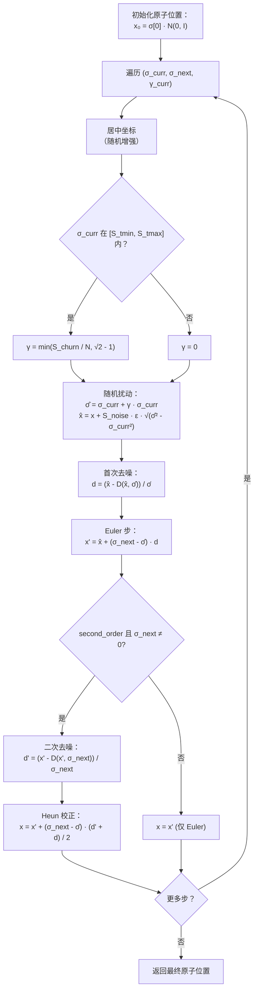

---
slug:25-diffusion-noise-schedule
blog_type:normal
---


扩散噪声调度控制着 Chai-1 在推理过程中如何从纯噪声过渡到结构化的原子坐标。它定义了去噪网络逐步解析的噪声水平（σ 值）序列，并控制着决定样本多样性与质量的随机扰动策略。本文将深入剖析其数学公式、幂次插值机制，以及在 Chai-1 随机采样器中的具体整合方式。

## 核心抽象：InferenceNoiseSchedule

噪声调度被封装在一个冻结的数据类 `InferenceNoiseSchedule` 中，它包含四个参数，共同定义了一条连续的 σ(t) 曲线，将归一化时间 t ∈ [0, 1] 映射到噪声水平：

| 参数 | 默认值 | 作用 |
|-----------|---------|------|
| `s_max` | 160.0 (schedule) / 80.0 (DiffusionConfig) | t = 0 时的 σ，即最大噪声水平（纯噪声） |
| `s_min` | 4e-4 | t = 1 时的 σ，即最小噪声水平（近似纯净） |
| `p` | 7.0 | 控制插值曲率的幂指数 |
| `sigma_data` | 16.0 | 数据缩放因子；最终 σ = sigma_data × 插值 |

该调度通过两种方法构建：`get_schedule` 为给定的步数生成离散的 σ 轨迹，而 `get_noise_for_times` 则计算任意归一化时间值对应的 σ。二者最终都委托给 `_power_interpolation` 函数。

来源：[diffusion_schedules.py](/chai_lab/model/diffusion_schedules.py#L12-L34)

## 幂次插值：数学核心

调度的核心是 `_power_interpolation`，它在 `val_0`（对应 t = 0）和 `val_1`（对应 t = 1）之间定义了一条平滑的参数化曲线：

```
f(t) = (t · val_1^(1/p) + (1-t) · val_0^(1/p))^p
```

这是阶数为 1/p 的**广义幂平均**。当 p > 1 时，曲线在过渡到 `val_1`（低噪声）之前，会在 `val_0`（高噪声）附近停留更长时间。当 p = 7 时，插值严重偏斜——调度在高噪声区域徘徊，解析出粗粒度的结构特征，随后快速穿过低噪声区域，显现出精细的原子细节。最终的 σ 值是通过将该插值乘以 `sigma_data` 进行缩放得到的：

```
σ(t) = sigma_data · f(t)
```

这种两阶段设计（先插值后缩放）将调度的形状与绝对噪声量级解耦，使得 `sigma_data` 可以独立调整，以匹配数据分布的方差。

来源：[diffusion_schedules.py](/chai_lab/model/diffusion_schedules.py#L37-L49)

## 时间步离散化：中点网格

`get_schedule` 方法使用**中点网格**策略而非均匀端点间距来生成离散的时间步：

```python
times = torch.linspace(0, 1, 2 * num_timesteps + 1, device=device)[1::2]
```

这在 [0, 1] 上创建了 `2N + 1` 个等距点，然后从索引 1 开始每隔一个点选取——在位置 1/(2N+1)、3/(2N+1)、5/(2N+1)、…、(2N-1)/(2N+1) 处产生 N 个点。这些是 N 个等长子区间的中点，与包含端点的 linspace 相比，它提供了对 σ 曲线更均衡的采样。默认的 `num_timesteps = 200` 会产生 200 个 σ 值，其中第一个噪声最大，最后一个近乎纯净。

来源：[diffusion_schedules.py](/chai_lab/model/diffusion_schedules.py#L21-L26)

## DiffusionConfig：采样器超参数

`InferenceNoiseSchedule` 定义了 σ 轨迹，而 `chai1.py` 中的 `DiffusionConfig` 类则控制在去噪循环中应用的**随机采样**行为：

| 参数 | 默认值 | 作用 |
|-----------|---------|------|
| `S_churn` | 80.0 | 总随机性预算；控制所有步骤中注入的随机扰动总量 |
| `S_tmin` | 4e-4 | 随机扰动的 σ 下限——低于此值，不添加噪声 |
| `S_tmax` | 80.0 | 随机扰动的 σ 上限——高于此值，不添加噪声 |
| `S_noise` | 1.003 | 每个随机步骤注入噪声的缩放因子 |
| `sigma_data` | 16.0 | 数据缩放比例，传递给 `InferenceNoiseSchedule` |
| `second_order` | True | 是否使用二阶（Heun）校正以提高精度 |

<CgxTip>`S_tmax` 参数具有双重作用：它既定义了采样器中随机扰动的上限，也定义了传递给 `InferenceNoiseSchedule` 的 `s_max` 值。这种耦合意味着调度的起始噪声水平与采样器的随机窗口是有意对齐的——采样器仅在调度所遍历的相同 σ 范围内添加扰动。</CgxTip>

来源：[chai1.py](/chai_lab/chai1.py#L242-L248)

## 整合：随机采样器循环

噪声调度在 `run_folding_on_context` 中被消费，以驱动完整的去噪过程。该整合遵循 **Karras 等人提出的随机采样器**（算法 2）的一个变体，它将确定性 Euler 步骤与可选的随机扰动相结合：



核心机制如下：

**调度实例化。** `InferenceNoiseSchedule` 由 `s_max = DiffusionConfig.S_tmax` (80.0)、`s_min = 4e-4`、`p = 7.0` 和 `sigma_data = 16.0` 构造。生成的 σ 轨迹决定了模型遍历的噪声水平序列。

**Gamma 计算。** 对于每一步，当当前 σ 落在窗口 `[S_tmin, S_tmax]` 内时，随机性因子 γ 计算为 `min(S_churn / num_timesteps, √2 - 1)`，否则为零。`√2 - 1` 的上限可防止扰动过度引发不稳定。

**随机扰动。** 当 γ > 0 时，当前位置被加噪至略高的水平 σ̂ = σ_curr(1 + γ)，然后从该扰动状态应用去噪器。这种受控随机性的注入，正是从相同的躯干表示中生成多样化结构样本的原因。

**二阶校正。** 启用后，在 σ_next 处的第二次去噪器评估会提供校正后的梯度估计（Heun 方法），以每次时间步多一次前向传递的代价提高了每步的精度。

来源：[chai1.py](/chai_lab/chai1.py#L775-L830)

## 调度形状及其影响

幂次插值 (p = 7) 与中点离散化的相互作用，产生了一个高度集中于高 σ 区间的调度。在 `sigma_data = 16.0` 及默认调度范围下，初始 σ 值约为 16 × 80 = 1280，而最终值接近 16 × 4e-4 ≈ 0.0064。这种跨越六个数量级的范围确保了去噪器在关注原子级精度（键长、侧链旋转异构体）之前，首先解析大规模的结构拓扑（骨架排列、结构域堆叠）。

| 区间 | σ 范围 | 解析的结构特征 |
|--------|---------|------------------------------|
| 高噪声 | σ > 100 | 全局拓扑、链排列 |
| 中噪声 | 10 < σ < 100 | 二级结构、结构域折叠 |
| 低噪声 | σ < 10 | 侧链堆叠、键几何 |
| 近似纯净 | σ < 1 | 原子精度、氢键 |

<CgxTip>将 `num_diffn_timesteps` 减少到默认值 200 以下会以质量换取速度，但由于幂次插值集中在高噪声区间，即使在步数较少时调度也能保持良好表现。γ 值与 `num_timesteps` 成反比，因此步数越少，每步自动获得的扰动就越大，从而部分补偿了更粗粒度的遍历。</CgxTip>

来源：[diffusion_schedules.py](/chai_lab/model/diffusion_schedules.py#L21-L34)、[chai1.py](/chai_lab/chai1.py#L775-L790)

## 与更广泛流水线的关系

噪声调度位于躯干表示与最终原子输出之间的边界。它作用于模型的**结构分支**——消费 `token_single_structure_input`、`token_pair_structure_input_feats` 及其经躯干精炼的对应物——并生成输入到置信度头部的原子坐标。因此，调度的设计独立于 MSA、模板和特征嵌入阶段，但其输出质量直接决定了下游的置信度预测和排序得分。

有关完整的去噪流水线上下文，请参阅 [扩散去噪过程](11-diffusion-denoising-process)。有关如何评估生成结构的详细信息，请参阅 [置信度预测与评分](12-confidence-prediction-and-scoring) 和 [pTM、pLDDT 与冲突指标](23-ptm-plddt-and-clash-metrics)。