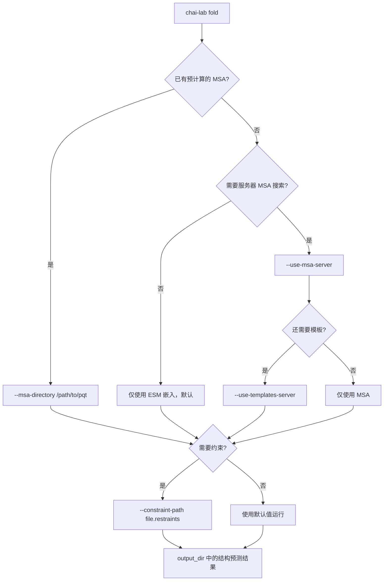

---
slug:3-cli-reference
blog_type:normal
---


`chai-lab` 命令行界面提供了对 Chai-1 结构预测功能的直接访问，无需编写 Python 代码。安装该包（`pip install chai_lab`）后，你的 shell 中便可以使用 `chai-lab` 命令，该命令提供三个子命令：用于运行结构预测的 **fold**、用于转换 MSA 文件格式的 **a3m-to-pqt**，以及用于打印引用信息的 **citation**。本页面涵盖了每个子命令、其参数、默认值及实际用法模式。

来源：[main.py](chai_lab/main.py#L1-L49), [pyproject.toml](pyproject.toml#L62-L63)

## 命令树概述

CLI 基于 [Typer](https://typer.tiangolo.com/) 构建并注册了三个子命令。入口点 `chai-lab` 在包配置中声明，并直接映射到 `chai_lab.main:cli`。每个子命令都是核心 Python 函数的轻量级封装，这意味着每个 CLI 参数在 Python API 中都有精确的对应项——在接口之间切换时不会丢失任何功能。

```
chai-lab
├── fold          → chai_lab.chai1.run_inference
├── a3m-to-pqt    → chai_lab.data.parsing.msas.aligned_pqt.merge_a3m_in_directory
└── citation      → 打印 Chai-1 技术报告的引用信息
```

来源：[main.py](chai_lab/main.py#L33-L48), [pyproject.toml](pyproject.toml#L62-L63)

## `chai-lab fold` — 结构预测

这是主要的子命令。它接收描述分子复合物的 FASTA 文件，并生成一组 CIF 格式的预测 3D 结构及置信度分数。在内部，它调用 [`run_inference`](chai_lab/chai1.py#L493-L539)，该函数编排了完整的流程：特征上下文组装 → 主干网络循环 → 扩散去噪 → 置信度预测 → 排序与输出。

### 基本用法

```shell
chai-lab fold input.fasta output_folder
```

默认情况下，模型从**单次主干网络传递**中生成 **5 个扩散样本**，运行 **3 次主干网络循环**，并使用 **200 个扩散时间步**。它会自动使用 ESM 嵌入，但除非明确要求，否则**不会**搜索 MSA 或模板。输出目录必须为**空**——如果它已包含文件，该命令将因断言错误而失败。

### 使用 MSA 和模板搜索

为了提高预测质量，可以启用 ColabFold MMseqs2 服务器来生成 MSA 和模板：

```shell
chai-lab fold --use-msa-server --use-templates-server input.fasta output_folder
```

如果你托管了自己的兼容 ColabFold 的服务器，请指定其 URL：

```shell
chai-lab fold --use-msa-server --msa-server-url "https://api.internalcolabserver.com" input.fasta output_folder
```

<CgxTip>`--use-msa-server` 和 `--msa-directory` 标志是**互斥的**——你不能同时指定两者。同样的互斥性也适用于 `--use-templates-server` 和 `--template-hits-path`。</CgxTip>

### 完整参数参考

| 参数 | 类型 | 默认值 | 描述 |
|---|---|---|---|
| `fasta_file` | 路径 (位置参数) | *必填* | 输入 FASTA 文件的路径 |
| `output_dir` | 路径 (位置参数) | *必填* | 空输出目录的路径 |
| `--use-esm-embeddings` | bool | `True` | 使用 ESM 蛋白质语言模型嵌入 |
| `--use-msa-server` | bool | `False` | 通过 ColabFold MMseqs2 服务器生成 MSA |
| `--msa-server-url` | str | `https://api.colabfold.com` | 自定义 ColabFold 服务器的 URL |
| `--msa-directory` | Path \| None | `None` | 预计算的 `.aligned.pqt` MSA 文件目录 |
| `--constraint-path` | Path \| None | `None` | 约束文件的路径（接触、口袋、共价键） |
| `--use-templates-server` | bool | `False` | 通过 ColabFold 服务器搜索结构模板 |
| `--template-hits-path` | Path \| None | `None` | 预计算模板命中结果的路径（`.m8` 格式） |
| `--num-trunk-recycles` | int | `3` | 主干网络循环迭代次数 |
| `--num-diffn-timesteps` | int | `200` | 扩散去噪步数 |
| `--num-diffn-samples` | int | `5` | 每次主干网络传递的结构样本数 |
| `--num-trunk-samples` | int | `1` | 独立主干网络传递的次数 |
| `--recycle-msa-subsample` | int | `0` | 循环期间的 MSA 子采样（0 = 禁用） |
| `--seed` | int \| None | `None` | 用于可复现性的随机种子 |
| `--device` | str \| None | `None` | Torch 设备字符串（默认：`cuda:0`） |
| `--low-memory` | bool | `True` | 启用 CPU 卸载以减少 GPU 内存使用 |
| `--fasta-names-as-cif-chains` | bool | `False` | 使用 FASTA 实体名称作为 CIF 链标识符 |

来源：[chai1.py](chai_lab/chai1.py#L493-L539), [chai1.py](chai_lab/chai1.py#L288-L398)

### 输入限制

模型对输入大小强制执行硬性限制。Token 计数会被填充到集合 **{256, 384, 512, 768, 1024, 1536, 2048}** 中最接近的可用模型大小，超过 2048 个 token 的输入将被拒绝。同样，MSA 深度和模板数量受内部常量（`MAX_MSA_DEPTH`、`MAX_NUM_TEMPLATES`）限制。每个 FASTA 实体必须具有**唯一名称**——重复的实体名称会触发 `UnsupportedInputError`。

来源：[chai1.py](chai_lab/chai1.py#L232-L254), [utils.py](chai_lab/data/collate/utils.py#L11-L12)

### 输出文件

成功运行后，输出目录针对每个扩散样本包含以下文件：

| 文件 | 格式 | 内容 |
|---|---|---|
| `pred.model_idx_{N}.cif` | CIF | 带有 pLDDT B 因子（0–100 范围）的预测 3D 结构 |
| `scores.model_idx_{N}.npz` | NumPy 归档 | pTM、ipTM、pLDDT 和冲突分数 |
| `msa_depth.pdf` | PDF | MSA token 覆盖率图（仅在使用了 MSA 数据时生成） |

Python API 返回的 `StructureCandidates` 对象还暴露了所有候选对象的 `pae`、`pde` 和 `plddt` 张量，以及一个 `.sorted()` 方法，该方法按聚合置信度分数降序重新排列结果。得分最高的候选对象被视为最佳预测。

来源：[chai1.py](chai_lab/chai1.py#L259-L282), [chai1.py](chai_lab/chai1.py#L940-L1060)

### FASTA 输入格式

FASTA 输入使用扩展头部来声明实体类型和名称。每个实体占用一条 FASTA 记录，其头部模式为 `>{type}|name={identifier}`，下一行为序列。支持的实体类型为 `protein`、`ligand`、`RNA` 和 `DNA`。配体指定为 **SMILES 字符串**，修饰残基则内联编码（例如，`AAA(SEP)AAA`）。以下是一个具体示例：

```fasta
>protein|name=receptor
AGSHSMRYFSTSVSRPGRGEPRFIAVGYVDDTQFVRFDSDAASPRGEPRAPWVEQEGPEYWDRETQKYKR
>protein|name=partner
AIQRTPKIQVYSRHPAENGKSNFLNCYVSGFHPSDIEVDLLKNGERIEKVEHSDLSFSKDWSFYLLYYTE
>ligand|name=drug
CCCCCCCCCCCCCC(=O)O
```

来源：[predict_structure.py](examples/predict_structure.py#L18-L30)

## `chai-lab a3m-to-pqt` — MSA 格式转换

此工具将原始的 `.a3m` MSA 文件（由 MMseqs2 或 Jackhmmer 等工具生成）转换为 Chai-1 使用的 `.aligned.pqt` parquet 格式。转换是**按查询序列**执行的——假定输入目录中的所有 `.a3m` 文件均源自同一查询，它们将被合并为一个单独的 parquet 文件。

### 用法

```shell
chai-lab a3m-to-pqt /path/to/a3m_directory
```

该命令会扫描指定目录中匹配 `*.a3m` 的文件，从每个文件名自动检测源数据库（例如，`hits_uniref90.a3m` → UniRef90），并将合并后的结果作为 `{seqhash}.aligned.pqt` 写入同一目录（如果指定了 `--output-directory`，则写入自定义的输出目录）。`seqhash` 是大写查询序列的 SHA-256 哈希值，以确保文件名具有确定性。

### 文件命名约定

| 文件名模式 | 检测到的来源 | 回退机制 |
|---|---|---|
| `hits_uniref90.a3m` / `uniref90_hits.a3m` | `uniref90` | — |
| `hits_uniprot.a3m` / `uniprot_hits.a3m` | `uniprot` | — |
| 任何无法识别的模式 | — | 默认为 `uniref90` |

<CgxTip>输出的 `.aligned.pqt` 文件必须遵循 `AlignedParquetModel` 架构：列 `sequence`（str）、`source_database`（来自已识别来源的 str）、`pairing_key`（str）和 `comment`（str）。第一行必须始终为 `source_database == "query"`。</CgxTip>

来源：[aligned_pqt.py](chai_lab/data/parsing/msas/aligned_pqt.py#L200-L241), [aligned_pqt.py](chai_lab/data/parsing/msas/aligned_pqt.py#L33-L41)

## `chai-lab citation` — 引用信息

将 Chai-1 技术报告的 BibTeX 条目打印到标准输出。在撰写论文或文档时，可使用此命令快速获取引用信息。

```shell
chai-lab citation
```

输出：

```
@article{Chai-1-Technical-Report,
    title        = {Chai-1: Decoding the molecular interactions of life},
    author       = {{Chai Discovery}},
    year         = 2024,
    journal      = {bioRxiv},
    publisher    = {Cold Spring Harbor Laboratory},
    doi          = {10.1101/2024.10.10.615955},
    ...
}
```

来源：[main.py](chai_lab/main.py#L17-L31), [main.py](chai_lab/main.py#L34-L36)

## 常见工作流

以下流程图说明了如何为常见的预测场景选择合适的 CLI 标志：



### 快速参考：最简命令与全功能命令

| 场景 | 命令 |
|---|---|
| **最快**（仅 ESM，无 MSA） | `chai-lab fold input.fasta output/` |
| **推荐**（带 MSA + 模板） | `chai-lab fold --use-msa-server --use-templates-server input.fasta output/` |
| **带约束** | `chai-lab fold --constraint-path pocket.restraints input.fasta output/` |
| **带本地 MSA** | `chai-lab fold --msa-directory ./msas/ input.fasta output/` |
| **可复现运行** | `chai-lab fold --seed 42 input.fasta output/` |
| **自定义 GPU 设备** | `chai-lab fold --device cuda:1 input.fasta output/` |
| **高质量（更多样本）** | `chai-lab fold --num-diffn-samples 10 --num-diffn-timesteps 400 input.fasta output/` |

来源：[chai1.py](chai_lab/chai1.py#L493-L539), [predict_structure.py](examples/predict_structure.py#L35-L45), [predict_with_msas.py](examples/msas/predict_with_msas.py#L28-L38), [predict_with_restraints.py](examples/restraints/predict_with_restraints.py#L21-L33), [predict_with_templates.py](examples/templates/predict_with_templates.py#L25-L31)

## Python API 等效性

每次 CLI `fold` 调用都直接映射到 `chai_lab.chai1.run_inference` 函数。如果你需要更精细的控制——例如手动构建 `AllAtomFeatureContext` 或访问中间张量——请切换到 Python API。下表展示了 CLI 标志与函数参数之间的精确映射：

| CLI 标志 | Python 参数 |
|---|---|
| `fasta_file` (位置参数) | `fasta_file: Path` |
| `output_dir` (位置参数) | `output_dir: Path` |
| `--use-msa-server` | `use_msa_server: bool` |
| `--msa-directory` | `msa_directory: Path \| None` |
| `--constraint-path` | `constraint_path: Path \| None` |
| `--num-trunk-recycles` | `num_trunk_recycles: int` |
| `--num-diffn-timesteps` | `num_diffn_timesteps: int` |
| `--num-diffn-samples` | `num_diffn_samples: int` |
| `--seed` | `seed: int \| None` |

对于 CLI 之外的高级用例，请参阅[架构概览](7-architecture-overview)以获取完整的流程分解，或参阅 [FASTA 解析与实体类型](13-fasta-parsing-and-entity-types)以了解输入格式详情。要了解约束如何指导折叠，请参考[约束与共价键系统](17-restraint-and-covalent-bond-system)。

来源：[chai1.py](chai_lab/chai1.py#L493-L539), [chai1.py](chai_lab/chai1.py#L288-L398)

## 环境变量

| 变量 | 用途 |
|---|---|
| `CHAI_DOWNLOADS_DIR` | 覆盖默认的模型权重下载位置（在 Docker 或挂载驱动器设置中非常有用） |

默认情况下，权重存储在 `<package_root>/downloads` 中。设置 `CHAI_DOWNLOADS_DIR` 可将下载重定向到自定义路径，例如，`CHAI_DOWNLOADS_DIR=/tmp/downloads chai-lab fold input.fasta output/`。

来源：[README.md](README.md#L74-L80)

## 下一步

现在你已可以从命令行调用 Chai-1，请探索以下主题以加深你的理解：

- **[架构概览](7-architecture-overview)** — 了解按下回车键后流水线内部发生了什么
- **[FASTA 解析与实体类型](13-fasta-parsing-and-entity-types)** — 掌握输入格式以编码蛋白质、配体、RNA、DNA 和聚糖
- **[MSA 生成与加载](14-msa-generation-and-loading)** — 了解 MSA 上下文是如何构建的以及它们为何能提高准确性
- **[约束与共价键系统](17-restraint-and-covalent-bond-system)** — 利用实验性接触和共价键指导预测