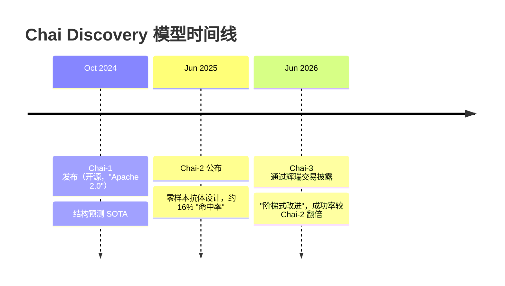

---
slug:4-latest-updates
blog_type:buzz
---

Chai Discovery 的发展速度惊人——从一款开源结构预测工具，到成为拥有两大制药巨头合作项目的独角兽估值平台，用时不到两年。然而，尽管该公司的商业化轨迹在不断加速，开源的 `chai-lab` 仓库却讲述着一个更为平缓、渐进的故事：依赖升级、错误修复以及可用性优化。以下是已经改变的、未曾改变的，以及对于押注这一技术栈的开发者而言，这一切究竟意味着什么。

---

## 从 Chai-1 到 Chai-3：模型的快速迭代

最重大的进展在于，Chai-1 已不再是该公司的旗舰模型。在大约十二个月的时间里，Chai Discovery 连续发布了三代模型：

| 模型 | 发布时间 | 核心能力 | 是否开源？ | 关键基准测试 |
|-------|----------|----------------|--------------|---------------|
| Chai-1 | 2024 年 10 月 | 多模态结构预测 | 是（Apache 2.0） | 77% PoseBusters 配体 RMSD 成功率；75.1% 蛋白质-蛋白质 DockQ 成功率 |
| Chai-2 | 2025 年 6 月 | 从头抗体设计 | 否（合作伙伴访问） | 52 个靶标上 16% 的命中率；50% 的靶标至少产生一种结合剂 |
| Chai-3 | 2026 年 6 月 | 抗体设计（改进版） | 否（辉瑞授权） | 声称成功率为 Chai-2 的两倍（据[辉瑞授权公告](https://www.businesswire.com/news/home/20260602498831/en/Chai-Discovery-Announces-License-Agreement-with-Pfizer-to-Accelerate-Drug-Discovery-with-AI)） |

对开发者而言的关键细节：**Chai-1 仍然是唯一公开了权重和代码的模型。** Chai-2 和 Chai-3 仅限商业使用。[Chai-2 技术报告](https://www.biorxiv.org/content/10.1101/2025.07.05.663018v1)于 2025 年 7 月发布在 bioRxiv 上，并且在 2025 年 8 月，一条 bibtex 条目被[添加到了 chai-lab 的 README 中](https://github.com/chaidiscovery/chai-lab/commit/2f7b713d6addd8cd7688ddfd5cb49e138f3e5b78)，但至今未发布任何推理代码或权重。这种分化在结构上意义重大——开源仓库是一个结构预测工具，而该公司的商业价值主张则是生成式抗体设计。

---

## 仓库活动：稳步维护，而非功能冲刺

自 2025 年中期以来，`chai-lab` 的提交日志展现出一种**维护优先工程**的模式：依赖兼容性、解析灵活性以及基础设施加固。没有发生重大的架构变更或新模型集成。

### 依赖与兼容性更新

最常见的提交类型是依赖管理——保持软件包在不断演进的 Python/PyTorch 生态系统中可安装：

| 提交 | 日期 | 变更内容 |
|--------|------|-------------|
| [Update rdkit (#416)](https://github.com/chaidiscovery/chai-lab/commit/c544fb183e865c4950909444db860a9d50604f66) | 2026 年 4 月 | RDKit 版本升级 |
| [Support newer versions of gemmi (#415)](https://github.com/chaidiscovery/chai-lab/commit/61036259c98222160963cb780750e354876ce485) | 2026 年 3 月 | Gemmi 兼容性修复 |
| [update pandera (#399)](https://github.com/chaidiscovery/chai-lab/commit/a01bfdeead343e1c7f369660ec519f12c940e9df) | 2025 年 9 月 | Pandera 升级（解决 FutureWarning） |
| [Allow torch 2.7 (#383)](https://github.com/chaidiscovery/chai-lab/commit/29195b89b1f63fb8a4a78406fc7a58468318ff4a) | 2025 年 6 月 | PyTorch 2.7.1 兼容性 |
| [specify kalign version (#375)](https://github.com/chaidiscovery/chai-lab/commit/6d1e44d8f2bdd37d96e0ed8d67ca4938d9bff54b) | 2025 年 5 月 | 固定 kalign 版本以避免版本漂移 |
| [use more generic error (#387)](https://github.com/chaidiscovery/chai-lab/commit/0a5a85594a44096aeeba7b6f53f99b53f240de15) | 2025 年 7 月 | 修复旧版本中 urllib3 NameResolutionError 的导入问题 |

这些都是不那么光鲜但必不可少的提交，确保了 `pip install chai_lab==0.6.1` 不会崩溃。[NameResolutionError 修复](https://github.com/chaidiscovery/chai-lab/issues/386)就是一个很好的例子：Chai 之前从 `urllib3.exceptions` 导入 `NameResolutionError`，但该类仅存在于较新的 urllib3 版本中，从而导致在带有旧版系统 Python 包的 AWS 实例上导入失败。

### 功能与可用性改进

第二类提交在不改变模型本身的情况下，改善了输入/输出的易用性：

- **灵活的修饰解析**（[#384](https://github.com/chaidiscovery/chai-lab/commit/dc41706bfc19b8530809c8b88cf7d90a58640b2e)）：除了使用 `()` 之外，支持使用 `[]` 在 FASTA 中指定修饰残基，并放宽了实体名称验证。这直接解决了用户在自定义残基表示法上的困扰。

- **实体名称作为链名称**（[#378](https://github.com/chaidiscovery/chai-lab/commit/2a2d4a96e842a73499bacced0db662455b42e886)）：允许 FASTA 中指定的实体名称作为链名称带入 CIF 输出中。以前，输出链会获得通用标识符，这使得将预测结果映射回输入变得困难。

- **约束改进**：多项提交（[#379](https://github.com/chaidiscovery/chai-lab/commit/ac9c1f3edc5c85d0fcb95f465ca1f27bb0481a5f)，[#377](https://github.com/chaidiscovery/chai-lab/commit/79dc5b9253c8baae1107ac095bd9693840a72c65)）增加了对约束中基于实体名称的子链支持，并改进了对空注释字段等边缘情况的解析。

- **全局模板缓存**（[#371](https://github.com/chaidiscovery/chai-lab/commit/eb63e84536bcbb46c0b675abb6a312ec9d682443)）：引入了 `CHAI_TEMPLATE_CIF_FOLDER` 环境变量，用于控制模板 CIF 文件的缓存位置。对于 Docker 部署和共享计算环境而言，这是一项重大的运维改进，因为在这些环境中，site-packages 内的默认 `/downloads` 路径不是持久化的。

### 性能与基础设施

有两项提交因对运维可靠性的影响而脱颖而出：

- **带超时的并行构象生成**（[#410](https://github.com/chaidiscovery/chai-lab/commit/af596cbc075a1fce368cec0ab5f31be1090ca7e2)）：之前的构象生成代码可能会无限期挂起。此修复增加了并行处理和合理的超时设置——这是一个典型的“进程就呆在那里什么都不做”的问题，在批处理工作流中是致命的。

- **模型组件的 CPU 缓存**（[#360](https://github.com/chaidiscovery/chai-lab/commit/4d110dd40ee4ae60303c83a21de5ecb2d4a57dd1)）：将模型组件保留在 CPU 缓存中，以减轻推理期间的 GPU 显存压力。这对于在 VRAM 较低的 GPU（A10、A30，或 README 中提到的消费级 RTX 4090）上运行的用户来说尤为重要。

---

## PyPI 发布历史：0.6.1 及后续

当前稳定的 PyPI 版本是 **`chai_lab==0.6.1`**，发布于 2025 年 3 月 18 日。完整的发布历史显示出初期节奏很快，但随后放缓：

| 版本 | 发布日期 | 备注 |
|---------|-------------|-------|
| 0.0.1 | 2024 年 9 月 9 日 | 初始发布 |
| 0.1.0 | 2024 年 9 月 25 日 | 随 Chai-1 的首次公开发布 |
| 0.2.0 | 2024 年 10 月 21 日 | CLI 改进 |
| 0.3.0 | 2024 年 11 月 19 日 | |
| 0.4.2 | 2024 年 11 月 27 日 | Hugging Face 模型卡引用此版本 |
| 0.5.0 | 2024 年 12 月 5 日 | |
| 0.5.2 | 2024 年 12 月 24 日 | |
| 0.6.0 | 2025 年 2 月 18 日 | |
| **0.6.1** | **2025 年 3 月 18 日** | **当前稳定版本** |

值得注意的是，尽管不断有提交合并到 `main` 分支，但**超过一年没有发布新的 PyPI 版本**。README 仍然建议固定使用 `0.6.1`，并指出 `pip install git+https://github.com/chaidiscovery/chai-lab.git` “每日更新，用于测试尚未发布的功能”。提交活动与发布节奏之间的这种差距表明，团队对于已发布的软件包优先考虑稳定性而非功能迭代速度，同时将 `main` 分支作为内部和早期采用者测试的滚动更新版本。

---

## 重塑格局的公司里程碑

该仓库存在于一家经历了巨大变革的公司之中。这些事件不会直接改变代码，但它们重塑了任何基于 Chai-1 进行构建的人的战略背景：

| 日期 | 事件 | 意义 |
|------|-------|-------------|
| 2024 年 9 月 | 3000 万美元种子轮融资（Thrive Capital, OpenAI, Dimension） | 初始资金 |
| 2024 年 10 月 | Chai-1 开源发布 + [bioRxiv 预印本](https://www.biorxiv.org/content/10.1101/2024.10.10.615955v2) | 建立信誉 |
| 2025 年 6 月 | Chai-2 公布：16% 抗体设计命中率 | 从预测转向生成 |
| 2025 年 8 月 | 7000 万美元 A 轮融资（Menlo Ventures, Anthology Fund/Anthropic） | 专注制药的 VC 给予验证 |
| 2025 年 12 月 | 1.3 亿美元 B 轮融资，估值 13 亿美元（Oak HC/FT, General Catalyst） | 独角兽地位；总融资额 > 2.25 亿美元 |
| 2026 年 1 月 | [与礼来合作](https://www.linkedin.com/posts/yosemiteco_yosemite-is-excited-to-see-eli-lilly-and-activity-7415491352773521408-blcA)（基于专有数据的自定义模型） | 首次大型制药企业部署 |
| 2026 年 6 月 | [辉瑞许可协议](https://www.businesswire.com/news/home/20260602498831/en/Chai-Discovery-Announces-License-Agreement-with-Pfizer-to-Accelerate-Drug-Discovery-with-AI)（Chai-3 访问权限 + 自定义模型） | Chai-3 揭晓；规模化验证 |

Chai 联合创始人兼首席执行官 Joshua Meier 在 LinkedIn 上简明扼要地总结了这一转变：“2025 年是我们证明 AI 能够改变临床前药物发现的一年。2026 年将是部署之年。”特别是与辉瑞的交易，证实了 **Chai-3** 的存在——这是一个“将前任模型的成功率翻倍”的模型，专注于治疗性结合、多特异性以及难以成药的靶标。Chai-3 未在任何出版物中描述过，并且仅在辉瑞协议之外不可用。

《福布斯》还在[2026 年 6 月报道](https://www.facebook.com/forbes/posts/1372275921429061)，Chai Discovery 正在谈判以 34 亿美元的估值额外筹集 4 亿美元——与仅仅六个月前的 B 轮融资相比，这几乎是 3 倍的跃升。

---

## 这种分化对开发者意味着什么

这就是结构性的紧张关系：`chai-lab` 仓库是一个**结构预测**工具（Chai-1），而 Chai Discovery 的商业未来是**生成式分子设计**（Chai-2，Chai-3）。这是根本不同的产品。结构预测接收一个序列并返回一个 3D 结构。生成式设计接收一个靶标并返回一个全新的序列。

**你今天从开源仓库获得的**仍然非常强大。在 PoseBusters 蛋白质-配体基准测试中，Chai-1 达到了 77% 的配体 RMSD 成功率，与 [AlphaFold3](https://github.com/google-deepmind/alphafold3) 报告的 76% 相当。其单序列模式（无需 MSA）在蛋白质-蛋白质界面上甚至超越了需要 MSA 的 AlphaFold-Multimer 2.3。其约束系统——口袋约束、接触约束和共价键规范——仍然是竞争性开源工具中不具备的独特功能。

**你无法获得的是**抗体设计、迷你蛋白结合剂生成，或者是推动了该公司近期融资和合作的任何生成能力。仓库中的[关于 Chai-2 的 issue](https://github.com/chaidiscovery/chai-lab/issues/412)——标题简单地写着“About Chai-2”，内容是“我非常期待使用 Chai-2。请请请尽快发布它！”——抓住了社区的情绪，但没有迹象表明生成模型的权重将被开源。

现实意义在于：如果你正在构建一个需要对已知序列进行结构预测的工作流（蛋白质-蛋白质对接、配体姿势生成、核酸复合物建模），`chai-lab` 仍然是一个强大且积极维护的选择。如果你需要从头进行抗体设计，你将需要谈判商业访问权限。

---

## 值得关注的显著技术变更

最近的几项提交预示了值得关注的动向：

1. **移除序列破坏逻辑**（[#368](https://github.com/chaidiscovery/chai-lab/commit/f824e747b46e73ea78c1153077a5907f6a0c3cca)）：D-型氨基酸现在被映射为 `X` 而不是其 L-型对应物，并且残基破坏逻辑被完全移除。这是一项正确性改进——旧的行为会静默地破坏 D-型氨基酸信息，可能会对包含非标准立体化学的序列产生误导性的预测。

2. **完整的 Typer CLI**（[#350](https://github.com/chaidiscovery/chai-lab/commit/6d3439a0f41a0f33bb8cc1c3bbacfa36a99b7df9)）：迁移到完整的 `typer` 库进行 CLI 参数解析，替换了临时的参数处理方式。这使得 CLI 更易于发现和保持一致性。

3. **非配对 MSA 的错误修复**（[#349](https://github.com/chaidiscovery/chai-lab/commit/bd49ff24d68fe97af7b7a2999b7c7c15fb6fb331)）：一个微妙但重要的修复——对非配对多序列比对的错误处理可能会静默地产生错误的特征，在不引发错误的情况下降低预测质量。

---

## 展望未来

`chai-lab` 仓库处于一种稳定但停滞的状态。上一次 PyPI 发布是在 2025 年 3 月。提交继续合并到 `main` 分支，但绝大多数是以维护为导向。公司的工程重心显然已经转移到了不属于该仓库的 Chai-2 和 Chai-3 上。

对于评估是否要基于此技术栈进行构建的开发者来说，关键问题是：

- **Chai-1 的权重会继续得到维护吗？** Apache 2.0 许可证是不可撤销的，但如果没有持续的维护，无法保证模型与未来 PyTorch 版本的兼容性。torch 2.7 兼容性的提交表明团队正在保持管道畅通，但随着商业优先级的转变，这可能会发生变化。

- **会有任何生成能力渗透到开源仓库中吗？** 约束系统已经允许使用实验数据来指导预测。可以想象，一个简化版的口袋约束引导设计可能会出现，但目前还没有宣布任何消息。

- **PAE 输出呢？** 关于从 CIF 文件中提取 PAE 矩阵的[待解决的 issue](https://github.com/chaidiscovery/chai-lab/issues/411)自 2025 年 12 月以来一直没有得到回应。Chai-1 在内部生成 PAE，但默认情况下不会将 `_ma_qa_metric_local_pairwise` 条目写入 ModelCIF。对于需要置信度指标来进行下游排序的用户来说，这是一个重大缺失。

底线：`chai-lab` 是一个工程优秀的结构预测工具包，目前处于等待状态，而其母公司正朝着商业生成式 AI 狂奔。代码运行正常，许可证宽松，模型具有竞争力。但是，如果你需要超越“折叠此序列并给我一个结构”的能力，你面临的将是一场商业谈判，而不是一次 pip install。