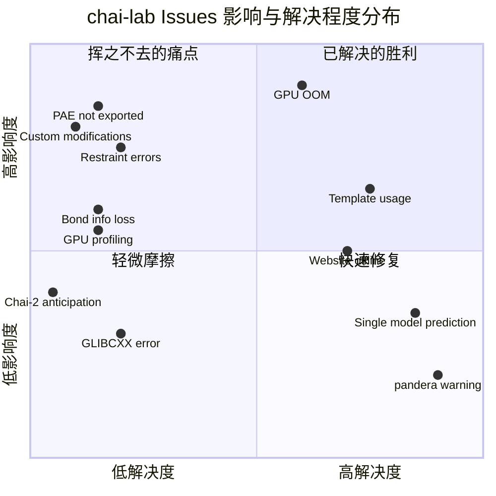
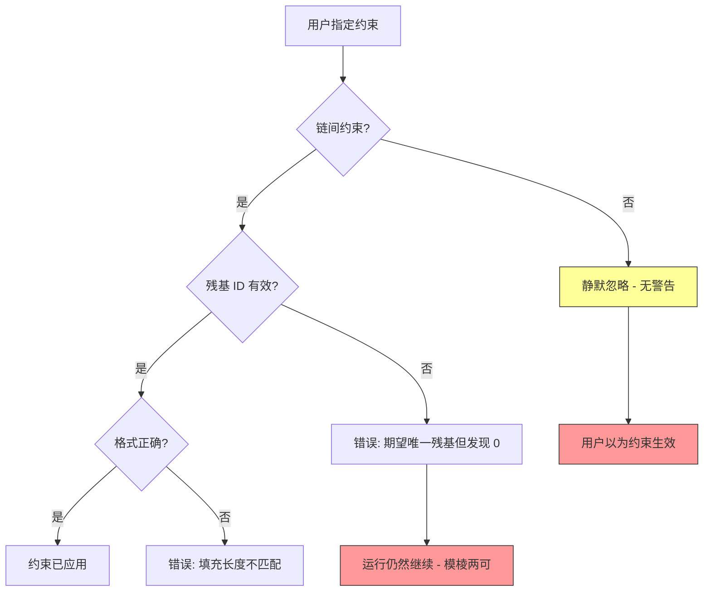

---
slug:5-issues-and-feedbacks
blog_type:buzz
---

截至 2026 年中，chai-lab 仓库已累计 84 个开放和 144 个关闭的 issue。对于 2024 年 9 月才公开发布的项目而言，这是一个强烈的信号。引人注目的不仅是数量，更是投诉的*形态*：它们集中在少数几个结构性缺口上，任何认真的使用者迟早都会遇到。下文将拆解这些反复出现的主题，梳理团队的应对方式，并标出仍悬而未决的问题。

## Issue 全局概览

## 1. GPU 硬件：显而易见的大问题

Chai-1 的硬件要求毫不妥协。README 推荐 **A100 80GB、H100 80GB 或 L40S 48GB**，并注明 A10/A30“适用于较小的复合物”。消费级 RTX 4090 (24GB) 则被提及“据报告可用”。这种措辞可谓意味深长。

最著名的开放 issue 是 [CUDA out of memory (#17)](https://github.com/chaidiscovery/chai-lab/issues/17)，使用 2080 Ti (11GB)、A100 40GB 分区甚至部分 A100 80GB 配置的用户都遇到了 OOM（显存不足）错误。一位评论者发现该问题与蛋白质序列长度有关：

> “如果我使用约 1500 的完整序列就会崩溃。然后我只放了约 900（去掉了 600），就成功了。” -- [@lonelu](https://github.com/chaidiscovery/chai-lab/issues/17)

该 issue 最终由贡献者 Alex Rogozhnikov 于 2025 年 1 月关闭，可能与 [keep model components in CPU cache (#360)](https://github.com/chaidiscovery/chai-lab/commit/4d110dd40ee4ae60303c83a21de5ecb2d4a57dd1) 提交有关，该提交将不需要的模型组件卸载到 CPU。这是一种务实的修复方案，但根本矛盾依然存在：**这是一个需要庞大 GPU 显存的大型模型，且不支持多 GPU 并行。**

在非 NVIDIA 领域，硬件情况更为复杂。[GLIBCXX_3.4.31 (#422)](https://github.com/chaidiscovery/chai-lab/issues/422) 报告了在 `libstdc++` 版本过旧的系统上出现 `ImportError`，这是一个典型的依赖地狱问题，让使用旧版 CentOS 或 HPC 集群环境的用户苦不堪言。而 [Inquiry about chai-1 support for NVIDIA Blackwell GPUs (#381)](https://github.com/chaidiscovery/chai-lab/issues/381) 则显示有用户尝试在最新的 RTX PRO 6000 Blackwell 显卡上运行——答案是可行的，但你可能需要最前沿的 PyTorch 和 CUDA 构建版本。

与此同时，[Error applying restraints (#413)](https://github.com/chaidiscovery/chai-lab/issues/413) 特别暴露了在 **AMD GPU 上通过 PyTorch ROCm 运行** 时的问题，在约束特征生成器中出现了填充长度不匹配的错误。这提醒我们，chai-lab 代码库首先是针对 NVIDIA CUDA 测试的，而 ROCm 的兼容性基本上是由社区验证的。

**底线**：如果你使用的不是配备当前版本 CUDA 的 A100/H100，请做好遇到阻碍的准备。团队已经进行了内存优化（CPU 缓存、[PR #410](https://github.com/chaidiscovery/chai-lab/commit/af596cbc075a1fce368cec0ab5f31be1090ca7e2) 中的构象超时），但在廉价硬件上运行大型复合物并没有银弹。

## 2. 约束系统：强大但危险

Chai-1 的约束功能可以说是其相较于 [AlphaFold 3](https://deepmind.google/technologies/alphafold-3/) 和 [Boltz](https://github.com/jwohlwend/boltz) 最差异化的能力。你可以指定口袋约束、接触约束和共价键，以实验先验来指导折叠。但其实现却暗藏隐患。

最根本的困惑记录在 [Using constraints seems to have little to no effect (#204)](https://github.com/chaidiscovery/chai-lab/issues/204) 中，一位用户指定了**链内**接触约束，却毫无效果。贡献者 Kevin Wu 解释道：

> “Chai-1 中的约束是作为**链间**接触训练的；根据你提供的代码行，你似乎试图指定一个**链内**接触。链内接触更类似于结构模板，你或许可以通过变通的方式将其加入 `TemplateContext`。”

这是一个关键的文档缺口。约束系统会*静默忽略*链内约束，而不是抛出错误。用户浪费算力，以为模型正在使用他们的数据，实际上并没有。

此外还有彻底的 bug。[Error on run with restraints: Expected unique residue but found 0 (#376)](https://github.com/chaidiscovery/chai-lab/issues/376) 报告了口袋约束的一个错误，模型无法解析残基标识符——然而运行却继续进行并产生了输出，让用户不确定约束是否真正被应用了。而 [Error applying restraints (#413)](https://github.com/chaidiscovery/chai-lab/issues/413) 显示在 ROCm 上使用约束时出现了填充长度不匹配，表明特征生成器具有平台特定的行为。

在文档方面，[Source for Pocket Restraint Docs (#418)](https://github.com/chaidiscovery/chai-lab/issues/418) 揭示，甚至连仓库资产中的约束文档图表似乎也没有可归属的来源，一位用户指出他们“除了某些同样展示该图表的 X 帖子外，找不到任何来源。”

**底线**：约束系统是 Chai-1 的杀手级特性之一，但它需要更好的防护机制。至少，链内约束应该产生警告。最理想的情况是，它们应该得到支持，或者文档应该预先明确说明这一限制。

## 3. 输出保真度：所见未必即所得

两个持续存在的问题表明，Chai-1 的输出格式丢失了下游工具所需的重要信息。

### PAE：计算中存在，输出中缺失

[Extract PAE matrix from .cif file (#411)](https://github.com/chaidiscovery/chai-lab/issues/411) 记录了 Chai-1 的 ModelCIF 输出包含 `_ma_qa_metric_local` 条目（逐残基置信度），但**不**包含编码预测对齐误差 (PAE) 矩阵的 `_ma_qa_metric_local_pairwise` 条目。这被 [Missing PAE File in Python Prediction Mode (#348)](https://github.com/chaidiscovery/chai-lab/issues/348) 所证实，该 issue 已积累了 4 条同样遇到此障碍的用户评论。

PAE 矩阵对于理解结构域间或链间的预测置信度至关重要。它的缺失意味着你无法区分“两条链都预测得很好且方向正确”和“两条链都预测得很好但相对位置可能放错”——而这正是对接和复合物预测中最关键的区别。

这不是模型的局限；PAE 是在内部计算的。这是一个输出缺失。[ChimeraX 的 ModelCIF PAE 方案](https://rbvi.github.io/chimerax-recipes/modelcif_pae/modelcif_pae.html)证明，生态系统中的其他工具*确实*会写入和读取该字段。

### 小分子的键信息丢失

[chai-1 prediction causes loss of atomic bond information (#417)](https://github.com/chaidiscovery/chai-lab/issues/417) 报告，在预测小分子配体时，输出 CIF 中的双键变成了单键。这是基于扩散的结构预测器的已知类别问题：扩散模块预测的是原子坐标而非键级，因此键类型信息必须从输入的化学结构中重建。当重建失败时，你会丢失芳香性和双键特征——这些信息对下游药物设计工作流至关重要。

| 输出指标 | 状态 | 影响 |
|---|---|---|
| pLDDT (逐残基置信度) | 已导出 | 低 |
| pTM / ipTM | 已导出 | 低 |
| PAE (成对对齐误差) | **未导出** | **高** |
| 键级 (小分子) | **丢失** | **高** |
| 链命名 | 可配置 (自 [PR #378](https://github.com/chaidiscovery/chai-lab/commit/2a2d4a96e842a73499bacced0db662455b42e886) 起) | 中 |

**底线**：对于一款标榜为药物发现最先进 (SOTA) 的模型来说，在输出中丢失 PAE 和键级是一个重大缺陷。这些并非边缘情况——它们是从业者评估和使用预测的核心依据。

## 4. 自定义化学：CCD 高墙

[Prediction with custom nucleotide/amino acid modifications (#423)](https://github.com/chaidiscovery/chai-lab/issues/423) 是最新开放的 issue，也可以说是最具前瞻性的。一位用户希望预测包含硫代磷酸核苷酸和其他**没有 CCD（化学组分字典）代码**修饰的结构。他们已经按照 AlphaFold 3 和 Boltz 使用的最小 CCD 格式生成了自定义 CIF 文件，并询问：

> “与 AF3 和 Boltz 类似，有没有办法更新 CCD 代码列表以包含我的自定义代码，以便我可以预测像 ATG(PSC-min)GGTA 这样的序列？”

这是一个真实的架构限制。Chai-1 的输入解析会根据 CCD 解析修饰代码，目前没有机制允许用户提供的条目扩展该字典。最近的 [More flexible modification parsing (#384)](https://github.com/chaidiscovery/chai-lab/commit/dc41706bfc19b8530809c8b88cf7d90a58640b2e) 提交拓宽了解析语法（除了使用 `()` 指定修饰外，还支持 `[]`），但并未添加自定义 CCD 支持。

相关问题包括 [Custom residue modification and covalent constraints (#366)](https://github.com/chaidiscovery/chai-lab/issues/366) 和 [Will ligand input as ccdcode be optional? (#382)](https://github.com/chaidiscovery/chai-lab/issues/382)，两者都指向同一堵高墙：CCD 是一个固定的依赖项，而不断增长的具有非标准化学的治疗性寡核苷酸世界无法整齐地容纳其中。

**底线**：对于用于药物发现的工具来说，化学字典的可扩展性不是可选项。这是 [Boltz](https://github.com/jwohlwend/boltz) 目前也没有优势的领域，从而成为 chai-lab 实现差异化的一大机会。

## 5. 基础设施脆弱性

几个问题表明，让 chai-lab 运行起来比应有的要难：

- **[Website is offline (#408)](https://github.com/chaidiscovery/chai-lab/issues/408)**：提供构象数据文件的 `chaiassets.com` 域名于 2025 年 12 月 1 日下线，彻底阻断了推理过程。这是依赖链中的单点故障：模型在运行时从外部主机下载构象参考数据，当该主机消失时，你就卡住了。该 issue 上的 5 条评论表明它影响了许多用户。

- **[HTTPError URL not found (#404)](https://github.com/chaidiscovery/chai-lab/issues/404)**：另一起运行时下载失败，除了错误截图外没有提供任何细节。

- **[NameResolutionError (#386)](https://github.com/chaidiscovery/chai-lab/issues/386)**：由旧版 `urllib3` 中不存在 `urllib3.exceptions.NameResolutionError` 引起的破坏性导入错误。在 [PR #387](https://github.com/chaidiscovery/chai-lab/commit/0a5a85594a44096aeeba7b6f53f99b53f240de15) 中通过切换到更通用的异常类快速修复，但模式很明确：**依赖版本约束过于宽泛**，传递依赖的变动会以不可预知的方式破坏 chai-lab。

- **[pandera warning (#398)](https://github.com/chaidiscovery/chai-lab/issues/398)**：来自 pandera 的关于已弃用导入路径的 `FutureWarning`。非致命，但它表明依赖版本固定策略需要关注。在 [PR #399](https://github.com/chaidiscovery/chai-lab/commit/a01bfdeead343e1c7f369660ec519f12c940e9df) 中当天修复。

[Global template cache folder + envvar (#371)](https://github.com/chaidiscovery/chai-lab/commit/eb63e84536bcbb46c0b675abb6a312ec9d682443) 提交是朝着正确方向迈出的一步——它添加了 `CHAI_TEMPLATE_CIF_FOLDER` 环境变量来控制模板 CIF 文件的缓存位置，避免从 RCSB 重复下载。更多这种“让下载可选且可缓存”的思路将有所帮助。

## 6. 模板系统：文档中存在却又不存在

[How to use structural templates? (#101)](https://github.com/chaidiscovery/chai-lab/issues/101) 于 2024 年 10 月开放，并在 7 个月后才关闭。发帖人想要对接两个蛋白质，其中一个具有已知结构，却找不到如何提供模板特征的示例。这是一种常见的模式：README 解释了你*可以*提供模板，但*如何*提供却散落在示例脚本和源代码中。

较新的 [IntCastingNaNError (#402)](https://github.com/chaidiscovery/chai-lab/issues/402) 显示，一位用户手工制作了自定义 `.m8` 模板命中文件，试图强制 Chai-1 使用特定的 PDB 结构作为模板，结果在解析时遇到了 NaN 错误。根本原因可能是手工制作的 m8 文件与解析器期望的格式不匹配，但错误信息却毫无帮助。

**底线**：模板使用是高级用户功能，有着未被满足的高级文档需求。虽然 [PR #371](https://github.com/chaidiscovery/chai-lab/commit/eb63e84536bcbb46c0b675abb6a312ec9d682443) 中添加的 `CHAI_TEMPLATE_CIF_FOLDER` 有所帮助，但真正需要的是一个包含自定义（非 RCSB）模板的完整示例。

## 7. 吞吐量与可扩展性：虚拟筛选之问

两个已关闭的 issue 指向了 chai-lab 未优化的一类用例：

- **[Virtual Screening (#380)](https://github.com/chaidiscovery/chai-lab/issues/380)**：一位用户询问在对同一蛋白质折叠多个配体时是否可以缓存蛋白质特征，以加速虚拟筛选工作流。他们甚至表示愿意在指导下提交 PR。该 issue 中没有记录团队的任何回应。

- **[How to predict only one model instead of five? (#385)](https://github.com/chaidiscovery/chai-lab/issues/385)**：一个直接的要求，即将默认的 5 样本预测减少到 1 以提高批处理速度。`--num-diffn-samples` 标志存在，但没有在显眼的位置进行文档说明。

- **[Feature Request: GPU Profiling (#414)](https://github.com/chaidiscovery/chai-lab/issues/414)**：请求内置 GPU 分析以识别内存热点，引用了 [PyTorch Profiler](https://pytorch.org/blog/introducing-pytorch-profiler-the-new-and-improved-performance-tool/)。该 issue 在未实施的情况下被立即关闭。

这些问题共同指向了一个矛盾：**Chai-1 是为精度优先的单一复合物预测而设计的，但许多药物发现工作流需要吞吐量优先的批处理。** 该架构目前不支持特征缓存，也没有用于分析或优化内存使用的内置工具。

## 8. Chai-2 这只房间里的大象

[About Chai-2 (#412)](https://github.com/chaidiscovery/chai-lab/issues/412) 只有一句话——“我非常期待使用 Chai-2。请请请尽快发布它！”——但它代表了一种更广泛的动态。Chai Discovery [宣布了 1.3 亿美元的 B 轮融资](https://www.chaidiscovery.com)，并在 bioRxiv 上发表了 [Chai-2 技术报告](https://www.biorxiv.org/content/early/2025/07/06/2025.07.05.663018)，展示了约 20% 实验命中率的零样本抗体设计。然而，Chai-2 的代码和模型权重**并未开源**，只能通过[试用申请](https://github.com/chaidiscovery/chai-lab/issues/391)获取。

这在社区中产生了分叉：chai-lab（开源仓库）仍停留在 Chai-1，而 Chai-2 则位于专有访问墙之后。正如 [Boolean Biotech 的对比](https://blog.booleanbiotech.com/alphafold3-boltz-chai1)所指出的，Chai-1 已经是“仅推理”——没有训练代码——而现在下一代受到了进一步限制。这一发展轨迹值得关注。

## 响应模式：团队的参与方式

从提交历史和 issue 关闭模式来看，chai-lab 团队反应迅速但有选择性：

| 类别 | 典型响应 | 示例 |
|---|---|---|
| 依赖故障 | 快速（数天内） | [NameResolutionError](https://github.com/chaidiscovery/chai-lab/issues/386) 在数小时内修复 |
| 解析/格式化 | 适中（数周内） | [Modification parsing](https://github.com/chaidiscovery/chai-lab/commit/dc41706bfc19b8530809c8b88cf7d90a58640b2e) |
| 功能请求 | 缓慢或无回应 | [GPU Profiling](https://github.com/chaidiscovery/chai-lab/issues/414) 未采取行动即关闭 |
| 架构缺口 | 无公开回应 | [PAE export](https://github.com/chaidiscovery/chai-lab/issues/411) 自 2025 年 12 月起开放 |
| 文档缺口 | 极少 | [Template usage](https://github.com/chaidiscovery/chai-lab/issues/101) 花了 7 个月 |

贡献者——主要是 **Alex Rogozhnikov**（依赖修复、内存优化）、**Kevin Wu**（约束系统、解析、模板处理）和 **Jack Dent**（CLI、依赖更新）——显然在迭代代码库，但 GitHub issue 跟踪器感觉更像是一个支持论坛，而不是产品路线图。许多开放的 issue 根本没有收到维护者的回应。

## 总结：Chai-1 在用户心中的地位

社区反馈描绘了这样一幅画面：一个拥有真正技术优势的模型——SOTA 基准测试、商业友好型许可、独特的约束能力——但在实践中却有着不可忽视的操作粗糙感：

1. **硬件访问仍是首要门槛。** 没有多 GPU 支持，内存优化是渐进式的而非变革性的。
2. **约束系统需要文档和防护机制。** 静默忽略链内约束是一种设计缺陷。
3. **输出完整性是一个信任问题。** 缺失 PAE 和键级削弱了药物发现工作流的信心。
4. **自定义化学支持是下一个前沿。** 随着寡核苷酸疗法的增长，CCD 高墙只会越来越高。
5. **基础设施可靠性需要加固。** 从外部主机进行运行时下载十分脆弱。

好消息是，其中许多问题无需架构更改即可修复。坏消息是，随着 Chai-2 走向专有，开源社区推动这些修复的筹码正在减少。如果你基于 chai-lab 进行构建，请固定你的版本，缓存你的依赖，并仔细测试你的约束。