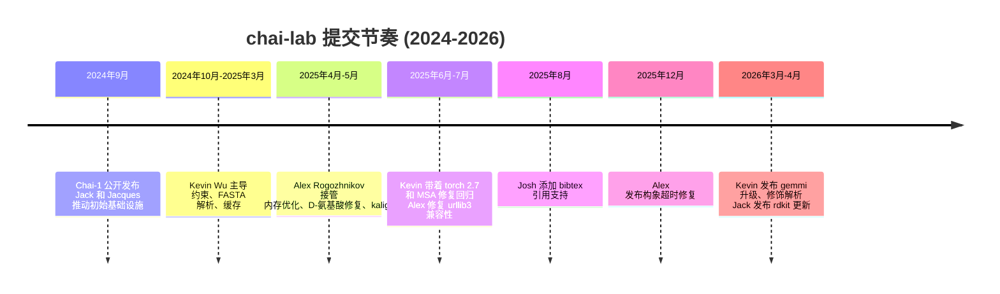

---
slug:6-about-contributors
blog_type:buzz
---

chai-lab 背后的团队并非那种周末随便修修补补的典型开源维护者。他们是 **Chai Discovery** 的核心团队，这是一家位于旧金山的应用 AI 实验室，融资总额超过 **2.25 亿美元**（[General Catalyst B 轮融资公告](https://www.generalcatalyst.com/stories/our-investment-in-chai-discovery)），与 **辉瑞** 和 **礼来** 达成了合作伙伴关系，并在不到两年的时间里连续发布了两款最先进的模型——用于结构预测的 Chai-1 和用于从头抗体设计的 Chai-2。该代码仓库是 Chai-1 的开源推理引擎，基于 Apache 2.0 协议发布，其提交记录讲述了一个小而精的专注团队的故事。

让我们来认识一下他们。

---

## 创始人

四位联合创始人——Joshua Meier、Jack Dent、Matthew McPartlon 和 Jacques Boitreaud——组成了一个紧密的团队，他们的职业轨迹交织于哈佛大学、大型科技公司和生物科技公司之间。正如 [General Catalyst 的投资备忘录](https://www.generalcatalyst.com/stories/our-investment-in-chai-discovery)所言：他们的合作是**“十年磨一剑”**的成果。

### Joshua Meier — 联合创始人兼 CEO

Josh 是 [Chai-1 预印本](https://www.biorxiv.org/content/10.1101/2024.10.10.615955v2)和 [Chai-2 预印本](https://www.biorxiv.org/content/10.1101/2025.07.05.663018v1)的公众代表和通讯作者。他的职业轨迹就像是 AI 应用于生物学这一运动的缩影：

- **哈佛大学** — 主修化学和计算机科学，在计算机科学课程的第一天就结识了 Jack Dent。
- **OpenAI** — 在 GPT-1/GPT-2 时代加入。正如 Josh 告诉 *GEN* 的那样：*"我们确实拥有前排座位，亲眼见证了语言建模及那里发生的一切。"* 这段经历引发了一个决定他职业生涯的问题：*"如果这些 AI 模型能够理解自然语言处理，为什么它们不能理解真正的自然语言，比如 DNA 和蛋白质呢？"*
- **Meta (Facebook AI)** — 共同领导了 **ESM1** 的开发，这是首个 Transformer 蛋白质语言模型。这项关于进化规模建模的工作，从根本上改变了该领域对于用学习表征替代 MSA 的看法。
- **Absci** — 担任首席 AI 官，他与 Matt McPartlon 在此开创了早期的从头抗体设计研究，并为目前进入临床的多种药物做出了贡献。

Josh 在 chai-lab 中的提交记录精简但意义重大——他编写了 [chai-2-bibtex (#394)](https://github.com/chaidiscovery/chai-lab/commit/2f7b713d6addd8cd7688ddfd5cb49e138f3e5b78)，一个引用工具，这反映了他作为面向论文发表负责人的角色。在 X 上，他将 Chai-2 的抗体命中率[描述](https://x.com/joshim5/status/1917600000000000000)为他整个职业生涯中*"只在梦中见到过"*的成果。

### Jack Dent — 联合创始人兼总裁

Jack 的职业轨迹是四人中最不寻常的。正如在 [LinkedIn 播客节目中透露的那样](https://www.linkedin.com/posts/sabrina-halper-00535716a_new-episode-with-jack-dent-co-founder-of-activity-7463323129533100033-aPpp)，他**在青少年时期就冷邮件联系了 Stripe** 并加入了该公司，花了几年时间建立新的产品和工程团队。他的 X 主页简介只有：[Co-Founder @chaidiscovery](https://x.com/jackdent)。

在 chai-lab 中，Jack 的贡献反映了他的产品工程直觉。他编写了 [Use full typer (#350)](https://github.com/chaidiscovery/chai-lab/commit/6d3439a0f41a0f33bb8cc1c3bbacfa36a99b7df9)，迁移了 CLI 框架；以及最近的 [Update rdkit (#416)](https://github.com/chaidiscovery/chai-lab/commit/c544fb183e865c4950909444db860a9d50604f66)——依赖项维护工作，这对于一个需要用户在极其异构的 HPC 环境中安装的软件包来说，是一项费力不讨好但至关重要的任务。也是他[与 Hugging Face 社区沟通](https://x.com/jackdent/status/1862200000000000000)，将 Chai-1 上线到 Hub；当用户反馈服务条款链接失效时，也是他[迅速做出了响应](https://x.com/jackdent/status/1300000000000000000)。

播客中有一则轶事：Sam Altman 显然在多年前就要求 Josh 和 Jack 创立 Chai，**远早于他们真正动手的时间**，这很能说明问题。他们选择了等待——Jack 在 Stripe 锻炼系统能力，Josh 深化领域专业知识——直到时机成熟。这种耐心在代码仓库的工程质量中得到了体现。

### Matthew McPartlon — 联合创始人

Matt 是最不抛头露面的创始人，但可以说是 Chai-2 突破最核心的科学人物。他在 [Pharm Exec](https://www.pharmexec.com/view/menlo-ventures-led-70-million-series-a-fundraiser-chai-discovery-transform-molecular-design) 中的引言抓住了这一愿景：

> *"在 Chai-2 之前，这个过程无异于在一大堆钥匙中寻找契合一把锁的正确钥匙，而有数以百万计的钥匙。现在，这就像让一位开锁大师仅根据你对锁的描述，就能精确设计出形状完全正确的钥匙。一家公司在一个问题上花费了三年多的时间和超过 500 万美元。而借助 Chai-2，我们能够在两周内找到一个经过实验验证的解决方案。"*

Matt 的背景与 Josh 相似：**Absci**，他在那里担任从头抗体设计建模的技术负责人。在此之前，[Menlo Ventures 的公告](https://menlovc.com/perspective/revolutionizing-antibody-design-with-ai-why-were-backing-chai-discovery)将他描述为*"生物学与人工智能交叉领域的顶尖研究员"*。他是 Chai-1 和 Chai-2 预印本的合著者，但没有出现在 chai-lab 的提交记录中——他的贡献位于上游的模型架构和训练中，而非推理基础设施。

### Jacques Boitreaud — 联合创始人

Jacques 曾在法国小分子药物发现公司 **Aqemia** 领导 AI 团队，在那里他将用于分子设计的 ML 工具进行了生产化——使研究原型变得足够健壮、可扩展和可靠，以适应真实世界的部署。这种生产化的理念在 chai-lab 的代码库中清晰可见：Jacques 编写了早期[以 CIF 格式写入预测结果的 PR](https://github.com/chaidiscovery/chai-lab/pull/45)，Jack Dent [公开表示](https://x.com/jackdent/status/1300000000000000000)这是对社区反馈的响应。他是两篇预印本的合著者。

---

## 核心工程师

除了创始人之外，chai-lab 的提交历史中还有两个名字占据主导地位：**Alex Rogozhnikov** 和 **Kevin Wu**。在过去的一年里，他们两人的提交量占了绝大多数。

### Alex Rogozhnikov — 基础架构师

无论以何种标准衡量，Alex 都是 chai-lab 日常开发中最丰产的贡献者。他的[个人博客](https://arogozhnikov.github.io/about)介绍他是一位机器学习方法学家，拥有**莫斯科大学数学和物理学博士学位**，以及莫斯科国立大学计算机系、高等经济学院和 Yandex 数据分析学院的额外硕士学位。

但在更广泛的 ML 社区中，Alex 最著名的身份是 **[einops](https://github.com/arogozhnikov/einops)** 的创建者——这个张量操作库已成为全球 PyTorch 代码库中的事实标准，每月在 PyPI 上的下载量约为 400 万次，拥有 9,500 多个 GitHub Star。在他自己对 [einops 的回顾](https://arogozhnikov.github.io/2023/07/13/retrospective-thoughts-on-einops.html)中，他将其描述为*"工程艺术"*——一个由严格约束塑造的系统。同样的品味也体现在他的 chai-lab 工作中。

他的提交记录讲述了一个清晰的故事：Alex 是那个确保推理管线不会崩溃的人。代表性示例如下：

| 提交 | 功能说明 |
|--------|-------------|
| [keep model components in CPU cache (#360)](https://github.com/chaidiscovery/chai-lab/commit/4d110dd40ee4ae60303c83a21de5ecb2d4a57dd1) | 内存优化——将模型组件卸载到 CPU |
| [remove seq corruption logic, do not map D-AAs to their L-partners (#368)](https://github.com/chaidiscovery/chai-lab/commit/f824e747b46e73ea78c1153077a5907f6a0c3cca) | D-氨基酸处理的正确性修复 |
| [use more generic error, that is also available in old urllib3 (#387)](https://github.com/chaidiscovery/chai-lab/commit/0a5a85594a44096aeeba7b6f53f99b53f240de15) | 旧环境的兼容性修复 |
| [Minimized version of #409 (parallel processing of conformers + reasonable timeout) (#410)](https://github.com/chaidiscovery/chai-lab/commit/af596cbc075a1fce368cec0ab5f31be1090ca7e2) | 修复了构象生成过程中的进程挂起问题 |
| [specify kalign version (#375)](https://github.com/chaidiscovery/chai-lab/commit/6d1e44d8f2bdd37d96e0ed8d67ca4938d9bff54b) | 依赖版本固定 |
| [update pandera (#399)](https://github.com/chaidiscovery/chai-lab/commit/a01bfdeead343e1c7f369660ec519f12c940e9df) | 依赖更新 |

模式非常明确：**兼容性、鲁棒性、内存管理和依赖维护**。Alex 是 chai-lab 能够在 A100 和 RTX 4090 上一视同仁地运行且不会发生神秘崩溃的原因。他还发起了 GitHub Issues [How do I get A100 GPU? #69](https://github.com/chaidiscovery/chai-lab/issues/69) 和 [Feature request: support larger crop sizes #153](https://github.com/chaidiscovery/chai-lab/issues/153)，表明他由内而外地思考用户体验。

### Kevin Wu — 功能主力

Kevin 是第二活跃的提交者，并且几乎凭一己之力塑造了 chai-lab 的约束和输入系统。他的 [X 主页](https://x.com/Kevin_E_Wu)列出了他曾任 **斯坦福大学** 和 **UC 伯克利分校** AI 研究科学家的履历。他是 Chai-1 和 Chai-2 预印本的合著者。

Kevin 的提交轨迹就像代码仓库功能演进的路线图：

| 提交 | 功能说明 |
|--------|-------------|
| [Allow using names specified in fasta file as chain names in cif (#378)](https://github.com/chaidiscovery/chai-lab/commit/2a2d4a96e842a73499bacced0db662455b42e886) | FASTA 到 CIF 的链名称传播 |
| [Allow restraints w.r.t. entity name-based subchains (#379)](https://github.com/chaidiscovery/chai-lab/commit/ac9c1f3edc5c85d0fcb95f465ca1f27bb0481a5f) | 基于实体名称的约束定位 |
| [Import cleanup + restraint unit test (#377)](https://github.com/chaidiscovery/chai-lab/commit/79dc5b9253c8baae1107ac095bd9693840a72c65) | 约束的测试覆盖 |
| [Global template cache folder + envvar to control its location (#371)](https://github.com/chaidiscovery/chai-lab/commit/eb63e84536bcbb46c0b675abb6a312ec9d682443) | 模板缓存基础设施 |
| [Allow torch 2.7 - tested to work correctly with 2.7.1 (#383)](https://github.com/chaidiscovery/chai-lab/commit/29195b89b1f63fb8a4a78406fc7a58468318ff4a) | PyTorch 兼容性扩展 |
| [More flexible modification parsing (#384)](https://github.com/chaidiscovery/chai-lab/commit/dc41706bfc19b8530809c8b88cf7d90a58640b2e) | 更广泛的输入格式支持 |
| [Support newer versions of gemmi (#415)](https://github.com/chaidiscovery/chai-lab/commit/61036259c98222160963cb780750e354876ce485) | 依赖兼容性 |
| [Bugfix for non-paired MSAs, adjust return types (#349)](https://github.com/chaidiscovery/chai-lab/commit/bd49ff24d68fe97af7b7a2999b7c7c15fb6fb331) | MSA 配对正确性修复 |
| [Fix corner case when template server is enabled with no protein entities (#355)](https://github.com/chaidiscovery/chai-lab/commit/b0175979a4a99c6bfcd18d4fd4a585191f33ca48) | 边缘情况处理 |
| [Remove threads argument from kalign (#356)](https://github.com/chaidiscovery/chai-lab/commit/a96c8ed4c35d3663ec8e9e8b4540b7c52c366797) | 比对工具清理 |

Kevin 是让 chai-lab 变得**可用**的工程师：链命名、约束语法、模板缓存、修饰解析——这些功能决定了一位研究人员是否真的能将其特定问题输入模型，而无需与工具搏斗。

---

## 其他贡献者

Chai-1 预印本将 **Vinicius Reis** 列为合著者，Chai-2 预印本则增加了 **Danny Geisz**、**Zhuoran Qiao**、**Nathan Rollins** 和 **Paul Wollenhaupt**——这反映了团队从成立时的约 7 名研究员扩展到 2025 年底的约 25 人。外部贡献者也出现在了提交记录中：**Keaun A** 与 Alex Rogozhnikov 共同编写了[并行构象处理 PR (#410)](https://github.com/chaidiscovery/chai-lab/commit/af596cbc075a1fce368cec0ab5f31be1090ca7e2)。

---

## 提交速度与团队节奏

提交历史揭示了关于该团队运作方式的一个显著模式：

该团队显然是在集中精力进行冲刺式开发，而不是持续零星地提交。漫长的沉默期对应着团队埋头于模型开发（Chai-2、Chai-3）的时期，而当他们浮出水面集成修复并推送发布时，就会出现开源活动的爆发。

---

## 团队背景对代码仓库特征的解释

用户经常遇到——有时会在 Issues 中抱怨——的 chai-lab 的几个特征，在了解了构建它的人之后，变得更加容易理解：

**产品工程基因**（来自 Stripe 的 Jack，来自 OpenAI 的 Josh）解释了为什么 chai-lab 拥有简洁的 CLI、Web 界面和 Apache 2.0 许可证，而不是学术生物信息学工具典型的非商业许可证。这是为普及而构建的基础设施。

**Absci 血统**（Josh 和 Matt）解释了约束系统。Absci 的核心主张就是 AI 驱动的抗体设计，而利用实验数据约束折叠的能力，正是 Chai-1 区别于 AlphaFold3 等纯结构预测工具的关键。Kevin Wu 大量的约束工作正是该血统的直接延续。

**生产化 ML 基因**（来自 einops 的 Alex，来自 Aqemia 的 Jacques）解释了他们对依赖兼容性、内存管理和超时处理的极度关注。这些人亲眼目睹过当代码从研究走向真实基础设施时会发生什么。

**小团队规模**（总共约 25 人，从事开源推理工作的则更少）解释了为什么某些 Issues 会悬而未决。正如 Josh 向 *GEN* 坦言的那样：*"我们是个小团队，但我们有大量的工作要做。"* 关于[自定义核苷酸修饰](https://github.com/chaidiscovery/chai-lab/issues/423)、[PAE 提取](https://github.com/chaidiscovery/chai-lab/issues/411)和[键信息丢失](https://github.com/chaidiscovery/chai-lab/issues/417)的未解决 Issues 并非被忽视的迹象——它们反映了一个现实，即团队的商业优先级（Chai-2、Chai-3、辉瑞、礼来）与开源推理引擎的方向有所不同。

---

## 更宏大的图景

Chai Discovery 的贡献者故事，归根结底是关于一个团队做出了一个非常具体的押注：生物学的基础模型将迎来一个拐点，在拐点之后它们将在药物发现的各个方面变得切实可行。正如 Josh [告诉 *GEN* 的那样](https://www.genengnews.com/topics/artificial-intelligence/chais-the-limit-for-ai-antibody-designer-after-130m-series-b-funding)：*"我们押注这些语言模型将达到一个拐点……五年后，这就会成为每个人发现药物的方式。"*

chai-lab 代码仓库就是这一押注的开源体现。它由一个本可以轻易将其保持闭源的团队维护——事实上，Chai-2 和 Chai-3 并未开源——但他们选择免费发布 Chai-1。随着公司商业压力的增加，这种开放性是否会持续仍是个未知数。就目前而言，提交记录讲述了一个小而精的技术精英团队快速行动并交付真实基础设施的故事。

该代码仓库最活跃的维护者同时也是 einops（PyTorch 生态中最广泛使用的 ML 实用工具之一）的作者，这绝非巧合。这是一个信号，表明严肃的 AI 应用于生物学需要何种水平的工程能力。