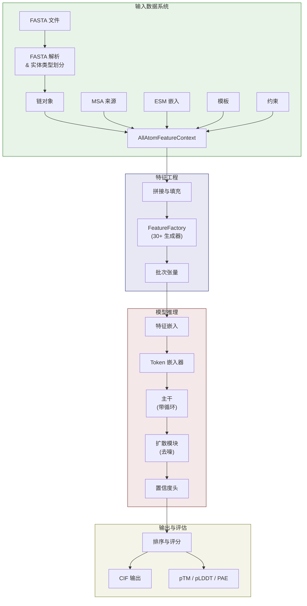
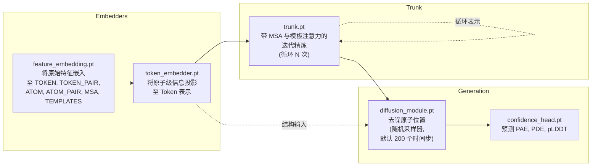

---
slug:7-architecture-overview
blog_type:normal
---


Chai-1 是一个用于**多链分子结构预测**的统一深度学习系统——它仅凭序列输入，就能将蛋白质、核酸、小分子和糖类折叠为联合三维结构。该架构遵循**四阶段流水线**：输入解析与上下文组装、特征嵌入与 Token 表示、带循环的迭代主干精炼，以及基于扩散的结构生成与置信度评分。每个阶段都被解耦为专用模块，它们通过带类型的数据上下文进行通信，既支持 CLI 驱动的推理，也支持编程式探索。


来源：[chai1.py](chai_lab/chai1.py#L1-L109), [main.py](chai_lab/main.py#L1-L49)

## 高层流水线架构

端到端的推理流程由 `run_inference` 统一编排，它将数据准备委托给 `make_all_atom_feature_context`，将模型推理委托给 `run_folding_on_context`。系统加载**五个已导出的 TorchScript 模型组件**——`feature_embedding.pt`、`token_embedder.pt`、`trunk.pt`、`diffusion_module.pt` 和 `confidence_head.pt`——每个组件都被封装在一个 `ModuleWrapper` 中，该封装器通过 `forward_{crop_size}` 方法处理设备迁移和裁剪尺寸的分发。



来源：[chai1.py](chai_lab/chai1.py#L498-L572), [chai1.py](chai_lab/chai1.py#L579-L716)

## 核心数据模型：上下文对象

该架构围绕一个**不可变上下文对象**层级结构构建，这些对象封装了不同模态的输入数据。其中枢是 `AllAtomFeatureContext`，它聚合了六个独立的上下文——每个上下文均可独立填充、可序列化为字典，并承载带类型的张量数据。这种设计确保每个模型组件都能通过定义良好的接口精确接收所需数据，而非通过临时参数传递。

| 上下文 | 用途 | 关键字段 | 来源模块 |
|---------|---------|------------|---------------|
| **AllAtomStructureContext** | 原子级坐标、掩码、残基索引、键信息 | `atom_coords`, `atom_exists_mask`, `token_residue_index` | [all_atom_structure_context.py](chai_lab/data/dataset/structure/all_atom_structure_context.py) |
| **MSAContext** | 多序列比对 Token、删除信息、配对键 | `tokens`, `mask`, `deletion_matrix`, `pairing_key_hash` | [msa_context.py](chai_lab/data/dataset/msas/msa_context.py) |
| **TemplateContext** | 来自同源结构的结构模板命中 | 模板距离图、单位向量、残基类型、掩码 | [context.py](chai_lab/data/dataset/templates/context.py) |
| **EmbeddingContext** | 预计算的 ESM 蛋白质语言模型嵌入 | `esm_embeddings` (形状: `num_tokens × 2560`) | [embedding_context.py](chai_lab/data/dataset/embeddings/embedding_context.py#L14-L26) |
| **RestraintContext** | 你指定的距离/口袋约束及共价键 | 成对约束张量 | [restraint_context.py](chai_lab/data/dataset/constraints/restraint_context.py) |
| **AllAtomFeatureContext** | 上述所有上下文的**聚合容器** | `chains`，以及上述所有五个上下文 | [all_atom_feature_context.py](chai_lab/data/dataset/all_atom_feature_context.py#L24-L39) |

<CgxTip>`AllAtomFeatureContext.pad()` 方法通过每个子上下文级联填充——Token 被填充至最接近的 `AVAILABLE_MODEL_SIZES` 桶（256, 384, …, 2048），原子数量则按每个 Token 23 个原子的比例进行缩放。这确保了为固定尺寸编译的已导出 TorchScript 模型始终能接收形状正确的输入。</CgxTip>

来源：[all_atom_feature_context.py](chai_lab/data/dataset/all_atom_feature_context.py#L24-L96), [embedding_context.py](chai_lab/data/dataset/embeddings/embedding_context.py#L14-L51), [collate/utils.py](chai_lab/data/collate/utils.py#L13-L39)

## 特征生成系统

特征由收集在 `FeatureFactory` 中的**30 多个 `FeatureGenerator` 实例注册表**生成。每个生成器声明一个 `FeatureType`（它填充的输出槽）和一个 `EncodingType`（原始数据的编码方式）。工厂的 `generate()` 方法针对拼接后的批次迭代所有已注册的生成器，生成模型消耗的命名张量字典。

`FeatureType` 枚举定义了与模型输入通道相对应的**七个特征槽**。每个槽承载着不同的几何和语义信息：

| FeatureType | 维度 | 描述 | 生成器示例 |
|-------------|---------------|-------------|-------------------|
| `TOKEN` | 每 Token | 单 Token 属性 | `ResidueType`, `ESMEmbeddings`, `RelativeEntity` |
| `TOKEN_PAIR` | Token×Token | 成对 Token 关系 | `RelativeSequenceSeparation`, `TokenDistanceRestraint` |
| `ATOM` | 每原子 | 单原子属性 | `AtomElementOneHot`, `AtomNameOneHot`, `RefPos` |
| `ATOM_PAIR` | 原子×原子 (分块) | 成对原子关系 | `BlockedAtomPairDistogram`, `BlockedAtomPairDistances` |
| `MSA` | MSA 深度 × Token | 多序列比对 | `MSAFeatureGenerator`, `MSADeletionValueGenerator` |
| `TEMPLATES` | 模板 × Token | 结构模板 | `TemplateDistogramGenerator`, `TemplateUnitVectorGenerator` |
| `RESIDUE` / `PAIR` | 遗留槽 | 内部使用 | — |

<CgxTip>`EncodingType` 控制原始整型或浮点型数据如何为模型消费进行转换。`ONE_HOT` 和 `OUTERSUM` 模式为填充位置追加了一个掩码类（索引 = `num_classes`）；`IDENTITY` 模式将其最后一个通道保留为二进制掩码标志。这种统一的掩码策略确保每个特征张量都能自我描述哪些位置是有效的。</CgxTip>

来源：[feature_type.py](chai_lab/data/features/feature_type.py#L1-L17), [base.py](chai_lab/data/features/generators/base.py#L58-L114), [feature_factory.py](chai_lab/data/features/feature_factory.py#L16-L27), [chai1.py](chai_lab/chai1.py#L172-L236)

## 模型组件架构

模型被分解为**五个已导出的 TorchScript 组件**，每个组件按需加载并在 CPU 和 GPU 之间转移以管理内存。`ModuleWrapper` 和 `_component_moved_to` 上下文管理器实现了一种瞬态设备迁移模式——组件被移至 GPU 进行计算，随后立即移回 CPU，从而避免了大型模型权重的重复磁盘 I/O。



**特征嵌入器**沿通道维度将每个输出分为两半——一半用于主干路径，另一半用于结构/扩散路径。这种双输出设计意味着 Token 嵌入器和主干在一组嵌入上操作，而扩散模块接收并行的另一组嵌入，从而允许为迭代精炼和坐标生成提供专用表示。

来源：[chai1.py](chai_lab/chai1.py#L679-L738), [chai1.py](chai_lab/chai1.py#L115-L148), [chai1.py](chai_lab/chai1.py#L844-L885)

## 推理流程：从上下文到结构

`run_folding_on_context` 函数按精确顺序实现了完整的推理轨迹。理解此流程对于梳理代码库至关重要：

1. **拼接**：`Collate` 类将 `AllAtomFeatureContext` 填充至最接近的模型尺寸桶，为局部注意力计算分块的原子对索引，并运行所有特征生成器以生成完整的特征字典。[collate.py](chai_lab/data/collate/collate.py#L29-L97)

2. **特征嵌入**：原始特征通过 `feature_embedding.pt` 投影，为每个特征槽生成嵌入表示。每个槽的输出被**一分为二**——一半送入主干，另一半送入结构模块。[chai1.py](chai_lab/chai1.py#L687-L698)

3. **键特征注入**：`TokenBondRestraint` 特征被单独生成（由于导出限制），并通过 `bond_loss_input_proj.pt` 投影，然后**相加**至主干和结构路径的 Token 对表示中。[chai1.py](chai_lab/chai1.py#L705-L715)

4. **Token 嵌入**：`token_embedder.pt` 消耗已嵌入的 Token、对和原子特征以及分块的原子对数据，产生三个输出：`token_single_initial_repr`、`token_single_structure_input` 和 `token_pair_initial_repr`。[chai1.py](chai_lab/chai1.py#L721-L738)

5. **主干循环**：主干迭代 `num_trunk_recycles` 次（默认为 3），同时接收初始表示和循环表示。在每次循环中，可以对 MSA 特征进行二次采样。主干输出更新后的 `token_single_trunk_repr` 和 `token_pair_trunk_repr`。[chai1.py](chai_lab/chai1.py#L748-L777)

6. **扩散去噪**：从纯噪声（由 σ_max 缩放）开始，扩散模块使用具有可配置扰动（S_churn=80）、二阶更新和幂插值噪声调度的**随机采样器**，迭代地对原子坐标进行去噪。[chai1.py](chai_lab/chai1.py#L806-L885)

7. **置信度预测**：`confidence_head.pt` 为 `num_diffn_samples` 个生成的结构分别预测每原子 pLDDT、每 Token 对 PAE 和每 Token 对 PDE。[chai1.py](chai_lab/chai1.py#L894-L915)

8. **排序与输出**：每个样本使用综合评分进行排序：`0.2 × pTM + 0.8 × ipTM − 100 × has_inter_chain_clashes`。结果被写入 CIF 文件和 `.npz` 评分归档文件中。[rank.py](chai_lab/ranking/rank.py#L94-L99)

来源：[chai1.py](chai_lab/chai1.py#L579-L1059), [rank.py](chai_lab/ranking/rank.py#L56-L112), [diffusion_schedules.py](chai_lab/model/diffusion_schedules.py#L13-L48)

## 内存管理策略

代码库实现了一种显式的 **CPU 卸载策略**，以支持在显存有限的 GPU 上进行推理。`_component_moved_to` 上下文管理器将加载的 TorchScript 模块缓存在全局 `_component_cache` 字典中，仅在组件前向传播期间将其移至 GPU，随后立即移回 CPU。`low_memory` 标志（默认为 `True`）控制中间嵌入是否在各阶段之间返回至 CPU。此外，在主干循环和扩散循环之后会调用 `torch.cuda.empty_cache()`，以在后续操作前释放碎片化的 GPU 显存。

来源：[chai1.py](chai_lab/chai1.py#L151-L166), [chai1.py](chai_lab/chai1.py#L648-L649), [chai1.py](chai_lab/chai1.py#L779-L780), [chai1.py](chai_lab/chai1.py#L887-L888)

## 输入数据系统概述

输入流水线通过多步过程将原始 FASTA 文件转换为 `AllAtomFeatureContext`。FASTA 文件中的每个实体都根据其类型（蛋白质、DNA、RNA、配体、糖类）进行解析，被 Token 化为残基级 Token，并组装为 `Chain` 对象。外部数据来源——MSA、ESM 嵌入、模板和约束——被加载或生成并合并至上下文中。下表总结了五种数据模态及其入口点：

| 模态 | 入口点 | 默认行为 | 你的控制项 |
|----------|-------------|-----------------|--------------|
| **MSA** | `get_msa_contexts()` / `generate_colabfold_msas()` | 未指定来源时为空 | `--use-msa-server` 或 `--msa-directory` |
| **ESM 嵌入** | `get_esm_embedding_context()` | 默认启用 (CPU) | `--no-use-esm` |
| **模板** | `get_template_context()` | 未指定来源时为空 | `--use-templates-server` 或 `--templates-path` |
| **约束** | `load_manual_restraints_for_chai1()` | 无约束文件时为空 | `--constraint-path` |
| **共价键** | `get_atom_covalent_bond_pairs_from_constraints()` | 从约束文件解析 | 嵌入在 `.restraints` 文件中 |

来源：[chai1.py](chai_lab/chai1.py#L338-L495), [inference_dataset.py](chai_lab/data/dataset/inference_dataset.py#L94-L177)

## 项目目录结构图

```
chai_lab/
├── chai1.py                  ← 核心推理编排与特征工厂
├── main.py                   ← CLI 入口点 (typer)
├── data/
│   ├── collate/              ← 批次拼接与至模型尺寸的填充
│   ├── dataset/              ← 上下文对象 (结构、MSA、嵌入等)
│   │   ├── constraints/      ← 约束加载与共价键处理
│   │   ├── embeddings/       ← ESM 嵌入上下文
│   │   ├── msas/             ← MSA 生成 (ColabFold) 与加载
│   │   ├── structure/        ← 全原子 Token 化、链、键工具
│   │   └── templates/        ← 模板比对与加载
│   ├── features/             ← 特征生成框架及 20+ 生成器
│   │   └── generators/       ← 单独的特征生成器实现
│   ├── io/                   ← CIF/PDB 输出、RCSB 工具
│   ├── parsing/              ← FASTA、糖类、约束、MSA、模板解析
│   └── sources/              ← 用于配体构象的 RDKit 集成
├── model/
│   ├── diffusion_schedules.py← 噪声调度 (幂插值)
│   └── utils.py              ← 注意力分块、四元数数学、增强
├── ranking/                  ← 结构评分：pTM、pLDDT、冲突检测
├── tools/                    ← 外部工具包装器 (kalign、刚性变换)
└── utils/                    ← 路径、张量操作、绘图、类型、默认值
```

来源：[项目结构](chai_lab/)

## 建议阅读路线

你刚刚阅读的架构概述建立了系统级的心智模型。若要深入探索，请遵循以下目录路径：

1. **从推理流水线阶段开始**——每个页面详细剖析五个模型组件之一：
   - [特征上下文组装](8-feature-context-assembly)——原始输入如何成为 `AllAtomFeatureContext`
   - [特征嵌入与 Token 嵌入](9-feature-embedding-and-token-embedding)——从特征到表示的投影
   - [主干循环与注意力](10-trunk-recycling-and-attention)——迭代精炼机制
   - [扩散去噪过程](11-diffusion-denoising-process)——从噪声生成坐标
   - [置信度预测与评分](12-confidence-prediction-and-scoring)——PAE、pLDDT 和 pTM 计算

2. **然后探索输入数据系统**——每种模态都有其独立的处理流水线：
   - [FASTA 解析与实体类型](13-fasta-parsing-and-entity-types)
   - [MSA 生成与加载](14-msa-generation-and-loading)
   - [ESM 嵌入集成](15-esm-embeddings-integration)
   - [模板处理流水线](16-template-processing-pipeline)
   - [约束与共价键系统](17-restraint-and-covalent-bond-system)

3. **最后，理解特征工程与输出评估**：
   - [特征生成器基础设计](18-feature-generator-base-design)
   - [Token 与原子特征生成器](19-token-and-atom-feature-generators)
   - [成对与约束特征生成器](20-pairwise-and-restraint-feature-generators)
   - [结构排序与评分](21-structure-ranking-and-scoring)
   - [CIF 输出与链命名](22-cif-output-and-chain-naming)
   - [pTM、pLDDT 与冲突指标](23-ptm-plddt-and-clash-metrics)