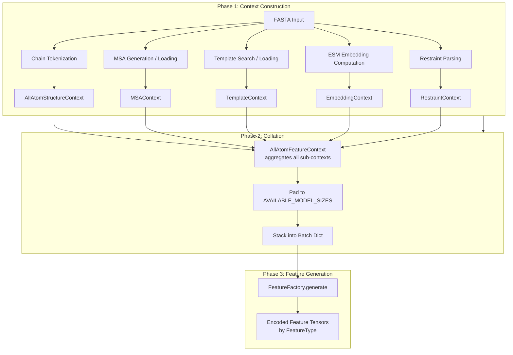
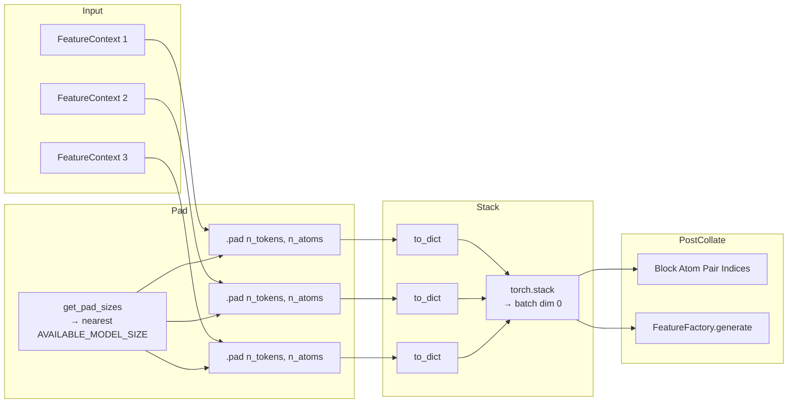
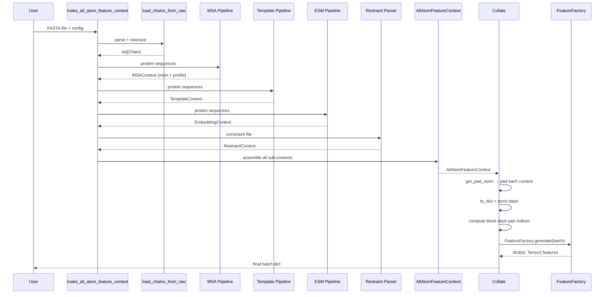

---
slug:8-feature-context-assembly
blog_type:normal
---

特征上下文组装是 Chai-1 推理管线中关键的编排层，它将原始输入序列转换为完全解析、填充并分组的张量字典，以供模型使用。它填补了异构输入源（FASTA 序列、MSA、模板、ESM 嵌入和约束条件）与模型前向传播所期望的统一特征张量之间的鸿沟。理解这一组装过程，对于任何想要扩展 Chai-1 输入能力或调试数据管线问题的人来说都是必不可少的。

## 组装架构概览

组装遵循严格的三阶段管线：**上下文构建**（系统内）、**合并**（跨系统）和**特征生成**（批次级）。每个阶段都有明确的契约——上下文生成类型化数据类，合并处理填充与堆叠，特征生成应用编码转换以生成最终的张量字典。

来源: [chai1.py](/chai_lab/chai1.py#L214-L399), [all_atom_feature_context.py](/chai_lab/data/dataset/all_atom_feature_context.py#L26-L96), [collate.py](/chai_lab/data/collate/collate.py#L23-L98)

## 核心数据结构：AllAtomFeatureContext

**AllAtomFeatureContext** 是统一的容器，聚合了单个分子系统的所有子上下文。它是由数据集层生成、供合并层使用的不可变数据类。其设计确保了严格的关注点分离：元数据字段（如 `chains`）随批次传递，但永远不会被填充或堆叠；而所有子上下文都实现了 `pad()` 方法和 `to_dict()` 方法，从而标准化了它们的表示形式，以适应分组张量操作。

| 子上下文 | 作用 | 关键字段 | 最大尺寸 |
|---|---|---|---|
| `AllAtomStructureContext` | Token/原子坐标、残基类型、链 ID、共价键索引 | `token_residue_type`, `atom_ref_pos`, `atom_covalent_bond_indices` | n_tokens × 23 atoms |
| `MSAContext` | 多序列比对行、删除矩阵、配对键 | `tokens`, `mask`, `deletion_matrix`, `pairing_key_hash` | 16,384 深度 |
| `TemplateContext` | 带有骨架帧和距离直方图的结构模板 | `template_restype`, `template_distances`, `template_unit_vector` | 4 个模板 |
| `EmbeddingContext` | 预计算的 ESM 蛋白质嵌入 | `esm_embeddings` | n_tokens × 2560 |
| `RestraintContext` | 接触、口袋和对接约束 | `docking_restraints`, `contact_restraints`, `pocket_restraints` | 无界列表 |

`to_dict()` 方法将所有子上下文字典合并为一个单一扁平字典，其中张量键遵循诸如 `msa_tokens`、`template_restype` 和 `esm_embeddings` 的命名约定。这种扁平化表示正是合并器在批次维度上进行堆叠的对象。`pad()` 方法委托给每个子上下文自身的填充逻辑，确保批次中的每个张量在堆叠前共享相同的空间维度。

<CgxTip>`profile_msa_context` 是独立于 `msa_context` 的第二个 `MSAContext`。主 MSA 上下文承载全深度的比对（最多 16,384 行），而概要 MSA 上下文提供压缩的摘要，用于基于概要的特征生成（例如 `MSAProfileGenerator`）。两者的填充和分组方式完全相同，但在下游服务于不同的特征生成器。</CgxTip>

来源: [all_atom_feature_context.py](/chai_lab/data/dataset/all_atom_feature_context.py#L26-L96), [all_atom_structure_context.py](/chai_lab/data/dataset/structure/all_atom_structure_context.py#L25-L96), [msa_context.py](/chai_lab/data/dataset/msas/msa_context.py#L19-L168), [context.py](/chai_lab/data/dataset/templates/context.py#L35-L120), [embedding_context.py](/chai_lab/data/dataset/embeddings/embedding_context.py#L10-L52), [restraint_context.py](/chai_lab/data/dataset/constraints/restraint_context.py#L29-L71)

## 上下文构建：从 FASTA 到 AllAtomFeatureContext

`chai1.py` 中的 `make_all_atom_feature_context` 函数是推理期间上下文构建的入口点。它按确定性顺序编排步骤，每一步生成一个子上下文：

1. **输入解析与验证** — `read_inputs` 解析 FASTA 文件，识别实体类型（蛋白质、配体、RNA、DNA、糖类），并验证实体名称的唯一性。

2. **链分词** — `load_chains_from_raw` 将每个输入转换为 `AllAtomEntityData`，然后通过 `AllAtomResidueTokenizer` 进行分词，生成封装了 `AllAtomStructureContext` 的 `Chain` 对象。分词失败的对象会被静默丢弃。

3. **结构合并** — 各个链的结构上下文通过 `AllAtomStructureContext.merge` 进行合并，生成一个统一的跨所有链重新索引 token 和原子的结构上下文。Token 数量验证（`raise_if_too_many_tokens`）在此阶段进行。

4. **MSA 组装** — 根据配置，MSA 可通过 ColabFold 服务器生成、从目录加载或留空。`get_msa_contexts` 函数生成主 `MSAContext`，而概要 MSA 则单独派生。

5. **模板加载** — 模板上下文基于 MMseqs2 搜索结果或预加载的模板文件构建，生成包含最多 4 个结构模板的 `TemplateContext`。

6. **ESM 嵌入** — 可选地为蛋白质序列计算 ESM-2 嵌入，并封装在 `EmbeddingContext` 中。

7. **约束解析** — 如果提供了约束文件，`load_manual_restraints_for_chai1` 会将其解析为包含接触、口袋或对接约束的 `RestraintContext`。

最终的 `AllAtomFeatureContext` 通过将所有子上下文传递给其构造函数来组装。值得注意的是，`EmbeddingContext` 是可选的（如果禁用 ESM 则为 `None`），而在未指定约束时使用 `RestraintContext.empty()`。

来源: [chai1.py](/chai_lab/chai1.py#L293-L399), [inference_dataset.py](/chai_lab/data/dataset/inference_dataset.py#L172-L246), [restraint_context.py](/chai_lab/data/dataset/constraints/restraint_context.py#L82-L137)

## 合并：填充、堆叠与批次准备

`Collate` 数据类将 `AllAtomFeatureContext` 对象列表转换单一的批次字典。这是在 `_collate` 和 `_post_collate` 中实现的两阶段过程。

**阶段 1 — 填充与堆叠 (`_collate`)**：首先，`get_pad_sizes` 确定批次中所有特征上下文的最大 token 和原子数。Token 填充向上对齐到 `AVAILABLE_MODEL_SIZES = [256, 384, 512, 768, 1024, 1536, 2048]` 中的最接近项，而原子填充使用公式 `23 × n_tokens`（每个 token 最多可有 23 个原子）。每个上下文通过 `AllAtomFeatureContext.pad` 独立填充，随后所有填充后的上下文被转换为字典，并使用 `torch.stack` 沿新的批次维度堆叠。

**阶段 2 — 后合并 (`_post_collate`)**：堆叠之后，合并器计算模型所需的辅助数据结构：基于块的原子对索引（`block_q_atom_idces`、`block_kv_atom_idces`）及其对应的掩码。这些结构使模型能够实现针对原子对的分块注意力模式，这对于大量 token 下的内存效率至关重要。最后，在整个批次上调用 `FeatureFactory.generate` 方法，生成编码后的特征张量。

| 模型尺寸 | 最大 Token 数 | 最大原子数 (23×) | 典型用例 |
|---|---|---|---|
| 256 | 256 | 5,888 | 小型单链蛋白 |
| 384 | 384 | 8,832 | 中型蛋白质 |
| 512 | 512 | 11,776 | 蛋白质-配体复合物 |
| 768 | 768 | 17,664 | 多链组装体 |
| 1024 | 1,024 | 23,552 | 大型复合物 |
| 1536 | 1,536 | 35,328 | 超大型复合物 |
| 2048 | 2,048 | 47,104 | 最大容量 |

来源: [collate.py](/chai_lab/data/collate/collate.py#L23-L98), [collate_utils.py](/chai_lab/data/collate/utils.py#L10-L40)

## FeatureFactory：编码引擎

`FeatureFactory` 是一个轻量级编排器，将命名的特征生成器映射到其输出。它持有一个 `dict[str, FeatureGenerator]`，其 `generate` 方法仅遍历所有已注册的生成器，对批次字典调用每个生成器的 `generate` 方法。生成的 `dict[str, Tensor]` 存储在最终批次的 `"features"` 键下。

每个 `FeatureGenerator` 都是一个抽象基类，声明了三个关键属性：

- **`ty` (FeatureType)** — 决定张量的结构角色：`TOKEN`（每 token 特征）、`TOKEN_PAIR`（成对 token 特征）、`MSA`（比对特征）、`TEMPLATES`（模板特征）、`ATOM`（每原子特征）或 `ATOM_PAIR`（成对原子特征）。

- **`encoding_ty` (EncodingType)** — 决定数值编码策略：`ONE_HOT`（类别型 → 独热向量）、`RBF`（用于距离的径向基函数）、`FOURIER`（位置编码）、`IDENTITY`（带掩码的直通）、`ESM`（预计算嵌入）或 `OUTERSUM`（独热编码的外和）。

- **`mask_value`** — 一个计算属性，根据编码类型返回被掩码位置的适当填充值。对于独热编码，它返回 `num_classes`（一个额外的“掩码”类）；对于 RBF/Fourier，它返回 `-100.0`；对于 identity，它使用一个专用的掩码通道，其中被掩码项的最后一个位置为 1。

在 Chai-1 的 `feature_factory` 中注册的完整特征生成器集包含 29 个命名生成器，按其特征类型组织如下：

| FeatureType | 生成器名称 | 数量 |
|---|---|---|
| TOKEN | `ResidueType`, `ESMEmbeddings`, `IsDistillation`, `TokenBFactor`, `TokenPLDDT`, `ChainIsCropped` | 6 |
| TOKEN_PAIR | `RelativeSequenceSeparation`, `RelativeTokenSeparation`, `RelativeEntity`, `RelativeChain`, `MissingChainContact`, `TokenDistanceRestraint`, `TokenPairPocketRestraint` | 7 |
| ATOM | `AtomRefPos`, `AtomRefCharge`, `AtomRefMask`, `AtomRefElement`, `AtomNameOneHot` | 5 |
| ATOM_PAIR | `BlockedAtomPairDistogram`, `InverseSquaredBlockedAtomPairDistances` | 2 |
| MSA | `MSAOneHot`, `MSAHasDeletion`, `MSADeletionValue`, `MSADeletionMean`, `MSAProfile`, `IsPairedMSA`, `MSADataSource` | 7 |
| TEMPLATES | `TemplateMask`, `TemplateUnitVector`, `TemplateResType`, `TemplateDistogram` | 4 |

<CgxTip>`DockingConstraintGenerator` 注册时带有 `include_probability=0.0` 和 `structure_dropout_prob=0.75`，这意味着在标准推理期间对接约束实际上是被禁用的。这是一个用于数据增强的训练时特征。如果你需要在推理时启用对接约束，必须修改该生成器的配置或创建自定义特征工厂。</CgxTip>

来源: [feature_factory.py](/chai_lab/data/features/feature_factory.py#L1-L27), [base.py](/chai_lab/data/features/generators/base.py#L11-L114), [feature_type.py](/chai_lab/data/features/feature_type.py#L1-L17), [chai1.py](/chai_lab/chai1.py#L165-L253)

## 子上下文填充语义

每个子上下文都实现了具有领域特定语义的填充，超越了简单的零填充。理解这些语义对于解释下游特征张量中的掩码值至关重要。

**AllAtomStructureContext** 通过用 `False` 条目扩展 `token_exists_mask` 并用中性值填充 token 级字段（例如，`token_residue_type` 的间隔残基类型）来填充 token。原子级字段遵循相似的模式：`atom_exists_mask` 和 `atom_is_not_padding_mask` 用 `False` 扩展，坐标字段（`atom_ref_pos`、`atom_gt_coords`）用零填充。共价键索引保持不变，因为它们引用的是非填充区域内的原子。

**MSAContext** 沿 token 维度（列）和深度维度（行）进行填充。Token 填充使用间隔 token（`:`）、`NO_PAIRING_KEY` 用于配对哈希、零删除和 `False` 掩码进行填充。深度填充添加具有相同填充值的空行。`sequence_source` 字段使用 `MSADataSource.NONE` 填充，以确保填充的 MSA 行不会归属于任何搜索来源。

**TemplateContext** 使用空残基类型（间隔字符 `-`）、伪 beta 和骨架帧的零掩码以及零距离/单位向量张量填充模板。`template_mask` 属性（派生自 `template_restype != gap`）能够在填充后正确识别非空模板。

**EmbeddingContext** 沿 token 维度对 ESM 嵌入矩阵进行零填充，生成形状为 `[max_tokens, 2560]` 的 `esm_embeddings`，其中填充位置为零向量。

**RestraintContext** 是一个显著的例外——它的 `pad()` 方法是一个空操作，返回未更改的同一对象。这是因为约束存储为 Python 数据类列表而非张量，并且由处理自身在 token 空间中索引的特征生成器进行处理。

来源: [all_atom_structure_context.py](/chai_lab/data/dataset/structure/all_atom_structure_context.py#L25-L200), [msa_context.py](/chai_lab/data/dataset/msas/msa_context.py#L90-L130), [context.py](/chai_lab/data/dataset/templates/context.py#L108-L200), [embedding_context.py](/chai_lab/data/dataset/embeddings/embedding_context.py#L30-L42), [restraint_context.py](/chai_lab/data/dataset/constraints/restraint_context.py#L44-L48)

## 端到端数据流

追踪从 FASTA 文件到模型就绪批次的完整路径，揭示了每个组件在组装中的参与方式：

最终批次字典包含三个顶级键：`"inputs"`（来自所有子上下文的已堆叠、填充的原始张量）、`"features"`（由 FeatureFactory 生成的已编码特征张量）以及额外的分块注意力索引（`block_atom_pair_q_idces`、`block_atom_pair_kv_idces`、`block_atom_pair_mask`）。模型的 forward 方法接收此完整字典，并根据其 `FeatureType` 将特征分派到相应的嵌入模块。

来源: [chai1.py](/chai_lab/chai1.py#L293-L399), [collate.py](/chai_lab/data/collate/collate.py#L36-L98), [feature_factory.py](/chai_lab/data/features/feature_factory.py#L14-L21)

## 下一步

随着特征上下文完成完全组装与分组，管线将继续进入嵌入和注意力阶段。要了解原始特征如何转换为模型输入：

- **[特征嵌入与 Token 嵌入](9-feature-embedding-and-token-embedding)** — 每种 FeatureType 是如何被嵌入并组合到主干输入表示中的。
- **[特征生成器基础设计](18-feature-generator-base-design)** — 深入探讨 `FeatureGenerator` 抽象基类以及如何创建自定义生成器。
- **[Token 与原子特征生成器](19-token-and-atom-feature-generators)** — 逐 Token 和逐原子特征编码逻辑的详细解析。