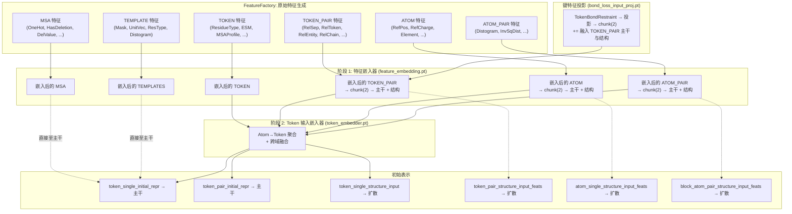

---
slug:9-feature-embedding-and-token-embedding
blog_type:normal
---


特征嵌入与 Token 嵌入阶段构成了原始异构输入特征与送入 Chai-1 主干回收器和扩散模块的结构化潜在表示之间的关键桥梁。二者协同工作，将包含各种特征张量的字典（每个张量具有各自的编码方案、维度和语义域）转换为统一的 **token single**、**token pair** 和 **atom** 表示，以备进行迭代注意力计算。理解这一两阶段的流水线，对于任何想要扩展特征集、调试表示质量或推理下游模块可用信息的人来说都是必不可少的。

## 从原始特征到类型化张量：FeatureFactory

每次推理运行都以一个 **FeatureFactory** 开始，它负责协调所有原始特征的生成。该工厂是一个简单的名称到生成器的注册表：每个注册的 `FeatureGenerator` 都知道如何从批次字典中提取其输入键、计算其特征张量，并通过其 `EncodingType` 将其转换为正确的数据类型。工厂的 `generate` 方法会遍历所有生成器，并返回一个扁平的具名张量字典。

```python
# 工厂在 chai1.py 中通过约 30 个生成器构建一次
feature_factory = FeatureFactory(feature_generators)
# ... 随后，在 Collate._post_collate 内部：
raw_batch["features"] = self.feature_factory.generate(raw_batch)
```

每个生成器声明了两个正交的身份轴：其 **FeatureType**（所属的语义域）和 **EncodingType**（原始数据的数值表示方式）。这两个轴决定了下游特征嵌入器将如何处理该张量。

来源: [chai1.py](/chai_lab/chai1.py#L118-L186), [feature_factory.py](/chai_lab/data/features/feature_factory.py#L1-L27), [collate.py](/chai_lab/data/collate/collate.py#L77-L85)

## 特征类型与语义域分类

`FeatureType` 枚举将所有特征划分为六个语义域。这种分类不仅仅是为了组织——它直接决定了特征嵌入器如何路由和拼接张量：

| FeatureType | 形状模式 | 描述 | 示例生成器 |
|---|---|---|---|
| `TOKEN` | `[B, N, ...]` | 逐 token 单一特征 | `ResidueType`, `ESMEmbeddings`, `MSAProfile` |
| `TOKEN_PAIR` | `[B, N, N, ...]` | 逐 token 对特征 | `RelativeSequenceSeparation`, `RelativeEntity`, `RelativeChain` |
| `ATOM` | `[B, A, ...]` | 逐 atom 单一特征 | `AtomRefPos`, `AtomRefCharge`, `AtomRefElement` |
| `ATOM_PAIR` | `[B, A_block, ...]` | 分块的 atom 对特征 | `BlockedAtomPairDistogram` |
| `MSA` | `[B, D, N, ...]` | MSA 深度 × token 特征 | `MSAFeatureGenerator`, `MSAHasDeletion` |
| `TEMPLATES` | `[B, T, N, ...]` | 模板特征 | `TemplateDistogram`, `TemplateUnitVector` |

其中 `B` 是批次大小，`N` 是 token 数量，`A` 是 atom 数量，`D` 是 MSA 深度，`T` 是模板数量。特征嵌入器在一次前向传播中处理所有这些特征，在每个域内进行拼接，然后应用特定域的线性投影。

来源: [feature_type.py](/chai_lab/data/features/feature_type.py#L1-L17)

## 编码类型与掩码约定

每个 `FeatureGenerator` 还声明了一个 `EncodingType`，它决定了原始数据类型和掩码策略：

| EncodingType | 输入数据类型 | 掩码策略 | 使用者 |
|---|---|---|---|
| `ONE_HOT` | `long/int` | 掩码索引 = `num_classes`（额外类别） | `ResidueType`, `RelativeSequenceSeparation`, `RelativeTokenSeparation`, `RelativeEntity`, `RelativeChain` |
| `IDENTITY` | `float` | 追加额外通道；1 = 已掩码 | `AtomRefCharge`, `MSADeletionValue`, `MSAProfile` |
| `RBF` | `float16/32/bf16` | -100.0 哨兵值 | `BlockedAtomPairDistogram`, `TokenDistanceRestraint` |
| `FOURIER` | `float16/32/bf16` | -100.0 哨兵值 | `RefPos` |
| `ESM` | `float` | 0.0（零向量） | `ESMEmbeddings` |
| `OUTERSUM` | `long/int` | 掩码索引 = `num_classes` | 成对 one-hot 组合 |

关键的洞见在于，**掩码在到达神经网络之前就已经被嵌入到特征张量本身之中**。对于 `ONE_HOT` 编码的特征，被掩码的位置会获得一个超出有效范围的额外类别索引；对于 `IDENTITY` 编码的特征，会拼接一个额外的二进制通道，其中 `1` 表示被掩码的位置。这种约定使得特征嵌入器能够学习如何处理缺失数据，而无需为每个特征提供单独的掩码张量。

<CgxTip>添加新的特征生成器时，`can_mask` 参数控制是否为 `IDENTITY` 类型的特征追加额外通道。设置 `can_mask=False`（大多数对特征的默认值）意味着生成器断言其数据始终存在——仅对结构上保证存在的特征（如相对位置）使用此设置。</CgxTip>

来源: [base.py](/chai_lab/data/features/generators/base.py#L1-L114)

## 特征生成器：Token 级特征

Token 级特征捕获每个残基的身份与上下文。该领域中最重要的生成器有：

**ResidueType** — 残基类型的 32 类 one-hot 编码（20 种标准氨基酸 + 间隔符 + 未知符 + 核苷酸类型 + 特殊 token）。它从批次中读取 `token_residue_type`，并生成一个 `[B, N, 33]` 的张量（32 个类别 + 1 个掩码类别）。这是主要的序列身份信号。

**ESMEmbeddings** — 预计算的 ESM-2 嵌入的直通操作，编码类型为 `ESM`。这些 768 维（或 1280 维，取决于使用的 ESM 模型）向量提供了每个残基生化上下文的丰富预训练表示。该生成器仅从批次中读取 `esm_embeddings` 并原样返回。

**MSAProfile** — 从完整（未二次采样）MSA 计算得出的残基类型边际分布。这是一个维度为 `num_res_ty`（通常为 32）的 `IDENTITY` 编码特征，通过在 MSA 深度维度上进行 `scatter_add` 计算得出。它提供了协同进化的摘要信息，补充了送入 MSA 流的原始 MSA 特征。

**MSADeletionMean** — MSA 深度上每个位置的平均缺失计数，按 `2/π · arctan(d/3)` 缩放。这是一个标量 `IDENTITY` 编码特征，指示每个残基的插入/缺失压力。

来源: [residue_type.py](/chai_lab/data/features/generators/residue_type.py#L1-L35), [esm_generator.py](/chai_lab/data/features/generators/esm_generator.py#L1-L35), [msa.py](/chai_lab/data/features/generators/msa.py#L84-L167)

## 特征生成器：Pair 级特征

Pair 级特征编码了 token 之间的关系结构——即 pair 表示必须捕获的空间、序列和组织关系。

**RelativeSequenceSeparation** — token *i* 和 *j* 之间的分桶相对残基索引，但仅限于同一链内。对于链间的 pair，分配一个特殊的分桶索引。默认配置使用 65 个桶（偏移范围 ±32），生成 67 类的 one-hot（65 + 链间 + 掩码）。这是链内主要的位置信号。

**RelativeTokenSeparation** — 与上述类似，但基于绝对 token 索引而非残基索引操作，并且会掩码掉残基间和链间的位置（将它们设置为专用类别 `2*r_max+2`）。当 `r_max=32` 时，产生 67 类的 one-hot。与 `RelativeSequenceSeparation` 的区别在于，token 索引考虑了多 token 残基（例如，具有多个 token 的修饰残基）。

**RelativeEntity** — 派生自 `entity_id` 的 3 类 one-hot：相同实体（类别 0）、前一实体（类别 1）或下一实体（类别 2）。受 AlphaFold-Multimer 算法 5 启发，此特征告知模型两个 token 是属于同一多肽链、同一配体实体，还是完全不同的实体。

**RelativeChain** — 编码同一实体*内*相对链 ID 的 6 类 one-hot（其中 `s_max=2`）。实体间的位置被分配一个专用类别。这捕获了同源寡聚对称性：作为同一实体副本的链会获得不同的相对链标签。

**BlockedAtomPairDistogram** — 分块（稀疏）格式下 atom 对之间的 RBF 编码距离直方图。这是进入 atom-pair 流的主要几何信号，提供了 atom 块之间 3D 邻近关系的粗粒度表示。

来源: [relative_sep.py](/chai_lab/data/features/generators/relative_sep.py#L1-L63), [relative_token.py](/chai_lab/data/features/generators/relative_token.py#L1-L54), [relative_entity.py](/chai_lab/data/features/generators/relative_entity.py#L1-L48), [relative_chain.py](/chai_lab/data/features/generators/relative_chain.py#L1-L55)

## 阶段一：特征嵌入器

特征嵌入器（`feature_embedding.pt`）是推理流水线中第一个可学习组件。它接收 `FeatureFactory` 生成的原始特征字典，并将每个语义域投影到统一的嵌入空间中。关键是，它在一次前向传播中处理所有域：

```python
with _component_moved_to("feature_embedding.pt", device) as feature_embedding:
    embedded_features = feature_embedding.forward(
        crop_size=model_size,
        move_to_device=device,
        return_on_cpu=low_memory,
        **features,
    )
```

输出是一个以 `FeatureType` 名称为键的字典，每个键包含一个嵌入张量。推理代码随后将特定输出拆分为 **主干（trunk）** 和 **结构（structure）** 路径：

```python
token_single_input_feats = embedded_features["TOKEN"]
token_pair_input_feats, token_pair_structure_input_feats = embedded_features[
    "TOKEN_PAIR"
].chunk(2, dim=-1)
atom_single_input_feats, atom_single_structure_input_feats = embedded_features[
    "ATOM"
].chunk(2, dim=-1)
block_atom_pair_input_feats, block_atom_pair_structure_input_feats = (
    embedded_features["ATOM_PAIR"].chunk(2, dim=-1)
)
template_input_feats = embedded_features["TEMPLATES"]
msa_input_feats = embedded_features["MSA"]
```

`.chunk(2, dim=-1)` 模式在架构上意义重大：特征嵌入器为 `TOKEN_PAIR`、`ATOM` 和 `ATOM_PAIR` 域生成**双倍宽度**的嵌入。前半部分送入主干（迭代优化），而后半部分留给结构模块（扩散条件）。这种分流确保了扩散模块在主干回收开始之前就能接收到基于几何信息的输入。

来源: [chai1.py](/chai_lab/chai1.py#L636-L663)

## 键特征：独立的投影

由于 TorchScript 导出的限制，键特征在主特征嵌入器之外处理。`TokenBondRestraint` 生成器生成原始键特征张量，随后由专用的 `bond_loss_input_proj.pt` 模块进行投影：

```python
bond_ft_gen = TokenBondRestraint()
bond_ft = bond_ft_gen.generate(batch=batch).data
with _component_moved_to("bond_loss_input_proj.pt", device) as bond_loss_input_proj:
    trunk_bond_feat, structure_bond_feat = bond_loss_input_proj.forward(
        return_on_cpu=low_memory,
        move_to_device=device,
        crop_size=model_size,
        input=bond_ft,
    ).chunk(2, dim=-1)
token_pair_input_feats += trunk_bond_feat
token_pair_structure_input_feats += structure_bond_feat
```

投影后的键特征以**加法合并**的方式融入主干和结构路径的 token-pair 表示中。这种残差风格的整合意味着键信号作为 pair 表示上的偏置，而不会破坏主要的特征嵌入。

<CgxTip>键特征的加法合并（`+=`）意味着如果未提供共价键约束，`bond_ft` 将全为零，投影将添加近零的偏置。这种优雅降级确保了流水线在有无共价键规范时都能一致地工作。</CgxTip>

来源: [chai1.py](/chai_lab/chai1.py#L669-L684)

## 阶段二：Token 输入嵌入器

Token 输入嵌入器（`token_embedder.pt`）是第二个可学习组件。它接收特征嵌入后的表示和跨域信息（聚合到 token 级别的 atom 特征、分块 atom-pair 特征），并生成作为主干种子的**初始 token 表示**：

```python
with _component_moved_to("token_embedder.pt", device) as token_input_embedder:
    token_input_embedder_outputs = token_input_embedder.forward(
        token_single_input_feats=token_single_input_feats,
        token_pair_input_feats=token_pair_input_feats,
        atom_single_input_feats=atom_single_input_feats,
        block_atom_pair_feat=block_atom_pair_input_feats,
        block_atom_pair_mask=block_atom_pair_mask,
        block_indices_h=block_indices_h,
        block_indices_w=block_indices_w,
        atom_single_mask=atom_single_mask,
        atom_token_indices=atom_token_indices,
        crop_size=model_size,
    )
token_single_initial_repr, token_single_structure_input, token_pair_initial_repr = (
    token_input_embedder_outputs
)
```

该模块执行关键的 **atom 到 token 聚合**：atom 级别的单一特征使用 `atom_token_indices` 映射池化到 token 级别，分块 atom-pair 特征也类似地浓缩。输出为一个三元组：

| 输出 | 形状 | 去向 |
|---|---|---|
| `token_single_initial_repr` | `[B, N, D_trunk]` | 主干单一表示（回收的种子） |
| `token_single_structure_input` | `[B, N, D_struct]` | 结构模块单一输入（扩散条件） |
| `token_pair_initial_repr` | `[B, N, N, D_trunk]` | 主干 pair 表示（回收的种子） |

注意，`token_pair_structure_input_feats`（来自特征嵌入器）*并非*由 token 嵌入器生成——它直接流向结构模块。因此，token 嵌入器拥有初始主干表示和结构单一输入，而结构 pair 输入则完全绕过了它。

来源: [chai1.py](/chai_lab/chai1.py#L688-L714)

## 端到端数据流

下图总结了从原始批次到初始表示的完整流水线：



来源: [chai1.py](/chai_lab/chai1.py#L636-L714)

## 特征注册摘要

下表列出了在默认 `feature_factory` 中注册的每个特征生成器，按域组织，并附有其编码类型和输出维度类别：

| 生成器 | FeatureType | EncodingType | 关键参数 |
|---|---|---|---|
| `RelativeSequenceSeparation` | `TOKEN_PAIR` | `ONE_HOT` | `sep_bins=None` (±32, 67 类) |
| `RelativeTokenSeparation` | `TOKEN_PAIR` | `ONE_HOT` | `r_max=32` (67 类) |
| `RelativeEntity` | `TOKEN_PAIR` | `ONE_HOT` | 3 类 |
| `RelativeChain` | `TOKEN_PAIR` | `ONE_HOT` | `s_max=2` (6 类) |
| `ResidueType` | `TOKEN` | `ONE_HOT` | `num_res_ty=32` (33 类) |
| `ESMEmbeddings` | `TOKEN` | `ESM` | 768/1280 维 |
| `BlockedAtomPairDistogram` | `ATOM_PAIR` | `RBF` | 分桶距离 |
| `InvSqBlockedAtomPairDist` | `ATOM_PAIR` | `IDENTITY` | `inverse_squared` 变换 |
| `AtomRefPos` | `ATOM` | `FOURIER` | 3D 坐标 |
| `AtomRefCharge` | `ATOM` | `IDENTITY` | 1 维 + 掩码 |
| `AtomRefMask` | `ATOM` | `IDENTITY` | 1 维 |
| `AtomRefElement` | `ATOM` | `ONE_HOT` | `max_atomic_num=128` |
| `AtomNameOneHot` | `ATOM` | `ONE_HOT` | Atom 名称类别 |
| `TemplateMask` | `TEMPLATES` | `IDENTITY` | 二值掩码 |
| `TemplateUnitVector` | `TEMPLATES` | `IDENTITY` | 3D 单位向量 |
| `TemplateResType` | `TEMPLATES` | `ONE_HOT` | 残基类型类别 |
| `TemplateDistogram` | `TEMPLATES` | `RBF` | 分桶距离 |
| `TokenDistanceRestraint` | `TOKEN_PAIR` | `RBF` | `num_rbf_radii=6` |
| `DockingConstraintGenerator` | `TOKEN_PAIR` | `RBF` | `include_probability=0.0` |
| `TokenPairPocketRestraint` | `TOKEN_PAIR` | `RBF` | `num_rbf_radii=6` |
| `MSAProfile` | `TOKEN` | `IDENTITY` | 32 维 |
| `MSADeletionMean` | `TOKEN` | `IDENTITY` | 1 维 |
| `IsDistillation` | `TOKEN` | `IDENTITY` | 二值标志 |
| `TokenBFactor` | `TOKEN` | `IDENTITY` | `include_prob=0.0` |
| `TokenPLDDT` | `TOKEN` | `IDENTITY` | `include_prob=0.0` |
| `ChainIsCropped` | `TOKEN` | `IDENTITY` | 二值标志 |
| `MissingChainContact` | `TOKEN` | `IDENTITY` | 1 维 |
| `MSAOneHot` | `MSA` | `ONE_HOT` | `num_res_ty` 类别 |
| `MSAHasDeletion` | `MSA` | `IDENTITY` | 1 维 |
| `MSADeletionValue` | `MSA` | `IDENTITY` | 1 维 |
| `IsPairedMSA` | `MSA` | `IDENTITY` | 1 维 |
| `MSADataSource` | `MSA` | `IDENTITY` | 源整数 |

来源: [chai1.py](/chai_lab/chai1.py#L118-L186)

## 核心架构观察

**双路径设计**：特征嵌入器输出处的 `.chunk(2, dim=-1)` 模式在*尽可能早的阶段*创建了主干路径和结构路径之间的硬分割。这意味着主干和扩散模块从不共享投影层——仅共享原始特征生成器。这种设计选择可能通过防止迭代优化主干与去噪扩散模块之间的梯度干扰来提高训练稳定性。

**键特征作为加性偏置**：通过单独投影键特征并将其添加到 token-pair 表示中，架构将共价键信息视为 pair 表示上的*扰动*，而非一等公民特征。这与大多数蛋白质不需要共价键约束的观察一致，并且模型在缺少这些约束时必须优雅降级。

**MSA 绕过 token 嵌入器**：嵌入的 MSA 和模板特征直接流向主干模块——它们不经过 token 输入嵌入器处理。这意味着 token 嵌入器的职责专门是将 atom 级别的几何信息与 token 级别的序列及 pair 信息融合，而主干则独立处理 MSA/模板的注意力流。

**特征嵌入器通过裁剪尺寸分派进行 JIT 编译**：`ModuleWrapper.forward` 方法根据 `crop_size` 选择不同的编译函数，这意味着特征嵌入器（和 token 嵌入器）针对每个受支持的模型尺寸分别编译。这是一种性能优化，避免了推理时的动态形状开销。

来源: [chai1.py](/chai_lab/chai1.py#L44-L60), [chai1.py](/chai_lab/chai1.py#L636-L714)

## 接下来的内容

由 token 输入嵌入器生成的初始表示——`token_single_initial_repr` 和 `token_pair_initial_repr`——成为主干迭代优化循环的起点。结构路径的表示（`token_single_structure_input`、`token_pair_structure_input_feats`、`atom_single_structure_input_feats`、`block_atom_pair_structure_input_feats`）保持恒定，随后用于为扩散模块提供条件。要了解这些表示如何通过回收和注意力进行演化，请继续阅读[主干回收与注意力](10-trunk-recycling-and-attention)。有关生成原始输入的各个特征生成器的详细信息，请参阅 [Token 与 Atom 特征生成器](19-token-and-atom-feature-generators) 和 [成对与约束特征生成器](20-pairwise-and-restraint-feature-generators)。