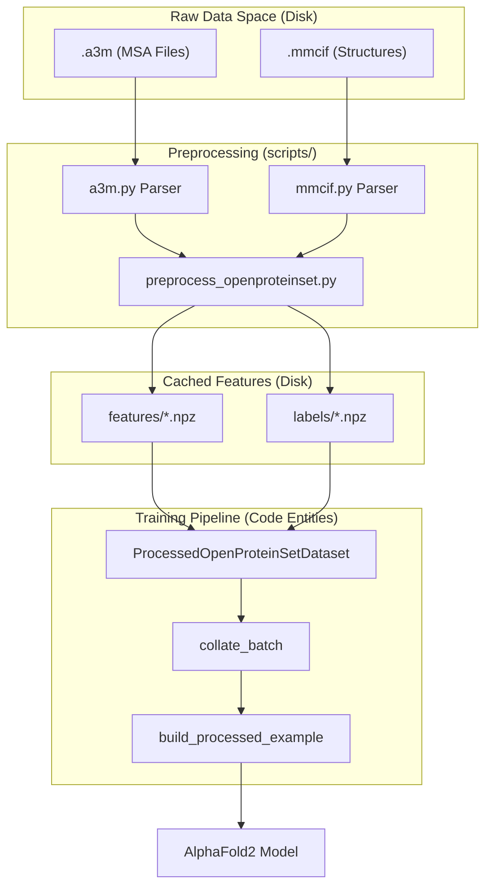
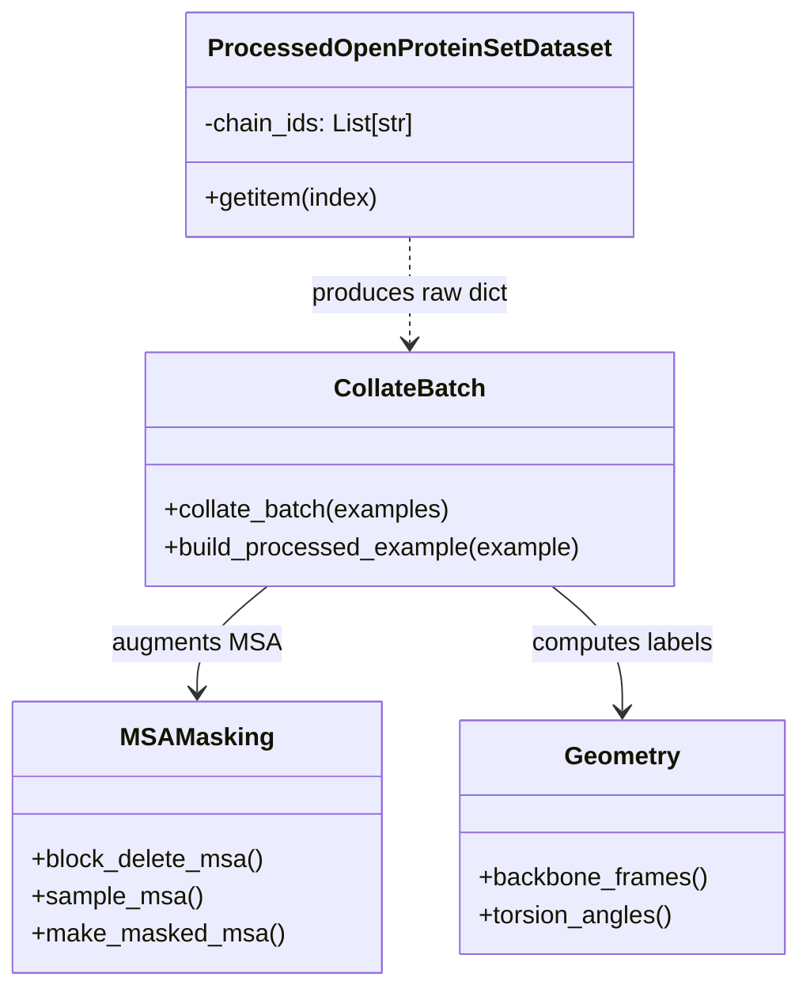

# Data Pipeline

> **Relevant source files**
> * [minalphafold/a3m.py](https://github.com/ChrisHayduk/minAlphaFold2/blob/d0d066ad/minalphafold/a3m.py)
> * [minalphafold/data.py](https://github.com/ChrisHayduk/minAlphaFold2/blob/d0d066ad/minalphafold/data.py)
> * [minalphafold/mmcif.py](https://github.com/ChrisHayduk/minAlphaFold2/blob/d0d066ad/minalphafold/mmcif.py)

The data pipeline in `minAlphaFold2` is responsible for transforming raw protein sequence and structural data into the highly specialized tensor formats required by the model. This system handles everything from parsing legacy file formats to performing complex stochastic augmentations like MSA block deletion and BERT-style masking.

The pipeline is designed to be efficient, utilizing a cached `.npz` format for fast loading during training while maintaining the flexibility to generate complex features on-the-fly.

## High-Level Data Flow

The following diagram illustrates how data flows from raw files through the preprocessing scripts and into the PyTorch `DataLoader`.

### System Data Flow: Disk to Tensor

**Sources:** [minalphafold/data.py L84-L128](https://github.com/ChrisHayduk/minAlphaFold2/blob/d0d066ad/minalphafold/data.py#L84-L128)

 [scripts/preprocess_openproteinset.py L1-L100](https://github.com/ChrisHayduk/minAlphaFold2/blob/d0d066ad/scripts/preprocess_openproteinset.py#L1-L100)

## Dataset and Feature Engineering

The core of the data loading logic resides in the `ProcessedOpenProteinSetDataset` class. It manages the discovery and splitting of protein chains based on the availability of both feature and label files [minalphafold/data.py L84-L98](https://github.com/ChrisHayduk/minAlphaFold2/blob/d0d066ad/minalphafold/data.py#L84-L98)

The actual "heavy lifting" of feature engineering happens during collation. The `collate_batch` function uses `build_processed_example` to transform raw sequence data into the final input features:

* **MSA Processing**: Includes `block_delete_msa` to randomly drop chunks of the MSA and `sample_msa` to select a subset of sequences [minalphafold/data.py L174-L219](https://github.com/ChrisHayduk/minAlphaFold2/blob/d0d066ad/minalphafold/data.py#L174-L219)
* **Masking**: Implements BERT-style masking on the MSA for the Masked MSA loss [minalphafold/data.py L222-L262](https://github.com/ChrisHayduk/minAlphaFold2/blob/d0d066ad/minalphafold/data.py#L222-L262)
* **Template Integration**: Constructs `template_pair_feat` (88-dim) and `template_angle_dim` (57-dim) from available structural templates [minalphafold/data.py L17-L19](https://github.com/ChrisHayduk/minAlphaFold2/blob/d0d066ad/minalphafold/data.py#L17-L19)  [minalphafold/data.py L318-L350](https://github.com/ChrisHayduk/minAlphaFold2/blob/d0d066ad/minalphafold/data.py#L318-L350)

For details on feature dimensions and masking strategies, see **[Dataset and Feature Engineering](/ChrisHayduk/minAlphaFold2/6.1-dataset-and-feature-engineering)**.

## File Format Parsers

The pipeline relies on three specialized parsers to handle standard bioinformatics formats:

1. **`a3m.py`**: Handles Multiple Sequence Alignments. It converts A3M strings into tokenized integers and tracks insertion/deletion counts [minalphafold/a3m.py L48-L94](https://github.com/ChrisHayduk/minAlphaFold2/blob/d0d066ad/minalphafold/a3m.py#L48-L94)
2. **`mmcif.py`**: Parses complex mmCIF structure files, extracting `atom14` coordinates and disambiguating alternative locations (altlocs) [minalphafold/mmcif.py L174-L208](https://github.com/ChrisHayduk/minAlphaFold2/blob/d0d066ad/minalphafold/mmcif.py#L174-L208)
3. **`pdbio.py`**: Provides utilities for writing model predictions back to PDB format, including mapping predicted confidence (pLDDT) to the B-factor column [minalphafold/pdbio.py L51-L75](https://github.com/ChrisHayduk/minAlphaFold2/blob/d0d066ad/minalphafold/pdbio.py#L51-L75)

For details on parsing logic and tokenization, see **[File Format Parsers](/ChrisHayduk/minAlphaFold2/6.2-file-format-parsers)**.

## Geometry Utilities

Once raw coordinates are parsed, `minalphafold/geometry.py` provides the mathematical foundations for structural features. This module converts raw XYZ coordinates into the internal representations used by the Evoformer and Structure Module:

* **Backbone Frames**: Computes Gram-Schmidt orthonormal bases for each residue [minalphafold/geometry.py L114-L142](https://github.com/ChrisHayduk/minAlphaFold2/blob/d0d066ad/minalphafold/geometry.py#L114-L142)
* **Torsion Angles**: Calculates the $\omega, \phi, \psi$ and $\chi_{1-4}$ angles as sine-cosine pairs [minalphafold/geometry.py L145-L184](https://github.com/ChrisHayduk/minAlphaFold2/blob/d0d066ad/minalphafold/geometry.py#L145-L184)
* **Pseudo-beta**: Determines the $C\beta$ position (or $C\alpha$ for Glycine) used in the distogram and recycling features [minalphafold/geometry.py L236-L248](https://github.com/ChrisHayduk/minAlphaFold2/blob/d0d066ad/minalphafold/geometry.py#L236-L248)

For details on the geometric transformations, see **[Geometry Utilities](/ChrisHayduk/minAlphaFold2/6.3-geometry-utilities)**.

## Data Augmentation Strategy

To ensure model robustness, the pipeline employs several stochastic strategies during training:

| Strategy | Description | Code Reference |
| --- | --- | --- |
| **Cropping** | Randomly selects a contiguous window of `crop_size` residues. | [minalphafold/data.py L145-L171](https://github.com/ChrisHayduk/minAlphaFold2/blob/d0d066ad/minalphafold/data.py#L145-L171) |
| **MSA Block Deletion** | Deletes random blocks of sequences to force reliance on the query. | [minalphafold/data.py L174-L197](https://github.com/ChrisHayduk/minAlphaFold2/blob/d0d066ad/minalphafold/data.py#L174-L197) |
| **MSA Clustering** | Samples a subset of MSA sequences and computes cluster statistics. | [minalphafold/data.py L199-L219](https://github.com/ChrisHayduk/minAlphaFold2/blob/d0d066ad/minalphafold/data.py#L199-L219) |
| **Masking** | 15% of MSA tokens are masked or replaced for the MLM task. | [minalphafold/data.py L222-L262](https://github.com/ChrisHayduk/minAlphaFold2/blob/d0d066ad/minalphafold/data.py#L222-L262) |

### Code Entity Mapping: Feature Construction

**Sources:** [minalphafold/data.py L84-L128](https://github.com/ChrisHayduk/minAlphaFold2/blob/d0d066ad/minalphafold/data.py#L84-L128)

 [minalphafold/data.py L382-L420](https://github.com/ChrisHayduk/minAlphaFold2/blob/d0d066ad/minalphafold/data.py#L382-L420)

 [minalphafold/geometry.py L114-L184](https://github.com/ChrisHayduk/minAlphaFold2/blob/d0d066ad/minalphafold/geometry.py#L114-L184)