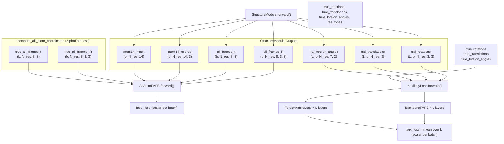
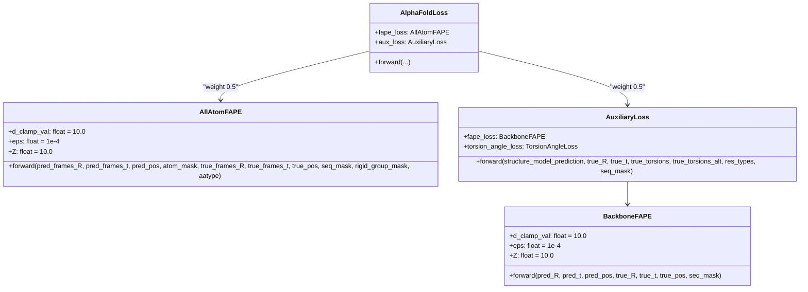

# FAPE Losses

> **Relevant source files**
> * [minalphafold/losses.py](https://github.com/ChrisHayduk/minAlphaFold2/blob/d0d066ad/minalphafold/losses.py)
> * [minalphafold/structure_module.py](https://github.com/ChrisHayduk/minAlphaFold2/blob/d0d066ad/minalphafold/structure_module.py)

## Purpose and Scope

This page covers the three FAPE-related loss classes in `minalphafold/losses.py`: `BackboneFAPE`, `AllAtomFAPE`, and `AuxiliaryLoss`. Together they implement the Frame Aligned Point Error (FAPE) objective — the primary structural loss used during AlphaFold2 training.

For the surrounding loss orchestration and weighting coefficients, see the parent page [Loss Functions](/ChrisHayduk/minAlphaFold2/3-loss-functions). For torsion angle and sequence losses that `AuxiliaryLoss` also applies, see [Sequence and Confidence Losses](/ChrisHayduk/minAlphaFold2/3.2-sequence-and-confidence-losses).

---

## What is FAPE?

FAPE measures structural error in a rotation-invariant way by projecting atom positions into the local coordinate frame of every rigid body in the structure, then computing a clamped L2 distance.

Given a set of predicted frames `{(R_f, t_f)}` and true frames `{(R̃_f, t̃_f)}`, and atom positions `{x_j}` and `{x̃_j}`, FAPE is defined as:

```
FAPE = (1/Z) * mean_{f,j} [ min( ||R_f^T(x_j - t_f) - R̃_f^T(x̃_j - t̃_f)||_2, d_clamp ) ]
```

| Symbol | Value | Meaning |
| --- | --- | --- |
| `Z` | 10.0 | Normalization constant (Å) |
| `d_clamp` | 10.0 Å | Clamp threshold — limits influence of large outliers |
| `eps` | 1e-4 | Added under the square root for numerical stability |

The inverse-frame projection `R^T(x - t)` is equivariant under global rigid-body transformations of the structure, making the loss frame-agnostic. Clamping prevents outlier frames from dominating the gradient.

**Sources:** [minalphafold/losses.py L234-L285](https://github.com/ChrisHayduk/minAlphaFold2/blob/d0d066ad/minalphafold/losses.py#L234-L285)

 [minalphafold/losses.py L287-L365](https://github.com/ChrisHayduk/minAlphaFold2/blob/d0d066ad/minalphafold/losses.py#L287-L365)

---

## Inverse Frame Computation

Both `BackboneFAPE` and `AllAtomFAPE` compute inverse frames identically. For a rotation matrix `R` (orthogonal, so $R^{-1} = R^T$) and translation `t`:

**Predicted inverse:**

* `R_pred_inv = R_pred.transpose(-1, -2)` [minalphafold/losses.py L252](https://github.com/ChrisHayduk/minAlphaFold2/blob/d0d066ad/minalphafold/losses.py#L252-L252)
* `t_pred_inv = -torch.einsum('birc,bic->bir', R_pred_inv, predicted_translations)` [minalphafold/losses.py L253](https://github.com/ChrisHayduk/minAlphaFold2/blob/d0d066ad/minalphafold/losses.py#L253-L253)

**True inverse:**

* `R_true_inv = true_rotations.transpose(-1, -2)` [minalphafold/losses.py L255](https://github.com/ChrisHayduk/minAlphaFold2/blob/d0d066ad/minalphafold/losses.py#L255-L255)
* `t_true_inv = -torch.einsum('birc,bic->bir', R_true_inv, true_translations)` [minalphafold/losses.py L256](https://github.com/ChrisHayduk/minAlphaFold2/blob/d0d066ad/minalphafold/losses.py#L256-L256)

Projecting atom position `x` into frame `f`:

```
x'_f = R_f^T @ x + t_f_inv
```

This is computed as a batch outer product over all (frame, atom) pairs using `torch.einsum`.

**Sources:** [minalphafold/losses.py L251-L263](https://github.com/ChrisHayduk/minAlphaFold2/blob/d0d066ad/minalphafold/losses.py#L251-L263)

 [minalphafold/losses.py L334-L345](https://github.com/ChrisHayduk/minAlphaFold2/blob/d0d066ad/minalphafold/losses.py#L334-L345)

---

## BackboneFAPE

**Class:** `BackboneFAPE` — [minalphafold/losses.py L234-L285](https://github.com/ChrisHayduk/minAlphaFold2/blob/d0d066ad/minalphafold/losses.py#L234-L285)

The backbone-only variant uses one frame per residue (the Cα backbone frame) and one atom per residue (Cα, passed as `predicted_atom_positions` = `traj_translations`).

### Tensor Shapes

| Argument | Shape | Description |
| --- | --- | --- |
| `predicted_rotations` | `(b, N_res, 3, 3)` | Per-residue backbone rotation matrices |
| `predicted_translations` | `(b, N_res, 3)` | Per-residue backbone translations (Cα positions) |
| `predicted_atom_positions` | `(b, N_atoms, 3)` | Atom positions to evaluate (Cα in the auxiliary use case) |
| `true_rotations` | `(b, N_res, 3, 3)` | Ground-truth backbone rotations |
| `true_translations` | `(b, N_res, 3)` | Ground-truth backbone translations |
| `true_atom_positions` | `(b, N_atoms, 3)` | Ground-truth atom positions |
| `seq_mask` | `(b, N_res)` | 1 = valid residue, 0 = padding |

### Computation Steps

```
BackboneFAPE Forward Pass
─────────────────────────────────────────────────────────────
1. Compute predicted and true inverse frames
   R_inv = R.T,  t_inv = −R.T @ t

2. Project all atoms through all frames (cross-product)
   x_frames_pred[b, f, j, :] = R_pred_inv[b,f] @ pred_pos[b,j] + t_pred_inv[b,f]
   x_frames_true[b, f, j, :] = R_true_inv[b,f] @ true_pos[b,j] + t_true_inv[b,f]

3. Compute clamped L2
   dist = sqrt(sum((x_pred − x_true)^2, dim=-1) + eps)   → (b, N_frames, N_atoms)
   dist_clamped = clamp(dist, max=d_clamp)

4. Masked mean over frames and atoms, divided by Z
   fape = (1/Z) * mean(dist_clamped * pair_mask) / pair_count
```

The cross-product means `N_res` frames each evaluate against all `N_atoms` atoms, giving a `(b, N_frames, N_atoms)` distance tensor before averaging [minalphafold/losses.py L266-L271](https://github.com/ChrisHayduk/minAlphaFold2/blob/d0d066ad/minalphafold/losses.py#L266-L271)

**Sources:** [minalphafold/losses.py L250-L285](https://github.com/ChrisHayduk/minAlphaFold2/blob/d0d066ad/minalphafold/losses.py#L250-L285)

---

## AllAtomFAPE

**Class:** `AllAtomFAPE` — [minalphafold/losses.py L287-L365](https://github.com/ChrisHayduk/minAlphaFold2/blob/d0d066ad/minalphafold/losses.py#L287-L365)

The all-atom variant uses all 8 rigid-group frames per residue (giving `N_res × 8` total frames) and all 14 atom slots per residue (giving `N_res × 14` total atoms).

### Tensor Shapes

| Argument | Shape | Description |
| --- | --- | --- |
| `predicted_frames_R` | `(b, N_res, 8, 3, 3)` | All rigid-group rotation matrices (predicted) |
| `predicted_frames_t` | `(b, N_res, 8, 3)` | All rigid-group translations (predicted) |
| `predicted_atom_positions` | `(b, N_res, 14, 3)` | atom14 coordinates (predicted) |
| `atom_mask` | `(b, N_res, 14)` | 1 = atom exists for this residue type |
| `true_frames_R` | `(b, N_res, 8, 3, 3)` | Ground-truth rigid-group rotations |
| `true_frames_t` | `(b, N_res, 8, 3)` | Ground-truth rigid-group translations |
| `true_atom_positions` | `(b, N_res, 14, 3)` | Ground-truth atom14 coordinates |
| `rigid_group_mask` | `(21, 8)` | Per-residue-type frame existence mask |
| `aatype` | `(b, N_res)` | Integer residue type (0–20) |

### Flattening Strategy

The implementation flattens the `(N_res, 8)` frame grid and `(N_res, 14)` atom grid into 1-D sequences before computing the cross-product projection [minalphafold/losses.py L313-L319](https://github.com/ChrisHayduk/minAlphaFold2/blob/d0d066ad/minalphafold/losses.py#L313-L319)

:

```
pred_R  = predicted_frames_R.reshape(b, N_res*8,  3, 3)pred_t  = predicted_frames_t.reshape(b, N_res*8,  3)pred_pos = predicted_atom_positions.reshape(b, N_res*14, 3)
```

### Masking

Two independent masks are combined:

| Mask | Source | Shape |
| --- | --- | --- |
| `flat_atom_mask` | `atom_mask` × `seq_mask` | `(b, N_res*14)` |
| `frame_mask` | `rigid_group_mask[aatype]` × `seq_mask` | `(b, N_res*8)` |

The `rigid_group_mask` (from `restype_rigid_group_mask` in `residue_constants.py`) ensures that chi-angle frames that don't exist for a given residue type (e.g. GLY has no chi frames) are excluded from the average [minalphafold/losses.py L321-L332](https://github.com/ChrisHayduk/minAlphaFold2/blob/d0d066ad/minalphafold/losses.py#L321-L332)

### Averaging

The average is two-stage:

1. For each frame, average the clamped distances over all valid atoms → `frame_means` of shape `(b, N_frames)`.
2. Average `frame_means` over valid frames, divided by `Z`.

```markdown
# Step 1: average over atoms (shared denominator)atom_count = flat_atom_mask.sum(dim=-1, keepdim=True).clamp(min=1)frame_means = (dist_clamped * flat_atom_mask[:, None, :]).sum(dim=-1) / atom_count # Step 2: average over framesframe_count = frame_mask.sum(dim=-1).clamp(min=1)fape_loss   = (frame_means * frame_mask).sum(dim=-1) / (frame_count * Z)
```

**Sources:** [minalphafold/losses.py L306-L365](https://github.com/ChrisHayduk/minAlphaFold2/blob/d0d066ad/minalphafold/losses.py#L306-L365)

---

## AuxiliaryLoss

**Class:** `AuxiliaryLoss` — [minalphafold/losses.py L153-L189](https://github.com/ChrisHayduk/minAlphaFold2/blob/d0d066ad/minalphafold/losses.py#L153-L189)

`AuxiliaryLoss` applies `BackboneFAPE` and `TorsionAngleLoss` to every intermediate backbone frame produced by the `StructureModule`'s per-layer trajectory, then averages the per-layer losses.

### Input Trajectories from StructureModule

The `StructureModule` accumulates one backbone frame and one set of torsion angles per iteration of its layer loop. These are collected into trajectory tensors [minalphafold/structure_module.py L131-L133](https://github.com/ChrisHayduk/minAlphaFold2/blob/d0d066ad/minalphafold/structure_module.py#L131-L133)

:

| Key | Shape | Description |
| --- | --- | --- |
| `traj_rotations` | `(L, b, N_res, 3, 3)` | Backbone rotations at each layer |
| `traj_translations` | `(L, b, N_res, 3)` | Backbone translations at each layer (Å) |
| `traj_torsion_angles` | `(L, b, N_res, 7, 2)` | Torsion angles at each layer |

`L` is `structure_module_layers` (the number of IPA iterations).

### BackboneFAPE Invocation in AuxiliaryLoss

A key implementation detail: translations are passed **both** as `predicted_translations` (frames) **and** as `predicted_atom_positions` (atom positions to evaluate) [minalphafold/losses.py L177-L182](https://github.com/ChrisHayduk/minAlphaFold2/blob/d0d066ad/minalphafold/losses.py#L177-L182)

 This means the backbone FAPE in `AuxiliaryLoss` effectively evaluates Cα positions only, without needing full atom14 coordinates at each intermediate layer.

```markdown
fape = self.fape_loss(    traj_R[l], traj_t[l], traj_t[l],   # translations used twice    true_rotations, true_translations, true_translations,    seq_mask=seq_mask,)
```

**Sources:** [minalphafold/losses.py L176-L189](https://github.com/ChrisHayduk/minAlphaFold2/blob/d0d066ad/minalphafold/losses.py#L176-L189)

---

## Data Flow Diagram

**FAPE Loss Data Flow — from StructureModule to Loss**



**Sources:** [minalphafold/losses.py L59-L98](https://github.com/ChrisHayduk/minAlphaFold2/blob/d0d066ad/minalphafold/losses.py#L59-L98)

 [minalphafold/losses.py L153-L189](https://github.com/ChrisHayduk/minAlphaFold2/blob/d0d066ad/minalphafold/losses.py#L153-L189)

 [minalphafold/structure_module.py L148-L168](https://github.com/ChrisHayduk/minAlphaFold2/blob/d0d066ad/minalphafold/structure_module.py#L148-L168)

---

## Class and Parameter Summary

**Class hierarchy and shared parameters**



**Sources:** [minalphafold/losses.py L17-L41](https://github.com/ChrisHayduk/minAlphaFold2/blob/d0d066ad/minalphafold/losses.py#L17-L41)

 [minalphafold/losses.py L144](https://github.com/ChrisHayduk/minAlphaFold2/blob/d0d066ad/minalphafold/losses.py#L144-L144)

 [minalphafold/losses.py L153-L189](https://github.com/ChrisHayduk/minAlphaFold2/blob/d0d066ad/minalphafold/losses.py#L153-L189)

---

## Comparison: BackboneFAPE vs AllAtomFAPE

| Property | `BackboneFAPE` | `AllAtomFAPE` |
| --- | --- | --- |
| Frames per residue | 1 (backbone) | 8 (all rigid groups) |
| Atoms evaluated | N_res (Cα only in aux loss) | N_res × 14 (atom14) |
| Frame tensor shape | `(b, N_res, 3, 3)` | `(b, N_res, 8, 3, 3)` |
| Atom tensor shape | `(b, N_atoms, 3)` | `(b, N_res, 14, 3)` |
| Frame mask | `seq_mask` | `rigid_group_mask[aatype]` × `seq_mask` |
| Atom mask | `seq_mask` | `atom_mask` × `seq_mask` |
| Used by | `AuxiliaryLoss` | `AlphaFoldLoss` directly |
| True frames source | passed directly | computed via `compute_all_atom_coordinates` |
| Averaging | joint over (frames, atoms) | atoms first, then frames |

---

## rigid_group_mask and Frame Validity

`AllAtomFAPE` consults `restype_rigid_group_mask` (shape `(21, 8)`) to decide which of the 8 frames are valid for a given residue type. This table is populated in `_make_rigid_group_constants()` in `residue_constants.py`:

* Frames 0–3 (backbone, pre-omega, phi, psi) are always 1 for standard residues (indices 0–19).
* Frames 4–7 (chi1–chi4) are 1 only if `chi_angles_mask[restype][chi_idx] == 1`.
* Residue type 20 (UNK) has all zeros.

**Sources:** [minalphafold/residue_constants.py L470-L483](https://github.com/ChrisHayduk/minAlphaFold2/blob/d0d066ad/minalphafold/residue_constants.py#L470-L483)

 [minalphafold/losses.py L321-L332](https://github.com/ChrisHayduk/minAlphaFold2/blob/d0d066ad/minalphafold/losses.py#L321-L332)

---

## Integration in AlphaFoldLoss

The two FAPE contributions enter `AlphaFoldLoss.forward()` with equal weight [minalphafold/losses.py L144](https://github.com/ChrisHayduk/minAlphaFold2/blob/d0d066ad/minalphafold/losses.py#L144-L144)

:

```
loss = 0.5 * fape_loss + 0.5 * aux_loss + 0.3 * dist_loss + 2.0 * msa_loss + 0.01 * plddt_loss
```

`AllAtomFAPE` receives the final-layer all-atom coordinates and all 8 rigid-group frames. `AuxiliaryLoss` receives the per-layer trajectory from the structure module. Both consume true frames derived from `compute_all_atom_coordinates` applied to the ground-truth rotations, translations, and torsion angles [minalphafold/losses.py L66-L75](https://github.com/ChrisHayduk/minAlphaFold2/blob/d0d066ad/minalphafold/losses.py#L66-L75)

**Sources:** [minalphafold/losses.py L144](https://github.com/ChrisHayduk/minAlphaFold2/blob/d0d066ad/minalphafold/losses.py#L144-L144)

 [minalphafold/losses.py L59-L98](https://github.com/ChrisHayduk/minAlphaFold2/blob/d0d066ad/minalphafold/losses.py#L59-L98)