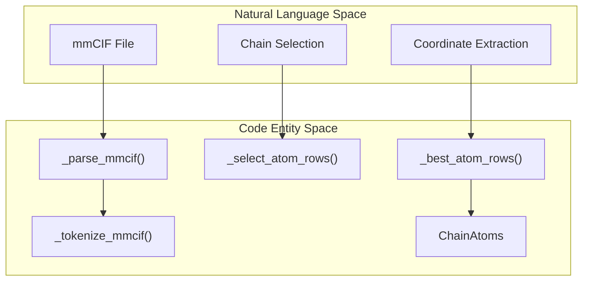
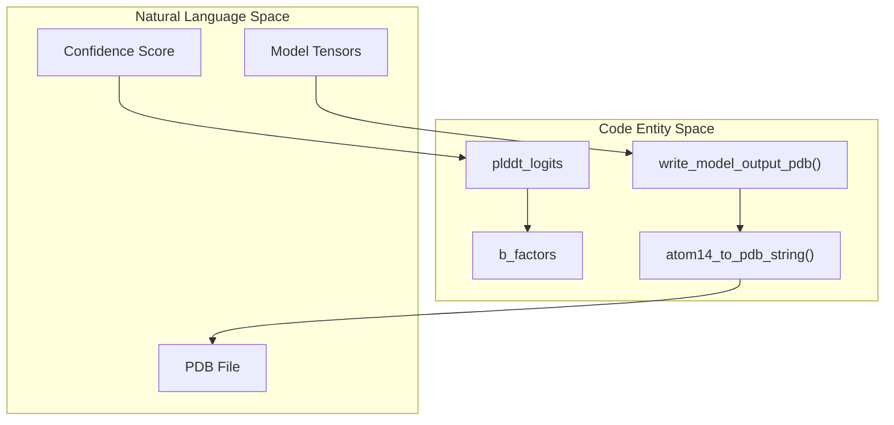

# File Format Parsers

> **Relevant source files**
> * [minalphafold/a3m.py](https://github.com/ChrisHayduk/minAlphaFold2/blob/d0d066ad/minalphafold/a3m.py)
> * [minalphafold/mmcif.py](https://github.com/ChrisHayduk/minAlphaFold2/blob/d0d066ad/minalphafold/mmcif.py)
> * [minalphafold/pdbio.py](https://github.com/ChrisHayduk/minAlphaFold2/blob/d0d066ad/minalphafold/pdbio.py)
> * [tests/test_pdbio.py](https://github.com/ChrisHayduk/minAlphaFold2/blob/d0d066ad/tests/test_pdbio.py)

The `minAlphaFold2` data pipeline relies on three specialized parsers to handle Multiple Sequence Alignments (MSA), structural ground truth (mmCIF), and model output serialization (PDB). These parsers bridge the gap between standard bioinformatics file formats and the internal `atom14` tensor representations used by the model.

### 1. MSA Parsing (a3m.py)

The `a3m.py` module handles the ingestion of A3M formatted alignments. It is responsible for tokenizing amino acid sequences, managing insertions/deletions relative to the query sequence, and generating the MSA feature tensors.

#### Implementation Details

* **Tokenization**: Sequences are converted to integer IDs using a 23-token alphabet (20 standard residues, `UNK`, `GAP`, and `MASK`) [minalphafold/a3m.py L10-L19](https://github.com/ChrisHayduk/minAlphaFold2/blob/d0d066ad/minalphafold/a3m.py#L10-L19)
* **Insertion Handling**: In A3M format, insertions relative to the query are represented by lowercase letters. The `A3M.to_aligned_msa` method tracks these to build a `deletions` matrix, which counts how many residues were deleted in the query relative to the hit at each position [minalphafold/a3m.py L56-L79](https://github.com/ChrisHayduk/minAlphaFold2/blob/d0d066ad/minalphafold/a3m.py#L56-L79)
* **Query Ungapping**: The `ungap_query_columns` function ensures that the final MSA tensors only contain columns where the query sequence has a residue (non-gap), maintaining alignment with the target structure [minalphafold/a3m.py L32-L44](https://github.com/ChrisHayduk/minAlphaFold2/blob/d0d066ad/minalphafold/a3m.py#L32-L44)

#### Key Functions

| Function | Role |
| --- | --- |
| `read_a3m` | Reads a file and returns an `A3M` dataclass instance [minalphafold/a3m.py L97-L126](https://github.com/ChrisHayduk/minAlphaFold2/blob/d0d066ad/minalphafold/a3m.py#L97-L126) |
| `A3M.to_tokens` | Converts raw strings into `msa` (N, L) and `deletions` (N, L) integer arrays [minalphafold/a3m.py L81-L94](https://github.com/ChrisHayduk/minAlphaFold2/blob/d0d066ad/minalphafold/a3m.py#L81-L94) |
| `sequence_to_ids` | Maps a string sequence to a NumPy array of residue indices [minalphafold/a3m.py L28-L29](https://github.com/ChrisHayduk/minAlphaFold2/blob/d0d066ad/minalphafold/a3m.py#L28-L29) |

**Sources:** [minalphafold/a3m.py L1-L127](https://github.com/ChrisHayduk/minAlphaFold2/blob/d0d066ad/minalphafold/a3m.py#L1-L127)

---

### 2. Structure Parsing (mmcif.py)

The `mmcif.py` module extracts ground truth coordinates from mmCIF files. It maps arbitrary atom names to the fixed `atom14` representation used by AlphaFold2.

#### Data Flow: mmCIF to Atom14

The parser identifies the target chain, resolves ambiguities in alternative locations (`altloc`), and populates a fixed-size (14 atoms per residue) coordinate tensor.

**Entity Mapping: mmCIF Logic**

1. **Tokenization**: Uses `shlex` to handle quoted strings and complex mmCIF syntax [minalphafold/mmcif.py L50-L76](https://github.com/ChrisHayduk/minAlphaFold2/blob/d0d066ad/minalphafold/mmcif.py#L50-L76)
2. **Altloc Disambiguation**: In `_best_atom_rows`, atoms with `altloc` 'A' or '.' are prioritized. If multiple exist, the one with the highest occupancy is selected [minalphafold/mmcif.py L174-L208](https://github.com/ChrisHayduk/minAlphaFold2/blob/d0d066ad/minalphafold/mmcif.py#L174-L208)
3. **Atom14 Mapping**: Coordinates are placed into the `(N, 14, 3)` tensor using the `ATOM14_INDEX` lookup table, which is derived from `residue_constants` [minalphafold/mmcif.py L37-L40](https://github.com/ChrisHayduk/minAlphaFold2/blob/d0d066ad/minalphafold/mmcif.py#L37-L40)

#### Structural Data Containers

* **`ChainAtoms`**: A dataclass storing the final parsed features for a single chain, including `aatype`, `atom14_positions`, and `atom14_mask` [minalphafold/mmcif.py L236-L241](https://github.com/ChrisHayduk/minAlphaFold2/blob/d0d066ad/minalphafold/mmcif.py#L236-L241)

**Structure Parsing Flow**
"Natural Language Space" to "Code Entity Space"

**Sources:** [minalphafold/mmcif.py L1-L241](https://github.com/ChrisHayduk/minAlphaFold2/blob/d0d066ad/minalphafold/mmcif.py#L1-L241)

 [minalphafold/a3m.py L10-L19](https://github.com/ChrisHayduk/minAlphaFold2/blob/d0d066ad/minalphafold/a3m.py#L10-L19)

---

### 3. PDB Serialization (pdbio.py)

The `pdbio.py` module provides utilities for converting model output tensors back into standard PDB files for visualization.

#### Features

* **pLDDT Mapping**: The `write_model_output_pdb` function automatically maps the model's `plddt_logits` to B-factors in the PDB file. It calculates the expected value of the binned pLDDT distribution to produce a per-residue confidence score [minalphafold/pdbio.py L170-L175](https://github.com/ChrisHayduk/minAlphaFold2/blob/d0d066ad/minalphafold/pdbio.py#L170-L175)
* **Atom14 to PDB**: Converts the compact `(N, 14, 3)` representation back to full ATOM records, looking up atom names (e.g., `CA`, `CB`, `OD1`) based on the residue type [minalphafold/pdbio.py L109-L119](https://github.com/ChrisHayduk/minAlphaFold2/blob/d0d066ad/minalphafold/pdbio.py#L109-L119)
* **Serialization**: Handles standard PDB formatting requirements, including atom serial numbers, chain IDs, and `TER`/`END` records [minalphafold/pdbio.py L115-L129](https://github.com/ChrisHayduk/minAlphaFold2/blob/d0d066ad/minalphafold/pdbio.py#L115-L129)

#### Key Functions

| Function | Role |
| --- | --- |
| `atom14_to_pdb_string` | Core logic for iterating through residues and atoms to build the PDB string [minalphafold/pdbio.py L26-L130](https://github.com/ChrisHayduk/minAlphaFold2/blob/d0d066ad/minalphafold/pdbio.py#L26-L130) |
| `write_model_output_pdb` | High-level wrapper that consumes `model_output` and `batch` dictionaries [minalphafold/pdbio.py L160-L186](https://github.com/ChrisHayduk/minAlphaFold2/blob/d0d066ad/minalphafold/pdbio.py#L160-L186) |

**Model Output Serialization**
"Natural Language Space" to "Code Entity Space"

**Sources:** [minalphafold/pdbio.py L1-L187](https://github.com/ChrisHayduk/minAlphaFold2/blob/d0d066ad/minalphafold/pdbio.py#L1-L187)

 [tests/test_pdbio.py L65-L87](https://github.com/ChrisHayduk/minAlphaFold2/blob/d0d066ad/tests/test_pdbio.py#L65-L87)